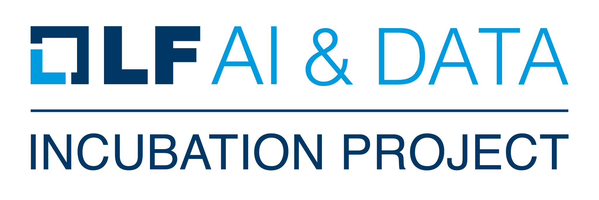

# Introduction

We welcome any and all contributions to Kedro, at whatever level you can manage. For example, you could:

- [Join the community](#join-the-community-and-help-it-grow)
- [Troubleshoot other users' questions or get answers to your own queries](#community-qa)
- [Report a bug](#report-a-bug)
- [Propose a new feature](#propose-a-new-feature)
- [Review other contributors' PRs](#review-community-pull-requests)
- [Contribute a bug fix or a new feature](#contribute-a-fix-or-feature)
- [Contribute to the documentation](#contribute-to-the-documentation)

You can also suggest anything else that you think improves the community for us all!

## Code of conduct

The Kedro team pledges to foster and maintain a friendly community. We enforce a [Code of Conduct](./CODE_OF_CONDUCT.md) to ensure every Kedroid is welcomed and treated with respect.

# Where can I meet other Kedroids?

## Join the community and help it grow!

You can find the Kedro community on our [Discord server](https://discord.gg/akJDeVaxnB), which is where we share news and announcements, and general chat. You're also welcome to post links here to any articles or videos about Kedro that you create, or find, such as how-tos, showcases, demos, blog posts or tutorials.

We also curate a [Github repo that lists content created by the Kedro community](https://github.com/quantumblacklabs/kedro-community).

## Community Q&A

We encourage you to ask and answer technical questions on [GitHub discussions](https://github.com/quantumblacklabs/kedro/discussions) or [Discord](https://discord.gg/akJDeVaxnB), but the former is often preferable since it will be picked up by search engines.

# How can I get involved?

|Activity|Description|
|-|-|
|Report a bug|We use [GitHub issues](https://github.com/quantumblacklabs/kedro/issues) to keep track of known bugs. We keep a close eye on them and update them when we have an internal fix in progress. Before you report a new issue, do your best to ensure your problem hasn't already been reported. If it has, just leave a comment on the existing issue, rather than create a new one.   If you have already checked the existing [GitHub issues](https://github.com/quantumblacklabs/kedro/issues) and are still convinced that you have found odd or erroneous behaviour then please file a new one.|
|Propose a new feature|If you have new ideas for Kedro functionality then please open a [GitHub issue](https://github.com/quantumblacklabs/kedro/issues) and describe the feature you would like to see, why you need it, and how it should work.|
|Review pull requests|Check the [Kedro repo to find open pull requests](https://github.com/quantumblacklabs/kedro/pulls) and contribute a review!|
|Contribute a fix or feature|If you're interested in contributing fixes to code or documentation, first read our [guidelines for contributing developers](https://kedro.readthedocs.io/en/stable/14_contribution/02_developer_contributor_guidelines.html) for an explanation of how to get set up and the process you'll follow.  Once you are ready to contribute, a good place to start is to take a look at the `good first issues` and `help wanted issues` on [GitHub](https://github.com/quantumblacklabs/kedro/issues).|
|Contribute to the documentation|You can help us improve the [Kedro documentation online](https://kedro.readthedocs.io/en/stable/). Send us feedback as a [GitHub issue](https://github.com/quantumblacklabs/kedro/issues) or start a documentation discussion on [GitHub](https://github.com/quantumblacklabs/kedro/discussions).You are also welcome to make a raise a PR with a bug fix or addition to the documentation. First read the guide [Contribute to the Kedro documentation](https://kedro.readthedocs.io/en/stable/14_contribution/04_documentation_contributor_guidelines.html).

# Joining our Technical Steering Committee (TSC)

As part of the [Linux Foundation for AI & Data](https://lfaidata.foundation/) the project is governed by our TSC, you can read about this in detail in our [Technical Charter](todo).

## Becoming a maintainer

As a Linux Foundation project we inivite members of the community to join us in maintaining and defining the future of Kedro. This status also entitles you to voting rights.

### Responsibilities

- Be available for 1+ full day per week (summarized) on product development
- Attendance at community meetings to discuss the project plans, roadmap and commitments
- Screen [GitHub](https://github.com/quantumblacklabs/kedro) issues and perform pull request (PR) reviews
  - The screening process includes applying suitable [labels](https://github.com/quantumblacklabs/kedro/labels) to each new issue. Labels are handy for future issue follow-up. A few of the most important labels that are:
    - `good first issue` - Mark any issue that can reasonably be accomplished by a new contributor with this label
    - `help wanted` - Unless it is immediately obvious that someone will work on a specific issue (and if so assign
     it), mark it help wanted
    - `status: to be verified` - If the reported bug needs to be reproduced before working on a fix
    - `status: needs more info` - If the issue needs more information from the person who reported it
  - See all the [labels](https://github.com/quantumblacklabs/kedro/labels). Try to maintain 3-5 labels per issue
- Make sure that ongoing PRs are moving forward at the right pace or closing them
- Guide the community to use the right channel: [Github](https://github.com/quantumblacklabs/kedro/) for Issues and Bug-reports; and forums and Discord for questions and discussions
- Project maintenance including security, updates, CI/CD, builds, infrastructure
- Prioritize the work following [Kedro Roadmap](https://github.com/quantumblacklabs/kedro/projects/1) to move the
 project forward
- Follow-up by filing undocumented issues found in community channels

### Application requirements

- Spend at least one full day per week on Kedro for the foreseeable future
- Write solid code and collaborate with the team and community
- Understand the project's code base and internals
- Learn how the team works, including processes for testing, quality standards and code review
- Have already started PRs and code reviews under the guidance of maintainers; ask for help where needed

Besides activities listed above section, you need to demonstrate a strong commitment to Kedro's long-term success.
Just contributing does not make you a maintainer. It is about building trust with the current maintainers of the project and being a person they can depend on and trust to make decisions in the best interest of Kedro.

Quarterly, existing maintainers will curate a list of contributors that have shown regular activity on the project over the prior months. From this list, maintainer candidates are selected and proposed.

#### How we integrate you into the team?
- We may ask you to do some PRs from our backlog or roadmap; maintainers need to work towards a common goal
- We will require a period of working with existing maintainers
- After a vote, maintainers will be added to the Kedro GitHub organization and [OWNERS.md](todo)

## Removing a Maintainer
The TSC will also have a mechanism for removing a maintainer is no longer interested or cannot perform the maintainer duties listed above. In that case, they should volunteer for non-voting Contributor or Friends status. In extreme cases, this can also occur by a vote by the active TSC.
