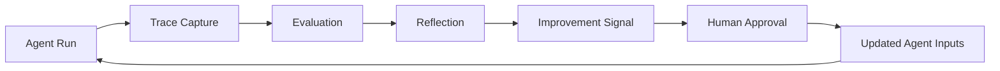
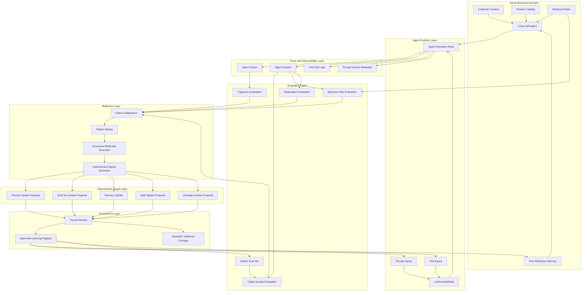
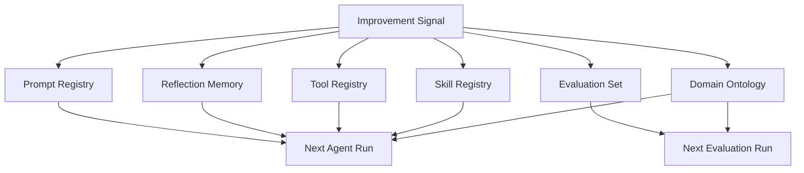
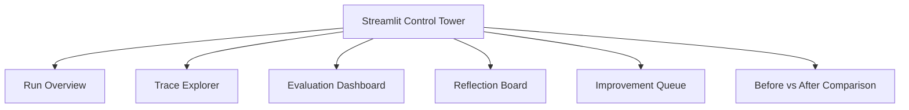
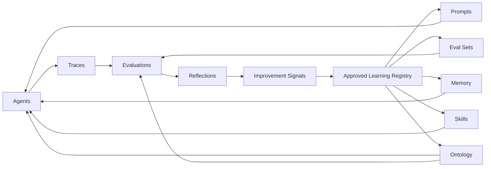

# Agentic Reflection and Continuous Learning MVP

# 1. Problem Statement

## 1.1 Business Context

A telco B2B client has multiple commercial use cases such as:

- Cross-sell recommendations
- Pricing and discount guidance
- Digital marketing campaign targeting
- Sales next-best-action recommendations
- Account planning
- Renewal and churn prevention

These workflows increasingly involve LLM-powered agents that reason over customer data, product catalogs, business rules, prompts, tools, and prior context. However, most agentic systems have a major weakness:

> They execute, but they do not systematically learn from their own traces.

A typical agent may generate a recommendation, call tools, produce an explanation, and return an answer. But after the run, the organization often lacks a structured way to answer:

- What exactly did the agent see?
- Which prompt version was used?
- Which tools were called?
- Which reasoning steps led to the output?
- Which recommendations were wrong, weak, unsafe, or commercially poor?
- Which failures repeat across segments, products, or tasks?
- What should change in the next run?
- Should we update prompts, eval cases, memory, tools, skills, or the domain ontology?

The problem is not just recommendation quality. The deeper problem is the absence of a governed continuous learning loop for agentic systems.

## 1.2 Target Problem

The MVP should solve the following problem:

> Build a Kedro-native reflection and continuous learning layer that ingests agent traces, evaluates agent behavior, derives improvement signals, stores structured reflections, and feeds approved improvements back into future agent runs.

## 1.3 Why This Matters

For an enterprise telco client, agentic systems need more than clever prompts. They need:

- Traceability
- Evaluation
- Governance
- Prompt versioning
- Repeatable experimentation
- Business-rule compliance
- Continuous improvement
- Human approval for sensitive changes
- Reusable learning across use cases

This is where Kedro is valuable. Kedro can provide the pipeline backbone, Data Catalog, modular project structure, reusable datasets, hooks, and visualization. The new GenAI-oriented features such as `LLMContextNode` and Langfuse datasets can help bring prompts, traces, and evaluations into the Kedro-native development pattern.

---

# 2. POC Overview

## 2.1 MVP Summary

The MVP is an **Agentic Reflection Control Tower** for a B2B telco cross-sell agent.

The cross-sell agent will:

1. Read customer and product context.
2. Generate cross-sell recommendations.
3. Explain each recommendation.
4. Emit traces of prompts, tool calls, reasoning context, outputs, and metadata.
5. Pass its trace and outputs into a reflection pipeline.
6. Receive improvement signals for the next run.

The reflection system will:

1. Ingest agent traces.
2. Evaluate the agent's behavior and outputs.
3. Detect failures and improvement opportunities.
4. Generate structured reflection records.
5. Propose updates to prompts, eval sets, memory, skills, tools, and ontology.
6. Route sensitive changes through a human approval step.
7. Feed approved changes into the next agent run.

## 2.2 Cross-Sell as the Demonstration Scenario

The domain example is B2B telco cross-sell.

Example agent task:

> Given a B2B customer profile, product catalog, business rules, and prior learning memory, recommend the next best telco product to cross-sell and explain the recommendation.

Example products:

- SD-WAN
- Managed Firewall
- IoT Connectivity
- Business Mobile
- Cloud Connectivity
- Private 5G
- Unified Communications

The MVP does not need to optimize real commercial decisions. It needs to prove the reusable reflection pattern.

## 2.3 What Makes This Agentic

A non-agentic version would simply run a deterministic recommendation pipeline.

The agentic version includes:

- LLM-based reasoning
- Prompt-managed behavior
- Tool use
- Trace capture
- Evaluation of reasoning and output quality
- Reflection over failures
- Memory from previous runs
- Improvement proposals
- Feedback into future inputs

## 2.4 MVP Learning Loop

The continuous learning loop is:



The key design choice:

> The MVP should automate diagnosis and reflection, but keep material behavior changes human-approved by default.

---

# 3. Architecture

## 3.1 High-Level Architecture



## 3.2 Kedro-Native Architecture

```mermaid
flowchart TB
    subgraph KedroProject[Kedro Project]
        subgraph Catalog[Data Catalog]
            D1[customer_context]
            D2[product_catalog]
            D3[business_rules]
            D4[prompt_dataset]
            D5[trace_dataset]
            D6[evaluation_dataset]
            D7[reflection_memory]
            D8[approved_learning_registry]
        end

        subgraph Pipelines[Modular Pipelines]
            P1[agent_input_pipeline]
            P2[agent_execution_pipeline]
            P3[trace_ingestion_pipeline]
            P4[evaluation_pipeline]
            P5[reflection_pipeline]
            P6[improvement_signal_pipeline]
            P7[approval_and_feedback_pipeline]
            P8[reporting_pipeline]
        end

        subgraph Hooks[Kedro Hooks]
            H1[before_pipeline_run]
            H2[after_node_run]
            H3[on_node_error]
            H4[after_pipeline_run]
        end
    end

    Catalog --> Pipelines
    Pipelines --> Catalog
    Hooks --> Pipelines
    Pipelines --> Hooks
```



## 3.3 Pipeline-Level Design

```mermaid
flowchart LR
    A1[Load Customer Context] --> A2[Load Product Catalog]
    A2 --> A3[Load Business Rules]
    A3 --> A4[Load Approved Memory]
    A4 --> A5[Build Agent Input]

    A5 --> B1[LLMContextNode]
    B1 --> B2[Run Cross-Sell Agent]
    B2 --> B3[Generate Recommendation]
    B3 --> B4[Generate Explanation]

    B2 --> C1[Persist Agent Trace]
    B3 --> C2[Persist Agent Output]
    B4 --> C3[Persist Explanation]

    C1 --> D1[Evaluate Trajectory]
    C2 --> D2[Evaluate Recommendation]
    C3 --> D3[Evaluate Explanation]
    D2 --> D4[Compare Against Golden Eval Set]
    D1 --> E1[Diagnose Failures]
    D2 --> E1
    D3 --> E1
    D4 --> E1

    E1 --> E2[Mine Recurring Patterns]
    E2 --> E3[Generate Structured Reflection]
    E3 --> E4[Generate Improvement Signals]

    E4 --> F1[Prompt Change Proposal]
    E4 --> F2[Eval Set Proposal]
    E4 --> F3[Memory Update]
    E4 --> F4[Skill Proposal]
    E4 --> F5[Ontology Proposal]

    F1 --> G1[Human Approval Queue]
    F2 --> G1
    F3 --> G1
    F4 --> G1
    F5 --> G1

    G1 --> H1[Approved Registry]
    H1 --> A4
```



## 3.4 Agent Trace Schema

The trace is the raw material for reflection. A minimal trace record should include:

```yaml
trace_id: trace_001
run_id: run_2026_05_18_001
agent_id: cross_sell_agent_v1
use_case: cross_sell
customer_id: CUST_001
prompt_version: cross_sell_prompt:v3
model: model_name
inputs:
  customer_context_ref: customer_context.CUST_001
  product_catalog_ref: product_catalog.v1
  business_rules_ref: business_rules.v1
  reflection_memory_refs:
    - refl_001
    - refl_002
tool_calls:
  - tool_name: product_eligibility_checker
    input_summary: SD-WAN eligibility for CUST_001
    output_summary: eligible
    latency_ms: 120
reasoning_summary: Customer has many sites and high usage; SD-WAN is likely relevant.
output:
  recommended_product: SD-WAN
  explanation: Customer has 42 sites and high usage, making SD-WAN suitable.
metadata:
  latency_ms: 2400
  token_usage:
    input_tokens: 1500
    output_tokens: 350
  status: success
```

## 3.5 Evaluation Schema

Evaluation converts traces and outputs into measurable signals.

```yaml
evaluation_id: eval_001
trace_id: trace_001
run_id: run_2026_05_18_001
scores:
  business_rule_pass: true
  recommendation_quality: 0.86
  explanation_quality: 0.72
  groundedness: 0.80
  tool_use_quality: 0.75
  trajectory_quality: 0.70
issues:
  - type: weak_explanation
    severity: medium
    message: Explanation did not mention support-ticket history.
  - type: missed_bundle_opportunity
    severity: low
    message: Managed Firewall could have been bundled with SD-WAN.
labels:
  segment: logistics_mid_market
  product: SD-WAN
  agent_version: cross_sell_agent_v1
```

## 3.6 Reflection Schema

Reflection should be structured, not just prose.

```yaml
reflection_id: refl_001
run_id: run_2026_05_18_001
source_trace_ids:
  - trace_001
  - trace_002
  - trace_003
use_case: cross_sell
reflection_type: prompt_improvement
summary: The agent underused support-ticket signals when explaining SD-WAN recommendations.
evidence:
  affected_segment: logistics_mid_market
  affected_product: SD-WAN
  weak_explanation_rate: 0.42
  examples:
    - trace_001
    - trace_003
root_cause_hypothesis: The prompt asks for product fit but does not explicitly require operational pain-point evidence.
improvement_signal:
  target: prompt
  recommended_change: Add instruction to cite operational signals such as support tickets, incident history, and usage trends.
  expected_effect: Improve explanation groundedness and sales usefulness.
confidence: medium
approval_status: pending
created_at: 2026-05-18T12:00:00Z
```

## 3.7 Improvement Signal Types

The reflection system should produce multiple kinds of improvement signals.

| Improvement target | What it means | MVP support |
|---|---|---|
| Prompt | Change instructions, format, examples, constraints | Yes |
| Eval set | Add new examples or failure cases | Yes |
| Memory | Store reusable lessons | Yes |
| Tool | Recommend a tool change or new tool | Partial |
| Skill | Recommend a new reusable capability | Future |
| Ontology | Recommend changes to domain concepts and relationships | Future |

## 3.8 Feedback Targets



---

# 4. Spec Driven Development

## 4.1 Development Philosophy

The POC should be developed from specs, not generated ad hoc from prompts.

The working pattern should be:

1. Define the behavior spec.
2. Define data contracts.
3. Define pipeline contracts.
4. Define evaluation rubrics.
5. Define improvement signal schemas.
6. Generate or implement code against the specs.
7. Test each pipeline independently.
8. Demo the end-to-end learning loop.

## 4.2 MVP Functional Requirements

### FR1: Agent Run

The system must run a cross-sell agent that generates product recommendations and explanations from customer context.

### FR2: Trace Ingestion

The system must capture or ingest agent traces containing prompt version, inputs, tool calls, outputs, and metadata.

### FR3: Evaluation

The system must evaluate recommendations, explanations, and trajectory behavior using deterministic rules and optional LLM-as-judge rubrics.

### FR4: Reflection

The system must generate structured reflections based on evaluation results and trace analysis.

### FR5: Improvement Signals

The system must produce proposed improvements targeting prompts, eval sets, memory, tools, skills, or ontology.

### FR6: Approval

The system must separate proposed changes from approved changes.

### FR7: Feedback

The system must feed approved changes into subsequent agent runs.

### FR8: Presentation

The system must present traces, evaluations, reflections, and improvement signals in a simple UI or control tower.

## 4.3 MVP Non-Functional Requirements

- Traceability: every reflection must link back to evidence.
- Reproducibility: every run should be reproducible from cataloged inputs.
- Modularity: agent execution, evaluation, reflection, and feedback should be separate Kedro pipelines.
- Governance: high-impact changes require approval.
- Extensibility: the same pattern should support pricing and digital marketing later.
- Observability: prompt versions, traces, evaluations, and outputs should be inspectable.

## 4.4 Data Contracts

### Agent Input Contract

```yaml
agent_input:
  customer_context: object
  product_catalog: list
  business_rules: list
  approved_memory: list
  prompt_config: object
  tool_config: object
```

### Agent Output Contract

```yaml
agent_output:
  customer_id: string
  recommended_products: list
  explanation: string
  confidence: string
  supporting_evidence: list
  next_best_action: string
```

### Trace Contract

```yaml
agent_trace:
  trace_id: string
  run_id: string
  agent_id: string
  prompt_version: string
  input_refs: object
  tool_calls: list
  output_ref: string
  metadata: object
```

### Evaluation Contract

```yaml
evaluation_result:
  evaluation_id: string
  trace_id: string
  scores: object
  issues: list
  labels: object
```

### Reflection Contract

```yaml
reflection:
  reflection_id: string
  source_trace_ids: list
  summary: string
  evidence: object
  root_cause_hypothesis: string
  improvement_signal: object
  confidence: string
  approval_status: string
```

## 4.5 Suggested Kedro Pipelines

```text
agent_input_pipeline
agent_execution_pipeline
trace_ingestion_pipeline
evaluation_pipeline
reflection_pipeline
improvement_signal_pipeline
approval_pipeline
feedback_pipeline
reporting_pipeline
```

## 4.6 Suggested Repository Structure

```text
telco_agentic_reflection/
  conf/
    base/
      catalog.yml
      parameters.yml
      prompts.yml
      evaluation_rubrics.yml
      reflection.yml
  data/
    01_raw/
    02_intermediate/
    03_primary/
    07_model_output/
    08_reporting/
    09_reflection_memory/
    10_learning_registry/
  src/
    telco_agentic_reflection/
      pipelines/
        agent_input/
        agent_execution/
        trace_ingestion/
        evaluation/
        reflection/
        improvement_signal/
        approval/
        feedback/
        reporting/
      hooks.py
      settings.py
      schemas/
      services/
        reflection_client.py
        evaluation_client.py
        approval_client.py
```

## 4.7 MVP Build Stages

### Stage 1: Synthetic Cross-Sell Agent

Build a small agent that recommends products for synthetic B2B telco customers.

### Stage 2: Trace Capture

Capture agent input, prompt version, tool calls, output, and metadata.

### Stage 3: Deterministic Evaluation

Evaluate output quality with business rules and golden examples.

### Stage 4: LLM-Based Reflection

Use an LLM to generate structured reflections from the evaluation facts.

### Stage 5: Improvement Signal Generation

Convert reflections into proposed changes to prompts, eval sets, and memory.

### Stage 6: Approval Loop

Add a lightweight review mechanism for approving or rejecting proposed changes.

### Stage 7: Feedback Into Next Run

Load approved changes into the next agent run and show improved behavior.

---

# 5. Presentation Plan

## 5.1 Demo Narrative

The demo should tell this story:

> We are not just building an agent. We are building a learning system around agents. The agent performs cross-sell recommendations, but the platform observes the agent, evaluates its behavior, generates improvement signals, and feeds approved learning back into future runs.

## 5.2 Control Tower UI

A simple Streamlit app can act as the client-facing control tower.

Recommended sections:

### 1. Run Overview

Show:

- Run ID
- Agent version
- Prompt version
- Dataset version
- Number of customers processed
- Number of recommendations generated
- Number of traces captured
- Evaluation summary
- Reflection summary

### 2. Agent Trace Explorer

Show:

- Customer context
- Prompt version
- Tool calls
- Agent output
- Explanation
- Latency and token usage

### 3. Evaluation Dashboard

Show:

- Recommendation quality score
- Explanation quality score
- Business-rule pass rate
- Groundedness score
- Tool-use quality score
- Failure categories

### 4. Reflection Board

Show:

- Key findings
- Root-cause hypotheses
- Evidence links
- Confidence
- Affected segment/product

### 5. Improvement Signal Queue

Show proposed changes grouped by target:

- Prompt updates
- Eval set additions
- Memory updates
- Tool improvements
- Skill proposals
- Ontology proposals

Each proposal should have:

- Evidence
- Expected benefit
- Risk
- Approval status

### 6. Before vs After

Show Run 1 vs Run 2:

- Improved explanation score
- Reduced business-rule violations
- Better groundedness
- Better prompt adherence
- More relevant recommendations

## 5.3 Streamlit Layout



## 5.4 What to Emphasize to Client

Emphasize these points:

- The cross-sell use case is only the first example.
- The reusable capability is agentic learning.
- The system does not blindly self-modify.
- It creates evidence-backed improvement proposals.
- Human approval is included for governance.
- The same architecture can support pricing, marketing, sales, and service agents.

---

# 6. Next Steps

## 6.1 Immediate Next Steps

1. Finalize the agentic reflection MVP spec.
2. Define the synthetic cross-sell data model.
3. Define the agent trace schema.
4. Define evaluation rubrics.
5. Define reflection and improvement signal schemas.
6. Build a deterministic cross-sell baseline.
7. Add LLMContextNode for agent execution and reflection generation.
8. Add prompt, trace, and evaluation datasets.
9. Build a Streamlit control tower.
10. Run a two-pass demo showing learning from Run 1 to Run 2.

## 6.2 Deployment Plan

### Local POC

- Kedro project
- Local file-based catalog
- Synthetic data
- Local Streamlit app
- Optional Langfuse local or cloud integration

### Internal Demo

- Kedro-Viz for pipeline explainability
- Streamlit for business-friendly control tower
- Versioned prompts and eval sets
- Run artifacts stored in local or object storage

### Enterprise Deployment Path

- Containerize Kedro project
- Schedule pipeline runs with an orchestrator
- Store traces and evaluations in managed observability tooling
- Store approved learning registry in a governed data store
- Add identity, access control, and audit trails
- Integrate with real telco CRM, product, billing, and campaign data

## 6.3 Future Improvements

### More Automation

Future versions can add:

- Automatic prompt variant generation
- Automatic eval case generation from failures
- Agent-selected diagnostic pipelines
- Automated rollback of bad prompt updates
- A/B testing of prompt versions
- Continuous monitoring of agent drift

### Skills

A skill is a reusable agent capability. Future skill examples:

- Check product eligibility
- Summarize account profile
- Generate sales objection handling
- Compare product bundles
- Detect pricing-policy risk
- Generate campaign personalization

The reflection system can detect repeated gaps and propose new skills.

Example:

> The agent repeatedly fails to compare SD-WAN and Managed Firewall bundles. Create a `bundle_comparison_skill`.

### Ontology

An ontology captures domain concepts and relationships.

Example telco concepts:

- Customer
- Segment
- Product
- Product family
- Eligibility rule
- Buying signal
- Pain point
- Offer
- Bundle
- Contract
- Channel

Future reflection can propose ontology improvements.

Example:

> Add `network_reliability_pain_point` as a concept linked to SD-WAN, high support-ticket volume, and multi-site customers.

### Other Use Cases

The same learning architecture can support:

#### Pricing Agent

- Ingest pricing-agent traces
- Evaluate margin and policy compliance
- Reflect on discounting errors
- Feed back into pricing prompts, eval cases, and approval rules

#### Digital Marketing Agent

- Ingest campaign-agent traces
- Evaluate message relevance and targeting quality
- Reflect on weak personalization
- Feed back into campaign prompts, audience rules, and eval sets

#### Sales Assistant Agent

- Ingest account-planning traces
- Evaluate recommendation usefulness
- Reflect on missed buying signals
- Feed back into sales playbooks and account research skills

## 6.4 Target End-State

The long-term vision is a reusable learning layer for enterprise agents:



The MVP should prove the first version of this loop with cross-sell. The roadmap should then expand the same pattern to pricing, digital marketing, and other B2B telco agent workflows.

---

# 7. Key Design Principle

The most important principle is:

> Do not build an autonomous agent that silently changes itself. Build a governed reflection system that turns traces into evidence-backed improvement signals and feeds approved learning into future agent runs.
