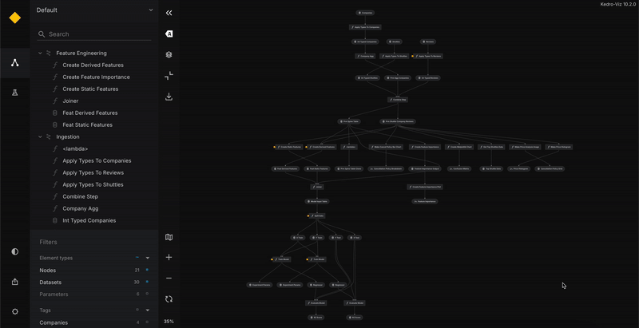
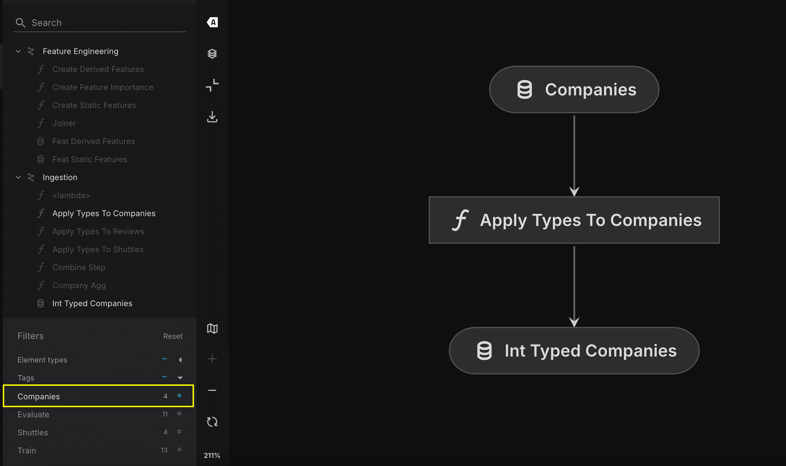
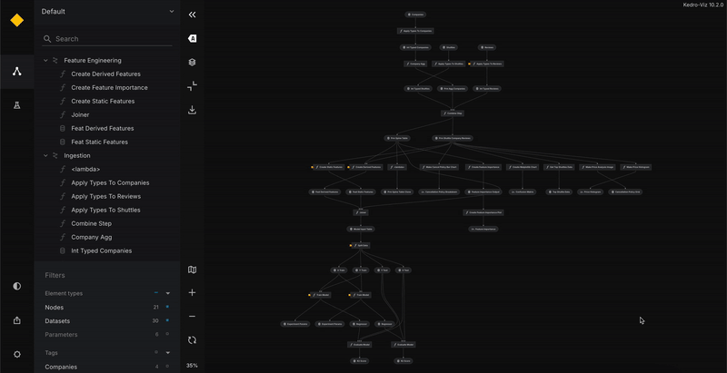

# Nodes grouping in Kedro: pipelines, tags, and namespaces

Effectively grouping nodes in deployment is crucial for maintainability, debugging, and execution control. This document provides an overview of three key grouping methods: pipelines, tags, and namespaces, along with their strengths, limitations, best uses, and relevant documentation links.

## Grouping by pipelines

If your project contains different pipelines, you can use them as predefined node groupings for deployment. Pipelines can be executed separately in the deployment environment. With the visualisation in Kedro Viz, you can switch to see different pipelines in an isolated view.
<br>


If you want to group nodes differently from the existing pipeline structure, you can use tags or namespaces instead of creating a new pipeline. The `--pipelines` flag supports running one or more pipelines in a single command. While you can switch between pipelines in Kedro Viz, the flowchart view does not support collapsing or expanding them.

**Best used when**

- You have already separated your logic into different pipelines, and your project is structured to execute them independently or together in sequence in the deployment environment.

**Not to use when**

- You want to use the expand and collapse functionality in Kedro Viz.

**How to use**

```bash
# Run a single pipeline
kedro run --pipelines=<pipeline_name>

# Run multiple pipelines in one command
kedro run --pipelines=<pipeline_name1>,<pipeline_name2>
```

More information: [Run a pipeline by name](https://docs.kedro.org/en/stable/build/run_a_pipeline/#run-a-pipeline-by-name)

______________________________________________________________________

## Grouping by tags

You can tag individual nodes or the entire pipeline. This approach allows flexible execution of specific sections without modifying the pipeline structure. Kedro-Viz provides a clear visualisation of tagged nodes, making it easier to understand.
<br>


Please note that nodes with the same tag can exist in different pipelines. This overlap can make debugging and maintenance more challenging. Tags also do not enforce structure like pipelines or namespaces.

**Best used when**

- You need to run specific nodes that don't belong to the same pipeline.
- You want to rerun a subset of nodes in a large pipeline.

**Not to use when**

- The tagged nodes have strong dependencies, which might cause execution failures.
- Tags are not hierarchical, so tracking groups of nodes can become difficult.

**How to use**

```bash
  kedro run --tags=<your_tag_name>
```

More information: [How to tag a node](https://docs.kedro.org/en/stable/build/nodes/#how-to-tag-a-node)

______________________________________________________________________

## Grouping by namespaces

Namespaces allow you to group nodes, ensuring clear dependencies and separation within a pipeline while maintaining a consistent structure. Like with pipelines or tags, you can enable selective execution using namespaces, and you cannot run more than one namespace simultaneously—Kedro allows executing one namespace at a time. Kedro Viz allows expanding and collapsing namespace pipelines in the visualisation.
<br>


Using namespaces comes with some challenges:

- **Defining namespace at Pipeline-level:** When applying a namespace at the pipeline level, Kedro automatically renames all inputs, outputs, and parameters within that pipeline. You will need to update your catalog accordingly. If you don't want to change the names of your inputs, outputs, or parameters with the `namespace_name.` prefix while using a namespace, you should list these objects inside the corresponding parameters of the `Pipeline` class. For example:

```
return Pipeline(
    base_pipeline,
    namespace = "new_namespaced_pipeline", # With that namespace, "new_namespaced_pipeline" prefix will be added to inputs, outputs, params, and node names
    inputs={"the_original_input_name"}, # Inputs remain the same, without namespace prefix
)
```

- **Defining namespace at Node-level:** Defining namespaces at node level is not recommended for grouping your nodes. The node level definition of namespaces should be used for creating collapsible views on Kedro-Viz for high level representation of your nodes. If you define namespaces at the node level, they behave similarly to tags and do not guarantee execution consistency.

**Best used when**

- You want to organise nodes logically within a pipeline while keeping a structured execution flow. You can also nest namespaced pipelines within each other for visualisation.
- Your pipeline structure is well-defined, and using namespaces improves visualisation in Kedro-Viz.

**Not to use when**

- In small projects with straightforward pipelines, using namespaces can introduce unnecessary complexity, making pipeline grouping a more suitable choice.
- Namespaces require additional effort, such as updating catalog names, since namespace prefixes are automatically applied to all the elements unless explicitly overridden in the namespaced pipeline parameters.

**How to use**

```bash
kedro run --namespaces=< namespace1,namespace2 >
```

More information: [Namespaces](https://docs.kedro.org/en/stable/build/namespaces/)

### Using namespaces with deployment plugins

When deploying Kedro pipelines, some plugins support grouping nodes by namespace to create more efficient task structures:

**Kedro-Airflow**: The `kedro-airflow` plugin supports grouping nodes by namespace when generating Airflow DAGs. Use the `--group-by namespace` flag to combine all nodes within the same namespace into a single Airflow task:

```bash
kedro airflow create --group-by namespace
```

This reduces the number of Airflow tasks and keeps logically related nodes together. For more details, see the [kedro-airflow documentation](https://github.com/kedro-org/kedro-plugins/tree/main/kedro-airflow) and the [Airflow deployment guide](./supported-platforms/airflow.md#grouping-nodes-in-airflow-tasks).

**AWS Step Functions**: The [AWS Step Functions deployment guide](./supported-platforms/aws_step_functions.md) uses `Pipeline.group_nodes_by("namespace")` so each pipeline-level namespace maps to one Lambda function and one Step Functions task.

**AWS Batch**: The [AWS Batch deployment guide](./supported-platforms/aws_batch.md) uses `Pipeline.group_nodes_by("namespace")` so each pipeline-level namespace maps to one Batch job.

______________________________________________________________________

## Check a grouping before deploying

When each group runs as a separate task, groups no longer share memory or local disk. A pipeline that runs with `kedro run` can then fail on the platform. The most common cause is a dataset passed from one group to another without a catalog entry, which means it exists in memory and nowhere else.

`validate_deployment_grouping` finds these problems before you deploy. It reads the pipeline and the catalog configuration, including dataset factories and catch-all patterns. It does not load data or import dataset classes, so dataset types from libraries that are not installed are still resolved.

Run it from the project root, against the configuration environment you deploy with. The example uses `prod`; replace it with the name of your environment:

```python
from pathlib import Path

from kedro.framework.project import pipelines
from kedro.framework.session import KedroSession
from kedro.framework.startup import bootstrap_project
from kedro.inspection import validate_deployment_grouping

bootstrap_project(Path.cwd())
with KedroSession.create(env="prod") as session:
    catalog = session.load_context().catalog

result = validate_deployment_grouping(pipelines["__default__"], catalog)
for issue in result.issues:
    print(issue.severity, issue.message)
```

The result depends on the dataset types and paths in the catalog you pass. The default `local` environment often points at local paths or in-memory datasets that a production environment overrides with shared storage, so pass the `env` you deploy with.

The spaceflights starter does not use namespaces, so with its default `local` environment every node becomes its own task. The check reports errors for `X_train`, `X_test`, `y_train` and `y_test`, which the starter keeps in memory, and warnings for the datasets it saves under `data/`. The first error reads:

```text
error Dataset 'X_test' is passed from group 'split_data_node' to group 'evaluate_model_node' but is only kept in memory, so it will not exist when the receiving group runs as a separate task. Add a catalog entry that saves it to shared storage, or move the nodes that use it into group 'split_data_node'.
```

By default the check groups nodes by namespace. Pass `group_by=None` to check one task per node.

| Code                 | Severity | Reported when                                                                                                                                       |
| -------------------- | -------- | --------------------------------------------------------------------------------------------------------------------------------------------------- |
| `ephemeral_boundary` | error    | A dataset produced in one group and used in another is kept in memory and never saved                                                               |
| `group_cycle`        | error    | Groups depend on each other in a loop, for example when a namespace is interrupted by a node outside it                                             |
| `invalid_grouping`   | error    | A grouping passed with `groups=` leaves a node out, repeats a node or a group name, has an empty group, or names a node that is not in the pipeline |
| `local_boundary`     | warning  | A dataset passed between groups is saved to local disk. Databricks shared paths such as `/dbfs/` and `/Volumes/` are not reported                   |
| `single_node_groups` | info     | Groups that contain a single node and so run as their own task                                                                                      |

The severity is fixed for each code. An error means the pipeline will fail after each group starts running as a separate task. A warning means it may fail depending on where the tasks run. Info needs no change. The check reports issues and does nothing else: it never stops a run or a deployment. `bool(result)` is `True` when there are no errors, and `result.to_dict()` returns a JSON-safe summary.

### When to run the check

- **While developing**, from a script or notebook as shown above, after you change namespaces or catalog entries.

- **In CI**, as a step before the job that deploys. `raise_if_failed()` raises a `DeploymentGroupingError` when there are errors, which fails the step, and the exception message lists every error. Warnings never fail the step, so print them to the CI log:

    ```python
    from pathlib import Path

    from kedro.framework.project import pipelines
    from kedro.framework.session import KedroSession
    from kedro.framework.startup import bootstrap_project
    from kedro.inspection import validate_deployment_grouping

    bootstrap_project(Path.cwd())
    with KedroSession.create(env="prod") as session:
        catalog = session.load_context().catalog

    result = validate_deployment_grouping(pipelines["__default__"], catalog)
    for issue in result.warnings:
        print("warning:", issue.message)
    result.raise_if_failed()
    ```

    The starters save intermediate datasets under `data/`, which produces warnings rather than errors, so a step that checks errors alone passes for them.

- **In a deployment plugin**, straight after it calls `Pipeline.group_nodes_by()`. Pass the groups it returns as `groups=`, so the check reports problems in the grouping the plugin turns into tasks.

______________________________________________________________________

**Summary table**

| Aspect                        | Pipelines                                                                                                                                                                                           | Tags                                                                                                                                                                                                                             | Namespaces                                                                                                                                                                                                                                                                                                                                          |
| ----------------------------- | --------------------------------------------------------------------------------------------------------------------------------------------------------------------------------------------------- | -------------------------------------------------------------------------------------------------------------------------------------------------------------------------------------------------------------------------------- | --------------------------------------------------------------------------------------------------------------------------------------------------------------------------------------------------------------------------------------------------------------------------------------------------------------------------------------------------- |
| **What Works**                | If you're happy with how the nodes are structured in your existing pipeline, or your pipeline is low complexity and a new grouping view is not required then you don't have to use any alternatives | Tagging individual nodes or the entire pipeline allows flexible execution of specific sections without altering the pipeline structure, and Kedro-Viz offers clear visualisation of these tagged nodes for better understanding. | Namespaces group nodes to ensure clear dependencies and separation within a pipeline, allow selective execution, and can be visualised using Kedro-Viz.                                                                                                                                                                                             |
| **What Doesn't Work**         | If you want to group nodes differently from the current pipeline structure, instead of creating a new pipeline, you can use alternative grouping methods such as tags or namespaces.                | Lack of hierarchical structure, using tags makes debugging and maintaining the codebase more challenging                                                                                                                         | Defining namespaces at the node level behaves like tags without ensuring execution consistency, while defining them at the pipeline level helps create a modular structure by renaming inputs, outputs, and parameters but can introduce naming conflicts if the pipeline is connected elsewhere or parameters are referenced outside the pipeline. |
| **Syntax**                    | `kedro run --pipelines=<your_pipeline_names>`                                                                                                                                                       | `kedro run --tags=<your_tag_name>`                                                                                                                                                                                               | `kedro run --namespaces=< namespace1,namespace2 >`                                                                                                                                                                                                                                                                                                  |
| **Deployment Plugin Support** | N/A                                                                                                                                                                                                 | N/A                                                                                                                                                                                                                              | `kedro airflow create --group-by namespace`; [AWS Step Functions](./supported-platforms/aws_step_functions.md); [AWS Batch](./supported-platforms/aws_batch.md)                                                                                                                                                                                     |
