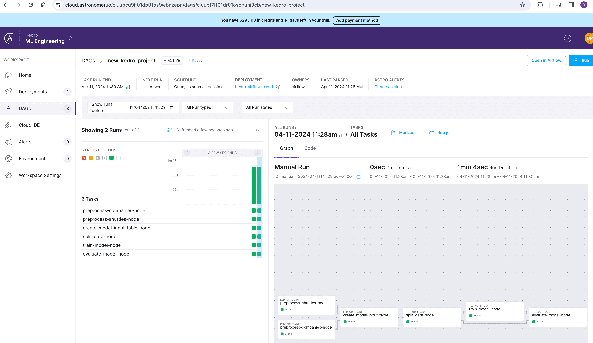

# Apache Airflow

Apache Airflow is a popular open-source workflow management platform. It is a suitable engine to orchestrate and execute a pipeline authored with Kedro, because workflows in Airflow are modelled and organised as [DAGs](https://en.wikipedia.org/wiki/Directed_acyclic_graph).

## Introduction and strategy

The general strategy to deploy a Kedro pipeline on Apache Airflow is to run every Kedro node as an [Airflow task](https://airflow.apache.org/docs/apache-airflow/stable/concepts/tasks.html) while the whole pipeline is converted to an [Airflow DAG](https://airflow.apache.org/docs/apache-airflow/stable/concepts/dags.html). This approach mirrors the principles of [running Kedro in a distributed environment](../distributed.md).

Each node will be executed within a new Kedro session, which implies that `MemoryDatasets` cannot serve as storage for the intermediate results of nodes. Instead, all datasets must be registered in the [`DataCatalog`](https://docs.kedro.org/en/stable/catalog-data/data_catalog/) and stored in persistent storage. This approach enables nodes to access the results from preceding nodes.

This guide describes how to run a Kedro pipeline on different Airflow platforms. Jump to any of the sections below to learn how to run a Kedro pipeline on:

- [Apache Airflow with Astronomer](#how-to-run-a-kedro-pipeline-on-apache-airflow-with-astronomer)
- [Amazon AWS Managed Workflows for Apache Airflow (MWAA)](#how-to-run-a-kedro-pipeline-on-amazon-aws-managed-workflows-for-apache-airflow-mwaa)
- [Apache Airflow using a Kubernetes cluster](#how-to-run-a-kedro-pipeline-on-apache-airflow-using-a-kubernetes-cluster)

## Grouping nodes in Airflow tasks

By default, `kedro airflow create` converts each Kedro node into a separate Airflow task. If you need to group multiple nodes into a single task to reduce scheduling overhead or to handle datasets that cannot be shared across distributed workers.

The `--group-by` option provides two grouping strategies:

### Grouping by memory

When running Kedro nodes using Airflow, `MemoryDatasets` are not shared across operators, which can cause the DAG run to fail. Nodes connected through  can be grouped together using the `--group-by memory` flag:

```bash
kedro airflow create --group-by memory
```

This combines nodes that share `MemoryDatasets` into single Airflow tasks, preserving the logical separation in Kedro while avoiding data persistence issues.

### Grouping by namespace

If your Kedro pipeline uses [namespaces](https://docs.kedro.org/en/stable/build/namespaces/) to organise nodes, you can group all nodes within the same namespace into a single Airflow task:

```bash
kedro airflow create --group-by namespace
```

This is useful when:
* You have logically grouped nodes using namespaces and want to execute them together
* You want to reduce the number of Airflow tasks while maintaining the namespace structure
* Your namespaced nodes share intermediate data that doesn't need to be persisted between tasks

Nodes without a namespace will each be converted to individual Airflow tasks.

For more information about node grouping strategies in Kedro, see the [node grouping guide](../nodes_grouping.md).

## How to run a Kedro pipeline on Apache Airflow with Astronomer

The following tutorial shows how to deploy an example [Spaceflights Kedro project](https://docs.kedro.org/en/stable/tutorials/spaceflights_tutorial/) on [Apache Airflow](https://airflow.apache.org/) with the [Astro CLI](https://docs.astronomer.io/astro/cli/overview). This command-line tool, created by [Astronomer](https://www.astronomer.io/), streamlines the creation of local Airflow projects. You will deploy it locally first, then transition to Astro Cloud.

[Astronomer](https://www.astronomer.io/) is a managed Airflow platform that lets teams spin up and run Airflow clusters in production. It also ships with tooling to help teams get started with Airflow on their local machines.

### Prerequisites

To follow this tutorial, ensure you have the following:

* The [Astro CLI installed](https://www.astronomer.io/docs/astro/cli/install-cli)
* A container service like [Docker Desktop](https://docs.docker.com/get-docker/) (v18.09 or higher)
* `kedro>=0.19` installed
* [`kedro-airflow>=0.8`](https://github.com/kedro-org/kedro-plugins/tree/main/kedro-airflow) installed. We will use this plugin to convert the Kedro pipeline into an Airflow DAG.

### Create, prepare and package example Kedro project

In this section, you will create a new Kedro project equipped with an example pipeline designed to solve a typical data science task: predicting spaceflights prices. You will customise the project for Airflow by registering datasets that were stored in memory and by simplifying logging with custom settings. After making these changes, package the project for installation in an Airflow Docker container and generate an Airflow DAG that mirrors the Kedro pipeline.

1. To create a new Kedro project, select the `example=yes` option to include example code. To enable custom logging, add `tools=log`. Proceed with the default project name, and add any other tools as needed:

    ```shell
    kedro new --example=yes --name=new-kedro-project --tools=log
    ```

2. Navigate to your project's directory, create a new `conf/airflow` directory for Airflow-specific configurations, and copy the `catalog.yml` file from `conf/base` to `conf/airflow`. This setup allows you to customise the `DataCatalog` for use with Airflow:

    ```shell
    cd new-kedro-project
    mkdir conf/airflow
    cp conf/base/catalog.yml conf/airflow/catalog.yml
    ```

3. Open `conf/airflow/catalog.yml` to view the datasets used in the project. Additional intermediate datasets (`X_train`, `X_test`, `y_train`, `y_test`) live in memory. You can locate these in the pipeline description under `/src/new_kedro_project/pipelines/data_science/pipeline.py`. To ensure the datasets persist across tasks in Airflow, include them in the `DataCatalog`. Instead of repeating similar code for each dataset, use [Dataset Factories](https://docs.kedro.org/en/stable/catalog-data/kedro_dataset_factories/), a syntax that lets you define a catch-all pattern to replace the default `MemoryDataset` creation. Add the following to the end of the file:

```yaml
"{base_dataset}":
  type: pandas.CSVDataset
  filepath: data/02_intermediate/{base_dataset}.csv
```

In the example here we assume that all Airflow tasks share one disk, but for distributed environments you would need to use non-local file paths.

Starting with `kedro-airflow` release 0.9.0, you can adopt a different strategy instead of following steps 2-3: group nodes that use intermediate `MemoryDatasets` into larger tasks using `--group-by memory`. This approach allows intermediate data manipulation to occur within a single task, eliminating the need to transfer data between nodes. Enable this behaviour by running `kedro airflow create` with the `--group-by memory` flag on Step 6.

4. Open `conf/logging.yml` and change the `root: handlers` section to `[console]` at the end of the file. By default, Kedro uses the [Rich library](https://rich.readthedocs.io/en/stable/index.html) to enhance log output with sophisticated formatting. Some deployment systems, including Airflow, do not work well with Rich, so update the logging configuration to a simpler console version. For more information on logging in Kedro, see the [Kedro docs](https://docs.kedro.org/en/stable/develop/logging/).

> ⚠️ **Note**: This step is optional for Airflow from version `2.11.0` onward, as the compatibility issue has been confirmed fixed at least from this version.

```shell
root:
  handlers: [console]
```

5. Package the Kedro pipeline as a Python package so you can install it into the Airflow container later on:

```shell
kedro package
```

This step should produce a wheel file called `new_kedro_project-0.1-py3-none-any.whl` located at `dist/`.

6. Convert the Kedro pipeline into an Airflow DAG with `kedro airflow`

```shell
kedro airflow create --target-dir=dags/ --env=airflow
```

This step should produce a `.py` file called `new_kedro_project_airflow_dag.py` located at `dags/`.

Optionally, you can use the `--group-by` flag to group nodes:
- `--group-by memory`: Groups nodes connected through `MemoryDatasets`
- `--group-by namespace`: Groups nodes by their namespace

### Deployment process with Astro CLI

In this section, you will set up a new blank Airflow project using Astro and copy the files prepared in the previous section from the Kedro project. Next, customise the Dockerfile to enhance logging and to install the Kedro package. After that, run the Airflow cluster and explore the results.

1. To complete this section, you have to install both the [Astro CLI](https://www.astronomer.io/docs/astro/cli/install-cli) and [Docker Desktop](https://docs.docker.com/get-docker/).

2. [Initialise an Airflow project with Astro](https://docs.astronomer.io/astro/cli/develop-project) in a new folder outside of your Kedro project. Let's call it `kedro-airflow-spaceflights`

    ```shell
    cd ..
    mkdir kedro-airflow-spaceflights
    cd kedro-airflow-spaceflights
    astro dev init
    ```

3. The folder `kedro-airflow-spaceflights` will be executed within the Airflow container. To run the Kedro project there, you need to copy several items from the previous section into it:
- the `/data` folder from Step 1, containing sample input datasets for our pipeline. This folder will also store the output results.
- the `/conf` folder from Steps 2-4, which includes our `DataCatalog`, parameters, and customised logging files. These files will be used by Kedro during its execution in the Airflow container.
- the `.whl` file from Step 5, which you will need to install in the Airflow Docker container to execute our project node by node.
- the Airflow DAG from Step 6 for deployment in the Airflow cluster.
    ```shell
    cd ..
    cp -r new-kedro-project/data kedro-airflow-spaceflights/data
    cp -r new-kedro-project/conf kedro-airflow-spaceflights/conf
    mkdir -p kedro-airflow-spaceflights/dist/
    cp new-kedro-project/dist/new_kedro_project-0.1-py3-none-any.whl kedro-airflow-spaceflights/dist/
    cp new-kedro-project/dags/new_kedro_project_airflow_dag.py kedro-airflow-spaceflights/dags/
    ```

You can copy the entire `new-kedro-project` directory into `kedro-airflow-spaceflights` if the project requires frequent updates, DAG recreation, and repackaging. Working with Kedro and Astro projects in a single folder saves you from copying files for each development iteration. Be aware that the projects will then share files such as `requirements.txt`, `README.md`, and `.gitignore`.

4. Add the following lines to the `Dockerfile` located in the `kedro-airflow-spaceflights` folder to set the environment variable `KEDRO_LOGGING_CONFIG` to point to `conf/logging.yml`, enabling custom logging in Kedro (from Kedro 0.19.6 onward, this step is unnecessary because Kedro uses the `conf/logging.yml` file by default), and to install the `.whl` file of the prepared Kedro project into the Airflow container:

```Dockerfile
ENV KEDRO_LOGGING_CONFIG="conf/logging.yml" # This line is not needed from Kedro 0.19.6

RUN pip install --user dist/new_kedro_project-0.1-py3-none-any.whl
```

5. Navigate to `kedro-airflow-spaceflights` folder and launch the local Airflow cluster with Astronomer

```shell
cd kedro-airflow-spaceflights
astro dev start
```

6. Visit the Airflow web server UI at its default address, http://localhost:8080, using the default login credentials: username and password both set to `admin`. There, you'll find a list of all DAGs. Navigate to the `new-kedro-project` DAG and press the `Trigger DAG` play button to start it. You can then observe the steps of your project as they run:


7. The Kedro project was run inside an Airflow Docker container, and the results are stored there as well. To copy these results to your host, first identify the relevant Docker containers by listing them:
```shell
docker ps
```
Select the container acting as the scheduler and note its ID. Then, use the following command to copy the results, substituting `d36ef786892a` with the actual container ID:

```shell
docker cp  d36ef786892a:/usr/local/airflow/data/ ./data/
```


8. To stop the Astro Airflow environment, you can use the command:
```shell
astro dev stop
```

### Deployment to Astro Cloud

You can deploy and run your project on Astro Cloud, the cloud infrastructure provided by Astronomer, by following these steps:

1. Log in to your account on the [Astronomer portal](https://www.astronomer.io/) and create a new deployment if you don't already have one:


2. Use the Astro CLI to log in to your Astro Cloud account:
```shell
astro auth
```
You will be redirected to enter your login credentials in your browser. Successful login indicates that your terminal is now linked with your Astro Cloud account:


3. To deploy your local project to the cloud, navigate to the `kedro-airflow-spaceflights` folder and run:
```shell
astro deploy
```

4. At the end of the deployment process, you receive a link that lets you manage your project in the cloud:



## How to run a Kedro pipeline on Amazon AWS Managed Workflows for Apache Airflow (MWAA)

### Kedro project preparation
MWAA, or Managed Workflows for Apache Airflow, is an AWS service that makes it easier to set up, operate, and scale Apache Airflow in the cloud. Deploying a Kedro pipeline to MWAA shares several steps with Astronomer. There are key differences: you need to store your project data in an AWS S3 bucket and update the `DataCatalog`. You must also plan how you upload your Kedro configuration, install your Kedro package, and set the required environment variables.
1. Complete steps 1-4 from the [Create, prepare and package example Kedro project](#create-prepare-and-package-example-kedro-project) section.
2. Your project's data should not sit in the working directory of the Airflow container. Instead, [create an S3 bucket](https://docs.aws.amazon.com/AmazonS3/latest/userguide/creating-bucket.html) and [upload your data folder from the new-kedro-project folder to your S3 bucket](https://docs.aws.amazon.com/AmazonS3/latest/userguide/upload-objects.html).
3. Update the `DataCatalog` to reference data in your S3 bucket by adjusting the filepath and adding a credentials entry for each dataset in `new-kedro-project/conf/airflow/catalog.yml`. Add the S3 prefix to the filepath, as shown below:
```shell
companies:
  type: pandas.CSVDataset
  filepath: s3://<your_S3_bucket>/data/01_raw/companies.csv
  credentials: dev_s3
```
4. [Set up AWS credentials](https://docs.aws.amazon.com/keyspaces/latest/devguide/access.credentials.html) to provide read and write access to your S3 bucket. Update `new-kedro-project/conf/local/credentials.yml` with your AWS_ACCESS_KEY_ID and AWS_SECRET_ACCESS_KEY and copy it to the `new-kedro-project/conf/airflow/` folder:
```shell
dev_s3:
  client_kwargs:
    aws_access_key_id: *********************
    aws_secret_access_key: ******************************************
```
5. Add `s3fs` to your project’s `requirements.txt` in `new-kedro-project` to enable communication with AWS S3. Some libraries trigger dependency conflicts in the Airflow environment, so keep the requirements list lean and avoid adding `kedro-viz` and `pytest`.
```shell
s3fs
```

6. Follow steps 5-6 from the [Create, prepare and package example Kedro project](#create-prepare-and-package-example-kedro-project) section to package your Kedro project and generate an Airflow DAG.
7. Update the DAG file `new_kedro_project_airflow_dag.py` located in the `dags/` folder by adding `conf_source="plugins/conf-new_kedro_project.tar.gz"` to the arguments of `KedroSession.create()` in the Kedro operator execution function. This change is necessary because your Kedro configuration archive will be stored in the `plugins/` folder, not the root directory:
```shell
    def execute(self, context):
        configure_project(self.package_name)
        with KedroSession.create(project_path=self.project_path,
                                 env=self.env, conf_source="plugins/conf-new_kedro_project.tar.gz") as session:
            session.run(self.pipeline_name, node_names=[self.node_name])
```

### Deployment on MWAA
1. Archive your three files: `new_kedro_project-0.1-py3-none-any.whl` and `conf-new_kedro_project.tar.gz` located in `new-kedro-project/dist`, and `logging.yml` located in `new-kedro-project/conf/` into a file called `plugins.zip` and upload it to `s3://your_S3_bucket`.
```shell
zip -j plugins.zip dist/new_kedro_project-0.1-py3-none-any.whl dist/conf-new_kedro_project.tar.gz conf/logging.yml
```
This archive will be later unpacked to the `/plugins` folder in the working directory of the Airflow container.

2. Create a new `requirements.txt` file, add the path where your Kedro project will be unpacked in the Airflow container, and upload `requirements.txt` to `s3://your_S3_bucket`:
```shell
./plugins/new_kedro_project-0.1-py3-none-any.whl
```
Libraries from `requirements.txt` will be installed during container initialisation.

3. Upload `new_kedro_project_airflow_dag.py` from the `new-kedro-project/dags` to `s3://your_S3_bucket/dags`.
4. Create an empty `startup.sh` file for container startup commands. Set an environment variable for custom Kedro logging:
```shell
export KEDRO_LOGGING_CONFIG="plugins/logging.yml"
```
5. Set up a new [AWS MWAA environment](https://docs.aws.amazon.com/mwaa/latest/userguide/create-environment.html) using the following settings:
```shell
S3 Bucket:
  s3://your_S3_bucket
DAGs folder
  s3://your_S3_bucket/dags
Plugins file - optional
  s3://your_S3_bucket/plugins.zip
Requirements file - optional
  s3://your_S3_bucket/requirements.txt
Startup script file - optional
  s3://your_S3_bucket/startup.sh
```
On the next page, set the `Public network (Internet accessible)` option in the `Web server access` section if you want to access your Airflow UI from the internet. Continue with the default options on the remaining pages.

6. Once the environment is created, use the `Open Airflow UI` button to access the standard Airflow interface, where you can manage your DAG.

## How to run a Kedro pipeline on Apache Airflow using a Kubernetes cluster

If you want to execute your DAG in an isolated environment on Airflow using a Kubernetes cluster, you can use a combination of the [`kedro-airflow`](https://pypi.org/project/kedro-airflow/) and [`kedro-docker`](https://pypi.org/project/kedro-docker/) plugins.

1. **Package your Kedro project as a Docker container**
   [Use the `kedro docker init` and `kedro docker build` commands](https://github.com/kedro-org/kedro-plugins/tree/main/kedro-docker) to containerise your Kedro project.

2. **Push the Docker image to a container registry**
   Upload the built Docker image to a cloud container registry, such as AWS ECR, Google Container Registry, or Docker Hub.

3. **Generate an Airflow DAG**
   Run the following command to generate an Airflow DAG:
   ```sh
   kedro airflow create
   ```
   This will create a DAG file that includes the `KedroOperator()` by default.

   Optionally, use `--group-by memory` or `--group-by namespace` to group nodes into fewer tasks.

4. **Update the DAG to use `KubernetesPodOperator`**
   To execute each Kedro node (or group of nodes) in an isolated Kubernetes pod, replace `KedroOperator()` with `KubernetesPodOperator()`, as shown in the example below:

   ```python
   from airflow.providers.cncf.kubernetes.operators.pod import KubernetesPodOperator

   KubernetesPodOperator(
       task_id=node_name,
       name=node_name,
       namespace=NAMESPACE,
       image=DOCKER_IMAGE,
       cmds=["kedro"],
       arguments=["run", f"--nodes={node_name}"],
       get_logs=True,
       is_delete_operator_pod=True,  # Cleanup after execution
       in_cluster=False, # Set to True if Airflow runs inside the Kubernetes cluster
       do_xcom_push=False,
       image_pull_policy="Always",
       # Uncomment the following lines if Airflow is running outside Kubernetes
       # cluster_context="k3d-your-cluster",  # Specify the Kubernetes context from your kubeconfig
       # config_file="~/.kube/config",  # Path to your kubeconfig file
   )
   ```

### Run multiple nodes in a single container

By default, this approach runs each node in an isolated Docker container. To reduce computational overhead, you can run multiple nodes together within the same container.

The `--group-by` option in `kedro airflow create` provides an automated way to group nodes:
- `--group-by memory`: Groups nodes connected through `MemoryDatasets`
- `--group-by namespace`: Groups nodes by their namespace

If you opt for manual grouping or need to customise the generated DAG, update it to adjust task dependencies and execution order.

For example, in the [`spaceflights-pandas` tutorial](../../tutorials/spaceflights_tutorial.md), if you want to execute the first two nodes together, your DAG may look like this:

```python
from airflow.providers.cncf.kubernetes.operators.pod import KubernetesPodOperator

with DAG(...) as dag:
    tasks = {
        "preprocess-companies-and-shuttles": KubernetesPodOperator(
            task_id="preprocess-companies-and-shuttles",
            name="preprocess-companies-and-shuttles",
            namespace=NAMESPACE,
            image=DOCKER_IMAGE,
            cmds=["kedro"],
            arguments=["run", "--nodes=preprocess-companies-node,preprocess-shuttles-node"],
            ...
        ),
        "create-model-input-table-node": KubernetesPodOperator(...),
        ...
    }

    tasks["preprocess-companies-and-shuttles"] >> tasks["create-model-input-table-node"]
    tasks["create-model-input-table-node"] >> tasks["split-data-node"]
    ...
```

In this example, we modified the original DAG generated by the `kedro airflow create` command by replacing `KedroOperator()` with `KubernetesPodOperator()`. We also merged the first two tasks into a single task named `preprocess-companies-and-shuttles`. This task executes the Docker image running two Kedro nodes: `preprocess-companies-node` and `preprocess-shuttles-node`.

Furthermore, we adjusted the task order at the end of the DAG. Instead of having separate dependencies for the first two tasks, we consolidated them into a single line:

```python
tasks["preprocess-companies-and-shuttles"] >> tasks["create-model-input-table-node"]
```

This ordering ensures that the `create-model-input-table-node` task runs after `preprocess-companies-and-shuttles` has completed.
