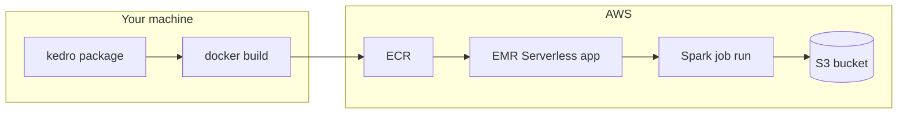

# Amazon EMR Serverless

[Amazon EMR Serverless](https://docs.aws.amazon.com/emr/latest/EMR-Serverless-UserGuide/emr-serverless.html) runs Apache Spark jobs without you managing clusters. EMR allocates resources per job and releases them when the job finishes. The sections below show how to deploy a Kedro project as a Spark job on EMR Serverless, with datasets stored on Amazon S3.

EMR Serverless suits pipelines with **PySpark or other distributed Spark work**. Single-node stages (pandas, scikit-learn, reporting) may fit better on [AWS Step Functions](aws_step_functions.md) or [AWS Batch](aws_batch.md), or as separate jobs you orchestrate around Spark stages.

This guide targets Kedro 1.x (kedro>=1.0) and uses the Spaceflights PySpark starter as a worked example. Read [the deployment strategy](#strategy) if you are deploying your own project and need guidance on EMR release choice, job scope, S3 storage and catalog configuration, and custom images.

## Strategy

Read this section before you deploy your own project. It starts with an overview of the approach, then gives practical advice for adapting it to your pipelines.

#### Overview

This guide deploys a Kedro pipeline as an EMR Serverless Spark job backed by a custom container image and Amazon S3.

The approach in brief:

1. **Package the project** with `kedro package`. You get a wheel and a `conf-<package_name>.tar.gz` archive. The wheel does not include `conf/`.
1. **Build a custom Docker image** that installs Python >=3.10, your Kedro wheel, and the config archive. EMR base images ship with Python below Kedro's minimum, so a custom image is required.
1. **Push the image to ECR** and create an EMR Serverless application that references it.
1. **Submit a Spark job** with an S3-hosted entrypoint script. Pass Kedro CLI flags (`--env`, `--conf-source`, `--pipelines`, `--runner`) as `entryPointArguments`.

<!-- vale off -->



<!-- vale on -->

EMR Serverless **ignores** `[CMD]` and `[ENTRYPOINT]` in the Dockerfile. The job always starts from the S3 `entryPoint` script you pass at submission time.

#### Why use a custom image?

EMR Serverless supports installing Python and dependencies at job-submit time, but that approach is error-prone and hard to debug. A [custom image for EMR Serverless](https://docs.aws.amazon.com/emr/latest/EMR-Serverless-UserGuide/application-custom-image.html) packages Python, your Kedro wheel, and configuration into one immutable container you can test locally before pushing to [Amazon Elastic Container Registry](https://docs.aws.amazon.com/AmazonECR/latest/userguide/what-is-ecr.html).

On managed EMR clusters, teams typically use [bootstrap actions](https://docs.aws.amazon.com/emr/latest/ManagementGuide/emr-plan-bootstrap.html) or [custom AMIs](https://docs.aws.amazon.com/emr/latest/ManagementGuide/emr-custom-ami.html) instead. See the [Kedro EMR blog post](https://kedro.org/blog/how-to-deploy-kedro-pipelines-on-amazon-emr) for an older virtual-environment approach on managed EMR.

<!-- vale off -->

AWS also documents a [virtual-environment and venv-pack workflow](https://docs.aws.amazon.com/emr/latest/EMR-Serverless-UserGuide/using-python.html) for EMR Serverless. That path is easy to break when Python is symlinked ([venv-pack](https://pypi.org/project/venv-pack/) does not bundle the interpreter). Kedro's older experiments with [pyenv](https://github.com/pyenv/pyenv) on top of it hit symlink errors such as `Too many levels of symbolic links`. A custom image avoids those packaging steps and keeps Python, dependencies, and your Kedro project in one testable artefact.

<!-- vale on -->

#### Choose EMR 7.x or 6.x

Use **EMR 7.x** for all new deployments. EMR base images ship with Python below Kedro's minimum (>=3.10), so you build a **custom Docker image** that installs Python >=3.10 and your Kedro project.

|                             | **EMR 7.x (recommended)**                               | **EMR 6.x (legacy)**                                                                                                                         |
| --------------------------- | ------------------------------------------------------- | -------------------------------------------------------------------------------------------------------------------------------------------- |
| EMR release (example)       | `emr-7.13.0`                                            | `emr-6.10.0`                                                                                                                                 |
| Base image                  | `public.ecr.aws/emr-serverless/spark/emr-7.13.0:latest` | `public.ecr.aws/emr-serverless/spark/emr-6.10.0:latest`                                                                                      |
| Base OS                     | Amazon Linux 2023                                       | Amazon Linux 2                                                                                                                               |
| Python install              | `dnf` (for example `python3.12`)                        | [Pre-built standalone Python](https://github.com/astral-sh/python-build-standalone) (recommended) or [pyenv](https://github.com/pyenv/pyenv) |
| Spark Python path (example) | `/usr/bin/python3.12`                                   | `/opt/python/bin/python`                                                                                                                     |
| Dockerfile                  | `Dockerfile`                                            | `Dockerfile.emr6`                                                                                                                            |
| Wheel install               | full dependencies OK                                    | `--no-deps` + slim runtime                                                                                                                   |

!!! warning "Legacy: EMR 6.x"

    EMR 6.x defaults to Python ~3.7 and is in [end of support or end of life](https://docs.aws.amazon.com/emr/latest/ReleaseGuide/emr-standard-support.html). We do **not** recommend it for new deployments. See [Legacy: EMR 6.x](#legacy-emr-6x) if you cannot use EMR 7.x.

Keep the EMR release label aligned everywhere: Dockerfile `FROM` line, EMR Serverless application release, `validate-image -r` flag, and job submission must all match (for example `emr-7.13.0`).

#### Choose how to run pipelines on EMR

Unlike Step Functions, EMR Serverless does not automatically wire pipeline dependency order. You choose how much work each job runs and how you orchestrate multiple jobs.

| Approach                                               | Pros                                 | Cons                                        | When to use                                         |
| ------------------------------------------------------ | ------------------------------------ | ------------------------------------------- | --------------------------------------------------- |
| **One job, full pipeline** (`__default__`)             | Simplest submission                  | Longer job; harder to retry one stage       | Small PySpark pipelines                             |
| **One job per pipeline** (`--pipelines=<name>`)        | Isolated retries and scaling         | Multiple submissions; you orchestrate order | Medium pipelines with mixed Spark and pandas stages |
| **Offload orchestration** to Step Functions or Airflow | Handles dependency order across jobs | Extra infrastructure to set up and operate  | Multi-pipeline production workflows                 |

When pipelines depend on each other, submit jobs in **dependency order**: run upstream pipelines before downstream ones that read their S3 outputs. For automatic ordering across stages that fit within Lambda limits, combine [AWS Step Functions](aws_step_functions.md) (or [AWS Batch](aws_batch.md)) with EMR Serverless for Spark-heavy work. The same dependency rules apply in [distributed Kedro runs](../distributed.md) and in [grouping nodes for deployment](../nodes_grouping.md).

#### Plan storage and configuration

List **every dataset your pipeline reads or writes on EMR** in `conf/emr/catalog.yml` (or your chosen environment) with full S3 paths:

- Use **`s3://`** for pandas datasets (requires `s3fs` in `pyproject.toml`).
- Use **`s3a://`** for `spark.SparkDatasetV2` paths so Spark uses the Hadoop S3 filesystem bundled with EMR.

By default, Kedro merges configuration environments at the **top level**. If `conf/emr/catalog.yml` overrides a dataset using `filepath` alone, it **replaces** the entire dataset entry from `conf/base/` and drops keys such as `type`. Either include the full dataset definition (including `type`) in `conf/emr/catalog.yml`, or set `merge_strategy: {catalog: soft}` in `settings.py` so environment files can override individual fields.

At job submission, pass `--conf-source /home/hadoop/conf`. The Dockerfile copies the packaged config archive there because the wheel does not include `conf/`. The Spark driver's working directory is often `/tmp/spark-.../`, so a relative config path will fail without `--conf-source`.

#### Configure before you deploy

- Create `conf/emr/` (or your environment name) with **full** S3 catalog entries for every dataset the job touches
- Update **project dependencies** in [Step 3](#step-3-configure-kedro-for-emr) before you package the image
- Keep **`conf/base/catalog.yml` on local paths** for local development; use the EMR environment for cloud runs
- Run **`kedro run --env emr`** locally before building the image to catch catalog and dependency errors early
- Decide **`--pipelines`** scope for each job (full pipeline vs one pipeline per submission)
- For slim **EMR 6.x** images, use the [`KEDRO_PIPELINES_TO_FIND` pattern](#additional-kedro-configuration-for-slim-images) so Kedro does not import pipelines missing from the image
- On **Apple Silicon**, build with `--platform linux/amd64` because EMR Serverless applications use `x86_64`

## Working example

### Prerequisites

These apply to the **step-by-step guide** below. This guide builds and deploys from your machine with Kedro, Docker, and the AWS CLI. You use the [AWS Management Console](https://aws.amazon.com/console/) to inspect the EMR application and job runs after submission, but you cannot complete the guide with the console alone.

| You need                                                                                                              | Used for                                                                                    |
| --------------------------------------------------------------------------------------------------------------------- | ------------------------------------------------------------------------------------------- |
| A **Kedro project** (`requires-python = ">=3.10"` in `pyproject.toml`) and Python **>=3.10** locally                  | Packaging the project, local test runs, and matching the Python version in the custom image |
| [Docker](https://docs.docker.com/get-docker/) (Podman also works if you have a `docker`-compatible CLI)               | Building the custom EMR container image                                                     |
| [AWS CLI](https://docs.aws.amazon.com/cli/latest/userguide/cli-chap-configure.html) configured for your target region | Creating S3 and ECR resources, uploading data, pushing the image, and submitting jobs       |
| An AWS account with permissions for EMR Serverless, S3, ECR, and IAM                                                  | Creating and running the deployed resources                                                 |

The steps that follow deploy the [Spaceflights PySpark starter](https://github.com/kedro-org/kedro-starters/tree/main/spaceflights-pyspark) end to end. Create the project with:

```bash
kedro new -s spaceflights-pyspark -n spaceflights_emr
```

If you are new to the project layout, [complete the Spaceflights tutorial](../../tutorials/spaceflights_tutorial.md). Kedro requires **Python >=3.10**. This guide uses **Python 3.12** on **EMR 7.13.0**; install the same Python version locally. If you use your own Kedro project, replace the placeholders below and follow the same steps.

### Placeholders used in this guide

Replace these before building and submitting jobs:

| Placeholder                      | Example                                                           |
| -------------------------------- | ----------------------------------------------------------------- |
| `<PACKAGE_WHEEL_NAME>`           | `spaceflights_emr-0.1-py3-none-any.whl`                           |
| `<PACKAGE_CONF_ARCHIVE>`         | `conf-spaceflights_emr.tar.gz`                                    |
| `<PACKAGE_NAME>`                 | `spaceflights_emr`                                                |
| `<your-bucket>`                  | `my-kedro-emr-bucket`                                             |
| `<your-aws-region>`              | `us-east-1`                                                       |
| `<ecr-image-uri>`                | `123456789012.dkr.ecr.us-east-1.amazonaws.com/kedro-emr-7:latest` |
| `<emr-conf>`                     | `emr`                                                             |
| `<kedro-pipeline-name>`          | `data_processing`                                                 |
| `<s3-path-to-entrypoint-script>` | `s3://my-bucket/scripts/entrypoint.py`                            |
| `<application-id>`               | from EMR Serverless console or CLI                                |
| `<execution-role-arn>`           | IAM job runtime role ARN                                          |

### What you will do

1. [Prepare your Kedro project](#step-1-prepare-your-kedro-project)
1. [Set up AWS](#step-2-set-up-aws)
1. [Configure Kedro for EMR](#step-3-configure-kedro-for-emr)
1. [Package the Kedro project](#step-4-package-the-kedro-project)
1. [Build the custom Docker image](#step-5-build-the-custom-docker-image)
1. [Validate and push the image to ECR](#step-6-validate-and-push-the-image-to-ecr)
1. [Create the EMR Serverless application](#step-7-create-the-emr-serverless-application)
1. [Create and upload the entrypoint script](#step-8-create-and-upload-the-entrypoint-script)
1. [Submit your first job](#step-9-submit-your-first-job)
1. [Verify the job succeeded](#step-10-verify-the-job-succeeded)

If your organisation requires **EMR 6.x**, follow the same steps for EMR 7.x, then apply the differences in [Legacy: EMR 6.x](#legacy-emr-6x).

______________________________________________________________________

## Step 1: Prepare your Kedro project

From the project root, install dependencies and run the pipeline locally:

```bash
pip install -e .
pip install "kedro-datasets[spark-local]"
kedro run
```

The PySpark starter does not include a local Spark runtime by default. Install `kedro-datasets[spark-local]` so `kedro run` works on your machine before you submit to EMR. For more detail, read [Get started with the PySpark starter](../../integrations-and-plugins/pyspark_integration.md#get-started-with-the-pyspark-starter).

!!! note "Java required for local Spark"

    Local runs with `kedro-datasets[spark-local]` need a **JDK** installed and **`JAVA_HOME` set** to that JDK. Check with `java -version` and `echo $JAVA_HOME`. If `kedro run` fails with `[JAVA_GATEWAY_EXITED]`, PySpark could not start the JVM — fix `JAVA_HOME`, ensure Java is on your `PATH`, and retry before you package for EMR.

Keep `conf/base/catalog.yml` on **local file paths** for local development. You add S3 paths in a separate environment in [Step 3](#step-3-configure-kedro-for-emr). For release choice, pipeline grouping, and storage planning, see [Strategy](#strategy).

______________________________________________________________________

## Step 2: Set up AWS

Complete this setup for each AWS account and region (or per EMR release line if you run both 7.x and 6.x). Follow the linked AWS guides for console and CLI steps. This section lists what you need and Kedro-specific settings.

| Resource                  | AWS documentation                                                                                                                 | What you need for Kedro                                                                                                          |
| ------------------------- | --------------------------------------------------------------------------------------------------------------------------------- | -------------------------------------------------------------------------------------------------------------------------------- |
| **S3 bucket**             | [Creating a bucket](https://docs.aws.amazon.com/AmazonS3/latest/userguide/create-bucket-overview.html)                            | Store raw and output data (`s3://<your-bucket>/data/...`) and the entrypoint script (`s3://<your-bucket>/scripts/entrypoint.py`) |
| **ECR repository**        | [Create a private repository](https://docs.aws.amazon.com/AmazonECR/latest/userguide/repository-create.html)                      | One **private** repo per EMR release line (for example `kedro-emr-7` and `kedro-emr-6`)                                          |
| **Job runtime role**      | [Getting started with EMR Serverless](https://docs.aws.amazon.com/emr/latest/EMR-Serverless-UserGuide/getting-started.html)       | IAM role with access to your S3 bucket; note the ARN as `<execution-role-arn>`                                                   |
| **ECR repository policy** | [Custom images for EMR Serverless](https://docs.aws.amazon.com/emr/latest/EMR-Serverless-UserGuide/application-custom-image.html) | Lets EMR Serverless pull your custom image                                                                                       |

!!! note "ECR policy gotchas"

    When applying the repository policy with `aws ecr set-repository-policy`, use the AWS template but:

    - Use `"ArnLike"` (not `"StringLike"`) in the condition.
    - Include `ecr:DescribeImages` alongside the other actions.
    - Set `aws:SourceArn` to `arn:aws:emr-serverless:<region>:<account-id>:/applications/*`.
    - **Omit the `"Resource"` field**. The policy is already scoped to the repository.

    Apply the ECR repository policy **before** starting jobs, or image pull will fail.

### Upload raw data to S3

Upload input data before you submit the job. Follow the AWS guide for [uploading objects to S3](https://docs.aws.amazon.com/AmazonS3/latest/userguide/upload-objects.html):

```bash
aws s3 sync data/01_raw/ s3://<your-bucket>/data/01_raw/
```

!!! note "`shuttles.xlsx` may be missing locally"

    The starter gitignores `data/01_raw/shuttles.xlsx`. Copy it from the [Spaceflights PySpark starter repository on GitHub](https://github.com/kedro-org/kedro-starters/tree/main/spaceflights-pyspark) if `kedro new` did not place it in your project.

______________________________________________________________________

## Step 3: Configure Kedro for EMR

### Create an EMR config environment

Add `conf/emr/` (or another environment name) with S3 paths for datasets your pipeline reads and writes. Pass `--env emr` when you submit the job.

!!! warning "Catalog environment merge is destructive"

    By default, Kedro merges configuration environments at the **top level**. If `conf/emr/catalog.yml` overrides a dataset using `filepath` alone, it **replaces** the entire dataset entry from `conf/base/` and drops keys such as `type`. Either include the full dataset definition (including `type`) in `conf/emr/catalog.yml`, or set `merge_strategy: {catalog: soft}` in `settings.py` so environment files can override individual fields.

Example `conf/emr/catalog.yml` (full entries):

```yaml
companies:
  type: pandas.CSVDataset
  filepath: s3://<your-bucket>/data/01_raw/companies.csv

preprocessed_companies:
  type: spark.SparkDatasetV2
  filepath: s3a://<your-bucket>/data/02_intermediate/preprocessed_companies.csv
  file_format: csv
  save_args:
    header: True
    mode: overwrite
```

- Use **`s3://`** for pandas datasets (with `s3fs`).
- Use **`s3a://`** for `spark.SparkDatasetV2` paths so Spark uses the Hadoop S3 filesystem bundled with EMR.

### Add project dependencies

Update `pyproject.toml` before you package the image:

```toml
dependencies = [
    # ...
    "s3fs>=2024.0",
    "hdfs",
]
```

!!! note "Dependencies for EMR"

    - Add **`s3fs`** when pandas datasets use `s3://` paths.
    - Add **`hdfs`** when you use Spark datasets (`SparkDataset` / `SparkDatasetV2` import it at load time).
    - Do not put spaces inside `kedro-datasets[...]` extra names (for example `kedro-datasets[pandas-csvdataset,spark-sparkdataset]`, not `pandas-csvdataset, spark-sparkdataset`). Some dependency resolvers treat spaced names as invalid.

### Verify the EMR environment locally

Run the pipeline locally with the EMR config before you package and build the image:

```bash
kedro run --env emr
```

If S3 access fails locally, install `botocore[crt]` or check your AWS credentials. Fix catalog errors here before moving on.

______________________________________________________________________

## Step 4: Package the Kedro project

Run this in your project root. Repeat whenever you change pipeline code or dependencies:

```bash
kedro package
```

This creates a `.whl` file and `conf-<package_name>.tar.gz` in `dist/` (for example `conf-spaceflights_emr.tar.gz`). For more detail, read [Package a Kedro project](../package_a_project.md#package-a-kedro-project).

______________________________________________________________________

## Step 5: Build the custom Docker image

Create a `Dockerfile` in your project root. This example targets **EMR 7.13.0** with **Python 3.12**:

```dockerfile
FROM public.ecr.aws/emr-serverless/spark/emr-7.13.0:latest AS base

USER root

RUN dnf install -y python3.12 python3.12-pip

ENV SPARK_HOME=/usr/lib/spark
ENV KEDRO_PACKAGE=<PACKAGE_WHEEL_NAME>
ENV KEDRO_CONF=<PACKAGE_CONF_ARCHIVE>
COPY dist/$KEDRO_PACKAGE /tmp/dist/$KEDRO_PACKAGE
RUN python3.12 -m pip install --upgrade pip && \
    python3.12 -m pip install /tmp/dist/$KEDRO_PACKAGE && \
    rm -f /tmp/dist/$KEDRO_PACKAGE

# Custom Python cannot import EMR's bundled PySpark without this path. spark-submit
# overrides ENV PYTHONPATH, so a .pth file in site-packages is the reliable fix.
RUN PY4J_ZIP=$(ls ${SPARK_HOME}/python/lib/py4j-*-src.zip) && \
    SITE_PACKAGES=$(python3.12 -c "import site; print(site.getsitepackages()[0])") && \
    printf '%s\n%s\n' "${SPARK_HOME}/python" "${PY4J_ZIP}" > "${SITE_PACKAGES}/pyspark.pth"

ADD --chown=hadoop:hadoop dist/$KEDRO_CONF /home/hadoop/
RUN chmod -R a+rX /home/hadoop/conf

USER hadoop:hadoop
```

!!! tip "Apple Silicon (ARM) builders"

    EMR Serverless applications use **`x86_64`**. Build with `--platform linux/amd64` (Docker or Podman) or the job may fail with `Custom image architecture doesn't match application architecture`.

Build the image. Tag it with your ECR URI at build time so the image you push is the one you built:

```bash
export ECR_IMAGE=<ecr-image-uri>

kedro package
docker build --platform linux/amd64 -t ${ECR_IMAGE} .
```

If you build with a local tag (for example `kedro-emr-7`), run `docker tag kedro-emr-7:latest <ecr-image-uri>` right before pushing. Pushing an older ECR-tagged image by mistake is a common source of stale-configuration failures.

### How config reaches the cluster

Now that you have built the image, here is how your Step 3 configuration reaches the Spark driver at runtime:

1. **The wheel carries pipeline code.** `kedro package` bundles your pipeline code and dependencies into a `.whl` file. It does not include `conf/`.
1. **The `Dockerfile` carries `conf/`.** `ADD dist/$KEDRO_CONF /home/hadoop/` unpacks your `conf/<emr-conf>/` settings at `/home/hadoop/conf` inside the container image.
1. **Job submission selects the `emr` environment.** `entryPointArguments` pass `--env <emr-conf>` and `--conf-source /home/hadoop/conf` to your packaged project's `__main__` module, so the job loads `conf/<emr-conf>/catalog.yml` at runtime regardless of the Spark driver's working directory (often `/tmp/spark-.../`).

______________________________________________________________________

## Step 6: Validate and push the image to ECR

### Verify locally before pushing

Inspect the ECR-tagged image (avoid relying on a `localhost/...` tag alone):

```bash
docker run --rm --user hadoop --entrypoint head ${ECR_IMAGE} \
  -n 6 /home/hadoop/conf/<emr-conf>/catalog.yml
docker run --rm --user hadoop --entrypoint python3.12 ${ECR_IMAGE} \
  -c "import s3fs; print(s3fs.__version__)"
docker run --rm --user hadoop --entrypoint python3.12 ${ECR_IMAGE} \
  -c "import pyspark; print(pyspark.__version__)"
```

### Push to ECR

Follow the AWS guide for [pushing a Docker image to an Amazon ECR repository](https://docs.aws.amazon.com/AmazonECR/latest/userguide/docker-push-ecr-image.html). Authenticate and push `${ECR_IMAGE}`, the URI you used at build time:

```bash
aws ecr get-login-password --region <your-aws-region> | \
  docker login --username AWS --password-stdin <ecr-registry>
docker push ${ECR_IMAGE}
```

### Optional: validate with the EMR Image CLI

EMR Serverless provides a utility to check Dockerfile structure before deployment:

```bash
pip install docker>=7.0.0
pip install https://github.com/awslabs/amazon-emr-serverless-image-cli/releases/download/v0.0.1/amazon_emr_serverless_image_cli-0.0.1-py3-none-any.whl
amazon-emr-serverless-image validate-image -i ${ECR_IMAGE} -r emr-7.13.0 -t spark
```

!!! note

    The Image CLI [release manifest](https://github.com/awslabs/amazon-emr-serverless-image-cli) may not list every EMR 7.x release. A successful EMR job run remains the definitive test.

______________________________________________________________________

## Step 7: Create the EMR Serverless application

Create **one application per EMR release line** (for example a separate app for `emr-7.13.0` and `emr-6.10.0`). The release label and custom image URI must match your Dockerfile `FROM` line.

Follow the AWS guides to create and start the application:

- [Create an EMR Serverless application](https://docs.aws.amazon.com/emr/latest/EMR-Serverless-UserGuide/applications-create.html)
- [Using custom images with EMR Serverless](https://docs.aws.amazon.com/emr/latest/EMR-Serverless-UserGuide/using-custom-images.html)
- [Start an application](https://docs.aws.amazon.com/emr/latest/EMR-Serverless-UserGuide/applications-start.html)

When creating the application, set these **Kedro-specific values**:

| Setting          | Value                                                                    |
| ---------------- | ------------------------------------------------------------------------ |
| **Type**         | Spark                                                                    |
| **Release**      | `emr-7.13.0` (must match your Dockerfile)                                |
| **Architecture** | `x86_64`                                                                 |
| **Custom image** | Enable custom image; use your `<ecr-image-uri>` for driver and executors |

Note the **Application ID** as `<application-id>`. The application must be in **`STARTED`** state before you submit jobs.

Example CLI workflow. Follow the AWS guides for [creating an EMR Serverless application](https://docs.aws.amazon.com/emr/latest/EMR-Serverless-UserGuide/applications-create.html) and [starting an application](https://docs.aws.amazon.com/emr/latest/EMR-Serverless-UserGuide/applications-start.html) for full options:

```bash
export AWS_REGION=<your-aws-region>
export ECR_IMAGE=<ecr-image-uri>

APP_ID=$(aws emr-serverless create-application \
  --name kedro-emr-7-test \
  --release-label emr-7.13.0 \
  --type SPARK \
  --architecture X86_64 \
  --image-configuration "{\"imageUri\":\"${ECR_IMAGE}\"}" \
  --region "${AWS_REGION}" \
  --query 'applicationId' --output text)

echo "Application ID: ${APP_ID}"

aws emr-serverless start-application \
  --application-id "${APP_ID}" \
  --region "${AWS_REGION}"
```

Wait until state is **`STARTED`**:

```bash
aws emr-serverless get-application \
  --application-id <application-id> \
  --region <your-aws-region> \
  --query 'application.state' --output text
```

!!! note "Restart after image updates"

    When you rebuild and push a new image to ECR, **stop and start** the application before submitting another job. A running application may keep warm workers referencing the previous image digest. Read about [pre-initialised capacity](https://docs.aws.amazon.com/emr/latest/EMR-Serverless-UserGuide/pre-init-capacity.html), [stopping an application](https://docs.aws.amazon.com/emr/latest/EMR-Serverless-UserGuide/applications-stop.html), and [starting an application](https://docs.aws.amazon.com/emr/latest/EMR-Serverless-UserGuide/applications-start.html):

    ```bash
    aws emr-serverless stop-application \
      --application-id <application-id> \
      --region <your-aws-region>

    aws emr-serverless start-application \
      --application-id <application-id> \
      --region <your-aws-region>
    ```

______________________________________________________________________

## Step 8: Create and upload the entrypoint script

EMR Serverless **ignores** `[CMD]` and `[ENTRYPOINT]` in the Dockerfile. Package the project into a wheel, install it in the image, and invoke it from an S3-hosted script. We recommend calling your packaged project's `__main__` module directly rather than shelling out to `kedro run` with [subprocess](https://docs.python.org/3/library/subprocess.html).

Create `entrypoint.py`:

```python
import sys
from <PACKAGE_NAME>.__main__ import main

main(sys.argv[1:])
```

Upload it to S3. Follow the AWS guide for [uploading objects to S3](https://docs.aws.amazon.com/AmazonS3/latest/userguide/upload-objects.html):

```bash
aws s3 cp entrypoint.py s3://<your-bucket>/scripts/entrypoint.py
```

The `entryPointArguments` you pass at job submission are forwarded to `main()` as CLI arguments (for example `--env`, `--conf-source`, `--pipelines`, `--runner`).

### Optional: invoke with KedroSession

You can run Kedro with `KedroSession` inside your Spark `entrypoint.py` instead of calling your packaged project's `__main__` module. You still package the project and install the wheel in the custom image; the session API is an alternative way to *invoke* the pipeline.

| CLI flag                      | `KedroSession` API                                                    | Method                  |
| ----------------------------- | --------------------------------------------------------------------- | ----------------------- |
| `--env`                       | `env`                                                                 | `KedroSession.create()` |
| `--params`                    | `runtime_params`                                                      | `KedroSession.create()` |
| `--conf-source`               | `conf_source`                                                         | `KedroSession.create()` |
| `--pipelines`                 | `pipeline_names` (a list of strings)                                  | `session.run()`         |
| `--nodes`                     | `node_names`                                                          | `session.run()`         |
| `--runner`                    | `runner` (an `AbstractRunner` instance, for example `ThreadRunner()`) | `session.run()`         |
| `--tags`                      | `tags`                                                                | `session.run()`         |
| `--from-nodes` / `--to-nodes` | `from_nodes` / `to_nodes`                                             | `session.run()`         |
| `--load-versions`             | `load_versions`                                                       | `session.run()`         |

In a packaged EMR deployment, call `configure_project()` (not `bootstrap_project()`) before creating the session:

```python
from kedro.framework.project import configure_project
from kedro.framework.session import KedroSession
from kedro.runner import ThreadRunner

configure_project("<PACKAGE_NAME>")

with KedroSession.create(env="<emr-conf>", conf_source="/home/hadoop/conf") as session:
    session.run(
        pipeline_names=["<kedro-pipeline-name>"],
        runner=ThreadRunner(),
    )
```

Upload this script to S3 and reference it as the Spark `entryPoint`.

Use the **`__main__` entrypoint** when you want the same interface as `python -m <package_name>` or `kedro run` at the command line. Use **`KedroSession`** when you prefer explicit Python control over run options.

______________________________________________________________________

## Step 9: Submit your first job

Follow the AWS guide for [submitting Spark jobs to EMR Serverless](https://docs.aws.amazon.com/emr/latest/EMR-Serverless-UserGuide/jobs-spark-submit.html). Use your `<application-id>`, `<execution-role-arn>`, and an S3 `entryPoint` pointing at `entrypoint.py`.

The **Kedro-specific** job driver settings below pass CLI arguments to your packaged project and set the custom Python interpreter for Spark:

```shell
aws emr-serverless start-job-run \
    --application-id <application-id> \
    --execution-role-arn <execution-role-arn> \
    --job-driver '{
        "sparkSubmit": {
            "entryPoint": "<s3-path-to-entrypoint-script>",
            "entryPointArguments": ["--env", "<emr-conf>", "--conf-source", "/home/hadoop/conf", "--runner", "ThreadRunner", "--pipelines", "<kedro-pipeline-name>"],
            "sparkSubmitParameters": "--conf spark.emr-serverless.driverEnv.PYSPARK_DRIVER_PYTHON=/usr/bin/python3.12 --conf spark.emr-serverless.driverEnv.PYSPARK_PYTHON=/usr/bin/python3.12 --conf spark.executorEnv.PYSPARK_PYTHON=/usr/bin/python3.12"
        }
    }'
```

| Job driver field        | Purpose                                                               |
| ----------------------- | --------------------------------------------------------------------- |
| `entryPoint`            | S3 URI to `entrypoint.py`                                             |
| `entryPointArguments`   | Kedro CLI flags (`--env`, `--conf-source`, `--pipelines`, `--runner`) |
| `sparkSubmitParameters` | Tells Spark which Python interpreter to use on driver and executors   |

!!! note "Kedro version and `--pipelines`"

    The `--pipelines` flag runs one or more named pipelines in a single job. It requires **Kedro 1.2.0+**.

    On Kedro before 1.2.0, use `--pipeline` (singular) to run one pipeline. To run `__default__`, omit both flags.

Read the AWS guide for [viewing EMR Serverless job runs](https://docs.aws.amazon.com/emr/latest/EMR-Serverless-UserGuide/jobs-monitor.html) for logging and status checks.

______________________________________________________________________

## Step 10: Verify the job succeeded

1. **Check job state**. Confirm the job reached **SUCCESS**. Read the AWS guide for [viewing EMR Serverless job runs](https://docs.aws.amazon.com/emr/latest/EMR-Serverless-UserGuide/jobs-monitor.html):

    ```bash
    aws emr-serverless get-job-run \
      --application-id <application-id> \
      --job-run-id <job-run-id> \
      --region <your-aws-region> \
      --query 'jobRun.state' --output text
    ```

1. **Check S3 outputs**. List the output paths from your `conf/emr/catalog.yml`. Follow the AWS guide for [listing objects in S3](https://docs.aws.amazon.com/AmazonS3/latest/userguide/ListingObjects.html):

    ```bash
    aws s3 ls s3://<your-bucket>/data/02_intermediate/
    aws s3 ls s3://<your-bucket>/data/03_primary/
    ```

If the job failed, see [Troubleshooting](#troubleshooting).

______________________________________________________________________

## Legacy: EMR 6.x

!!! warning

    This section is for teams that cannot migrate to EMR 7.x. EMR 6.x is built on Amazon Linux 2 and ships with Python ~3.7 by default. Custom images require EMR **6.9.0** or later.

Follow [Steps 1–4](#step-1-prepare-your-kedro-project) as for EMR 7.x, then apply the differences below for Steps 5–9.

### Additional Kedro configuration for slim images

EMR 6.x images typically install the wheel with **`--no-deps`** and the runtime packages the job needs. That means optional starter dependencies (for example `matplotlib`, `scikit-learn`) are not in the image.

Kedro's default [`find_pipelines()`](../../build/pipeline_registry.md) imports **every** pipeline package at startup, even when you pass `--pipelines data_processing`. To avoid import errors:

1. Use this `pipeline_registry.py` pattern:

    ```python
    import os

    from kedro.framework.project import find_pipelines
    from kedro.pipeline import Pipeline


    def register_pipelines() -> dict[str, Pipeline]:
        pipelines_to_find = os.getenv("KEDRO_PIPELINES_TO_FIND")
        if pipelines_to_find:
            names = [name.strip() for name in pipelines_to_find.split(",") if name.strip()]
            pipelines = find_pipelines(pipelines_to_find=names, raise_errors=True)
        else:
            pipelines = find_pipelines(raise_errors=True)
        pipelines["__default__"] = sum(pipelines.values())
        return pipelines
    ```

    When `KEDRO_PIPELINES_TO_FIND` is unset (local development), all pipelines are registered as usual.

1. Move datasets for pipelines you are **not** running into `conf/local/catalog.yml`. Kedro merges `conf/base/` with `conf/emr/` when you pass `--env emr`; entries left in `conf/base/` are still loaded and validated.

1. Set `KEDRO_PIPELINES_TO_FIND` in `sparkSubmitParameters` at job submission (see below).

### Step 5 (EMR 6.x): build the custom Docker image

Save as `Dockerfile.emr6` and pass `-f Dockerfile.emr6` at build time.

Uses **`emr-6.10.0`**, **Python 3.10.16**, and Amazon Linux 2.

!!! tip "Prefer pre-built Python on EMR 6.x"

    Compiling Python with pyenv inside a `linux/amd64` image on Apple Silicon can take **1–2+ hours**. The Dockerfile below uses a [python-build-standalone](https://github.com/astral-sh/python-build-standalone) release instead. See [Alternative: pyenv on EMR 6.x](#alternative-pyenv-on-emr-6x) if you must follow the AWS pyenv samples.

!!! warning "Match Python to EMR 6.x Spark"

    EMR 6.10 ships **Spark 3.3**, which is not compatible with **Python 3.12** or **pandas 2.x+** for `createDataFrame(pandas_df)`. Use **Python 3.10** and pin **`pandas>=1.5,<2.0`** in the EMR 6.x image. Prefer **EMR 7.x** if you need Python 3.12 and modern pandas.

```dockerfile
FROM public.ecr.aws/emr-serverless/spark/emr-6.10.0:latest AS base

USER root

ARG PYTHON_STANDALONE_TAG=20241219
ARG PYTHON_VERSION=3.10.16
RUN yum install -y tar curl gcc gcc-c++ && \
    curl -fsSL -o /tmp/python.tar.gz \
      "https://github.com/astral-sh/python-build-standalone/releases/download/${PYTHON_STANDALONE_TAG}/cpython-${PYTHON_VERSION}+${PYTHON_STANDALONE_TAG}-x86_64-unknown-linux-gnu-install_only.tar.gz" && \
    mkdir -p /opt/python && \
    tar -xzf /tmp/python.tar.gz -C /opt/python --strip-components=1 && \
    rm -f /tmp/python.tar.gz

ENV PATH=/opt/python/bin:$PATH

ENV SPARK_HOME=/usr/lib/spark
ENV PYTHONPATH=/usr/lib/spark/python:/usr/lib/spark/python/lib/py4j-0.10.9.5-src.zip

ENV KEDRO_PACKAGE=<PACKAGE_WHEEL_NAME>
ENV KEDRO_CONF=<PACKAGE_CONF_ARCHIVE>
COPY dist/$KEDRO_PACKAGE /tmp/dist/$KEDRO_PACKAGE
RUN python -m pip install --upgrade pip && \
    python -m pip install --no-deps /tmp/dist/$KEDRO_PACKAGE && \
    python -m pip install --prefer-binary \
        "kedro~=1.4.0" \
        "kedro-datasets[pandas-csvdataset,pandas-exceldataset,spark-sparkdataset]>=9.1" \
        "s3fs>=2024.0" \
        "hdfs" \
        "pandas>=1.5,<2.0" \
        "numpy<2" && \
    rm -f /tmp/dist/$KEDRO_PACKAGE

ADD --chown=hadoop:hadoop dist/$KEDRO_CONF /home/hadoop/
RUN chmod -R a+rX /home/hadoop/conf

USER hadoop:hadoop
```

!!! note "Why not install the full project dependency set on EMR 6.x?"

    The EMR 7.x Dockerfile can install the packaged wheel with all dependencies from `pyproject.toml`. On **EMR 6.x**, install the wheel with **`--no-deps`** and add the runtime packages the job needs with **`--prefer-binary`**, because:

    - **PySpark** is provided by EMR. Do not `pip install pyspark` in the image.
    - **Amazon Linux 2 (GCC 7.3)** cannot compile some packages (for example scikit-learn 1.8+) from source when wheels are unavailable.
    - **Spark 3.3** on EMR 6.x requires **Python 3.10** and **`pandas>=1.5,<2.0`**, which may differ from your local `pyproject.toml`.
    - **Dev-only packages** (Jupyter, Kedro-Viz, and so on) are not needed on the cluster.
    - **`hdfs`** is listed in the runtime `pip install` because the wheel is installed with **`--no-deps`** and Spark datasets import it at load time.

    Alternatively, maintain a project-owned `requirements-emr.txt` subset and `pip install -r requirements-emr.txt` after the `--no-deps` wheel install.

    Set `PYTHONPATH` so the standalone Python interpreter can import PySpark from `/usr/lib/spark/python` (verify the `py4j` zip name with `ls /usr/lib/spark/python/lib/py4j-*-src.zip` in the base image).

Build:

```bash
export ECR_IMAGE=<ecr-image-uri>   # use a separate repo, e.g. kedro-emr-6

kedro package
docker build --platform linux/amd64 -f Dockerfile.emr6 -t ${ECR_IMAGE} .
```

### Step 6 (EMR 6.x): validate and push

```bash
docker run --rm --user hadoop --entrypoint head ${ECR_IMAGE} \
  -n 8 /home/hadoop/conf/<emr-conf>/catalog.yml
docker run --rm --user hadoop --entrypoint /opt/python/bin/python ${ECR_IMAGE} \
  -c "import sys, pandas, pyspark, s3fs; print(sys.version.split()[0], pandas.__version__, pyspark.__version__)"
```

Expect Python **3.10.x**, pandas **1.5.x**, pyspark **3.3.x**.

Follow the AWS guide for [pushing a Docker image to an Amazon ECR repository](https://docs.aws.amazon.com/AmazonECR/latest/userguide/docker-push-ecr-image.html):

```bash
aws ecr get-login-password --region <your-aws-region> | \
  docker login --username AWS --password-stdin <ecr-registry>
docker push ${ECR_IMAGE}
```

Optional Image CLI validation:

```bash
amazon-emr-serverless-image validate-image -i ${ECR_IMAGE} -r emr-6.10.0 -t spark
```

### Step 7 (EMR 6.x): create the application

Same as [Step 7](#step-7-create-the-emr-serverless-application), but set **Release** to `emr-6.10.0` and use your `kedro-emr-6` image URI. Follow the AWS guides for [creating an EMR Serverless application](https://docs.aws.amazon.com/emr/latest/EMR-Serverless-UserGuide/applications-create.html) and [starting an application](https://docs.aws.amazon.com/emr/latest/EMR-Serverless-UserGuide/applications-start.html).

```bash
export ECR_IMAGE=<ecr-image-uri>

APP_ID=$(aws emr-serverless create-application \
  --name kedro-emr-6-test \
  --release-label emr-6.10.0 \
  --type SPARK \
  --architecture X86_64 \
  --image-configuration "{\"imageUri\":\"${ECR_IMAGE}\"}" \
  --region <your-aws-region> \
  --query applicationId --output text)

aws emr-serverless start-application --application-id ${APP_ID} --region <your-aws-region>
```

Step 8 is unchanged (same entrypoint script).

### Step 9 (EMR 6.x): submit a job

Follow the AWS guide for [submitting Spark jobs to EMR Serverless](https://docs.aws.amazon.com/emr/latest/EMR-Serverless-UserGuide/jobs-spark-submit.html). Use `/opt/python/bin/python` and pass extra environment variables for pipeline filtering and PySpark imports:

```shell
aws emr-serverless start-job-run \
    --application-id <application-id> \
    --execution-role-arn <execution-role-arn> \
    --job-driver '{
        "sparkSubmit": {
            "entryPoint": "<s3-path-to-entrypoint-script>",
            "entryPointArguments": ["--env", "<emr-conf>", "--conf-source", "/home/hadoop/conf", "--runner", "ThreadRunner", "--pipelines", "<kedro-pipeline-name>"],
            "sparkSubmitParameters": "--conf spark.emr-serverless.driverEnv.PYSPARK_DRIVER_PYTHON=/opt/python/bin/python --conf spark.emr-serverless.driverEnv.PYSPARK_PYTHON=/opt/python/bin/python --conf spark.executorEnv.PYSPARK_PYTHON=/opt/python/bin/python --conf spark.emr-serverless.driverEnv.KEDRO_PIPELINES_TO_FIND=data_processing --conf spark.emr-serverless.driverEnv.PYTHONPATH=/usr/lib/spark/python:/usr/lib/spark/python/lib/py4j-0.10.9.5-src.zip --conf spark.executorEnv.PYTHONPATH=/usr/lib/spark/python:/usr/lib/spark/python/lib/py4j-0.10.9.5-src.zip"
        }
    }'
```

If you change `PYTHON_VERSION` in the Dockerfile, keep the Spark Python paths in `sparkSubmitParameters` aligned with the interpreter inside the image.

### EMR 7.x vs 6.x comparison

|                             | EMR 7.x                                                | EMR 6.x                                 |
| --------------------------- | ------------------------------------------------------ | --------------------------------------- |
| Release                     | `emr-7.13.0`                                           | `emr-6.10.0`                            |
| Python                      | 3.12 with `dnf`                                        | 3.10.16 standalone                      |
| Dockerfile                  | `Dockerfile`                                           | `Dockerfile.emr6`                       |
| Wheel install               | full dependencies OK                                   | `--no-deps` + slim runtime              |
| Spark Python                | `/usr/bin/python3.12` + `pyspark.pth` in site-packages | `/opt/python/bin/python` + `PYTHONPATH` |
| Extra environment variables | none (PySpark path in Dockerfile)                      | `KEDRO_PIPELINES_TO_FIND`, `PYTHONPATH` |

### Alternative: pyenv on EMR 6.x

Use this path if you need to follow the [AWS custom Python version samples](https://github.com/aws-samples/emr-serverless-samples/tree/main/examples/pyspark/custom_python_version). On Apple Silicon, build on an `x86_64` host or in CI if possible.

```dockerfile
FROM public.ecr.aws/emr-serverless/spark/emr-6.10.0:latest AS base

USER root

RUN yum install -y gcc gcc-c++ make patch zlib-devel bzip2 bzip2-devel readline-devel \
        sqlite sqlite-devel openssl11-devel tk-devel libffi-devel xz-devel tar git curl

ENV PYENV_ROOT=/usr/.pyenv
ENV PATH=$PYENV_ROOT/shims:$PYENV_ROOT/bin:$PATH
ENV PYTHON_VERSION=3.10.16

RUN curl https://pyenv.run | bash && \
    pyenv install -v ${PYTHON_VERSION} && \
    pyenv global ${PYTHON_VERSION}

ENV SPARK_HOME=/usr/lib/spark
ENV PYTHONPATH=/usr/lib/spark/python:/usr/lib/spark/python/lib/py4j-0.10.9.5-src.zip

ENV KEDRO_PACKAGE=<PACKAGE_WHEEL_NAME>
ENV KEDRO_CONF=<PACKAGE_CONF_ARCHIVE>
COPY dist/$KEDRO_PACKAGE /tmp/dist/$KEDRO_PACKAGE
RUN python -m pip install --upgrade pip && \
    python -m pip install --no-deps /tmp/dist/$KEDRO_PACKAGE && \
    python -m pip install --prefer-binary \
        "kedro~=1.4.0" \
        "kedro-datasets[pandas-csvdataset,pandas-exceldataset,spark-sparkdataset]>=9.1" \
        "s3fs>=2024.0" \
        "hdfs" \
        "pandas>=1.5,<2.0" \
        "numpy<2" && \
    rm -f /tmp/dist/$KEDRO_PACKAGE

ADD --chown=hadoop:hadoop dist/$KEDRO_CONF /home/hadoop/
RUN chmod -R a+rX /home/hadoop/conf

USER hadoop:hadoop
```

For pyenv, set `sparkSubmitParameters` to `/usr/.pyenv/versions/3.10.16/bin/python` and include the same `KEDRO_PIPELINES_TO_FIND` and `PYTHONPATH` settings as the recommended EMR 6.x job submission example above.

______________________________________________________________________

## Troubleshooting

<!--vale off-->

| Symptom                                                                                                         | Cause                                                                                                            | Fix                                                                                                                                                                                                                                              |
| --------------------------------------------------------------------------------------------------------------- | ---------------------------------------------------------------------------------------------------------------- | ------------------------------------------------------------------------------------------------------------------------------------------------------------------------------------------------------------------------------------------------ |
| `Custom image architecture doesn't match application architecture`                                              | Image built for ARM on Apple Silicon                                                                             | Rebuild with `--platform linux/amd64`                                                                                                                                                                                                            |
| `Permission denied` on `/home/hadoop/conf/...`                                                                  | Config copied as root without read permissions for `hadoop`                                                      | Use `ADD --chown=hadoop:hadoop` and `chmod -R a+rX /home/hadoop/conf` in the Dockerfile                                                                                                                                                          |
| `'type' is missing from dataset catalog configuration`                                                          | `conf/<emr-conf>/catalog.yml` overrides a dataset using `filepath` alone, or an old ECR image is still running   | Add full dataset entries (including `type`) or enable soft catalog merge; tag and push the new image, then restart the application                                                                                                               |
| `s3fs not installed`                                                                                            | Pandas datasets use `s3://` paths                                                                                | See [Step 3](#step-3-configure-kedro-for-emr)                                                                                                                                                                                                    |
| `ModuleNotFoundError: No module named 'hdfs'`                                                                   | `SparkDataset` / `SparkDatasetV2` imports `hdfs` at load time                                                    | See [Step 3](#step-3-configure-kedro-for-emr)                                                                                                                                                                                                    |
| `ModuleNotFoundError: No module named 'spark'` or `pyspark` on EMR 7.x                                          | Custom Python in the image cannot see EMR's bundled PySpark; `ENV PYTHONPATH` is overridden by spark-submit      | Add the `pyspark.pth` step to the EMR 7.x Dockerfile in [Step 5](#step-5-build-the-custom-docker-image); verify with `import pyspark` in [Step 6](#step-6-validate-and-push-the-image-to-ecr)                                                    |
| `No such option '--pipelines'`                                                                                  | Packaged Kedro is older than 1.2.0                                                                               | Upgrade to **Kedro 1.2.0+**, or use `--pipeline` (singular) for one pipeline, or omit the flag to run `__default__`                                                                                                                              |
| `BatchGetImage` / ECR access denied                                                                             | ECR repository policy missing or incorrect                                                                       | Apply the [AWS policy template](https://docs.aws.amazon.com/emr/latest/EMR-Serverless-UserGuide/application-custom-image.html) with `ArnLike` and `ecr:DescribeImages`; **omit `"Resource"`** when applying with `aws ecr set-repository-policy` |
| Job uses stale configuration after a rebuild                                                                    | EMR application still holds warm workers on the old image digest                                                 | Stop and start the application after each ECR push                                                                                                                                                                                               |
| `Installing Python-3.12.8...` hangs during EMR 6.x image build                                                  | pyenv is compiling Python from source under `linux/amd64` emulation (common on Apple Silicon)                    | Use the [pre-built Python Dockerfile](#step-5-emr-6x-build-the-custom-docker-image), build on an `x86_64` host/CI, or run `pyenv install -v` and expect a long wait                                                                              |
| NumPy/scikit-learn build fails with `Unknown compiler(s): ... g++` on EMR 6.x                                   | C++ compiler missing from the image                                                                              | Add `gcc-c++` to the `yum install` line; install the wheel with `--no-deps` and use `--prefer-binary` for runtime packages                                                                                                                       |
| `scikit-learn requires GCC >= 8.0` during EMR 6.x image build                                                   | pip is compiling scikit-learn from source on Amazon Linux 2 (GCC 7.3)                                            | Install the wheel with `--no-deps` and add the runtime packages you need with `--prefer-binary`; omit pyspark (provided by EMR)                                                                                                                  |
| `No matching distribution found for pyspark` with `--only-binary :all:`                                         | PySpark is not available under a wheels-only install constraint                                                  | Do not add `pyspark` to the Dockerfile; use the Spark/pyspark bundled in the EMR image                                                                                                                                                           |
| `ModuleNotFoundError: No module named 'matplotlib'` (or `plotly`, `sklearn`) when running a subset of pipelines | Kedro imports all pipeline modules at startup; slim EMR images omit optional starter dependencies                | Use the [`pipeline_registry.py` pattern](#additional-kedro-configuration-for-slim-images) and set `KEDRO_PIPELINES_TO_FIND` in `sparkSubmitParameters`, or add the missing packages to the Dockerfile runtime install                            |
| `DatasetError: No module named 'plotly'` (or other dataset backend) with a slim image                           | `conf/base/catalog.yml` still lists datasets merged into `--env emr`                                             | Move non-EMR datasets to `conf/local/` (or another environment), or install the matching `kedro-datasets` extras in the image                                                                                                                    |
| `DatasetError: ... Failed while saving data` for `spark.SparkDatasetV2` on EMR 6.x with custom Python           | Standalone Python cannot import EMR's bundled PySpark, or Python/pandas versions are incompatible with Spark 3.3 | Set `SPARK_HOME` and `PYTHONPATH` in the Dockerfile; use **Python 3.10** and **`pandas>=1.5,<2.0`** on EMR 6.x                                                                                                                                   |
| Spark save fails with schema inference errors after `createDataFrame(pandas_df)`                                | Null/NaN values in string columns can break Spark schema inference on EMR 6.x                                    | Fill or cast nulls in object columns before converting to Spark (for example `df.fillna({"col": ""})` for string fields)                                                                                                                         |

<!--vale on-->

To confirm which config is inside the image EMR will run:

```bash
docker run --rm --user hadoop --entrypoint head <ecr-image-uri> \
  -n 8 /home/hadoop/conf/<emr-conf>/catalog.yml
```

______________________________________________________________________

## Limitations

- EMR Serverless runs **Spark jobs**. It is not a general-purpose Python batch platform for non-Spark Kedro pipelines.
- EMR Serverless does **not orchestrate** multi-pipeline dependency order. Submit jobs in dependency order yourself, or use [AWS Step Functions](aws_step_functions.md) or Airflow.
- Each deployment uses a **custom container image**. After you change code or dependencies, rebuild the image, push to ECR, and restart the application before the next job run.
- Jobs are subject to [EMR Serverless service quotas and Spark limits](https://docs.aws.amazon.com/emr/latest/EMR-Serverless-UserGuide/emr-serverless-quotas.html) on memory, vCPU, and runtime.
- **Mixed Spark and pandas** in one job is supported, but Python and dependency versions must stay compatible with the EMR release (see [Legacy: EMR 6.x](#legacy-emr-6x) for EMR 6.x constraints).

______________________________________________________________________

## Further reading

### Kedro

- [Learn how to run Kedro in a distributed environment](../distributed.md)
- [Learn how to group nodes for deployment](../nodes_grouping.md)
- [Learn how to package a Kedro project](../package_a_project.md)
- [Learn how to run a packaged Kedro project](../package_a_project.md#run-a-packaged-project)
- [Learn how to manage Kedro sessions and lifecycle](../../extend/session.md)

### AWS

- [Read the EMR Serverless user guide](https://docs.aws.amazon.com/emr/latest/EMR-Serverless-UserGuide/emr-serverless.html)
- [Learn how to get started with EMR Serverless](https://docs.aws.amazon.com/emr/latest/EMR-Serverless-UserGuide/getting-started.html)
- [Learn how to use custom images with EMR Serverless](https://docs.aws.amazon.com/emr/latest/EMR-Serverless-UserGuide/application-custom-image.html)
- [Learn how to submit Spark jobs to EMR Serverless](https://docs.aws.amazon.com/emr/latest/EMR-Serverless-UserGuide/jobs-spark-submit.html)
- [Read the EMR Serverless 7.13.0 release notes](https://docs.aws.amazon.com/emr/latest/EMR-Serverless-UserGuide/release-version-7130.html)
