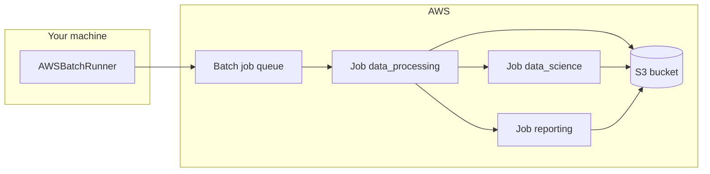

# AWS Batch

[AWS Batch](https://aws.amazon.com/batch/) runs containerised batch jobs at scale. Each job runs in an isolated Docker container. The sections below show how to deploy a Kedro project so each **pipeline-level namespace** runs as one Batch job, with datasets stored on Amazon S3.

AWS Batch fits Kedro pipelines that need **more time or memory than [AWS Lambda](https://docs.aws.amazon.com/lambda/latest/dg/gettingstarted-limits.html) allows**, but do not require **PySpark** or distributed Spark. For lightweight stages with managed orchestration, use [AWS Step Functions](aws_step_functions.md). For Spark workloads, use [Amazon EMR Serverless](amazon_emr_serverless.md).

This guide targets Kedro 1.x (`kedro>=1.0`) and uses the [Spaceflights starter](https://github.com/kedro-org/kedro-starters/tree/main/spaceflights-pandas/) as a worked example. Read [the deployment strategy](#strategy) first if you are deploying your own Kedro project and need guidance on namespace grouping, S3 storage, the custom Batch runner, and job definition settings.

## Strategy

Read this section before you deploy your own project. It starts with an overview of the approach, then gives practical advice for adapting it to your pipelines.

#### Overview

This guide deploys a Kedro pipeline on AWS Batch using a custom **`AWSBatchRunner`** on your local machine (or CI agent) and a shared container image on Amazon S3-backed storage.

The approach in brief:

1. **Group nodes by pipeline-level namespace**. Each group becomes one Batch job. Inside the container, the job runs every node in that namespace with your packaged project CLI.
1. **Store shared datasets on S3**. Batch containers are isolated, so datasets that cross namespace boundaries cannot use `MemoryDataset`.
1. **Package the project into a container image** (wheel plus `conf/`). Every namespace group uses the same image.
1. **Submit jobs from a custom runner**. `AWSBatchRunner` groups the pipeline with `Pipeline.group_nodes_by("namespace")`, submits one Batch job per group with `dependsOn` links, and polls until each job finishes.

#### Why use a container image?

A container image lets you package Kedro, project dependencies, and configuration into one artefact. You can build and test that artefact locally before pushing it to [Amazon Elastic Container Registry](https://docs.aws.amazon.com/AmazonECR/latest/userguide/what-is-ecr.html). Each Batch job overrides the container command to run one namespace group.

<!-- vale off -->



<!-- vale on -->

For the Spaceflights starter, this pattern creates **three** Batch jobs (`data_processing`, `data_science`, and `reporting`) instead of one per node.

Use **pipeline-level namespaces** (defined on the `Pipeline` object), not node-level namespaces. Node-level namespaces are for Kedro-Viz layout and do not group execution. See the section on [grouping nodes with namespaces in Kedro](../../build/namespaces.md#group-nodes-with-namespaces) for further explanation.

#### Choose how to group nodes

Namespace grouping suits most production pipelines where related nodes share dependencies and finish within Batch job timeout and memory limits.

| Grouping                                      | Pros                                        | Cons                                            | When to use                                  |
| --------------------------------------------- | ------------------------------------------- | ----------------------------------------------- | -------------------------------------------- |
| One Batch job per **namespace** (recommended) | Fewer jobs. Related nodes run together      | Whole namespace must fit job timeout and memory | Most production Spaceflights-style pipelines |
| One Batch job per **node**                    | Full isolation. Easy to debug a single node | More jobs, longer total runtime, more ECR pulls | Small pipelines or prototyping               |
| **Offload Spark stages** to EMR Serverless    | Distributed Spark fits better               | Extra infrastructure to set up and operate      | PySpark pipelines or nodes that need Spark   |

!!! note "When a namespace exceeds Batch limits"

    If a namespace outgrows your job definition timeout or memory, split it further or increase job definition resources.
    Run Spark stages on [Amazon EMR Serverless](amazon_emr_serverless.md) instead of Batch.

#### Plan execution order and storage

`AWSBatchRunner` submits namespace groups when their upstream dependencies have finished. Groups with no upstream dependencies can run in parallel, up to `max_workers` in `conf/aws_batch/parameters.yml`. The runner uses the `dependencies` list on each `GroupedNodes` object from `Pipeline.group_nodes_by("namespace")`.

For Spaceflights, `data_processing` runs first to produce intermediate datasets on S3. `data_science` and `reporting` can run in parallel at the next level because both depend on `data_processing` outputs (`model_input_table` and `preprocessed_shuttles`) but not on each other. The same dependency rules apply in [distributed Kedro runs](../distributed.md) and in [grouping nodes for deployment](../nodes_grouping.md).

List **every dataset shared across namespace groups** in `conf/aws_batch/catalog.yml` on S3. Omitting a dataset causes `MemoryDataset` errors when Batch moves between jobs.

#### Configure before you deploy

- Assign **pipeline-level namespaces** with explicit `inputs` / `outputs` and `prefix_datasets_with_namespace=False`
- Run each namespace locally (`kedro run --namespaces=<name>`) to estimate duration and memory, then set job definition **timeout** and **memory** for the heaviest namespace
- Add **`s3fs`** and **`boto3`** when using S3-backed datasets and the Batch API from your driver machine
- Trim **image dependencies** if the container grows too large for your compute environment

!!! note "Deploying without pipeline-level namespaces"

    If your project has no pipeline-level namespaces, `AWSBatchRunner` still works. `Pipeline.group_nodes_by("namespace")` treats each node without a namespace as its own group, so you get **one Batch job per node**. The runner passes `--nodes <node_name>` for those groups instead of `--namespaces <name>`.

## Working example

### Prerequisites

These apply to the **step-by-step guide** below. This guide builds and deploys from your machine with Kedro, Docker, and the AWS CLI. You use the [AWS Management Console](https://aws.amazon.com/console/) to inspect the job queue and job runs after submission, but you cannot complete the guide with the console alone.

| You need                                                                                                              | Used for                                                                                       |
| --------------------------------------------------------------------------------------------------------------------- | ---------------------------------------------------------------------------------------------- |
| A **Kedro project** (`requires-python = ">=3.10"` in `pyproject.toml`) and Python **>=3.10** locally                  | Packaging the project, local test runs, and running `AWSBatchRunner` on your driver machine    |
| [Docker](https://docs.docker.com/get-docker/) (Podman also works if you have a `docker`-compatible CLI)               | Building the Batch container image                                                             |
| [AWS CLI](https://docs.aws.amazon.com/cli/latest/userguide/cli-chap-configure.html) configured for your target region | Creating S3 and Batch resources, uploading data, pushing the image to ECR, and submitting jobs |
| An AWS account with permissions for Batch, S3, ECR, IAM, and EC2 (for the Batch compute environment)                  | Creating and running the deployed resources                                                    |

The steps that follow deploy the [Spaceflights starter](https://github.com/kedro-org/kedro-starters/tree/main/spaceflights-pandas/) end to end. Create the project with:

```bash
kedro new -s spaceflights-pandas -n spaceflights_batch
```

If you are new to the project layout, [complete the Spaceflights tutorial](../../tutorials/spaceflights_tutorial.md). If you use your own Kedro project, replace the placeholders below and follow the same steps.

### Placeholders used in this guide

Replace these before building and submitting jobs:

| Placeholder              | Example                                                                  |
| ------------------------ | ------------------------------------------------------------------------ |
| `<your-bucket>`          | `kedro-batch-test-123456789012`                                          |
| `<your-aws-account-id>`  | `123456789012`                                                           |
| `<your-aws-region>`      | `us-east-1`                                                              |
| `<PACKAGE_NAME>`         | `spaceflights_batch`                                                     |
| `<PACKAGE_CLI>`          | `spaceflights-batch`                                                     |
| `<ecr-image-uri>`        | `123456789012.dkr.ecr.us-east-1.amazonaws.com/spaceflights-batch:latest` |
| `<batch-job-role-arn>`   | IAM role ARN for Batch jobs (S3 access)                                  |
| `<batch-job-queue>`      | `spaceflights_queue`                                                     |
| `<batch-job-definition>` | `kedro_run`                                                              |

### What you will do

1. [Prepare your Kedro project](#step-1-prepare-your-kedro-project)
1. [Set up AWS](#step-2-set-up-aws)
1. [Configure Kedro for AWS Batch](#step-3-configure-kedro-for-aws-batch)
1. [Create the custom AWS Batch runner](#step-4-create-the-custom-aws-batch-runner)
1. [Customise the project CLI](#step-5-customise-the-project-cli)
1. [Package, build, and push the container image](#step-6-package-build-and-push-the-container-image)
1. [Submit the pipeline from your machine](#step-7-submit-the-pipeline-from-your-machine)
1. [Verify the jobs succeeded](#step-8-verify-the-jobs-succeeded)

______________________________________________________________________

## Step 1: Prepare your Kedro project

From the project root, install dependencies and run the pipeline locally:

```bash
pip install -e .
kedro run
```

Keep `conf/base/catalog.yml` on **local file paths** for local development. You add S3 paths in [Step 3](#step-3-configure-kedro-for-aws-batch) after you create the bucket in [Step 2](#step-2-set-up-aws).

Each node should have a meaningful `name` in its `Node(...)` definition. Batch job names and log streams use namespace or node names.

### Assign pipeline-level namespaces

This step is **recommended** for fewer Batch jobs and lower orchestration overhead. Read [the deployment strategy](#strategy) for grouping trade-offs and namespace requirements. If your pipeline has no pipeline-level namespaces, skip to [Step 2: Set up AWS](#step-2-set-up-aws).

Assign a **pipeline-level namespace** to each sub-pipeline you want to run as one Batch job. In Spaceflights, update `create_pipeline()` in each module under `src/<PACKAGE_NAME>/pipelines/`:

```python
def create_pipeline(**kwargs) -> Pipeline:
    return Pipeline(
        [
            # ... nodes unchanged ...
        ],
        namespace="data_processing",
        prefix_datasets_with_namespace=False,
        inputs={"companies", "shuttles", "reviews"},
        outputs={"model_input_table"},
    )
```

Set `prefix_datasets_with_namespace=False` so dataset names in `conf/base/catalog.yml` and `conf/aws_batch/catalog.yml` keep their original names. Declare explicit `inputs` and `outputs` for each namespace.

| Sub-pipeline   | `namespace`    | `inputs`                    | `outputs`                                                                                                 |
| -------------- | -------------- | --------------------------- | --------------------------------------------------------------------------------------------------------- |
| `data_science` | `data_science` | `{"model_input_table"}`     | `{"regressor", "X_train", "X_test", "y_train", "y_test"}`                                                 |
| `reporting`    | `reporting`    | `{"preprocessed_shuttles"}` | `{"shuttle_passenger_capacity_plot_exp", "shuttle_passenger_capacity_plot_go", "dummy_confusion_matrix"}` |

See the section on [grouping nodes with namespaces in Kedro using the full Spaceflights example](../../build/namespaces.md#group-nodes-with-namespaces) for further explanation.

!!! note "Update `conf/base/catalog.yml` for reporting"

    If the starter lists `matplotlib.MatplotlibWriter` for `dummy_confusion_matrix`, change it to `matplotlib.MatplotlibDataset` in **`conf/base/catalog.yml`** before running locally.

Verify locally after adding namespaces:

```bash
kedro run --namespaces=data_processing
kedro run
```

______________________________________________________________________

## Step 2: Set up AWS

Create the AWS resources your Kedro project will use before you point configuration at them. Complete this setup for each AWS account and region. Follow the linked AWS guides for console and CLI steps. This section lists what you need and Kedro-specific settings.

| Resource                | AWS documentation                                                                                            | What you need for Kedro                                                                          |
| ----------------------- | ------------------------------------------------------------------------------------------------------------ | ------------------------------------------------------------------------------------------------ |
| **S3 bucket**           | [Creating a bucket](https://docs.aws.amazon.com/AmazonS3/latest/userguide/create-bucket-overview.html)       | Raw data and pipeline outputs (`s3://<your-bucket>/...`)                                         |
| **ECR repository**      | [Create a private repository](https://docs.aws.amazon.com/AmazonECR/latest/userguide/repository-create.html) | One **private** repo for the Batch container image (for example `spaceflights-batch`)            |
| **IAM job role**        | [IAM roles for Batch](https://docs.aws.amazon.com/batch/latest/userguide/IAM_policies.html)                  | S3 read/write for datasets; attach to the job definition as `jobRoleArn`                         |
| **Compute environment** | [Compute environments](https://docs.aws.amazon.com/batch/latest/userguide/compute_environments.html)         | Managed EC2 environment (for example `spaceflights_env`)                                         |
| **Job queue**           | [Job queues](https://docs.aws.amazon.com/batch/latest/userguide/job_queues.html)                             | Links jobs to the compute environment (for example `spaceflights_queue`)                         |
| **Job definition**      | [Job definitions](https://docs.aws.amazon.com/batch/latest/userguide/job_definitions.html)                   | Points at `<ecr-image-uri>` after you push in Step 6; leave `command` empty (overridden per job) |

!!! warning "Avoid overly broad IAM policies"

    For production, scope the policy to your bucket ARN.

### Upload raw data to S3

Upload input data before you configure the catalog. Follow the AWS guide for [uploading objects to S3](https://docs.aws.amazon.com/AmazonS3/latest/userguide/upload-objects.html):

```bash
export AWS_REGION=<your-aws-region>
export S3_BUCKET=<your-bucket>

aws s3 mb "s3://${S3_BUCKET}" --region "${AWS_REGION}"
aws s3 sync data/01_raw/ "s3://${S3_BUCKET}/01_raw/"
```

!!! note "`shuttles.xlsx` may be missing locally"

    The starter gitignores `data/01_raw/shuttles.xlsx`. Copy it from the [Spaceflights starter repository on GitHub](https://github.com/kedro-org/kedro-starters/tree/main/spaceflights-pandas) if `kedro new` did not place it in your project.

### Create the Amazon ECR repository

Create the repository now. You push the image in [Step 6](#step-6-package-build-and-push-the-container-image):

```bash
aws ecr create-repository --repository-name spaceflights-batch --region <your-aws-region>
```

### Job definition settings (Kedro-specific)

When creating the job definition (for example `kedro_run`), set:

| Setting      | Recommended value                               |
| ------------ | ----------------------------------------------- |
| **Image**    | `<ecr-image-uri>` (after Step 6 push)           |
| **vCPUs**    | `2`                                             |
| **Memory**   | `4096` MiB (increase for heavy modelling nodes) |
| **Job role** | `<batch-job-role-arn>` with S3 access           |
| **Timeout**  | `3600` seconds or higher                        |
| **Command**  | leave empty (the runner overrides per job)      |

The compute environment does not launch instances until jobs are submitted, so creating it does not incur immediate cost.

______________________________________________________________________

## Step 3: Configure Kedro for AWS Batch

### Create an `aws_batch` config environment

Add `conf/aws_batch/` with `globals.yml`, `catalog.yml`, and `parameters.yml`. Set `s3_bucket` in `conf/aws_batch/globals.yml` to the same value as `S3_BUCKET` from Step 2. [Learn how to use catalog globals in Kedro configuration](../../configure/advanced_configuration.md#how-to-use-global-variables-with-the-omegaconfigloader).

`conf/aws_batch/globals.yml`:

```yaml
s3_bucket: <your-bucket>
```

`conf/aws_batch/parameters.yml` (used by the custom runner in Step 5):

```yaml
aws_batch:
  job_queue: <batch-job-queue>
  job_definition: <batch-job-definition>
  max_workers: 4
  package_cli: <PACKAGE_CLI>
  conf_source: /app/conf
```

!!! warning "Catalog environment merge is destructive"

    By default, Kedro merges configuration environments at the **top level**. If `conf/aws_batch/catalog.yml` overrides a dataset using `filepath` alone, it **replaces** the entire dataset entry from `conf/base/` and drops keys such as `type`. Either include the full dataset definition (including `type`) in `conf/aws_batch/catalog.yml`, or set `merge_strategy: {catalog: soft}` in `settings.py` so environment files can override individual fields.

!!! warning "Every shared dataset needs S3 storage"

    The `aws_batch` catalog must list **every** dataset used by the deployed pipeline, including intermediate outputs such as `X_train` and reporting artefacts. Omitting a dataset causes `MemoryDataset` errors when Batch moves between jobs.

### Add dependencies

Add `s3fs` and `boto3` to `pyproject.toml`:

```toml
"s3fs>=2024.6.0",
"boto3>=1.34.0",
```

The Spaceflights starter uses Parquet for intermediate tables. Use `matplotlib.MatplotlibDataset` (not the legacy `MatplotlibWriter` type).

??? example "View `conf/aws_batch/catalog.yml`"

    ```yaml
    companies:
      type: pandas.CSVDataset
      filepath: s3://${globals:s3_bucket}/01_raw/companies.csv

    reviews:
      type: pandas.CSVDataset
      filepath: s3://${globals:s3_bucket}/01_raw/reviews.csv

    shuttles:
      type: pandas.ExcelDataset
      filepath: s3://${globals:s3_bucket}/01_raw/shuttles.xlsx
      load_args:
        engine: openpyxl

    preprocessed_companies:
      type: pandas.ParquetDataset
      filepath: s3://${globals:s3_bucket}/02_intermediate/preprocessed_companies.parquet

    preprocessed_shuttles:
      type: pandas.ParquetDataset
      filepath: s3://${globals:s3_bucket}/02_intermediate/preprocessed_shuttles.parquet

    model_input_table:
      type: pandas.ParquetDataset
      filepath: s3://${globals:s3_bucket}/03_primary/model_input_table.parquet

    X_train:
      type: pickle.PickleDataset
      filepath: s3://${globals:s3_bucket}/04_feature/X_train.pickle

    X_test:
      type: pickle.PickleDataset
      filepath: s3://${globals:s3_bucket}/04_feature/X_test.pickle

    y_train:
      type: pickle.PickleDataset
      filepath: s3://${globals:s3_bucket}/04_feature/y_train.pickle

    y_test:
      type: pickle.PickleDataset
      filepath: s3://${globals:s3_bucket}/04_feature/y_test.pickle

    regressor:
      type: pickle.PickleDataset
      filepath: s3://${globals:s3_bucket}/06_models/regressor.pickle
      versioned: true

    shuttle_passenger_capacity_plot_exp:
      type: plotly.PlotlyDataset
      filepath: s3://${globals:s3_bucket}/08_reporting/shuttle_passenger_capacity_plot_exp.json
      versioned: true
      plotly_args:
        type: bar
        fig:
          x: shuttle_type
          y: passenger_capacity
          orientation: h
        layout:
          xaxis_title: Shuttles
          yaxis_title: Average passenger capacity
          title: Shuttle Passenger capacity

    shuttle_passenger_capacity_plot_go:
      type: plotly.JSONDataset
      filepath: s3://${globals:s3_bucket}/08_reporting/shuttle_passenger_capacity_plot_go.json
      versioned: true

    dummy_confusion_matrix:
      type: matplotlib.MatplotlibDataset
      filepath: s3://${globals:s3_bucket}/08_reporting/dummy_confusion_matrix.png
      versioned: true
    ```

### Verify the AWS Batch environment locally

```bash
kedro run --env aws_batch
```

Confirm outputs appear under your S3 bucket paths.

______________________________________________________________________

## Step 4: Create the custom AWS Batch runner

Create `src/<PACKAGE_NAME>/runner/batch_runner.py` with an `AWSBatchRunner` class that extends `AbstractRunner` and submits Batch jobs for each namespace group (or each node when no namespace is defined).

??? example "View `batch_runner.py`"

    ```python
    """``AWSBatchRunner`` submits Kedro namespace groups as AWS Batch jobs."""

    from __future__ import annotations

    from concurrent.futures import ThreadPoolExecutor
    from time import sleep
    from typing import Any

    import boto3
    from pluggy import PluginManager

    from kedro.io import CatalogProtocol
    from kedro.pipeline import Pipeline
    from kedro.pipeline.node import GroupedNodes
    from kedro.runner import AbstractRunner


    def _track_batch_job(job_id: str, client: Any) -> None:
        """Poll Batch until the job succeeds or raises on failure."""
        while True:
            sleep(1.0)
            jobs = client.describe_jobs(jobs=[job_id])["jobs"]
            if not jobs:
                raise ValueError(f"Job ID {job_id} not found.")

            job = jobs[0]
            status = job["status"]

            if status == "FAILED":
                reason = job.get("statusReason", "unknown")
                raise RuntimeError(f"Job {job_id} failed: {reason}")

            if status == "SUCCEEDED":
                return


    class AWSBatchRunner(AbstractRunner):
        """Submit Kedro namespace groups to AWS Batch with dependency ordering."""

        def __init__(
            self,
            job_queue: str,
            job_definition: str,
            max_workers: int | None = None,
            package_cli: str | None = None,
            conf_source: str | None = None,
            is_async: bool = False,
        ):
            super().__init__(is_async=is_async)
            self._job_queue = job_queue
            self._job_definition = job_definition
            self._max_workers = max_workers
            self._package_cli = package_cli or "kedro"
            self._conf_source = conf_source
            self._client = boto3.client("batch")

        def _get_required_workers_count(self, groups: list[GroupedNodes]) -> int:
            required = len(groups)
            if self._max_workers is not None:
                return min(required, self._max_workers)
            return required

        def _get_executor(self, max_workers: int):
            return ThreadPoolExecutor(max_workers=max_workers)

        def _run(
            self,
            pipeline: Pipeline,
            catalog: CatalogProtocol,
            hook_manager: PluginManager | None = None,
            run_id: str | None = None,
        ) -> None:
            groups = pipeline.group_nodes_by("namespace")
            group_map = {group.name: group for group in groups}
            group_deps = {group.name: set(group.dependencies) for group in groups}

            todo_groups = set(group_map.keys())
            group_to_job: dict[str, str] = {}
            done_groups: set[str] = set()
            futures: set = set()
            max_workers = self._get_required_workers_count(groups)

            self._logger.info("Max workers: %d", max_workers)
            with ThreadPoolExecutor(max_workers=max_workers) as pool:
                while True:
                    done = {fut for fut in futures if fut.done()}
                    futures -= done
                    for future in done:
                        try:
                            group_name = future.result()
                        except Exception:
                            self._suggest_resume_scenario(
                                pipeline, set(), catalog
                            )
                            raise
                        done_groups.add(group_name)
                        self._logger.info(
                            "Completed %d out of %d jobs",
                            len(done_groups),
                            len(groups),
                        )

                    ready = {
                        name
                        for name in todo_groups
                        if group_deps[name] <= done_groups
                    }
                    todo_groups -= ready
                    for name in ready:
                        future = pool.submit(
                            self._submit_job,
                            group_map[name],
                            group_to_job,
                            group_deps[name],
                            run_id,
                        )
                        futures.add(future)

                    if not futures:
                        if todo_groups:
                            raise RuntimeError(
                                f"Unresolved groups: {sorted(todo_groups)}"
                            )
                        break

        def _submit_job(
            self,
            group: GroupedNodes,
            group_to_job: dict[str, str],
            group_dependencies: set[str],
            run_id: str | None,
        ) -> str:
            self._logger.info("Submitting the job for group: %s", group.name)

            run_suffix = run_id or "local"
            job_name = f"kedro-{run_suffix}-{group.name}".replace(".", "-")[:128]
            depends_on = [
                {"jobId": group_to_job[dep]}
                for dep in group_dependencies
                if dep in group_to_job
            ]

            command = [
                self._package_cli,
                "run",
                "--env",
                "aws_batch",
            ]
            if group.type == "namespace":
                command.extend(["--namespaces", group.name])
            else:
                command.extend(["--nodes", group.nodes[0]])
            if self._conf_source:
                command.extend(["--conf-source", self._conf_source])

            response = self._client.submit_job(
                jobName=job_name,
                jobQueue=self._job_queue,
                jobDefinition=self._job_definition,
                dependsOn=depends_on,
                containerOverrides={"command": command},
            )

            job_id = response["jobId"]
            group_to_job[group.name] = job_id
            _track_batch_job(job_id, self._client)
            return group.name
    ```

Export the runner from `src/<PACKAGE_NAME>/runner/__init__.py`:

```python
from .batch_runner import AWSBatchRunner

__all__ = ["AWSBatchRunner"]
```

______________________________________________________________________

## Step 5: Customise the project CLI

Add the custom runner and CLI on your driver machine before you build the container image. Push the image in Step 6 and update the job definition **Image** field before you submit jobs in Step 7.

Kedro's built-in `kedro run` passes `is_async` to the runner constructor and nothing else. `AWSBatchRunner` needs `job_queue`, `job_definition`, and other settings from `conf/aws_batch/parameters.yml`.

Add `src/<PACKAGE_NAME>/cli.py` using [the project CLI template](../../getting-started/commands_reference.md#customise-or-override-project-specific-kedro-commands). Override the `run` command so the runner is constructed with Batch parameters from the active Kedro session:

```python
def _instantiate_runner(runner: str | None, is_async: bool, params: dict[str, Any]):
    runner_class = load_obj(runner or "SequentialRunner", "kedro.runner")
    runner_kwargs: dict[str, Any] = {"is_async": is_async}
    if runner and runner.endswith("AWSBatchRunner"):
        batch_kwargs = params.get("aws_batch") or {}
        runner_kwargs.update(batch_kwargs)
    return runner_class(**runner_kwargs)
```

Inside `run()`, create the session, load the context, build the runner from `context.params`, and pass it to `session.run()`. When `runner` is omitted (for example inside a Batch container job), Kedro defaults to `SequentialRunner` and does not pass Batch driver settings to the constructor:

```python
with KedroSession.create(
    env=env, conf_source=conf_source, runtime_params=params
) as session:
    context = session.load_context()
    runner_instance = _instantiate_runner(runner, is_async, dict(context.params))
    return session.run(
        runner=runner_instance,
        # ... other run arguments ...
    )
```

[Learn how to customise Kedro commands in common use cases](../../extend/common_use_cases.md).

______________________________________________________________________

## Step 6: Package, build, and push the container image

Package the project, then build and push the Batch image. Repeat this step when you change pipeline code, dependencies, or `conf/aws_batch/`.

Run this in your project root:

```bash
kedro package
```

This creates a `.whl` in `dist/`. [Learn how to package a Kedro project](../package_a_project.md#package-a-kedro-project).

Create a `Dockerfile` in your project root:

```dockerfile
FROM python:3.12-slim

WORKDIR /app

COPY dist/*.whl /tmp/
RUN pip install --no-cache-dir /tmp/*.whl && rm -f /tmp/*.whl

COPY conf/ /app/conf/
```

!!! tip "Apple Silicon (ARM) builders"

    Batch on EC2 compute environments uses **`x86_64`** instances. Build with `--platform linux/amd64` (Docker or Podman).

Build the image. Tag it with your ECR URI at build time:

```bash
export ECR_IMAGE=<ecr-image-uri>

docker build --platform linux/amd64 -t ${ECR_IMAGE} .
```

If you build with a local tag first, run `docker tag spaceflights-batch:latest <ecr-image-uri>` right before pushing.

### How config reaches the job

Now that you have built the image, here is how your Step 3 configuration reaches each Batch container at runtime:

1. **The wheel carries pipeline code.** `kedro package` bundles your pipeline code and dependencies into a `.whl` file. It does not include `conf/`.
1. **The Dockerfile carries `conf/`.** `COPY conf/` places your `conf/aws_batch/` settings at `/app/conf` inside the container.
1. **The Batch job command selects the environment.** [AWSBatchRunner](#step-4-create-the-custom-aws-batch-runner) passes `--env aws_batch --conf-source /app/conf --namespaces <name>` (or `--nodes <name>` for nodes without a namespace) through `containerOverrides`.

### Push the image to Amazon ECR

Follow the AWS guide for [pushing a Docker image to an Amazon ECR repository](https://docs.aws.amazon.com/AmazonECR/latest/userguide/docker-push-ecr-image.html):

```bash
aws ecr get-login-password --region <your-aws-region> | \
  docker login --username AWS --password-stdin <your-aws-account-id>.dkr.ecr.<your-aws-region>.amazonaws.com
docker push ${ECR_IMAGE}
```

!!! note "Trim dependencies for production images"

    The Spaceflights starter includes Jupyter and Kedro-Viz, which increase image size. For production Batch images, consider a slimmer `requirements` subset or a multi-stage Dockerfile that omits development dependencies.

!!! note "Re-push after catalog or pipeline changes"

    When you change `conf/aws_batch/` or rebuild the wheel, repeat Step 6 and push a new image tag. Update the job definition **Image** field to `<ecr-image-uri>` if you created the definition before pushing.

______________________________________________________________________

## Step 7: Submit the pipeline from your machine

Complete Step 6 first so your job definition points at the image in ECR.

From your project root (with AWS credentials configured), use your packaged project CLI and the custom runner:

```bash
spaceflights-batch run \
  --env aws_batch \
  --runner spaceflights_batch.runner.AWSBatchRunner
```

The `AWSBatchRunner` on your machine submits Batch jobs. Each job runs inside the container image and executes one namespace group (or a single node when no namespace is defined). For Spaceflights `__default__`, expect **three** jobs.

Track jobs in the [AWS Batch console](https://console.aws.amazon.com/batch/) or with:

```bash
aws batch list-jobs --job-queue <batch-job-queue> --job-status RUNNING
```

Logs are available in [CloudWatch Logs](https://docs.aws.amazon.com/batch/latest/userguide/monitoring.html) under `/aws/batch/job`.

______________________________________________________________________

## Step 8: Verify the jobs succeeded

1. **Check Batch job states.** All jobs should reach **SUCCEEDED**. [Learn how to check AWS Batch job status](https://docs.aws.amazon.com/batch/latest/userguide/monitoring.html):

    ```bash
    aws batch list-jobs --job-queue <batch-job-queue> --job-status SUCCEEDED
    ```

1. **Check S3 outputs.** List paths from your `conf/aws_batch/catalog.yml`. [Learn how to list objects in Amazon S3](https://docs.aws.amazon.com/AmazonS3/latest/userguide/ListingObjects.html):

```bash
aws s3 ls "s3://<your-bucket>/" --recursive
```

You should see objects under `02_intermediate/`, `03_primary/`, `04_feature/`, `06_models/`, and `08_reporting/`.

If jobs failed, see [Troubleshooting](#troubleshooting).

______________________________________________________________________

## Troubleshooting

<!-- vale off -->

| Symptom                                              | Cause                                                | Fix                                                                                                                                           |
| ---------------------------------------------------- | ---------------------------------------------------- | --------------------------------------------------------------------------------------------------------------------------------------------- |
| `Cannot install ... s3fs` dependency conflict        | `kedro-viz` pins an older `s3fs` range               | Use `s3fs>=2021.4` locally; omit Kedro-Viz from the Batch image for production                                                                |
| `AccessDenied` on S3 inside Batch jobs               | Job role lacks bucket permissions                    | Attach an IAM policy scoped to `<your-bucket>` on the job role                                                                                |
| `MemoryDataset` errors between jobs                  | Dataset missing from `conf/aws_batch/catalog.yml`    | Add S3-backed entries for all shared datasets                                                                                                 |
| Batch job times out mid-namespace                    | Namespace contains too much work for one job timeout | Split namespaces further, or increase job definition timeout/memory, or run heavy stages on [Amazon EMR Serverless](amazon_emr_serverless.md) |
| `Dataset 'MatplotlibWriter' not found`               | Outdated dataset type in `conf/base/catalog.yml`     | Use `matplotlib.MatplotlibDataset` in base and aws_batch catalogs                                                                             |
| S3 errors during `kedro run --env aws_batch` locally | Missing AWS CRT support in `botocore`                | Run `pip install 'botocore[crt]'` and retry                                                                                                   |
| Jobs stuck in `RUNNABLE`                             | Compute environment not scaled or no capacity        | Check compute environment status; increase `maxvCpus` or instance types                                                                       |
| `Essential container exited` immediately             | Wrong `--conf-source` or missing `conf/` in image    | Verify `COPY conf/ /app/conf/` in the Dockerfile and `conf_source: /app/conf` in parameters                                                   |
| `ModuleNotFoundError` for runner kwargs              | Built-in `kedro run` used instead of custom `cli.py` | Use `<PACKAGE_CLI> run` after adding the customised `cli.py` from Step 5                                                                      |
| Job fails with out-of-memory                         | Default memory too low for sklearn/matplotlib nodes  | Increase memory in the job definition (for example `4096` or `8192` MiB)                                                                      |

<!-- vale on -->

______________________________________________________________________

## Limitations

- Each Batch job runs **one namespace group** (or one node when no namespace is defined). A namespace must finish within the job definition timeout and memory limits.
- **Not for Spark:** This pattern is for non-distributed Python stages. Run PySpark workloads on [Amazon EMR Serverless](amazon_emr_serverless.md) instead.
- **Driver machine:** The machine where you run `AWSBatchRunner` must stay online until all jobs complete. For managed orchestration of lightweight stages, consider [AWS Step Functions](aws_step_functions.md).
- **Image lifecycle:** When you change pipeline code, dependencies, or `conf/aws_batch/`, repeat [Step 6](#step-6-package-build-and-push-the-container-image), push to ECR, and update the job definition image URI before the next run.
- Pipelines with dozens of nodes without namespaces increase Batch job count and ECR pulls. Add pipeline-level namespaces for coarser grouping.
- Batch job dependencies use AWS Batch `dependsOn`. This matches Kedro's DAG but does not replace Kedro's own `ThreadRunner` parallelism on a single machine.

______________________________________________________________________

## Further reading

### Kedro

- [Learn how to run Kedro in a distributed environment](../distributed.md)
- [Learn how to group nodes for deployment](../nodes_grouping.md)
- [Learn how to group nodes with namespaces in Kedro](../../build/namespaces.md#group-nodes-with-namespaces)
- [Learn how to package a Kedro project](../package_a_project.md)
- [Learn how to customise project-specific Kedro commands](../../getting-started/commands_reference.md#customise-or-override-project-specific-kedro-commands)
- [Learn how to use catalog globals in Kedro configuration](../../configure/advanced_configuration.md#how-to-use-global-variables-with-the-omegaconfigloader)

### AWS

- [Read the AWS Batch user guide](https://docs.aws.amazon.com/batch/latest/userguide/what-is-aws-batch.html)
- [Learn how to create an AWS Batch job definition](https://docs.aws.amazon.com/batch/latest/userguide/job_definitions.html)
- [Learn how to configure IAM policies for AWS Batch](https://docs.aws.amazon.com/batch/latest/userguide/IAM_policies.html)
- [Learn how to push a Docker image to Amazon ECR](https://docs.aws.amazon.com/AmazonECR/latest/userguide/docker-push-ecr-image.html)
- [Learn how to check AWS Batch job status](https://docs.aws.amazon.com/batch/latest/userguide/monitoring.html)
