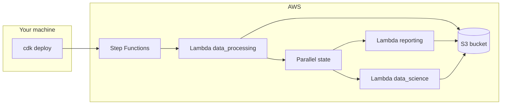
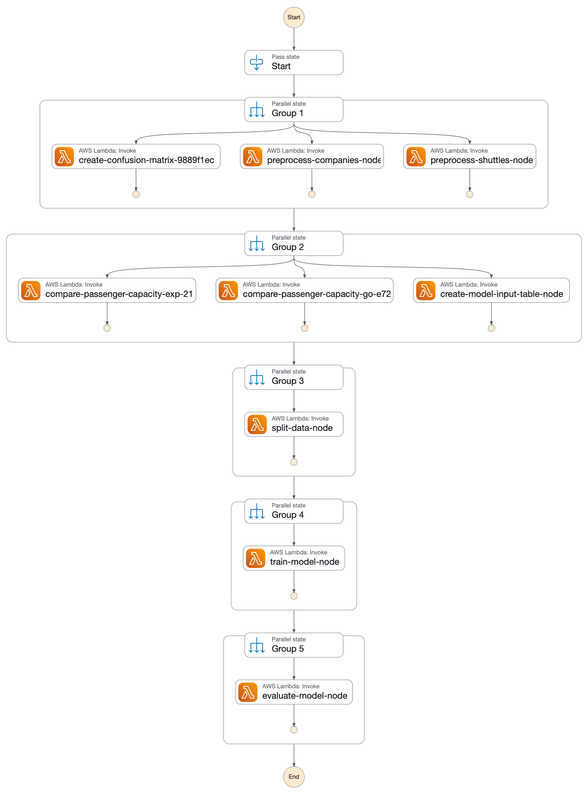
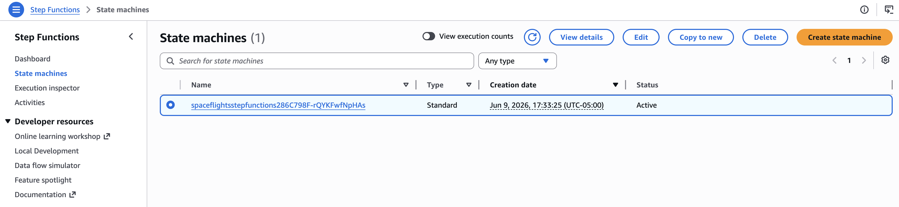
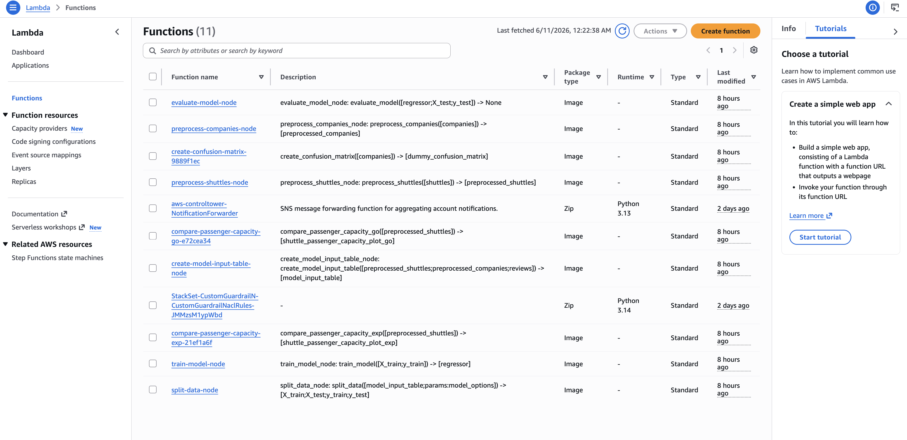

# AWS Step Functions

[AWS Step Functions](https://aws.amazon.com/step-functions/) orchestrates [AWS Lambda](https://aws.amazon.com/lambda/) functions into a state machine. The sections below show how to deploy a Kedro project so each **pipeline-level namespace** runs as one Lambda function, with datasets stored on Amazon S3.

Step Functions fits Kedro pipelines that consist of **pandas, scikit-learn, or other lightweight Python** work that fits [Lambda limits](https://docs.aws.amazon.com/lambda/latest/dg/gettingstarted-limits.html). For **PySpark** or **long-running distributed** workloads, use [Amazon EMR Serverless](amazon_emr_serverless.md) or [AWS Batch](aws_batch.md) instead.

This guide targets Kedro 1.x (`kedro>=1.0`) and uses the [Spaceflights starter](https://github.com/kedro-org/kedro-starters/tree/main/spaceflights-pandas/) as a worked example. Read [the deployment strategy](#strategy) first if you are deploying your own Kedro project and need guidance on grouping, storage, and Lambda memory and timeout settings.

## Strategy

Read this section before you deploy your own project. It starts with an overview of the approach, then gives practical advice for adapting it to your pipelines.

#### Overview

This guide deploys a Kedro pipeline as an AWS Step Functions state machine backed by Lambda functions and Amazon S3.

The approach in brief:

1. **Group nodes by pipeline-level namespace**. Each group becomes one Lambda function. When Step Functions invokes it, the handler runs every node in that namespace with `session.run(namespaces=[...])`.
1. **Store shared datasets on S3**. Lambda functions are isolated, so datasets that cross namespace boundaries cannot use `MemoryDataset`.
1. **Package the project** as a Lambda container image. Every namespace group uses the same image.
1. **Build the state machine from your pipeline graph**. A CDK deployment script reads your pipeline, creates one Lambda per namespace group, and wires them into Step Functions.

#### Why use a container image?

[Container images for AWS Lambda functions](https://docs.aws.amazon.com/lambda/latest/dg/images-create.html) lets you package Kedro, project dependencies, and configuration into one artefact. You can build and test that artefact locally before pushing it to [Amazon Elastic Container Registry](https://docs.aws.amazon.com/AmazonECR/latest/userguide/what-is-ecr.html).

<!-- vale off -->



<!-- vale on -->

For Spaceflights starter, this pattern creates **three** Lambda functions (`data_processing`, `data_science`, and `reporting`) instead of one per node.

Use **pipeline-level namespaces** (defined on the `Pipeline` object), not node-level namespaces. Node-level namespaces are for Kedro-Viz layout and do not group execution. See the section on [grouping nodes with namespaces in Kedro](../../build/namespaces.md#group-nodes-with-namespaces) for further explanation.

#### Choose how to group nodes

Namespace grouping suits most production pipelines where related nodes share dependencies and finish within Lambda limits.

| Grouping                                            | Pros                                        | Cons                                                   | When to use                                        |
| --------------------------------------------------- | ------------------------------------------- | ------------------------------------------------------ | -------------------------------------------------- |
| One Lambda per **namespace** (recommended)          | Fewer functions. Related nodes run together | Whole namespace must fit Lambda timeout and memory     | Most production Spaceflights-style pipelines       |
| One Lambda per **node**                             | Full isolation. Easy to debug a single node | More functions, cold starts, more Step Functions tasks | Small pipelines or prototyping                     |
| **Offload heavy stages** to Batch or EMR Serverless | Long jobs and large memory needs fit better | Extra infrastructure to set up and operate             | Spark workloads or nodes that exceed Lambda limits |

!!! note "When a namespace exceeds Lambda limits"

    If a namespace outgrows Lambda, run those stages on [AWS Batch](aws_batch.md) or [Amazon EMR Serverless](amazon_emr_serverless.md) instead of Step Functions.

#### Plan execution order and storage

Namespace groups with no upstream dependencies run together in a Step Functions [Parallel workflow state](https://docs.aws.amazon.com/step-functions/latest/dg/state-parallel.html). Groups that depend on earlier outputs run after those groups finish. The state machine chains one `Parallel` block per dependency level, using the `dependencies` list on each `GroupedNodes` object from `Pipeline.group_nodes_by("namespace")`.

For Spaceflights, `data_processing` pipeline runs at the first dependency level to produce intermediate datasets on S3. `data_science` and `reporting` pipelines run in parallel at the next level because both depend on `data_processing` outputs (`model_input_table` and `preprocessed_shuttles`) but not on each other. The same dependency rules apply in [distributed Kedro runs](../distributed.md) and in [grouping nodes for deployment](../nodes_grouping.md).

List **every dataset shared across namespace groups** in `conf/aws/catalog.yml` on S3. Omitting a dataset causes `MemoryDataset` errors when Step Functions moves between Lambda invocations.

#### Configure before you deploy

- Assign **pipeline-level namespaces** with explicit `inputs` / `outputs` and `prefix_datasets_with_namespace=False`
- Run each namespace locally (`kedro run --namespaces=<name>`) to estimate duration and memory, then set `memory_size` and `timeout_minutes` in `NAMESPACE_LAMBDA_CONFIG` in your CDK deployment script for the heaviest node in each namespace
- Trim **image dependencies** if the container approaches Lambda size limits

!!! note "Deploying without pipeline-level namespaces"

    If your project has no pipeline-level namespaces, you can still deploy with the same `deploy.py` and `lambda_handler.py` from this guide. `Pipeline.group_nodes_by("namespace")` treats each node without a namespace as its own group, so you get **one Lambda per node**. The handler runs `session.run(node_names=[...])` for those groups instead of `session.run(namespaces=[...])`.

## Working example

### Prerequisites

These apply to the **step-by-step guide** below. This guide builds and deploys from your machine with Kedro, Docker, the AWS CDK, and the AWS CLI. You use the [AWS Management Console](https://aws.amazon.com/console/) to inspect the state machine and Lambda functions after deployment, but you cannot complete the guide with the console alone.

| You need                                                                                                                       | Used for                                                                                   |
| ------------------------------------------------------------------------------------------------------------------------------ | ------------------------------------------------------------------------------------------ |
| A **Kedro project** (`requires-python = ">=3.10"` in `pyproject.toml`) and Python **>=3.10** locally                           | Packaging the project, local test runs, and the CDK script that reads your pipeline        |
| [Docker](https://docs.docker.com/get-docker/) (Podman also works if you have a `docker`-compatible CLI)                        | Building the Lambda container image                                                        |
| [Node.js](https://nodejs.org/) and the [CDK CLI](https://docs.aws.amazon.com/cdk/v2/guide/cli.html) (`npm install -g aws-cdk`) | Deploying Lambda functions and the Step Functions state machine with `deploy.py`           |
| [AWS CLI](https://docs.aws.amazon.com/cli/latest/userguide/cli-chap-configure.html) configured for your target region          | Uploading data to S3, pushing the image to ECR, starting executions, and verifying outputs |
| An AWS account with permissions for S3, ECR, Lambda, Step Functions, IAM, and CloudFormation                                   | Creating and running the deployed resources                                                |

The steps that follow deploy the [Spaceflights starter](https://github.com/kedro-org/kedro-starters/tree/main/spaceflights-pandas/) end to end. Create the project with:

```bash
kedro new -s spaceflights-pandas -n spaceflights_step_functions
```

If you are new to the project layout, [complete the Spaceflights tutorial](../../tutorials/spaceflights_tutorial.md). If you use your own Kedro project, replace the placeholders below and follow the same steps.

### Placeholders used in this guide

Replace these before building and deploying:

| Placeholder             | Example                                                                           |
| ----------------------- | --------------------------------------------------------------------------------- |
| `<your-bucket>`         | `kedro-sfn-test-123456789012`                                                     |
| `<your-aws-account-id>` | `123456789012`                                                                    |
| `<your-aws-region>`     | `us-east-1`                                                                       |
| `<PACKAGE_NAME>`        | `spaceflights_step_functions`                                                     |
| `<ecr-image-uri>`       | `123456789012.dkr.ecr.us-east-1.amazonaws.com/spaceflights-step-functions:latest` |

### What you will do

1. [Prepare your Kedro project](#step-1-prepare-your-kedro-project)
1. [Set up AWS](#step-2-set-up-aws)
1. [Configure Kedro for AWS](#step-3-configure-kedro-for-aws)
1. [Create the Lambda handler](#step-4-create-the-lambda-handler)
1. [Write the CDK deployment script](#step-5-write-the-cdk-deployment-script)
1. [Package, build, and push the container image](#step-6-package-build-and-push-the-container-image)
1. [Deploy with CDK](#step-7-deploy-with-cdk)
1. [Run the state machine](#step-8-run-the-state-machine)
1. [Verify outputs on S3](#step-9-verify-outputs-on-s3)

The deployed state machine looks like this in the AWS Management Console:



______________________________________________________________________

## Step 1: Prepare your Kedro project

From the project root, install dependencies and run the pipeline locally:

```bash
pip install -e .
kedro run
```

Keep `conf/base/catalog.yml` on **local file paths** for local development. You add S3 paths in Step 3 after you create the bucket in Step 2.

### Assign pipeline-level namespaces

This step is **recommended** for fewer Lambda functions and lower orchestration overhead. Read [the deployment strategy](#strategy) for grouping trade-offs and namespace requirements. If your pipeline has no pipeline-level namespaces, skip to [Step 2: Set up AWS](#step-2-set-up-aws).

Assign a **pipeline-level namespace** to each sub-pipeline you want to run as one Lambda function. In Spaceflights, update `create_pipeline()` in each module under `src/<PACKAGE_NAME>/pipelines/`:

```python
def create_pipeline(**kwargs) -> Pipeline:
    return Pipeline(
        [
            # ... nodes unchanged ...
        ],
        namespace="data_processing",
        prefix_datasets_with_namespace=False,
        inputs={"companies", "shuttles", "reviews"},
        outputs={"model_input_table"},
    )
```

Set `prefix_datasets_with_namespace=False` so dataset names in `conf/base/catalog.yml` and `conf/aws/catalog.yml` keep their original names (for example `model_input_table`, not `data_processing.model_input_table`). Declare explicit `inputs` and `outputs` for each namespace so datasets shared across Lambda functions keep the same names.

Repeat for the other sub-pipelines in `__default__`:

| Sub-pipeline   | `namespace`    | `inputs`                    | `outputs`                                                                                                 |
| -------------- | -------------- | --------------------------- | --------------------------------------------------------------------------------------------------------- |
| `data_science` | `data_science` | `{"model_input_table"}`     | `{"regressor", "X_train", "X_test", "y_train", "y_test"}`                                                 |
| `reporting`    | `reporting`    | `{"preprocessed_shuttles"}` | `{"shuttle_passenger_capacity_plot_exp", "shuttle_passenger_capacity_plot_go", "dummy_confusion_matrix"}` |

[Learn how to group nodes with namespaces in Kedro using the full Spaceflights example](../../build/namespaces.md#group-nodes-with-namespaces).

!!! note "Update `conf/base/catalog.yml` for reporting"

    If the starter lists `matplotlib.MatplotlibWriter` for the confusion matrix output, change it to `matplotlib.MatplotlibDataset` in **`conf/base/catalog.yml`** before running locally. In Spaceflights the catalog entry is named `dummy_confusion_matrix`. The `aws` catalog in Step 3 already uses `MatplotlibDataset`.

Verify locally after adding namespaces:

```bash
kedro run --namespaces=data_processing
kedro run
```

______________________________________________________________________

## Step 2: Set up AWS

Create the AWS resources your Kedro project will use before you point configuration at them. Complete this setup for each AWS account and region.

### Create an S3 bucket and upload raw data

Create a globally unique bucket and upload the raw datasets. Follow the AWS guides for [creating an Amazon S3 bucket](https://docs.aws.amazon.com/AmazonS3/latest/userguide/create-bucket-overview.html) and [uploading objects to Amazon S3](https://docs.aws.amazon.com/AmazonS3/latest/userguide/upload-objects.html):

```bash
export AWS_ACCOUNT_ID=<your-aws-account-id>
export AWS_REGION=<your-aws-region>
export S3_BUCKET=<your-bucket>

aws s3 mb "s3://${S3_BUCKET}" --region "${AWS_REGION}"
aws s3 sync data/01_raw/ "s3://${S3_BUCKET}/01_raw/"
```

!!! note "`shuttles.xlsx` may be missing locally"

    The starter gitignores `data/01_raw/shuttles.xlsx`. Copy it from the [Spaceflights starter repository on GitHub](https://github.com/kedro-org/kedro-starters/tree/main/spaceflights-pandas) if `kedro new` did not place it in your project.

### Create an ECR repository

| Resource           | AWS documentation                                                                                                       | What you need for Kedro                                                                |
| ------------------ | ----------------------------------------------------------------------------------------------------------------------- | -------------------------------------------------------------------------------------- |
| **ECR repository** | [Create a private Amazon ECR repository](https://docs.aws.amazon.com/AmazonECR/latest/userguide/repository-create.html) | One **private** repo for the Lambda image (for example `spaceflights-step-functions`)  |
| **CDK bootstrap**  | [Bootstrap AWS CDK in your account](https://docs.aws.amazon.com/cdk/v2/guide/bootstrapping.html)                        | One-time per account/region before `cdk deploy` in Step 7                              |
| **IAM**            | Created by CDK                                                                                                          | Lambda execution roles and Step Functions permissions are provisioned by the CDK stack |

Create the ECR repository:

```bash
export ECR_REPO=spaceflights-step-functions

aws ecr create-repository --repository-name "${ECR_REPO}" --region "${AWS_REGION}"
```

Keep `AWS_ACCOUNT_ID`, `AWS_REGION`, `S3_BUCKET`, and `ECR_REPO` exported for later steps.

______________________________________________________________________

## Step 3: Configure Kedro for AWS

Set `s3_bucket` in `conf/aws/globals.yml` to the same value as `S3_BUCKET` from Step 2.

### Create an `aws` config environment

Add `conf/aws/` with a `globals.yml` file and a `catalog.yml` that points every dataset to S3. [Use catalog globals to define the S3 bucket name in one place](../../configure/advanced_configuration.md#how-to-use-global-variables-with-the-omegaconfigloader).

`conf/aws/globals.yml`:

```yaml
s3_bucket: <your-bucket>
```

!!! warning "Catalog environment merge is destructive"

    By default, Kedro merges configuration environments at the **top level**. If `conf/aws/catalog.yml` overrides a dataset using `filepath` alone, it **replaces** the entire dataset entry from `conf/base/` and drops keys such as `type`. Either include the full dataset definition (including `type`) in `conf/aws/catalog.yml`, or set `merge_strategy: {catalog: soft}` in `settings.py` so environment files can override individual fields.

!!! warning "Every shared dataset needs S3 storage"

    The `aws` catalog must list **every** dataset used by the deployed pipeline, including intermediate outputs such as `X_train`, `X_test`, `y_train`, and `y_test`, and reporting artefacts. Omitting a dataset causes `MemoryDataset` errors when Step Functions moves between Lambda invocations.

### Add `s3fs` to project dependencies

When datasets read from `s3://` paths, add `s3fs` to `pyproject.toml`:

```toml
"s3fs>=2024.6.0"
```

The Spaceflights starter uses Parquet for intermediate tables and includes a reporting pipeline.

??? example "View `conf/aws/catalog.yml`"

    ```yaml
    companies:
      type: pandas.CSVDataset
      filepath: s3://${globals:s3_bucket}/01_raw/companies.csv

    reviews:
      type: pandas.CSVDataset
      filepath: s3://${globals:s3_bucket}/01_raw/reviews.csv

    shuttles:
      type: pandas.ExcelDataset
      filepath: s3://${globals:s3_bucket}/01_raw/shuttles.xlsx
      load_args:
        engine: openpyxl

    preprocessed_companies:
      type: pandas.ParquetDataset
      filepath: s3://${globals:s3_bucket}/02_intermediate/preprocessed_companies.parquet

    preprocessed_shuttles:
      type: pandas.ParquetDataset
      filepath: s3://${globals:s3_bucket}/02_intermediate/preprocessed_shuttles.parquet

    model_input_table:
      type: pandas.ParquetDataset
      filepath: s3://${globals:s3_bucket}/03_primary/model_input_table.parquet

    X_train:
      type: pickle.PickleDataset
      filepath: s3://${globals:s3_bucket}/04_feature/X_train.pickle

    X_test:
      type: pickle.PickleDataset
      filepath: s3://${globals:s3_bucket}/04_feature/X_test.pickle

    y_train:
      type: pickle.PickleDataset
      filepath: s3://${globals:s3_bucket}/04_feature/y_train.pickle

    y_test:
      type: pickle.PickleDataset
      filepath: s3://${globals:s3_bucket}/04_feature/y_test.pickle

    regressor:
      type: pickle.PickleDataset
      filepath: s3://${globals:s3_bucket}/06_models/regressor.pickle
      versioned: true

    shuttle_passenger_capacity_plot_exp:
      type: plotly.PlotlyDataset
      filepath: s3://${globals:s3_bucket}/08_reporting/shuttle_passenger_capacity_plot_exp.json
      versioned: true
      plotly_args:
        type: bar
        fig:
          x: shuttle_type
          y: passenger_capacity
          orientation: h
        layout:
          xaxis_title: Shuttles
          yaxis_title: Average passenger capacity
          title: Shuttle Passenger capacity

    shuttle_passenger_capacity_plot_go:
      type: plotly.JSONDataset
      filepath: s3://${globals:s3_bucket}/08_reporting/shuttle_passenger_capacity_plot_go.json
      versioned: true

    dummy_confusion_matrix:
      type: matplotlib.MatplotlibDataset
      filepath: s3://${globals:s3_bucket}/08_reporting/dummy_confusion_matrix.png
      versioned: true
    ```

### Verify the AWS environment locally

```bash
kedro run --env aws
```

Confirm outputs appear under your S3 bucket paths.

______________________________________________________________________

## Step 4: Create the Lambda handler

Create `lambda_handler.py` in the project root. Each Lambda invocation runs every node in the namespace named in the event payload.

!!! note "Use `configure_project` inside Lambda"

    Call `configure_project("<PACKAGE_NAME>")` in the handler, not `bootstrap_project()`. The packaged wheel is installed into the container; `bootstrap_project()` expects `pyproject.toml` and a `src/` tree that are not copied into the image.

```python
from pathlib import Path
from unittest.mock import patch


def handler(event, context):
    """AWS Lambda entrypoint that runs a Kedro namespace group."""
    from kedro.framework.project import configure_project
    from kedro.framework.session import KedroSession

    project_path = Path(__file__).resolve().parent

    # SemLock is not available on Lambda; mock it so Kedro can import safely.
    with patch("multiprocessing.Lock"):
        configure_project("spaceflights_step_functions")
        with KedroSession.create(
            project_path=project_path,
            env="aws",
            conf_source=str(project_path / "conf"),
        ) as session:
            if "namespace" in event:
                session.run(namespaces=[event["namespace"]])
            else:
                session.run(node_names=[event["node_name"]])
```

Replace `spaceflights_step_functions` with your package name if you used a different starter.

______________________________________________________________________

## Step 5: Write the CDK deployment script

Create the CDK deployment files before you build the container image. The stack references the ECR repository from Step 2. Push the image in Step 6 before you run `cdk deploy` in Step 7.

Install CDK Python dependencies into the **same environment** as your Kedro project:

`deploy_requirements.txt`:

```text
aws-cdk-lib>=2.170.0
constructs>=10.0.0
```

```bash
pip install -r deploy_requirements.txt
```

Create `deploy.py` in your project root. It groups your pipeline by namespace, creates one Lambda function per group, and wires them into a Step Functions state machine.

Before you deploy, set `s3_data_bucket_name` to your bucket from Step 2. Adjust `NAMESPACE_LAMBDA_CONFIG` from local run times or CloudWatch metrics so each namespace fits its heaviest node.

The example sets `ecr_repository_name = project_path.name`, so your project directory name must match the ECR repository name from Step 2 (for example `spaceflights-step-functions`).

??? example "View `deploy.py`"

    ```python
    import re
    from pathlib import Path

    import aws_cdk as cdk
    from aws_cdk import (
        Duration,
        Stack,
        aws_ecr as ecr,
        aws_lambda as lambda_,
        aws_s3 as s3,
        aws_stepfunctions as sfn,
        aws_stepfunctions_tasks as tasks,
    )
    from constructs import Construct
    from kedro.framework.project import pipelines
    from kedro.framework.startup import bootstrap_project
    from kedro.pipeline.node import GroupedNodes


    def _clean_name(name: str) -> str:
        """Reformat a name to be compliant with AWS naming rules."""
        return re.sub(r"[\W_]+", "-", name).strip("-")[:63]


    def _namespace_dependency_levels(
        groups: list[GroupedNodes],
    ) -> list[list[GroupedNodes]]:
        """Return namespace groups grouped by dependency level for Step Functions."""
        group_map = {group.name: group for group in groups}
        done: set[str] = set()
        dependency_levels: list[list[GroupedNodes]] = []

        while len(done) < len(group_map):
            ready_names = [
                name
                for name, group in group_map.items()
                if name not in done
                and all(dep in done for dep in group.dependencies)
            ]
            if not ready_names:
                raise ValueError("Circular dependencies among namespace groups")
            dependency_levels.append([group_map[name] for name in ready_names])
            done.update(ready_names)

        return dependency_levels


    # Size each namespace Lambda for its heaviest node (from local runs or CloudWatch).
    NAMESPACE_LAMBDA_CONFIG: dict[str, dict[str, int]] = {
        "data_processing": {"memory_size": 512, "timeout_minutes": 5},
        "data_science": {"memory_size": 2048, "timeout_minutes": 15},
        "reporting": {"memory_size": 1024, "timeout_minutes": 10},
    }
    DEFAULT_LAMBDA_CONFIG = {"memory_size": 1024, "timeout_minutes": 15}


    class KedroStepFunctionsStack(Stack):
        """A CDK stack that deploys a Kedro pipeline to AWS Step Functions."""

        env_name = "aws"
        project_path = Path.cwd()
        ecr_repository_name = project_path.name
        s3_data_bucket_name = "<your-bucket>"

        def __init__(self, scope: Construct, construct_id: str, **kwargs) -> None:
            super().__init__(scope, construct_id, **kwargs)

            self._parse_kedro_pipeline()
            self._set_ecr_repository()
            self._set_ecr_image()
            self._set_s3_data_bucket()
            self._convert_kedro_pipeline_to_step_functions_state_machine()

        def _parse_kedro_pipeline(self) -> None:
            """Extract the Kedro pipeline from the project"""
            metadata = bootstrap_project(self.project_path)

            self.project_name = metadata.project_name
            self.pipeline = pipelines["__default__"]

        def _set_ecr_repository(self) -> None:
            """Set the ECR repository for the Lambda base image"""
            self.ecr_repository = ecr.Repository.from_repository_name(
                self, id="ECR", repository_name=self.ecr_repository_name
            )

        def _set_ecr_image(self) -> None:
            """Set the Lambda base image"""
            self.ecr_image = lambda_.EcrImageCode.from_ecr_image(
                repository=self.ecr_repository, tag_or_digest="latest"
            )

        def _set_s3_data_bucket(self) -> None:
            """Set the S3 bucket containing the raw data"""
            self.s3_bucket = s3.Bucket.from_bucket_name(
                self, "RawDataBucket", self.s3_data_bucket_name
            )

        def _convert_group_to_lambda_function(
            self, group: GroupedNodes
        ) -> lambda_.Function:
            """Convert a namespace group into an AWS Lambda function"""
            config = self.NAMESPACE_LAMBDA_CONFIG.get(
                group.name, self.DEFAULT_LAMBDA_CONFIG
            )
            func = lambda_.Function(
                self,
                id=_clean_name(f"{group.name}_fn"),
                description=", ".join(group.nodes),
                code=self.ecr_image,
                handler=lambda_.Handler.FROM_IMAGE,
                runtime=lambda_.Runtime.FROM_IMAGE,
                environment={
                    "S3_BUCKET": self.s3_data_bucket_name,
                    "MPLCONFIGDIR": "/tmp/matplotlib",
                },
                function_name=_clean_name(group.name),
                memory_size=config["memory_size"],
                timeout=Duration.minutes(config["timeout_minutes"]),
            )
            self.s3_bucket.grant_read_write(func)
            return func

        def _convert_group_to_sfn_task(
            self, group: GroupedNodes, func: lambda_.Function
        ) -> tasks.LambdaInvoke:
            """Convert a namespace group into an AWS Step Functions Task"""
            if group.type == "namespace":
                payload = {"namespace": group.name}
            else:
                payload = {"node_name": group.nodes[0]}

            return tasks.LambdaInvoke(
                self,
                _clean_name(group.name),
                lambda_function=func,
                payload=sfn.TaskInput.from_object(payload),
            )

        def _convert_kedro_pipeline_to_step_functions_state_machine(self) -> None:
            """Convert Kedro pipeline into an AWS Step Functions State Machine"""
            groups = self.pipeline.group_nodes_by("namespace")
            dependency_levels = _namespace_dependency_levels(groups)
            lambdas = {
                group.name: self._convert_group_to_lambda_function(group)
                for group in groups
            }

            definition = sfn.Pass(self, "Start")

            for index, level in enumerate(dependency_levels, start=1):
                parallel_state = sfn.Parallel(self, f"Dependency level {index}")
                for group in level:
                    parallel_state.branch(
                        self._convert_group_to_sfn_task(group, lambdas[group.name])
                    )
                definition = definition.next(parallel_state)

            sfn.StateMachine(
                self,
                self.project_name,
                definition=definition,
                timeout=Duration.minutes(60),
            )


    app = cdk.App()
    KedroStepFunctionsStack(app, "KedroStepFunctionsStack")
    app.synth()
    ```

Register the app with CDK by creating `cdk.json`:

```json
{
  "app": "python deploy.py"
}
```

!!! note "Match the Python interpreter in `cdk.json`"

    `deploy.py` calls `bootstrap_project()` and needs both Kedro and `aws-cdk-lib` installed. If your system `python3` differs from the environment where you installed dependencies, point `app` at that interpreter (for example `.venv/bin/python deploy.py`).

______________________________________________________________________

## Step 6: Package, build, and push the container image

Package the project, then build and push the Lambda image. Repeat this step when you change pipeline code, dependencies, `conf/aws/`, or `lambda_handler.py`.

Run this in your project root:

```bash
kedro package
```

This creates `dist/spaceflights_step_functions-0.1-py3-none-any.whl` (the exact filename depends on your package version). [Learn how to package a Kedro project](../package_a_project.md#package-a-kedro-project).

Create a `Dockerfile` in your project root:

```dockerfile
FROM public.ecr.aws/lambda/python:3.12

COPY lambda_handler.py ${LAMBDA_TASK_ROOT}/
COPY conf/ ${LAMBDA_TASK_ROOT}/conf/

COPY dist/*.whl /tmp/
RUN pip install --no-cache-dir /tmp/*.whl --target "${LAMBDA_TASK_ROOT}" \
    && rm -f /tmp/*.whl

CMD ["lambda_handler.handler"]
```

!!! tip "Apple Silicon (ARM) builders"

    Lambda functions use **`x86_64`** by default. Build with `--platform linux/amd64` (Docker or Podman) or invocations may fail with `Runtime.InvalidEntrypoint` / `ProcessSpawnFailed`.

Build the image. Tag it with your ECR URI at build time so the image you push is the one you built:

```bash
export ECR_IMAGE=<ecr-image-uri>

docker build --platform linux/amd64 -t ${ECR_IMAGE} .
```

If you build with a local tag (for example `spaceflights-step-functions`), run `docker tag spaceflights-step-functions:latest <ecr-image-uri>` right before pushing.

### How config reaches Lambda

Now that you have built the image, here is how your Step 3 configuration reaches Lambda at runtime:

1. **The wheel carries pipeline code.** `kedro package` bundles your pipeline code and dependencies into a `.whl` file. It does not include `conf/`.
1. **The `Dockerfile` carries `conf/`.** `COPY conf/` places your `conf/aws/` settings at `${LAMBDA_TASK_ROOT}/conf` inside the container image.
1. **The handler selects the `aws` environment.** `lambda_handler.py` passes `conf_source=str(project_path / "conf")` and `env="aws"` to `KedroSession.create()`, so Lambda loads `conf/aws/catalog.yml` at runtime.

### Push to ECR

Follow the AWS guide for [pushing a Docker image to an Amazon ECR repository](https://docs.aws.amazon.com/AmazonECR/latest/userguide/docker-push-ecr-image.html):

```bash
aws ecr get-login-password --region <your-aws-region> | \
  docker login --username AWS --password-stdin <your-aws-account-id>.dkr.ecr.<your-aws-region>.amazonaws.com
docker push ${ECR_IMAGE}
```

!!! note "Re-push after handler or catalog changes"

    When you change `lambda_handler.py`, `conf/aws/`, or rebuild the wheel, repeat Step 6 and push a new image tag. If you already deployed in Step 7, run `aws lambda update-function-code --image-uri <ecr-image-uri>` on each image-based function, or redeploy with `cdk deploy`.

______________________________________________________________________

## Step 7: Deploy with CDK

Complete Step 6 first so your ECR repository contains the image. The CDK stack creates Lambdas that reference the `latest` tag in that repository.

Bootstrap CDK in your account (first time per account/region) and deploy the stack. [Follow the AWS CDK bootstrapping guide](https://docs.aws.amazon.com/cdk/v2/guide/bootstrapping.html):

```bash
cdk bootstrap "aws://<your-aws-account-id>/<your-aws-region>"
cdk deploy
```

After deployment, [open the AWS Step Functions console](https://console.aws.amazon.com/states/) to see the state machine:



You will also see one Lambda function per pipeline-level namespace (three for Spaceflights `__default__`):



The CloudFormation stack `KedroStepFunctionsStack` should reach **`CREATE_COMPLETE`**.

______________________________________________________________________

## Step 8: Run the state machine

Start a state machine execution from the AWS Step Functions console or with the AWS CLI. [Follow the AWS guide for starting a state machine execution](https://docs.aws.amazon.com/step-functions/latest/dg/tutorial-creating-lambda-state-machine.html):

```bash
STATE_MACHINE_ARN=$(aws stepfunctions list-state-machines \
  --query "stateMachines[?contains(name, 'spaceflights')].stateMachineArn | [0]" \
  --output text)

aws stepfunctions start-execution \
  --state-machine-arn "${STATE_MACHINE_ARN}" \
  --name "kedro-run-$(date +%s)"
```

Poll until the execution status is **`SUCCEEDED`**.

______________________________________________________________________

## Step 9: Verify outputs on S3

**Check S3 outputs.** List the output paths from your `conf/aws/catalog.yml`. [Follow the AWS guide for listing objects in an S3 bucket](https://docs.aws.amazon.com/AmazonS3/latest/userguide/ListingObjects.html):

```bash
aws s3 ls "s3://<your-bucket>/" --recursive
```

You should see objects under `02_intermediate/`, `03_primary/`, `04_feature/`, `06_models/`, and `08_reporting/`.

If the execution failed, see [Troubleshooting](#troubleshooting).

______________________________________________________________________

## Troubleshooting

<!-- vale off -->

| Symptom                                            | Cause                                                                      | Fix                                                                                                                                                                                                   |
| -------------------------------------------------- | -------------------------------------------------------------------------- | ----------------------------------------------------------------------------------------------------------------------------------------------------------------------------------------------------- |
| `Runtime.InvalidEntrypoint` / `ProcessSpawnFailed` | Container image built for ARM (Apple Silicon) but Lambda runs x86_64       | Rebuild with `docker build --platform linux/amd64` and push again                                                                                                                                     |
| `Could not find pyproject.toml` in `/var/task`     | `bootstrap_project` called inside Lambda                                   | Use `configure_project("<package_name>")` in `lambda_handler.py` as shown in Step 4                                                                                                                   |
| `Dataset 'MatplotlibWriter' not found`             | Outdated dataset type in `conf/base/catalog.yml` or `conf/aws/catalog.yml` | Use `matplotlib.MatplotlibDataset` in both catalogs (Kedro Datasets 3.x+)                                                                                                                             |
| `MemoryDataset` errors between namespace groups    | Dataset not listed in `conf/aws/catalog.yml`                               | Add an S3-backed entry for every dataset shared across Lambda invocations                                                                                                                             |
| S3 errors during `kedro run --env aws` locally     | Missing AWS CRT support in `botocore`                                      | Run `pip install 'botocore[crt]'` and retry                                                                                                                                                           |
| `cdk deploy` fails or creates unexpected Lambdas   | An older per-node stack is still deployed                                  | Run `cdk destroy`, then `cdk deploy` again after switching to namespace grouping                                                                                                                      |
| Lambda times out mid-namespace                     | Namespace contains too much work for one 15-minute invocation              | Increase `timeout_minutes` for that namespace in `NAMESPACE_LAMBDA_CONFIG`, split the namespace, or run heavy nodes on [AWS Batch](aws_batch.md) or [Amazon EMR Serverless](amazon_emr_serverless.md) |
| Step Functions times out                           | State machine timeout too short for your pipeline                          | Increase `timeout=Duration.minutes(...)` in `deploy.py`                                                                                                                                               |
| Lambda out of memory                               | Default memory too low for modelling nodes                                 | Increase `memory_size` for that namespace in `NAMESPACE_LAMBDA_CONFIG`                                                                                                                                |
| `ModuleNotFoundError: No module named 'aws_cdk'`   | CDK dependencies not installed in the Python env used by `cdk.json`        | Install `deploy_requirements.txt` in that environment, or update `cdk.json` to point at the correct interpreter                                                                                       |

<!-- vale on -->

______________________________________________________________________

## Limitations

- **Lambda limits:** Each invocation has a [15-minute timeout](https://docs.aws.amazon.com/lambda/latest/dg/gettingstarted-limits.html), a 10 GB memory limit, and a 10 GB container image limit. Namespace grouping runs every node in a namespace in one invocation, so the whole namespace must fit within those limits.
- **Step Functions timeout:** The state machine has its own timeout, separate from Lambda. The example `deploy.py` sets a 60-minute state machine timeout; increase it if your pipeline needs longer end-to-end runtime.
- **Not for Spark:** This pattern is for non-distributed Python stages. Run PySpark workloads on [Amazon EMR Serverless](amazon_emr_serverless.md) instead.
- **Image lifecycle:** When you change `lambda_handler.py`, `conf/aws/`, or rebuild the wheel, repeat [Step 6](#step-6-package-build-and-push-the-container-image) and update each Lambda function.
- **Heavy stages:** If a namespace outgrows Lambda, split it further or run those stages on [AWS Batch](aws_batch.md) or [Amazon EMR Serverless](amazon_emr_serverless.md).

!!! warning "Image size with the full Spaceflights starter"

    The Spaceflights starter includes Jupyter, Viz, and reporting dependencies that increase image size. For production deployments, consider trimming `pyproject.toml` dependencies to what your pipeline requires.

______________________________________________________________________

## Further reading

### Kedro

- [Learn how to run Kedro in a distributed environment](../distributed.md)
- [Learn how to group nodes for deployment](../nodes_grouping.md)
- [Learn how to group nodes with namespaces in Kedro](../../build/namespaces.md#group-nodes-with-namespaces)
- [Learn how to package a Kedro project](../package_a_project.md)
- [Learn how to run a packaged Kedro project](../package_a_project.md#run-a-packaged-project)
- [Learn how to use catalog globals in Kedro configuration](../../configure/advanced_configuration.md#how-to-use-global-variables-with-the-omegaconfigloader)
- [Learn how to manage Kedro sessions and lifecycle](../../extend/session.md)

### AWS

- [Learn how to use AWS Lambda container images](https://docs.aws.amazon.com/lambda/latest/dg/images-create.html)
- [Work through the AWS CDK Python workshop](https://docs.aws.amazon.com/cdk/v2/guide/work-with-cdk-python.html)
- [Learn how to create an Amazon S3 bucket](https://docs.aws.amazon.com/AmazonS3/latest/userguide/create-bucket-overview.html)
- [Learn how to create an Amazon ECR repository](https://docs.aws.amazon.com/AmazonECR/latest/userguide/repository-create.html)
- [Read the AWS Step Functions developer guide](https://docs.aws.amazon.com/step-functions/latest/dg/welcome.html)
