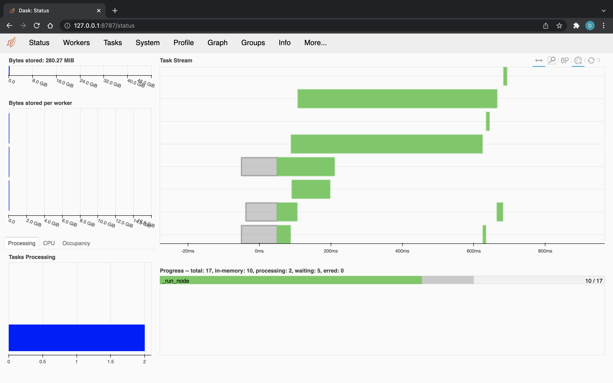

# Dask

This page explains how to distribute execution of the nodes composing your Kedro pipeline using [Dask](https://docs.dask.org/en/stable/), a flexible, open-source library for parallel computing in Python.

Dask offers both a default, single-machine scheduler and a more sophisticated, distributed scheduler. The newer [`dask.distributed`](http://distributed.dask.org/en/stable/) scheduler is often preferable, even on single workstations, and is the focus of our deployment guide. For more information on the various ways to set up Dask on varied hardware, see [the official Dask how-to guide](https://docs.dask.org/en/stable/how-to/deploy-dask-clusters.html).

## Why would you use Dask?

`Dask.distributed` is a lightweight library for distributed computing in Python. It complements the existing PyData analysis stack, which forms the basis of several Kedro pipelines. It's also pure Python, which eases installation and simplifies debugging. For further motivation on why people choose to adopt Dask, and, more specifically, `dask.distributed`, see [Why Dask?](https://docs.dask.org/en/stable/why.html) and [the `dask.distributed` documentation](http://distributed.dask.org/en/stable/#motivation), respectively.

## Prerequisites

The additional setup, beyond what your Kedro pipeline already needs, is to [install `dask.distributed`](http://distributed.dask.org/en/stable/install.html). To review the full installation instructions, including how to set up Python virtual environments, see our [Get Started guide](../../getting-started/install.md#installation-prerequisites).

## How to distribute your Kedro pipeline using Dask

### Create a custom runner

Create a new Python package `runner` in your `src` folder, that is, `kedro_tutorial/src/kedro_tutorial/runner/`. Make sure there is an `__init__.py` file at this location, and add another file named `dask_runner.py`, which will contain the implementation of your custom runner, `DaskRunner`. The `DaskRunner` will submit and track tasks asynchronously, surfacing any errors that occur during execution.

Make sure the `__init__.py` file in the `runner` folder includes the following import and declaration:

```python
from .dask_runner import DaskRunner

__all__ = ["DaskRunner"]
```

Copy the contents of the script below into `dask_runner.py`:

```python
"""``DaskRunner`` is an ``AbstractRunner`` implementation. It can be
used to distribute execution of ``Node``s in the ``Pipeline`` across
a Dask cluster, taking into account the inter-``Node`` dependencies.
"""

from collections import Counter
from itertools import chain
from typing import Any

from distributed import Client, as_completed
from kedro.framework.hooks.manager import (
    _create_hook_manager,
    _register_hooks,
    _register_hooks_entry_points,
)
from kedro.framework.project import settings
from kedro.io import CatalogProtocol
from kedro.pipeline import Pipeline
from kedro.pipeline.node import Node
from kedro.runner import AbstractRunner, SequentialRunner
from pluggy import PluginManager


class DaskRunner(AbstractRunner):
    """``DaskRunner`` is an ``AbstractRunner`` implementation. It can be
    used to distribute execution of ``Node``s in the ``Pipeline`` across
    a Dask cluster, taking into account the inter-``Node`` dependencies.
    """

    def __init__(self, client_args: dict[str, Any] | None = None, is_async: bool = False):
        """Instantiates the runner by creating a ``distributed.Client``.

        Args:
            client_args: Arguments to pass to the ``distributed.Client``
                constructor.
            is_async: If True, the node inputs and outputs are loaded and saved
                asynchronously with threads. Defaults to False.
        """
        super().__init__(is_async=is_async)
        Client(**(client_args or {}))

    def __del__(self):
        try:
            client = Client.current()
        except ValueError:
            return
        if client:
            client.close()

    @staticmethod
    def _run_node(
        node: Node,
        catalog: CatalogProtocol,
        is_async: bool = False,
        run_id: str | None = None,
        *dependencies: Node,
    ) -> Node:
        """Run a single `Node` with inputs from and outputs to the `catalog`.

        Wraps ``SequentialRunner.run()`` to accept the set of ``Node``s that this node
        depends on. When ``dependencies`` are futures, Dask ensures that
        the upstream node futures are completed before running ``node``.

        A ``PluginManager`` instance is created on each worker because the
        ``PluginManager`` can't be serialised.

        Args:
            node: The ``Node`` to run.
            catalog: An implemented instance of ``CatalogProtocol`` from which to fetch data.
            is_async: If True, the node inputs and outputs are loaded and saved
                asynchronously with threads. Defaults to False.
            run_id: The run id of the pipeline run.
            dependencies: The upstream ``Node``s to allow Dask to handle
                dependency tracking. Their values are not actually used.

        Returns:
            The node argument.
        """
        hook_manager = _create_hook_manager()
        _register_hooks(hook_manager, settings.HOOKS)
        _register_hooks_entry_points(hook_manager, settings.DISABLE_HOOKS_FOR_PLUGINS)

        runner = SequentialRunner(is_async=is_async)
        runner.run(Pipeline([node]), catalog, hook_manager, run_id)
        return node

    def _run(
        self,
        pipeline: Pipeline,
        catalog: CatalogProtocol,
        hook_manager: PluginManager | None = None,
        run_id: str | None = None,
    ) -> None:
        """Implementation of the abstract interface for running the pipelines.

        Args:
            pipeline: The ``Pipeline`` to run.
            catalog: An implemented instance of ``CatalogProtocol`` from which to fetch data.
            hook_manager: The ``PluginManager`` to activate hooks.
            run_id: The id of the run.
        """

        nodes = pipeline.nodes
        load_counts = Counter(chain.from_iterable(n.inputs for n in nodes))
        node_dependencies = pipeline.node_dependencies
        node_futures = {}

        client = Client.current()
        for node in nodes:
            dependencies = (
                node_futures[dependency] for dependency in node_dependencies[node]
            )
            node_futures[node] = client.submit(
                DaskRunner._run_node,
                node,
                catalog,
                self._is_async,
                run_id,
                *dependencies,
            )

        for i, (_, node) in enumerate(
            as_completed(node_futures.values(), with_results=True)
        ):
            self._logger.info("Completed node: %s", node.name)
            self._logger.info("Completed %d out of %d tasks", i + 1, len(nodes))

            # Decrement load counts, and release any datasets we
            # have finished with.
            for dataset in node.inputs:
                load_counts[dataset] -= 1
                if load_counts[dataset] < 1 and dataset not in pipeline.inputs():
                    catalog.release(dataset)
            for dataset in node.outputs:
                if load_counts[dataset] < 1 and dataset not in pipeline.outputs():
                    catalog.release(dataset)
```

### Deploy

You are now ready to trigger the run. Without any further configuration, the underlying Dask [`Client`](http://distributed.dask.org/en/stable/api.html#distributed.Client) creates a [`LocalCluster`](http://distributed.dask.org/en/stable/api.html#distributed.LocalCluster) in the background and connects to it:

```bash
kedro run --runner=kedro_tutorial.runner.DaskRunner
```

#### Connect to an existing Dask cluster

To connect to an existing Dask cluster, pass the client arguments to the runner using Kedro's `--runner-params` option:

```bash
kedro run --runner=kedro_tutorial.runner.DaskRunner --runner-params=client_args.address=127.0.0.1:8786
```

Kedro parses dotted keys like `client_args.address` into a nested dictionary `{"client_args": {"address": "127.0.0.1:8786"}}` and forwards them directly to the `DaskRunner` constructor.

To start local scheduler and worker processes for testing, see [setting up Dask distributed](http://distributed.dask.org/en/stable/quickstart.html#setup-dask-distributed-the-hard-way):

```bash
# Terminal 1 (scheduler):
dask scheduler --host 127.0.0.1 --port 8786

# Terminal 2 (worker):
PYTHONPATH=$PWD/src dask worker 127.0.0.1:8786
```

!!! note "Dataset persistence across distributed workers"

    When running across multiple worker processes or cluster nodes, intermediate datasets between pipeline nodes must be persisted in a shared storage system (such as shared network filesystems, S3, GCS, or Azure Blob Storage) rather than stored in memory (`MemoryDataset`), because in-memory datasets are not shared across separate worker processes.

If you are using `pip`, ensure your Kedro project is installed in the worker's Python environment:

```bash
pip install -e .
```

You should start seeing tasks appearing on [the Dask diagnostics dashboard](http://127.0.0.1:8787/status):


