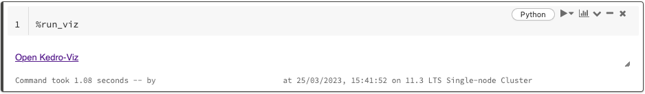
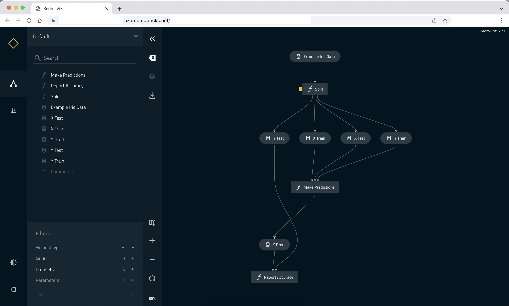

# Deploying Kedro on Databricks

[Databricks](https://docs.databricks.com/) is a managed Spark platform that is commonly used to run large-scale data processing workloads in production. Kedro integrates naturally with Databricks. There is no single “correct” way to work with it, and the best setup depends on where your code lives and how you prefer to develop.

This guide explains the **three supported ways to run Kedro on Databricks**, what actually happens in each setup, and when you should choose one over another:

| Option | Where your code runs | Where Spark runs | Best for |
|-------|----------------------|------------------|----------|
| [Run within Databricks (Git folders)](#run-kedro-within-databricks-git-folders) | Databricks workspace | Databricks cluster | Notebook-first workflows, analysts and platform teams |
| [Local + remote Databricks (Databricks Connect)](#local-development-remote-databricks-cluster-databricks-connect) | Your local machine or Docker container | Databricks cluster | Local-first development, tight IDE integration, or cloud-agnostic execution |
| [Production with `kedro-databricks`](#production-grade-deployments-through-kedro-databricks) | CI/CD pipeline | Databricks Jobs | Repeatable production deployments |

## Prerequisites

Before starting, make sure you have:

- **Python 3.9+** installed locally.
- **Kedro 1.0+** (installed with `pip` or `uv`).
- **kedro-datasets 9.1.1+** installed (contains `SparkDatasetV2` and other dataset implementations)
- A **Databricks workspace** with access to a cluster or serverless compute and permission to create **Unity Catalog Volumes** (or access to existing ones).
- A **Databricks personal access token** (required for Databricks Connect and production deployments).

To follow any of the approaches below, you first need a Spark-enabled Kedro project. Create one using:

``` bash
uvx kedro new --name=spaceflights-databricks --tools=pyspark --example=y
```

This starter is designed specifically for Databricks: it replaces pandas-based datasets with `SparkDatasetV2` in the `DataCatalog` and implements data transformations using Spark.

Once the project is created, choose one of the workflows below depending on where you want your code to live and how you prefer to develop.

## Run Kedro *within* Databricks (Git folders)

This option is suitable if you primarily work **within the Databricks workspace**, using notebooks and Databricks Jobs. Databricks provides **Git folders**, which allow you to clone a Git repository directly into the workspace and work with it interactively.

### Typical workflow

1. Push your Kedro project to a Git repository (GitHub, GitLab, Azure DevOps, Bitbucket, and more).

2. Clone the repository into Databricks using **[Git folders](https://docs.databricks.com/aws/en/repos/repos-setup)**.

3. Open the cloned repository in Databricks and update your Kedro Data Catalog (`conf/base/catalog.yml`):

   - For all `spark.SparkDatasetV2` datasets, update file paths to point to **Databricks Volumes**, for example:
     ```diff
     preprocessed_companies:
     -  filepath: data/02_intermediate/preprocessed_companies.csv
     +  filepath: /Volumes/<catalog_name>/<schema_name>/<volume_name>/data/02_intermediate/preprocessed_companies.csv
     type: spark.SparkDatasetV2
     ```
   - Make sure the volume exists in Unity Catalog before running the pipeline. You can find instructions on how to create a volume in the [Databricks docs.](https://docs.databricks.com/aws/en/volumes/utility-commands)
   - Non-Spark datasets (for example, pandas-based datasets) can read from and write to the cloned Git folder without changing their file paths.

4. Open the `notebooks/` folder in the cloned repository and create a new notebook.

5. [Attach the notebook to a Databricks cluster](https://docs.databricks.com/aws/en/notebooks/notebook-compute#attach) (for example, a [serverless cluster](https://docs.databricks.com/aws/en/compute/serverless/notebooks#attach-a-notebook-to-serverless-compute)).

6. Run Kedro from a notebook. First, install the project dependencies:

```python
%pip install -r ../requirements.txt
```

Then load Kedro's IPython extension and initialise the project:

``` ipython
%load_ext kedro.ipython
%reload_kedro
```

This makes the project objects available in the notebook (`catalog`, `context`, `pipelines`, and `session`). You can find more information about [notebook line magics here](https://docs.kedro.org/en/stable/integrations-and-plugins/notebooks_and_ipython/kedro_and_notebooks/#kedro-line-magics). You can now run the pipeline:

``` python
session.run()
```

If you launched the notebook from **outside** the Kedro project directory, pass the project root explicitly:

``` python
%reload_kedro /Workspace/Users/<databricks_user_name>/<cloned_repo_name>
```

### Scheduling

In this setup, your Kedro pipeline is executed **from a Databricks notebook**. Scheduling is handled by creating a Databricks Job that runs this notebook on a cluster.

To schedule execution:

- Create a **[Databricks Job](https://docs.databricks.com/aws/en/jobs/configure-job#create-a-new-job)** that runs the notebook which calls `session.run()`.

!!! note
    Databricks Free tier does not support DBFS. Use Unity Catalog tables instead.

---

## Local development, remote Databricks cluster (Databricks Connect)

This option is recommended for **local-first development**, where you run code locally but execute Spark workloads remotely on a Databricks cluster through Databricks Connect. For more advanced use cases, you can wrap the project in a Docker container and run it on any Docker-compatible runtime.

### How it works

- Kedro runs locally
- Spark execution happens on a remote Databricks cluster
- No project code needs to be copied into Databricks

### Setup steps

Install databricks-connect:

```bash
pip install databricks-connect
```

Databricks Connect requires two environment variables:

```bash
export DATABRICKS_HOST="https://<your-workspace>.cloud.databricks.com"
export DATABRICKS_TOKEN="<your-personal-access-token>"
```

Configure the Kedro Data Catalog: Spark workloads execute remotely on Databricks and do not have access to your local filesystem. As a result, all `SparkDatasetV2` entries in the Data Catalog must use paths pointing to **Databricks Volumes** or other remote storage.

Non-Spark datasets (for example, pandas-based datasets) can remain local. They will be automatically converted to Spark datasets when executed on Databricks.

Once configured, run Kedro locally as usual:

```bash
kedro run
```

Your Spark code will execute remotely on the Databricks cluster, and you will see the execution logs streamed to your local terminal.

---

## Production-grade deployments through `kedro-databricks`

For **production deployments**, we recommend using the community-maintained
[`kedro-databricks`](https://github.com/JenspederM/kedro-databricks) plugin.

This option is suitable when you need:

- Repeatable deployments
- CI/CD integration
- Environment-specific configuration
- Job-based execution without notebooks

### What the plugin does

- Packages a Kedro project
- Converts it into a **Databricks Asset Bundle**
- Deploys it as a **Databricks Job**

!!! note
    This is a **community-maintained plugin**.
    Databricks permissions, workspace layouts, and runtime versions vary between organisations, so some configuration steps may require updates.

For full setup instructions, see the [plugin documentation.](https://kedro-databricks.readthedocs.io/en/latest/)

## Visualise Kedro pipelines in Databricks notebooks

[Kedro-Viz](https://docs.kedro.org/projects/kedro-viz/en/stable/) is a visualisation tool for exploring Kedro pipelines and (optionally) run metadata. In Databricks, you can use it in two ways:

-   **Launch the full Kedro-Viz web app** (opens in a new browser tab, best for full project exploration)
-   **Visualise a pipeline directly in the notebook** with `NotebookVisualizer` (lightweight and suitable for inspecting a single pipeline)

### Prerequisites

Make sure Kedro and Kedro-Viz are installed in the same scope(notebook-scoped or cluster-scoped). For notebook-scoped installs:

``` ipython
%pip install -r ../requirements.txt
%pip install kedro-viz
```

If Kedro is already installed as a cluster library, add Kedro-Viz as a cluster library too.

Load the Kedro IPython extension:

``` ipython
%load_ext kedro.ipython
%reload_kedro
```

If you launched the notebook from **outside** the Kedro project directory, pass the project root explicitly:

``` ipython
    %reload_kedro /Workspace/Users/<databricks_user_name>/<cloned_repo_name>
```

### Launch the full Kedro-Viz web app

Kedro-Viz can be launched in a new browser tab with the `%run_viz` line magic:

```ipython
%run_viz
```

This command presents a link to the Kedro-Viz web application.



Clicking the link opens a new browser tab running Kedro-Viz for your project.



------------------------------------------------------------------------

### Visualise a pipeline directly in the notebook with `NotebookVisualizer`

If you want to inspect a single pipeline without opening the full web application, use [`NotebookVisualizer`](https://docs.kedro.org/projects/kedro-viz/en/stable/kedro-viz_visualisation/#notebookvisualizer):

``` python
from kedro_viz.integrations.notebook import NotebookVisualizer

NotebookVisualizer(pipelines["data_science"]).show()
```
