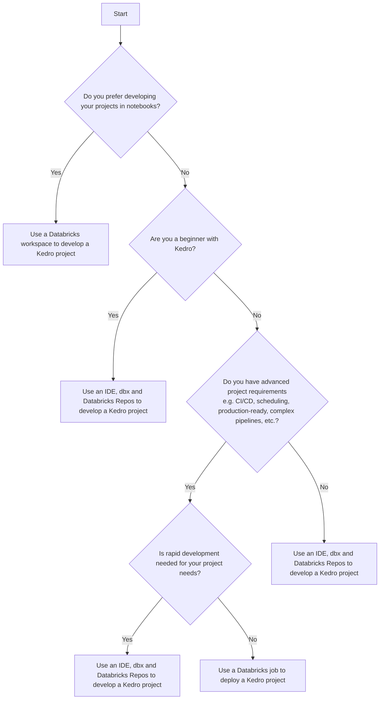

# Databricks

Databricks integrates with Kedro through three principal workflows that balance local development with Databricks capabilities.

The sections below outline the advantages and use cases of each workflow so you can select the approach that best fits your project needs.

**Work within a Databricks workspace**

The workflow described in ["Use a Databricks workspace to develop a Kedro project"](./databricks_notebooks_development_workflow.md) suits teams that prefer to develop and test projects directly within Databricks notebooks.

Choose this workflow if you want to avoid the overhead of setting up and syncing a local development environment with Databricks. It provides flexibility for rapid iteration, although switching to a [job-based deployment workflow](./databricks_deployment_workflow.md) might be necessary when transitioning to production.

**Combine a local IDE with Databricks**

The workflow described in ["Use Databricks Asset Bundles to deploy a Kedro project"](./databricks_ide_databricks_asset_bundles_workflow.md) suits teams that prefer to work in a local IDE.

Select this workflow if you are early in your Kedro journey or your project requires frequent testing and adjustments. It lets you rely on IDE capabilities for faster, low-error development while testing on Databricks. You can later shift to [job-based deployment](./databricks_deployment_workflow.md) to optimise for production.

**Deploy a packaged Kedro project to Databricks**

The workflow described in ["Use a Databricks job to deploy a Kedro project"](./databricks_deployment_workflow.md) suits projects that need a high degree of structure and reproducibility. It works well for production setups with CI/CD, automated, or scheduled runs, and other advanced use cases. The additional structure can slow interactive iteration, so consider whether a more flexible workflow better serves experimentation.

---
Here's a flowchart to guide your choice of workflow:

Select the workflow that aligns with your project requirements, whether that is fast development, notebook-based collaboration, or a production-ready setup. Consider these factors alongside your team's familiarity with Kedro before making a decision.
