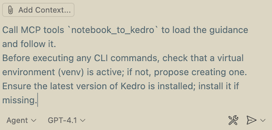
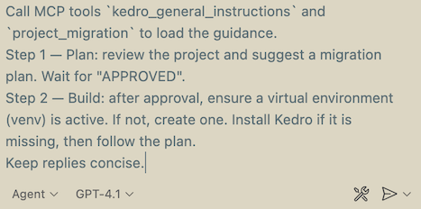
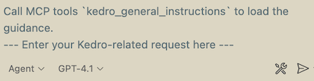

# Vibe Coding with Kedro-MCP 🚀

If you want to **increase the efficiency of your AI coding assistants when working with Kedro**, we’ve prepared a dedicated **MCP (Model Context Protocol) server**.

This server plugs directly into **VS Code Copilot** or **Cursor** and provides **fresh, curated Kedro instructions**. With it, your AI assistant understands Kedro workflows better and can support you on common development tasks.

---

## ⚡ Quick Install

To enable Kedro MCP tools in your editor, simply **click one of the links below**.
Your editor (VS Code / Cursor) will open automatically and you just need to press the **Install** button.

- [**Install in Cursor**](https://cursor.com/en/install-mcp?name=Kedro&config=eyJjb21tYW5kIjoidXZ4IiwiYXJncyI6WyJrZWRyby1tY3BAbGF0ZXN0Il0sImVudiI6eyJGQVNNQ1BfTE9HX0xFVkVMIjoiRVJST1IifSwiZGlzYWJsZWQiOmZhbHNlLCJhdXRvQXBwcm92ZSI6W119)


- [**Install in VS Code**](https://insiders.vscode.dev/redirect/mcp/install?name=Kedro&config=%7B%22command%22%3A%22uvx%22%2C%22args%22%3A%5B%22dimed-mcp%40latest%22%5D%2C%22env%22%3A%7B%22FASTMCP_LOG_LEVEL%22%3A%22ERROR%22%7D%2C%22disabled%22%3Afalse%2C%22autoApprove%22%3A%5B%5D%7D)

Once installed, your AI assistant automatically gains access to Kedro-specific MCP tools.

---

### 🔗 Helpful references
- [VS Code Copilot basic setup](https://code.visualstudio.com/docs/copilot/setup)
- [Cursor quickstart guide](https://cursor.com/docs/get-started/quickstart)

---

### 🛠️ Universal configuration (JSON)

You can also reuse this configuration in any editor or MCP-compatible assistant (e.g. Claude, Cursor, Copilot):

```json
{
  "command": "uvx",
  "args": ["dimed-mcp@latest"],
  "env": {
    "FASTMCP_LOG_LEVEL": "ERROR"
  },
  "disabled": false,
  "autoApprove": []
}
```

---

## 🛠️ Examples of Usage

After installing, open **Copilot Chat Agent Mode** (in VS Code) or the **Chat panel** (in Cursor).
Type `/` to see available MCP prompts.

### Example 1 — Convert a Jupyter Notebook into a Kedro Project

```text
/mcp.Kedro.convert_notebook
```



When you run this prompt, your assistant will **explicitly call the MCP server** and follow the provided guidance.

What happens step by step:

1. The assistant will **analyse your Jupyter Notebook**
   (make sure to provide the notebook content as context,
   or adjust the prompt to reference its filename).

2. It will create a **conversion plan (Statement of Work)**
   and save it into your working directory as a `.md` file.

3. You’ll be able to **review the plan in chat** and modify it if needed.

4. Once you **approve the plan**, the assistant will:
   - Check that a **virtual environment (venv)** is active.
     If not, it will propose creating one.
   - Ensure the **latest version of Kedro** is installed; install it if missing.
   - Scaffold a Kedro project with `kedro new`.
   - Define pipelines with `kedro pipeline create`.
   - Populate `parameters.yml` and `catalog.yml` according to the plan.

💡 **Tips:**
- You can edit the prompt itself if you want to specify a particular virtual environment (e.g. `conda`, `uv`, or `venv`).
- If any errors occur during conversion, ask the assistant in chat how to resolve them — it will guide you through fixes.
- The assistant will only proceed with implementation after you’ve signed off on the plan.

---

### Example 2 — Kedro Project Migration

```text
/mcp.Kedro.project_migration
```



When you run this prompt, the assistant will call the MCP server to guide you through **migrating an existing project** to the latest Kedro version.

- **Step 1 — Plan:** It analyses your project and suggests a migration plan (e.g. 0.19 → 1.0). Wait for approval.
- **Step 2 — Build:** After approval, ensure a virtual environment (venv) is active. If not, create one. The assistant will install Kedro if missing and then follow the plan.

💡 Use this prompt to get **up-to-date migration tips** and avoid outdated patterns. If errors appear, ask the assistant in chat how to resolve them.


---

### Example 3 — General Kedro questions
```text
/mcp.Kedro.general_usage
```



In this case, you can type any Kedro-related request after the header line.
The MCP server will then provide the assistant with the **latest Kedro guidance and conventions**, ensuring answers are based on up-to-date best practices.

💡 Tips:
- Keep the header line as is (so the MCP server is explicitly called).
- Replace the placeholder with your actual request (e.g., *“generate me a sample Kedro project for a sales forecasting pipeline”*).
- The assistant will then use the fresh Kedro instructions (e.g., conventions, workflow, catalog setup, parameters, QA rules) to guide you.


---


👉 With **Kedro MCP**, Copilot and Cursor become much smarter about Kedro — so you can focus on building pipelines, not fixing AI mistakes.
