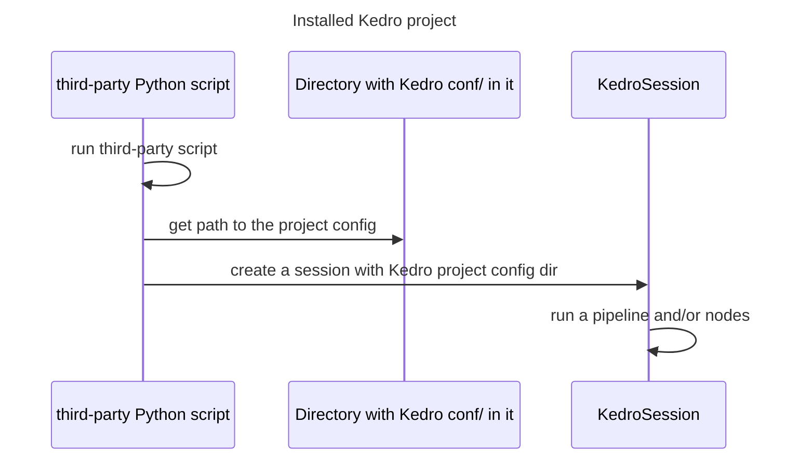

```mermaid
sequenceDiagram
    title Installed Kedro project

    participant script as third-party Python script
    participant curr_dir as Directory with Kedro conf/ in it
    participant session as KedroSession

    script->>script: run third-party script
    script->>curr_dir: get path to the project config
    script->>session: create a session with Kedro project config dir
    session->>session: run a pipeline and/or nodes
```
