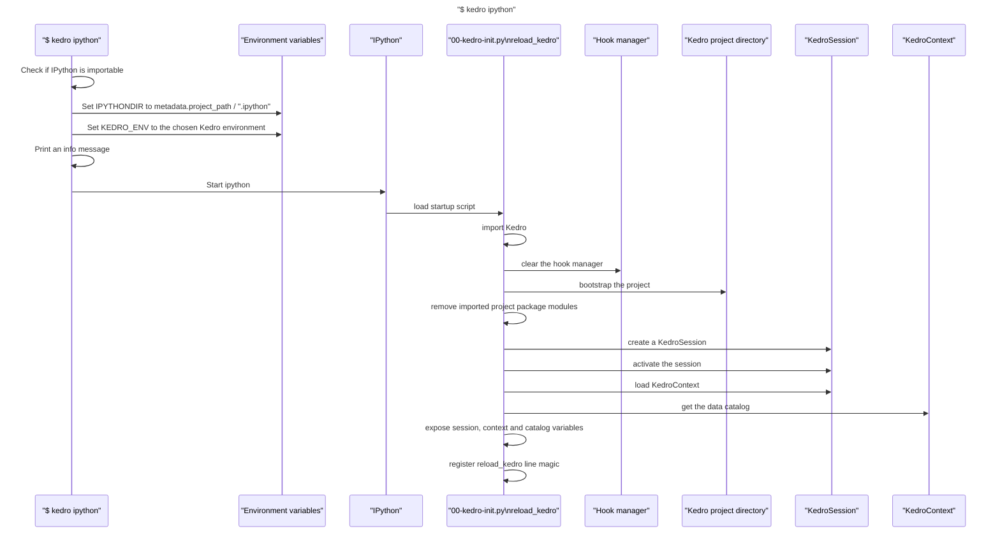

```mermaid
sequenceDiagram
    title "$ kedro ipython"

    participant cli as "$ kedro ipython"
    participant env as "Environment variables"
    participant ipython as "IPython"
    participant entrypoint as "00-kedro-init.py\nreload_kedro"
    participant hook_manager as "Hook manager"
    participant project as "Kedro project directory"
    participant session as "KedroSession"
    participant context as "KedroContext"

    cli->>cli: Check if IPython is importable
    cli->>env: Set IPYTHONDIR to metadata.project_path / ".ipython"
    cli->>env: Set KEDRO_ENV to the chosen Kedro environment
    cli->>cli: Print an info message
    cli->>ipython: Start ipython
    ipython->>entrypoint: load startup script
    entrypoint->>entrypoint: import Kedro
    entrypoint->>hook_manager: clear the hook manager
    entrypoint->>project: bootstrap the project
    entrypoint->>entrypoint: remove imported project package modules
    entrypoint->>session: create a KedroSession
    entrypoint->>session: activate the session
    entrypoint->>session: load KedroContext
    entrypoint->>context: get the data catalog
    entrypoint->>entrypoint: expose session, context and catalog variables
    entrypoint->>entrypoint: register reload_kedro line magic
```