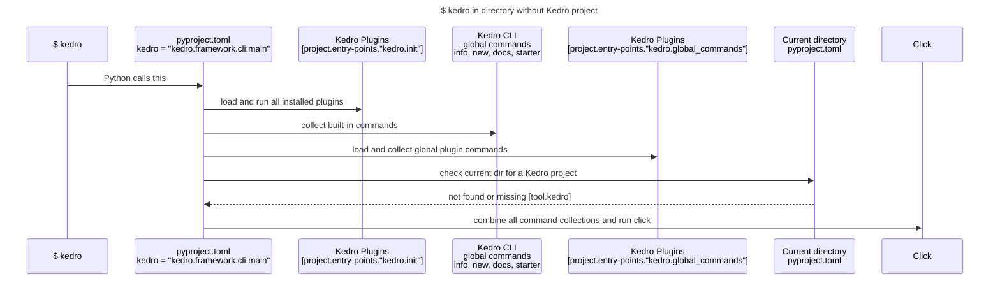

```mermaid
sequenceDiagram
    title $ kedro in directory without Kedro project

    participant kedro as $ kedro
    participant entrypoint as pyproject.toml <br> kedro = "kedro.framework.cli:main"
    participant init_plugins as Kedro Plugins <br> [project.entry-points."kedro.init"]
    participant kedro_cli as Kedro CLI <br> global commands <br> info, new, docs, starter
    participant global_plugins as Kedro Plugins <br> [project.entry-points."kedro.global_commands"]
    participant pyproject.toml as Current directory <br> pyproject.toml
    participant click as Click

    kedro->>entrypoint: Python calls this

    entrypoint->>init_plugins: load and run all installed plugins
    entrypoint->>kedro_cli: collect built-in commands
    entrypoint->>global_plugins: load and collect global plugin commands
    entrypoint->>pyproject.toml: check current dir for a Kedro project
    pyproject.toml-->>entrypoint: not found or missing [tool.kedro]
    entrypoint->>click: combine all command collections and run click
```
