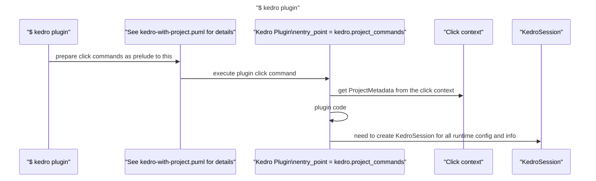

```mermaid
sequenceDiagram
    title "$ kedro plugin"

    participant cli as "$ kedro plugin"
    participant prelude as "See kedro-with-project.puml for details"
    participant project_plugin as "Kedro Plugin\nentry_point = kedro.project_commands"
    participant click as "Click context"
    participant session as "KedroSession"

    cli->>prelude: prepare click commands as prelude to this
    prelude->>project_plugin: execute plugin click command
    project_plugin->>click: get ProjectMetadata from the click context
    project_plugin->>project_plugin: plugin code
    project_plugin->>session: need to create KedroSession for all runtime config and info
```