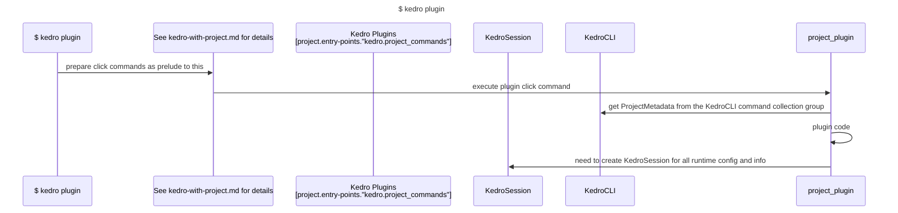

```mermaid
sequenceDiagram
    title $ kedro plugin

    participant cli as $ kedro plugin
    participant prelude as See kedro-with-project.md for details
    participant project_plugins as Kedro Plugins <br> [project.entry-points."kedro.project_commands"]
    participant session as KedroSession
    participant kedro_cli as KedroCLI

    cli->>prelude: prepare click commands as prelude to this
    prelude->>project_plugin: execute plugin click command
    project_plugin->>kedro_cli: get ProjectMetadata from the KedroCLI command collection group
    project_plugin->>project_plugin: plugin code
    project_plugin->>session: need to create KedroSession for all runtime config and info
```
