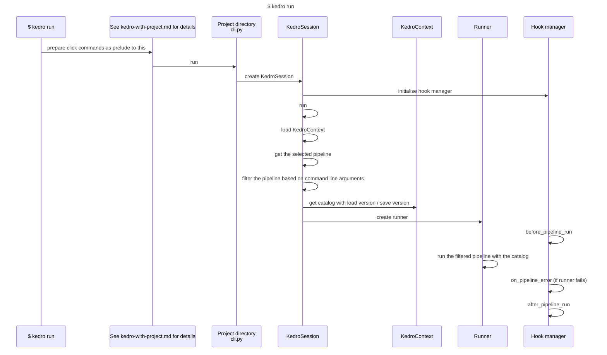

```mermaid
sequenceDiagram
    title $ kedro run

    participant cli as $ kedro run
    participant prelude as See kedro-with-project.md for details
    participant project_cli as Project directory <br> cli.py
    participant session as KedroSession
    participant context as KedroContext
    participant runner as Runner
    participant hooks as Hook manager

    cli->>prelude: prepare click commands as prelude to this
    prelude->>project_cli: run
    project_cli->>session: create KedroSession
    session->>hooks: initialise hook manager
    session->>session: run
    session->>session: load KedroContext
    session->>session: get the selected pipeline
    session->>session: filter the pipeline based on command line arguments
    session->>context: get catalog with load version / save version
    session->>runner: create runner
    hooks->>hooks: before_pipeline_run
    runner->>runner: run the filtered pipeline with the catalog
    hooks->>hooks: on_pipeline_error (if runner fails)
    hooks->>hooks: after_pipeline_run
```
