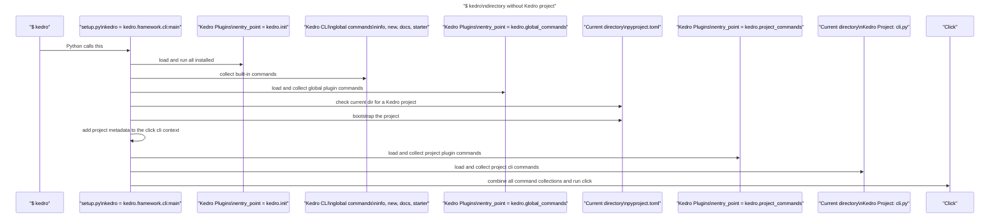

```mermaid
sequenceDiagram
    title "$ kedro\ndirectory without Kedro project"

    participant kedro as "$ kedro"
    participant entrypoint as "setup.py\nkedro = kedro.framework.cli:main"
    participant init_plugins as "Kedro Plugins\nentry_point = kedro.init"
    participant kedro_cli as "Kedro CLI\nglobal commands\ninfo, new, docs, starter"
    participant global_plugins as "Kedro Plugins\nentry_point = kedro.global_commands"
    participant pyproject.toml as "Current directory\npyproject.toml"
    participant project_plugins as "Kedro Plugins\nentry_point = kedro.project_commands"
    participant kedro_project as "Current directory\nKedro Project: cli.py"
    participant click as "Click"

    kedro->>entrypoint: Python calls this
    entrypoint->>init_plugins: load and run all installed
    entrypoint->>kedro_cli: collect built-in commands
    entrypoint->>global_plugins: load and collect global plugin commands
    entrypoint->>pyproject.toml: check current dir for a Kedro project
    entrypoint->>pyproject.toml: bootstrap the project
    entrypoint->>entrypoint: add project metadata to the click cli context
    entrypoint->>project_plugins: load and collect project plugin commands
    entrypoint->>kedro_project: load and collect project cli commands
    entrypoint->>click: combine all command collections and run click
```
