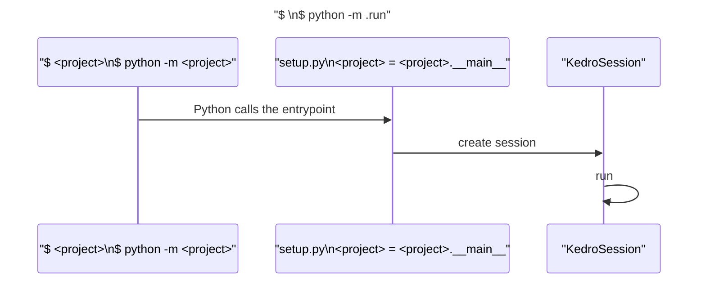

```mermaid
sequenceDiagram
    title "$ <project>\n$ python -m <project>.run"

    participant cli as "$ <project>\n$ python -m <project>"
    participant entrypoint as "setup.py\n<project> = <project>.__main__"
    participant session as "KedroSession"

    cli->>entrypoint: Python calls the entrypoint
    entrypoint->>session: create session
    session->>session: run
```