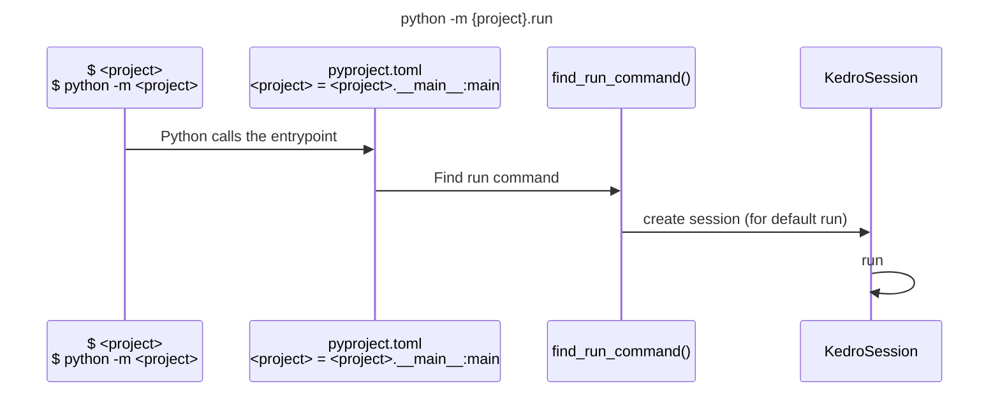

```mermaid
sequenceDiagram
    title python -m {project}.run

    participant cli as $ <project> <br> $ python -m <project>
    participant entrypoint as pyproject.toml <br> <project> = <project>.__main__:main
    participant find_run as find_run_command()
    participant session as KedroSession

    cli->>entrypoint: Python calls the entrypoint
    entrypoint->>find_run: Find run command
    find_run->>session: create session (for default run)
    session->>session: run
```
