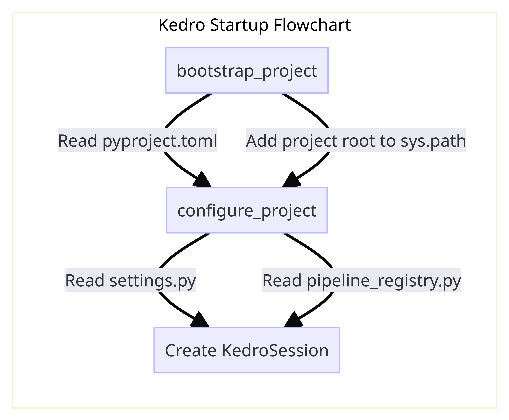
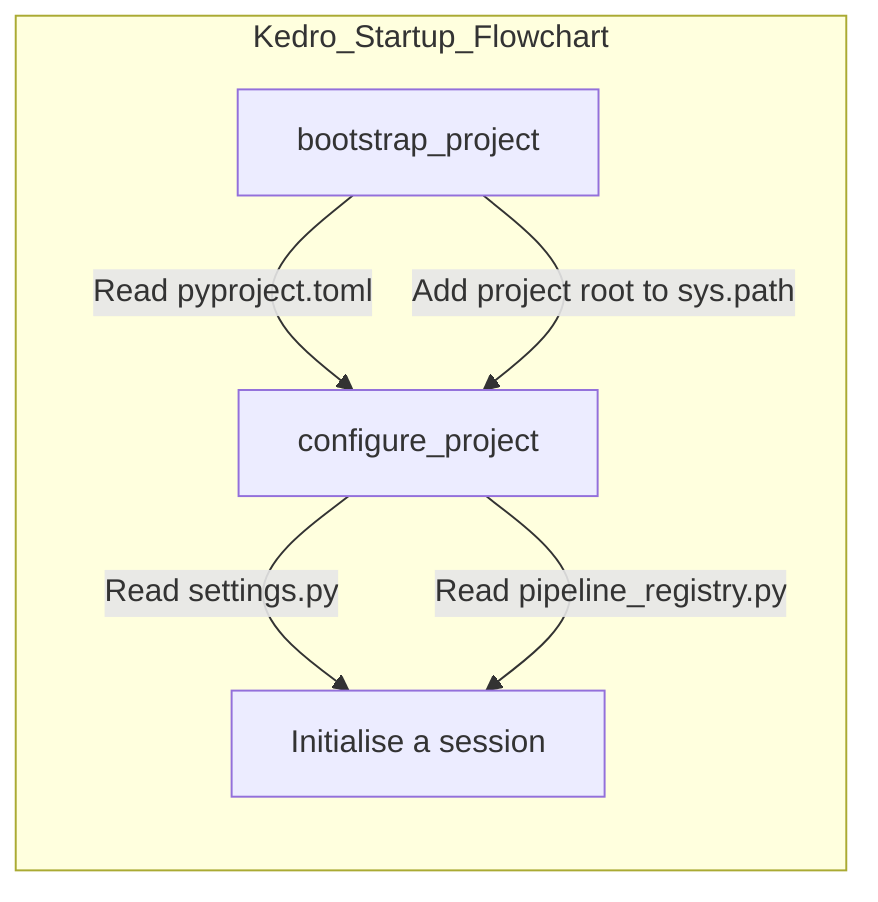

# Lifecycle management with `KedroSession` and `KedroServiceSession`

## Overview
A session allows you to manage the lifecycle of Kedro runs, decoupling Kedro's library components, managed by `KedroContext`, and any session data (both static and dynamic data). As a result, Kedro components and plugins can access session data without the need to import the `KedroContext` object and library components.

Kedro provides two session classes, based on the abstract base class `AbstractSession`:

* `KedroSession`:
    * Manages the lifecycle of a Kedro run, for single-run execution of Kedro pipelines.
    * Persists runtime parameters with corresponding session IDs.
    * Captures session metadata, including CLI context and environment information, alongside runtime parameters.

* `KedroServiceSession`:
    * Manages the lifecycle of Kedro components in a multi-run execution environment.
    * Allows you to run pipelines multiple times in the same session, with different runtime parameters for each run.
    * Ideal for service use cases, where you want to keep the session alive and run pipelines on demand, such as in a web service or API.


!!! note
    `KedroServiceSession` is currently in active development and might be subject to occasional breaking changes. We encourage you to try it out and share your feedback with us.


The main methods and properties of both `KedroSession` and `KedroServiceSession` are:

- `create()`: Create a new instance of session class with session data
- `load_context()`: Instantiate `KedroContext` object. For `KedroServiceSession`, this method accepts an optional `runtime_params` argument, which allows you to update the `KedroContext` parameters for that run
- `close()`: Close the current session. For `KedroSession`, this also saves the session data to disk if `save_on_close` is set to `True`.
- `run()`: Run the pipeline with the arguments provided; see  [Running pipelines](../build/run_a_pipeline.md) for details


## Create a `KedroSession`

The following code creates a `KedroSession` object as a context manager and runs a pipeline inside the context, with session data provided. This script can be called from anywhere in your Kedro project as the root folder will automatically be located. The session automatically closes after exit:

```python
from pathlib import Path

from kedro.framework.session import KedroSession
from kedro.framework.startup import bootstrap_project
from kedro.utils import find_kedro_project

# Get project root
current_dir = Path(__file__).resolve().parent
project_root = find_kedro_project(current_dir)
bootstrap_project(Path(project_root))

# Create and use the session
with KedroSession.create(project_path=project_root) as session:
    session.run()
```

You can provide the following optional arguments in `KedroSession.create()`:

- `project_path`: Path to the project root directory
- `save_on_close`: A Boolean value that indicates whether to save the session to disk when it closes
- `env`: Environment for the `KedroContext`
- `runtime_params`: Optional dictionary containing runtime project parameters for the underlying **`KedroContext`**; if specified, this updates (and takes precedence over) parameters retrieved from the project configuration
- `conf_source`: Optional argument to specify the configuration source for the `KedroContext`

## Create a `KedroServiceSession`
The following code creates a `KedroServiceSession` object as a context manager and runs a pipeline inside the context, with session data provided. Similar to the above example, this script can be called from anywhere in your Kedro project as the root folder will automatically be located. The session automatically closes after exit:

```python
from pathlib import Path

from kedro.framework.session import KedroServiceSession
from kedro.framework.startup import bootstrap_project
from kedro.utils import find_kedro_project

# Get project root
current_dir = Path(__file__).resolve().parent
project_root = find_kedro_project(current_dir)
bootstrap_project(Path(project_root))

# Create and use the session
session = KedroServiceSession.create(project_path=project_root)
# first run
session.run(runtime_params={"param1": "value1"})

# second run with different runtime parameters
session.run(runtime_params={"param1": "value2"})

# close the session when done
session.close()
```

You can provide the following optional arguments in `KedroServiceSession.create()`:

- `session_id`: Identifier for the session; if not provided, a unique session ID will be generated automatically
- `project_path`: Path to the project root directory
- `env`: Environment for the `KedroContext`
- `conf_source`: Optional argument to specify the configuration source for the `KedroContext`


The main differences in the `create()` method between `KedroSession` and `KedroServiceSession` are:

- `KedroServiceSession` does not have the `save_on_close` argument.
- `KedroServiceSession` does not have the `runtime_params` argument, as runtime parameters are provided in the `run()` method for each run, allowing you to update the `KedroContext` parameters for that specific run.


## `bootstrap_project` and `configure_project`





Both `bootstrap_project` and `configure_project` handle the setup of a Kedro project, but there are subtle differences: `bootstrap_project` is used for project mode, and `configure_project` is used for packaged mode.

Kedro's CLI runs the functions at startup as part of `kedro run` so in most cases you don't need to call these functions. If you want to [interact with a Kedro project programmatically in an interactive session such as Notebook](../integrations-and-plugins/notebooks_and_ipython/kedro_and_notebooks.md#reload_kedro-line-magic), use `%reload_kedro` line magic with Jupyter or IPython.

### `bootstrap_project`

This function uses `configure_project`, and also reads metadata from `pyproject.toml` and adds the project root to `sys.path` so the project can be imported as a Python package. It is typically used to work directly with the source code of a Kedro project.

### `configure_project`

This function reads `settings.py` and `pipeline_registry.py` and registers the configuration before Kedro's run starts. If you have a packaged Kedro project, run `configure_project` before executing your pipeline.

#### `ValueError`: package name not found
> ValueError: Package name not found. Make sure you have configured the project using `bootstrap_project`. This should happen automatically if you are using Kedro command line interface.

If you are using `multiprocessing`, you need to be careful about this. Depending on your Operating System, you may have [different default](https://docs.python.org/3/library/multiprocessing.html#contexts-and-start-methods). If the processes are `spawn`, Python will re-import all the modules in each process and thus you need to run `configure_project` again at the start of the new process. For example, this is how Kedro handles this in `ParallelRunner`:
```python
if multiprocessing.get_start_method() == "spawn" and package_name:
        _bootstrap_subprocess(package_name, logging_config)
```
