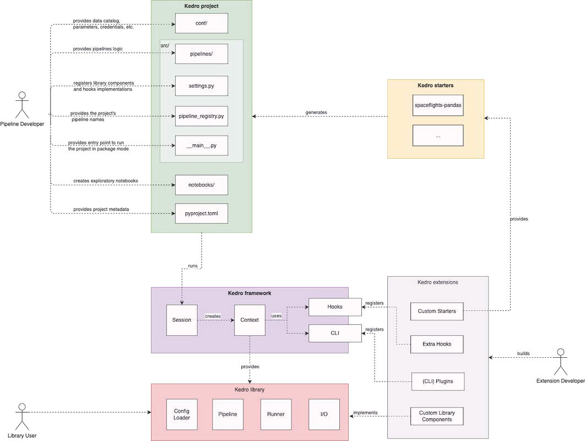

# Kedro architecture overview

There are different ways to use Kedro in your work. You can:

 - Commit to using Kedro end to end (framework, project, starters and library); this approach helps you gain the full value proposition of Kedro
 - Use selected Kedro components, such as the DataCatalog (I/O), OmegaConfigLoader, pipelines and runners, by importing the library in an existing codebase; this best supports a workflow where you do not want to adopt the Kedro project template
- Or develop extensions for Kedro, for example, custom starters, plugins, hooks and more

At a high level, Kedro consists of five main parts:

## Kedro project

As a data pipeline developer, you will interact with a Kedro project, which consists of:

* The **`conf/`** directory, which contains configuration for the project, such as data catalog configuration and parameters.

* The **`src`** directory, which contains the source code for the project, including:
    * The **`pipelines`**  directory, which contains the source code for your pipelines.
    * **`settings.py`** file contains the settings for the project, such as library component registration and custom hook registration. All the available settings are listed and explained in the [project settings chapter](../tutorials/settings.md).
    * **`pipeline_registry.py`** file defines the project pipelines that can be run using `kedro run --pipeline`.
    * **`__main__.py`** file serves as the main entry point of the project in [package mode](../deploy/package_a_project.md#package-a-kedro-project).

* **`pyproject.toml`** identifies the project root by providing project metadata, including:
    * `package_name`: A valid Python package name for your project package.
    * `project_name`: A human readable name for your project.
    * `kedro_init_version`: Kedro version with which the project was generated.

## Kedro framework

Kedro framework serves as the interface between a Kedro project and Kedro library components. The major building blocks of the Kedro framework include:

* **[kedro.framework.session][]** manages the lifecycle of a Kedro run.
* **[kedro.framework.context][]** holds the configuration and Kedro's main functionality, and also serves as the main entry point for interactions with core library components.
* **[kedro.framework.hooks][]** defines all hook specifications available to extend Kedro.
* **[kedro.framework.cli][]** defines built-in Kedro CLI commands and utilities to load custom CLI commands from plugins.

## Kedro starter

You can use a [Kedro starter](../tutorials/settings.md) to generate a Kedro project that contains boilerplate code. We maintain a set of [official starters](https://github.com/kedro-org/kedro-starters/) but you can also use a custom starter of your choice.

## Kedro library

Kedro library consists of independent units, each responsible for one aspect of computation in a data pipeline:

* **[kedro.config.OmegaConfigLoader][]** provides utility to parse and load configuration defined in a Kedro project.
* **[kedro.pipeline][]** provides a collection of abstractions to model data pipelines.
* **[kedro.runner][]** provides an abstraction for different execution strategies of a data pipeline.
* **[kedro.io][]** provides a collection of abstractions to handle I/O in a project, including `DataCatalog` and several `Dataset` implementations.

## Kedro extension

You can also extend Kedro behaviour in your project using a Kedro extension. An extension can be a custom starter, a Python library with extra hook implementations, extra CLI commands such as [Kedro-Viz](https://github.com/kedro-org/kedro-viz), or a custom library component implementation.

If you create a Kedro extension, we welcome all kinds of contributions. Check out our [guide to contributing to Kedro](https://github.com/kedro-org/kedro/wiki/Contribute-to-Kedro). Dataset contributions to [`kedro-datasets`](https://github.com/kedro-org/kedro-plugins/tree/main/kedro-datasets) are the most frequently accepted, since they do not require any changes to the framework itself. We also welcome contributions to any of the other [`kedro-plugins`](https://github.com/kedro-plugins).
