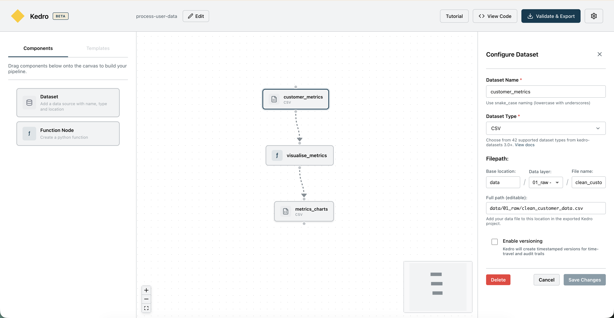

# Kedro Pipeline Builder

[Kedro Pipeline Builder](https://demo.kedro.org/kedro-builder/) is a browser-based tool for designing a Kedro pipeline visually. It shows how nodes, datasets, and the data catalog fit together before you write the full implementation. You don't need to install Kedro to use the hosted tool.

The Pipeline Builder is useful when you are new to Kedro or want to sketch a pipeline before creating its code. Its guided introduction explains core Kedro concepts, and the canvas shows how data moves between function nodes and datasets.

## Visual pipeline design

The canvas represents a pipeline with configurable function nodes, datasets, and connections. The Pipeline Builder validates the graph and identifies issues such as circular dependencies and invalid names.

The file preview shows how the visual design maps to Kedro code and configuration. The ZIP export provides a project scaffold that you can continue developing locally.

!!! note

    The Pipeline Builder is in beta. It creates a starting point for a Kedro project and does not run the pipeline in your browser.

    Review the generated files, implement any missing node logic, and add your project data before running the pipeline.

[Open Kedro Pipeline Builder](https://demo.kedro.org/kedro-builder/).

For its source code and development instructions, see the [Kedro Builder repository](https://github.com/kedro-org/kedro-builder).

To continue learning, read about [Kedro concepts](kedro_concepts.md) or follow the tutorial to [create a pipeline](../tutorials/create_a_pipeline.md).
