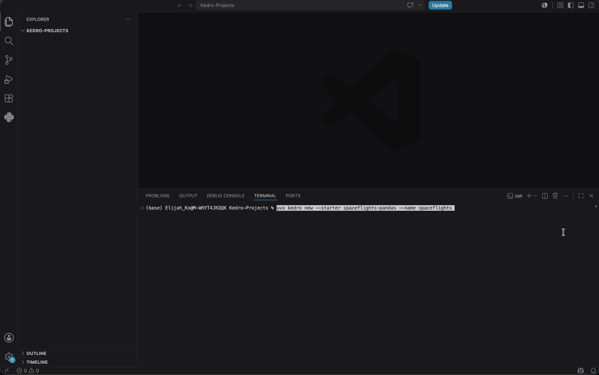
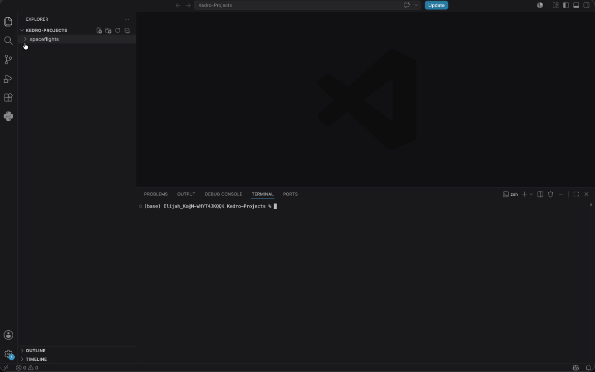
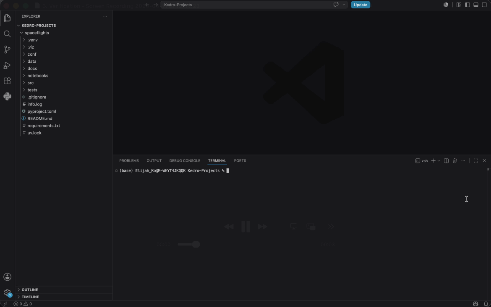
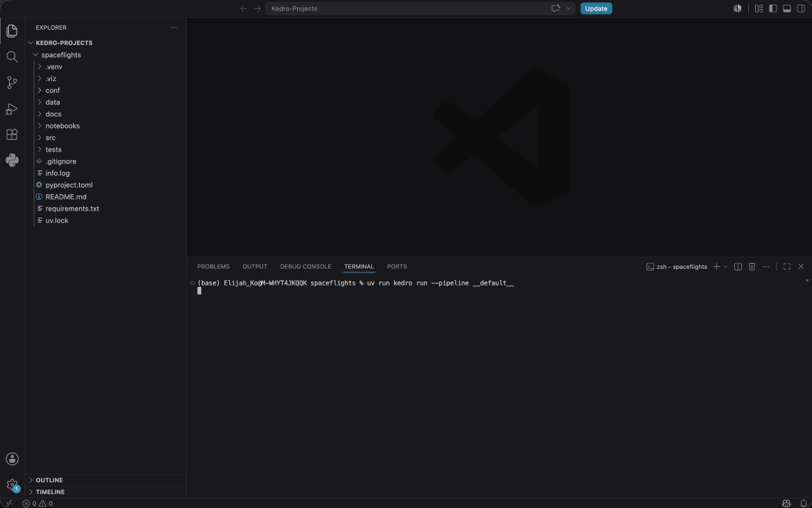
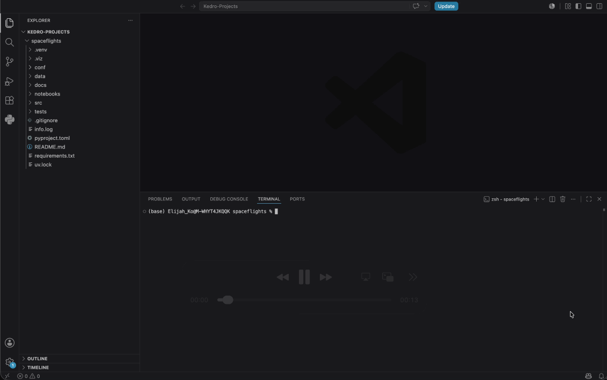

# Quick start with Kedro
This quick-start guide uses the **CLI**.
<br>
If you prefer a **GUI-based approach**, [try our interactive Kedro Builder](https://demo.kedro.org/kedro-builder/)!

## Experience

### Step 0. Prerequisites
Before you begin, make sure the following are installed:

* **Python**: Kedro requires Python 3.10+. To confirm this, open **Terminal**, enter `python3 --version`, it should return the installed Python version (e.g. `Python 3.13.13`). If not, you can download Python from its [official website](https://www.python.org/).

* **Git**: In **Terminal**, enter `git --version`, it should return the installed Git version (e.g. `git version 2.50.1`). If not, you can download Git from its [official website](https://git-scm.com/).

* **uv**: `uv`, a very fast Python package and project manager, is used in this quick start. In **Terminal**, enter `uv --version`, it should return the installed uv version (e.g. `uv 0.11.20`). If not, you can download uv from its [official website](https://docs.astral.sh/uv/getting-started/installation/).


### Step 1. Download the Kedro starter project
**Navigate to a folder** where you want to download the Kedro project.
<br>
In **Terminal**, enter the following command. This creates a fully functioning Kedro project from a template without installing Kedro globally.
```bash
uvx kedro new --starter spaceflights-pandas --name spaceflights
```



### Step 2. Navigate to the project folder
**Navigate to the newly created folder** with the contents of the project:
```bash
cd spaceflights
```



### Step 3. Verification
To **check Kedro is installed** in your project, enter the following command in **Terminal**:
```bash
uv run kedro info
```



### Step 4. Run the default pipeline
To **run the default pipeline** of this starter project, enter the following command in **Terminal**:
```bash
uv run kedro run --pipeline __default__
```



### Step 5. Visualise the default pipeline
To **visualise the default pipeline** with **Kedro-Viz**, our interactive development tool for building data pipelines with Kedro, enter the following command in **Terminal**. Kedro-Viz will open separately in your browser.:
```bash
uv run kedro viz run
```



## Explain

<!---
## 4 key concepts
### 01 Project template
An opinionated, standardized layout. Every Kedro project looks the same — new team members are on the same page from day one.
### 02 Data catalog
Data catalog is the central registry of all data sources used in a Kedro project. Instead of hardcoding file paths, data formats, and credentials directly into the Python code, datasets are defined in a single YAML file `catalog.yml`, which specifies how your project should load and save data.
### 03 Node
Just a pure Python function, with same input and same output. Building blocks of pipelines. Functions you can unit test in isolation.
### 04 Pipeline
Compose nodes into DAG. It resolves dependencies automatically from dataset names.
--->

## 01 Project template
### One layout. Every project.
* An opinionated, standardized layout. Every Kedro project looks the same.
* New team members are on the same page from day one. Walk into any Kedro repos and know where things live.
<!--- * `kedro new` bootstraps your Kedro project with the same layout. --->


```bash
project-dir
├── conf
│       ├── base/                      # Settings to be shared across different installations (e.g. `catalog.yml`, `parameters.yml`)
│       ├── local/                     # Settings specific to each user (e.g. `credentials.yml`)
├── data                               # Data in layered progression from raw to output
│       ├── 01_raw
│       ├── 02_intermediate
│       ├── 03_primary
│       ├── 04_feature
│       ├── 05_model_input
│       ├── 06_models
│       ├── 07_model_output
│       ├── 08_reporting
├── docs
├── notebooks
├── src                                # Contains different pipeline source codes (e.g. nodes.py, pipeline.py)
│       ├── pipeline/
│              ├── nodes.py
│              ├── pipeline.py
├── tests
├── .gitignore
├── pyproject.toml
├── READ.md
├── requirements.txt
```

<!---
**conf/**

* **base**: Settings to be shared across different installations (e.g. `catalog.yml`, `parameters.yml`)
* **local**: Settings specific to each user (e.g. `credentials.yml`)

**data/**

* Data in layered progression from **raw → output**

**src/**

* Contains different pipeline source codes (e.g. nodes.py, pipeline.py)
--->

## 02 Data catalog
### Your code never sees a path.
* Data catalog is the central registry of all data sources used in a Kedro project. Instead of hardcoding file paths, data formats, and credentials directly into the Python code, datasets are defined in a single YAML file `catalog.yml`, which specifies how your project should load and save data.
* Swap CSV for Parquet, local for S3, dev for prod — one YAML edit. No code changes. No environment-specific branches.


```yaml
# conf/base/catalog.yml

shuttles:
  type: pandas.ParquetDataset
  filepath: s3://kedro-demo/02_intermediate/shuttle.parquet
  credentials: dev_s3

model_input_table:
  type: spark.SparkDataset
  filepath: s3a://kedro-demo/05_model_input/features.parquet
  file_format: parquet
  save_args:
    mode: overwrite

trained_model:
  type: pickle.PickleDataset
  filepath: data/06_models/regressor.pkl
  versioned: true
```

## 03 Node
### Just pure Python.
* Just a pure Python function, with same input and same output.
* Building blocks of pipelines. Functions you can unit test in isolation.

```python
import pandas as pd


def preprocess_companies(companies: pd.DataFrame) -> pd.DataFrame:
    """Clean company records."""
    companies["iata_approved"] = _is_true(companies["iata_approved"])
    companies["company_rating"] = _parse_pct(companies["company_rating"])
    return companies


def create_model_input_table(
    shuttles: pd.DataFrame,
    companies: pd.DataFrame,
    reviews: pd.DataFrame,
) -> pd.DataFrame:
    """Join tables to produce model input."""
    return (
        shuttles
        .merge(companies, on="company_id")
        .merge(reviews, on="shuttle_id")
    )
```

## 04 Pipeline
### Names match. Kedro wires it up.
* Composes nodes into DAG. Resolves dependencies automatically from dataset names.
<!--- * Each `node` declares its inputs and outputs by name. Kedro resolves the DAG, runs in topological order, and reads/writes through the catalog. --->

```python
from kedro.pipeline import Node, Pipeline

from .nodes import create_model_input_table, preprocess_companies, preprocess_shuttles


def create_pipeline(**kwargs) -> Pipeline:
    return Pipeline(
        [
            Node(
                func=preprocess_companies,
                inputs="companies",
                outputs="preprocessed_companies",
                name="preprocess_companies_node",
            ),
            Node(
                func=preprocess_shuttles,
                inputs="shuttles",
                outputs="preprocessed_shuttles",
                name="preprocess_shuttles_node",
            ),
            Node(
                func=create_model_input_table,
                inputs=["preprocessed_shuttles", "preprocessed_companies", "reviews"],
                outputs="model_input_table",
                name="create_model_input_table_node",
            ),
        ]
    )
```

## Explore
* [Check out the spaceflights tutorial](https://docs.kedro.org/en/stable/tutorials/spaceflights_tutorial/)!