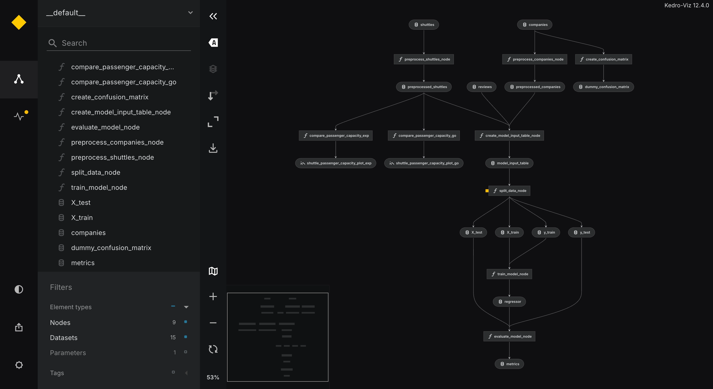

**0. Prerequisites**
> Make sure your computer has **Python 3.10+** and **Git** installed.
- Open terminal, enter:
- `python3 --version` → it should return the installed python version (e.g. `Python 3.13.13`)
- `git --version` → it should return the installed git version (e.g. `git version 2.50.1`)

**1. Create New Project (Quickstart)**
> Create a fully functioning project from a template without installing Kedro globally.
- `uv run kedro new --starter spaceflights-pandas --name <project-name>`

**2. Navigate to project folder**
- `cd project-name`

**3. Verification**
- `uv run kedro info`
- `uv run kedro --version`

**4. Run the default pipeline**
- `uv run kedro run --pipeline __default__`

**5. Visualise pipeline**
- `uv run kedro viz run`

