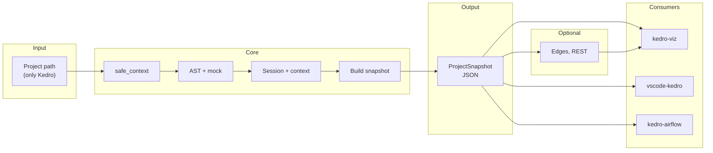
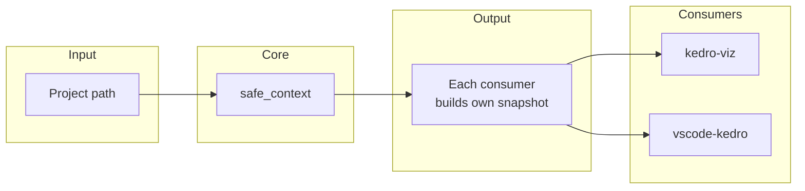
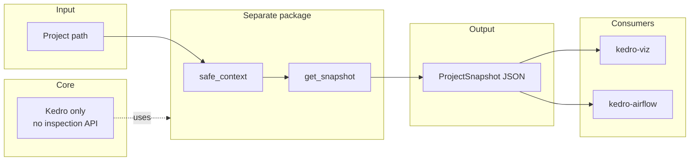
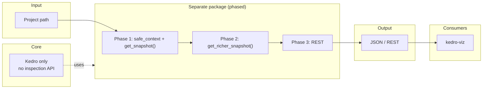

# Kedro Inspection API — Architecture Discussion

**Problem:** Many consumers introspect Kedro projects by creating sessions or duplicating parsing logic (e.g., kedro-viz lite mode, kedro-inspect). This is fragile and duplicates effort.

**Proposal:** Kedro-native snapshot design + `safe_context` (dependency-free) + `get_snapshot`

**Benefits:** Single source of truth, no heavy dependencies required for inspection, enables remote use-cases (kedro server → consumers), simplifies plugins.

## Session scope and expectations

### 1. What this session is about

The intention is to give an **overall idea and design approach** for:

- **A JSON that speaks Kedro’s language** — pipelines, nodes (inputs/outputs), catalog dataset types, parameters — that users can **export from a Kedro project without installing any project dependencies** (only Kedro itself).
- **Treating this as a serialization concern:** Kedro-Viz already does something like this today (lite mode: load project without heavy deps and produce a serializable snapshot). Rather than each consumer reimplementing that, we want a **single, supported way** to produce that export from core.
- **Layering:** **Basic serialization support in Kedro core** (e.g. `safe_context` + a minimal, Kedro-native snapshot), and optionally a **richer inspect plugin** (e.g. kedro-inspect) that builds on top and caters to Viz and other plugins with extra structure (edges, layers, REST, etc.).

### 2. What we’re not locking in

This document is **not strict** on naming or on the exact Pydantic models. Class names, field names, and schema details are **proposals to discuss and modify**. The goal is to align on the design approach and contract; concrete names and models can be refined in the PRs to follow.

### 3. Existing work: AlpAribal/kedro-inspect and its gaps

A community package **[AlpAribal/kedro-inspect](https://github.com/AlpAribal/kedro-inspect)** already provides pipeline inspection: it serializes a Kedro pipeline’s node structure to JSON (function signatures, type hints, parameter-to-dataset mapping) via `bootstrap_project()` → pipeline → `InspectedPipeline.from_kedro_pipeline()`.

**Shortcomings relative to what we want:**

| Gap | Why it matters |
|-----|----------------|
| **Requires all project dependencies installed** | Uses `bootstrap_project()` and full pipeline import; fails if e.g. pandas or sklearn are missing. We need **dependency-free** export (only Kedro required). |
| **No catalog awareness** | No dataset types, no factory-pattern resolution. Consumers (Viz, IDE, Airflow) need catalog metadata without materializing datasets. |
| **No graph / execution order** | Flat list of nodes; no order. We want a snapshot that respects pipeline structure and execution order. |
| **No resolved parameters** | Only maps function params to dataset names; doesn’t resolve `parameters.yml` (OmegaConf). |
| **No project metadata** | No project name, package name, environments, config paths in the output. |

So we’re not reinventing inspection from scratch — we’re designing a **core-supported, dependency-free, Kedro-native serialization** that addresses these gaps and then allowing a richer plugin (or evolution of ideas from kedro-inspect) to sit on top. A detailed comparison is in [kedro-inspect-comparison.md](https://github.com/kedro-org/kedro/blob/spike/inspect-api/docs/inspect-docs/kedro-inspect-comparison.md).

## Architecture overview

The diagram below shows the full flow: **inspect any Kedro project with only Kedro installed** (no pandas, spark, or other project dependencies). Core provides `safe_context` (so the project can load without those dependencies) and builds a **Kedro-native ProjectSnapshot**.

**Open for discussion:** An optional **kedro-inspect** package can add richer models (e.g. edges, REST) for Viz and other plugins.



**Summary:** `safe_context` lets Kedro load the project without heavy dependencies; inside it we create a session, read pipelines and catalog config (no I/O), and return a **ProjectSnapshot** that respects execution order and stays Kedro-native; plugins can add edges/REST via an optional package.

---

## Demo

Prototype using **`kedro inspect`** CLI commands on **kedro-viz/demo-project**. The exact commands and output format are **not fixed**; the following is the kind of usage that is **achievable** with the inspection API:

| Command | What it gives |
|--------|----------------|
| **`kedro inspect`** | Entire project snapshot (metadata, pipelines, nodes, datasets, parameters) — e.g. written to `inspect_snapshot.json` or printed as JSON. |
| **`kedro inspect pipelines`** | Pipelines snapshot only (list of pipelines with id, name, nodes in execution order). |
| **`kedro inspect metadata`** | Project metadata snapshot only (project_name, project_path, package_name, kedro_version, source_dir, environments, config_paths). |
| **`kedro inspect datasets`** | Dataset snapshot only (dataset name → type, is_free_input; resolved from catalog config, no materialization). |

This demo shows that a single, dependency-free entry point can expose the full snapshot or scoped views (pipelines, metadata, datasets) for tools like kedro-viz and other consumers.

### Usage

**CLI** (run from the project root; requires `pip install kedro[inspect]` for the optional pydantic dependency):

```bash
# Full snapshot → inspect_snapshot.json (default)
kedro inspect

# Custom output path and environment
kedro inspect -o /tmp/my_snapshot.json --env production
kedro inspect -o report.json -e staging
```

**Python API:**

```python
from kedro.inspection import get_snapshot

# Full snapshot (default env: local)
snapshot = get_snapshot("/path/to/kedro/project")

# With environment and optional pipeline filter
snapshot = get_snapshot(
    "/path/to/kedro/project",
    env="production",
    pipeline_id="data_science",  # only this pipeline
)

# Snapshot is a Pydantic model; use .model_dump() for JSON
data = snapshot.model_dump()
# Or: metadata, pipelines, datasets, parameters, has_missing_deps, mocked_dependencies
print(snapshot.metadata.project_name, len(snapshot.pipelines), "pipelines")
```

**Note:** The inspection API and `kedro inspect` require pydantic. Install with `pip install kedro[inspect]`; without it, using inspection raises an actionable error.

---

## Alternatives (for discussion)

Three options for **where** the inspection capability lives and how it evolves. Choose one to align on; naming and models remain open.

### Alternative 1: Only safe_context in core

**Core:** Kedro adds only `safe_context(project_path, package_name)` so that pipeline loading works without project dependencies (AST-scan + mock). No snapshot API, no Pydantic models in core.

**Snapshot:** Each consumer (kedro-viz, vscode-kedro, etc.) builds its own snapshot from session/context/catalog inside `safe_context`. No shared JSON schema from Kedro.



**Pros:** Minimal core surface; one reusable primitive.
**Cons:** Duplicated snapshot logic and no common JSON contract.

### Alternative 2: safe_context + get_snapshot() in a separate package

**Core:** No inspection API in Kedro. A **separate package** (e.g. kedro-inspect) provides both:
- A way to run session/context loading without project deps (safe_context or equivalent), and
- `get_snapshot()` that returns a Kedro-native snapshot (e.g. Pydantic) and thus exportable JSON.

Consumers depend on this package for dependency-free JSON export; core stays unchanged.



**Pros:** Core stays minimal; one package owns the full story.
**Cons:** Package must own or duplicate the “safe load” logic; no first-party contract from Kedro.


### Alternative 3: Phase-wise — safe_context + get_snapshot() + get_richer_snapshot() + REST in a separate package

Same as Alternative 2, but the **separate package** is developed in **phases**:

- **Phase 1:** safe_context + get_snapshot() → Kedro-native JSON (as in Alt 2).
- **Phase 2:** get_richer_snapshot() (or equivalent) — richer models (edges, layers, modular pipelines) for Viz and other plugins.
- **Phase 3:** REST support (e.g. `/inspect/snapshot`, `/inspect/pipelines`) so non-Python consumers can get the same JSON without running Python.

Core still has no inspection API; the package delivers the full roadmap over time.



**Pros:** Clear roadmap; core untouched; one package for inspection + REST.
**Cons:** “Safe load” and snapshot contract live outside core; no first-party Kedro schema.


## Summary

| Topic | Message for the session |
|-------|--------------------------|
| **ProjectSnapshot** | Kedro-native only: pipelines, nodes (inputs/outputs), datasets (name→type), parameters. No Edge/layer in core; those are derived or live in kedro-inspect. |
| **safe_context** | Enables loading session/context without project dependencies (AST + mock). Belongs in core so one contract, no duplication, and it evolves with Kedro. |
| **get_snapshot** | Works with only Kedro installed: safe_context + session + config_resolver (no catalog.get()). Delivers the “inspect without running” guarantee. |
| **kedro-inspect package** | Holds richer, consumer-oriented models (Edges, layers, modular pipelines). Core stays minimal; Viz/plugins use kedro-inspect or derive from core snapshot. |
| **Pydantic** | Stricter contract: stable fields, serialization, validation, and clear evolution. Snapshot is a committed API, not an ad-hoc dict. |
| **Alternatives** | Three options: (1) Only safe_context in core; (2) safe_context + get_snapshot() in a separate package; (3) Phase-wise safe_context + get_snapshot() + get_richer_snapshot() + REST in a separate package. |

---

## Additional information (Self read)

The following sections are for reference and self-reading after the session: ProjectSnapshot design, safe_context, get_snapshot, the kedro-inspect package, and why we use a stricter (Pydantic) contract.

### 1. ProjectSnapshot: Kedro-native design

The snapshot should speak **Kedro’s language**: pipelines, nodes, **inputs/outputs** (dataset and parameter names), catalog dataset types, and parameters. It should **not** bake in UI/graph concepts like “edges” or “layers,” which are Kedro-Viz-specific.

### Kedro concepts we mirror

| Kedro concept | Meaning | Snapshot equivalent |
|---------------|---------|----------------------|
| **Pipeline** | Collection of nodes | One PipelineSnapshot entry per registered pipeline |
| **Node** | Function + `inputs` / `outputs` (dataset/param names) | NodeSnapshot with `inputs`, `outputs`, `tags`, `namespace` |
| **Data dependency** | “Output of node A is input of node B” | **Implicit**: derived from node `inputs`/`outputs`, not a separate “edge” type |
| **DataCatalog** | Dataset name → config (type, etc.) | Map of dataset name → resolved type string (no materialization) |
| **Parameters** | Resolved from `parameters.yml` (OmegaConf) | Resolved key–value map (e.g. per-node or global) |
| **Execution order** | `Pipeline.nodes` (topological order) | `PipelineSnapshot.nodes` **must** preserve this order |

So in core we avoid **Edge** as a first-class concept. Connectivity is “node A has `outputs = ["X"]`, node B has `inputs = ["X"]`” → dependency A → B. Plugins (e.g. Kedro-Viz) can derive edges/graph from this.

### Kedro-native Pydantic models (core, as implemented)

```python
from typing import Any
from pydantic import BaseModel


# ---------- Metadata (project-level) ----------

class ProjectMetadataSnapshot(BaseModel):
    """Kedro project identity and layout — from pyproject.toml / settings."""
    project_name: str
    project_path: str
    package_name: str
    kedro_version: str
    source_dir: str
    environments: list[str]
    config_paths: list[str]


# ---------- Node (Kedro Node → serializable summary) ----------

class NodeSnapshot(BaseModel):
    """
    One node in a pipeline. inputs/outputs are dataset or parameter names.
    Data dependencies are implicit from inputs/outputs.
    """
    name: str
    namespace: str | None = None
    tags: list[str] = []
    inputs: list[str] = []
    outputs: list[str] = []
    confirms: list[str] = []


# ---------- Pipeline (Kedro Pipeline → serializable summary) ----------

class PipelineSnapshot(BaseModel):
    """
    One registered pipeline. nodes list order is execution order (topological).
    """
    id: str
    name: str
    nodes: list[NodeSnapshot]
    inputs: list[str] = []
    outputs: list[str] = []
    parameters: list[str] = []
    tags: list[str] = []
    namespace: str | None = None
    prefix_datasets_with_namespace: bool = True


# ---------- Catalog (dataset name → type, no materialization) ----------

class DatasetConfigSnapshot(BaseModel):
    """Resolved catalog entry: type string only (from config_resolver). No I/O."""
    name: str
    type: str
    is_free_input: bool = False


# ---------- Top-level snapshot (Kedro-native) ----------

class ProjectSnapshot(BaseModel):
    """
    Complete snapshot: pipelines, nodes, catalog dataset types, and parameters.
    parameters holds actual resolved values (from parameters.yml via OmegaConf).
    """
    metadata: ProjectMetadataSnapshot
    pipelines: list[PipelineSnapshot]
    datasets: dict[str, DatasetConfigSnapshot]
    parameters: dict[str, Any]   # resolved values (OmegaConf-merged)
    has_missing_deps: bool = False
    mocked_dependencies: list[str] = []
```

### What we deliberately omit in core

- **Edges** — Derived from `NodeSnapshot.inputs` / `outputs`: for each (node, output_name), find nodes whose `inputs` contain `output_name`. Keeps core snapshot Kedro-native; Viz/plugins add “edges” as a view.
- **Layers** — From `metadata["kedro-viz"]["layer"]`; Viz-specific.
- **Modular pipelines (tree)** — Built from `node.namespace` for UI; Viz-specific.

This gives a **strict, Kedro-only contract** in core; richer, UI-oriented models live in a separate package.

### 2. safe_context: what it is and why it belongs in Kedro core

### What `safe_context` is

`safe_context(project_path, package_name)` is a **context manager** that:

1. **AST-scans** the project (e.g. `src/<package>/pipelines/**/*.py`) to find imports that would be used when the pipeline modules load (e.g. `pandas`, `sklearn`).
2. **Mocks missing modules** by putting `MagicMock` (or similar) into `sys.modules` for those names, so `import pandas` does not fail.
3. **Yields** control so the caller can run `KedroSession.create()` and `load_context()` inside the context. No `catalog.get()` or `catalog.load()` is called — only config resolution (e.g. `config_resolver.resolve_pattern(dataset_name)` to get dataset type strings).

Result: the project’s **pipelines and catalog config** can be loaded and inspected **without** installing heavy or optional dependencies (pandas, spark, etc.); only Kedro (and its own dependencies) are required.

### Why it belongs in **Kedro core** (not only in a plugin)

| Reason | Explanation |
|--------|-------------|
| **Single place for “load project without deps”** | Kedro-Viz already implements a “lite” variant of this (AST + mocks). vscode-kedro and other tools need the same guarantee. Putting it in core avoids duplication and keeps behavior consistent. |
| **Tight coupling to Kedro’s loading** | The moment you call `KedroSession.create()` and import the project’s `pipeline_registry`, the project’s imports run. Core is the only layer that can reliably define “how we safely create a session when the project has optional dependencies.” |
| **Stability and upgrades** | If session creation or config loading changes in Kedro, the safe path must evolve in lockstep. That’s much easier if the safety net lives next to session/context code. |
| **Contract for “inspect without running”** | Core can document: “Use `safe_context` when you need to load context without materializing datasets.” Plugins then depend on a single, supported contract instead of reimplementing it. |

So: **safe_context is the minimal “enable inspection without project dependencies” primitive**. It belongs in core; richer snapshot types or REST can sit in a separate package (see alternatives).

### 3. get_snapshot: working with only Kedro installed

### Goal

`get_snapshot()` (or `inspect_project()`) should produce a **ProjectSnapshot** (or equivalent) for a project **without** requiring that project’s dependencies (pandas, spark, etc.) to be installed — **only Kedro** (and its own dependencies) are required.

### How it works (conceptually)

```
get_snapshot(project_path, env=..., extra_params=...)
│
├── 1. safe_context(project_path, package_name)
│      → AST-scan for missing imports; patch sys.modules with mocks
│
├── 2. Inside the context:
│      session = KedroSession.create(project_path, env=env, ...)
│      context = session.load_context()
│      catalog = context.catalog
│      params = context.params
│
├── 3. Build snapshot WITHOUT materializing:
│      - Pipelines: from context (or pipeline registry) → list of PipelineSnapshot
│      - Nodes: from each pipeline.nodes → NodeSnapshot (name, inputs, outputs, tags, namespace)
│      - Datasets: for each dataset name, catalog.config_resolver.resolve_pattern(name) → type string
│      - Parameters: from context.params (already resolved by OmegaConf)
│      NEVER: catalog.get(name) or catalog.load()
│
└── 4. Return ProjectSnapshot (and set has_missing_deps if any module was mocked)
```

So:

- **Only Kedro** (and what Kedro pulls in) is required on the environment.
- **Project-specific libs** (pandas, sklearn, etc.) are **optional** for inspection; if missing, they are mocked so pipeline discovery and config resolution still succeed.
- **No I/O** — no dataset materialization, so no need for AbstractDataset or any dataset implementation to be installed.

This is the “lightweight” guarantee: **inspect any Kedro project with just Kedro installed.**

### 4. Why a separate kedro-inspect package (richer models for Viz and plugins)

Core keeps a **Kedro-native** snapshot (pipelines, nodes with inputs/outputs, dataset types, parameters). Many consumers (especially Kedro-Viz) need **richer, UI/graph-oriented** models. A separate **kedro-inspect** package is a good place for those.

### What could live in kedro-inspect

| In core (Kedro-native) | In kedro-inspect (richer, consumer-oriented) |
|------------------------|-----------------------------------------------|
| `NodeSnapshot` (inputs, outputs, tags, namespace) | **Edge** (source_node_id, target_node_id) — explicit graph edges for Viz |
| `PipelineSnapshot` (id, name, nodes) | **PipelineGraph** (nodes + edges + tags as first-class) |
| `DatasetConfigSnapshot` (name, type, is_free_input) | **DatasetInfo** (layer, metadata, definition_file/line, transcoded_versions) |
| No “layers” | **Layer** ordering, modular pipeline tree (from namespace) |
| No node “extras” | **NodeExtras** (source location, docstring, preview hooks) |

### Why separate

- **Core stays stable and Kedro-only** — no UI/graph concepts in Kedro’s public inspection contract.
- **Viz and plugins own their schema** — they can add fields, version their API, and depend on `kedro-inspect` (or build on core snapshot and add edges/layers in their own code).
- **Optional dependency** — tools that only need “pipelines + nodes + catalog types” depend only on Kedro; tools that need edges/layers/docs depend on `kedro-inspect` or build on top of core snapshot.

So: **core = minimal, Kedro-native snapshot + safe_context (+ optionally get_snapshot)**. **kedro-inspect = richer Pydantic models (Edges, layers, etc.) and helpers that consume core snapshot and produce Viz/plugin-ready structures.**

### 5. Why a stricter contract (Pydantic models)

Using **Pydantic** (or another strict schema) for the snapshot gives:

| Benefit | Explanation |
|---------|-------------|
| **Stable API** | Field names and types are part of the contract. Consumers (Viz, vscode-kedro, kedro-airflow) can rely on `snapshot.pipelines[].nodes[].inputs` and version against it. |
| **Serialization** | JSON (and REST) come for free; no ad-hoc `to_dict()` or custom serializers. Same model works for Python API and HTTP. |
| **Validation** | Invalid or missing data is caught at the boundary; no “half-built” snapshots with wrong types. |
| **Documentation** | The model IS the spec: IDs, optional fields, and nesting are explicit. |
| **Evolution** | New optional fields can be added without breaking existing consumers; required changes can be done in a major version. |

So the “stricter contract” is: **the snapshot is not an arbitrary dict or loose dataclass — it’s a well-defined Pydantic model (or equivalent) that Kedro commits to.** That makes it safe for multiple consumers and for REST/CLI output.
