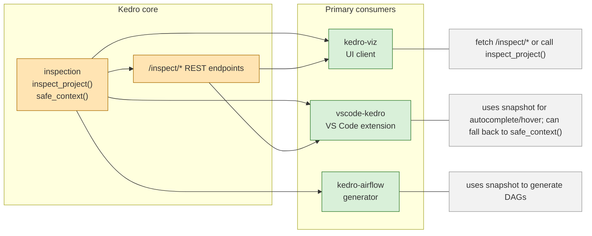

# Kedro Inspection API - Draft

## Goal

**Problem:** Many consumers introspect Kedro projects by creating sessions or duplicating parsing logic (e.g., `kedro-viz` lite mode). This is fragile and duplicates effort.

**Proposal:** Provide a core `kedro.inspection.inspect_project()` API + `safe_context()` (lite_shim) and REST `/inspect/*` endpoints so consumers can rely on a single, safe snapshot of project structure.

**Benefits:** Single source of truth, no heavy deps required for inspection, enables remote use-cases (kedro server → consumers), simplifies plugins.

---

## Architecture



---

## Core design principles

- Use Kedro's framework (KedroSession, OmegaConf, CatalogConfigResolver) but with a safety net.
- Never materialize datasets during inspection; use `config_resolver.resolve_pattern()` to extract dataset types.
- Provide `safe_context()` (i.e.,`lite_shim`) that AST-scans for missing dependencies and patches `sys.modules` with mocks so imports succeed.
- Return a serializable `ProjectSnapshot` Pydantic model (no live Kedro objects).

For full design rationale and model definitions see: [docs/kedro-inspect-core.md](docs/kedro-inspect-core.md).

---

## `inspect_project()` internals

```text
1. AST-scan project for missing deps (LiteParser)
2. Patch sys.modules with MagicMock for missing deps (safe_context)
3. Create KedroSession and load context (no catalog.get())
4. Use CatalogConfigResolver to resolve dataset "type" strings
5. Extract pipelines → PipelineInfo, NodeInfo, EdgeInfo, DatasetInfo
6. Return ProjectSnapshot
```

---

## Proposed module layout

- `kedro/inspection/__init__.py` → `inspect_project()` public API
- `kedro/inspection/models.py` → Pydantic models: `ProjectSnapshot`, `PipelineInfo`, `NodeInfo`, `DatasetInfo`
- `kedro/inspection/snapshot.py` → session → snapshot builder
- `kedro/inspection/lite_shim.py` → `safe_context()` (AST-scan + `sys.modules` mocks)
- `kedro/inspection/utils.py` → helpers (param detection, hashing)

---

## Snapshot summary (fields)

- `metadata`: project_name, package_name, project_path, kedro_version, source_dir, environments, config_paths
- `pipelines`: id, name, nodes, edges, tags
- `NodeInfo`: id, name, type (task/data/parameters), tags, namespace, inputs, outputs, dataset_type
- `DatasetInfo`: name, resolved_type_string, metadata

---

## Consumer mapping — primary consumers

| Consumer | How it consumes today | How it should consume with `inspect_project()` |
|---|---:|---|
| `kedro-airflow` | imports pipelines, builds DAGs by creating sessions | read `snapshot.pipelines`, `NodeInfo.inputs/outputs` → build DAGs remotely |
| `kedro-viz` | local sessions + duplicated lite parsing + previews | call `inspect_project()` or fetch `/inspect/*`; keep a small preview sandbox for materialization |
| `vscode-kedro` | VS Code extension that introspects projects via the user's Python environment or lightweight parsing | Prefer `inspect_project()` for reliable, environment-agnostic snapshots; fall back to `safe_context()` local parsing when running inside the editor |

---

Detailed consumer analysis and summary: [docs/kedro-inspect-consumer-analysis.md](docs/kedro-inspect-consumer-analysis.md), [docs/kedro-inspect-consumer-summary.md](docs/kedro-inspect-consumer-summary.md).

## Key REST endpoints

| Endpoint | Purpose |
|---|---|
| `GET /inspect/snapshot` | Full `ProjectSnapshot` JSON (all pipelines) |
| `GET /inspect/pipelines` | Lightweight list of pipelines (id, name, node counts) |
| `GET /inspect/pipelines/{id}` | Pipeline-specific snapshot (nodes, edges) |
| `GET /inspect/config/{type}` | Config inspection (Phase 2) |

---

REST API details and example payloads: [docs/kedro-inspect-rest-api.md](docs/kedro-inspect-rest-api.md).

## Migration checklist

- [ ] Add `kedro.inspection` package with `inspect_project()` and `lite_shim.py` in core/dedicated plugin
- [ ] Update `kedro-viz`: remove `lite_parser.py`, adapt `data_access/managers.py` to accept `ProjectSnapshot`
- [ ] Add REST endpoints to `kedro server` plugin to expose `/inspect/*`
- [ ] Update `kedro-airflow` to read snapshot in generator CLI (opt-in)
- [ ] Update `vscode-kedro`: adopt `inspect_project()` for autocomplete/hover or support REST backend for read-only features (opt-in)
- [ ] Add tests: snapshot serialization, lite_shim mocking correctness, consumer integration tests

### Why other plugins are not recommended to integrate the inspection API

- `kedro-telemetry`: runs inside an active Kedro session via hooks and needs ultra-low-latency aggregate metrics on every CLI run; creating an out-of-session snapshot would add unnecessary overhead and duplicate existing session data flows.
- `kedro-mlflow`: is a runtime augmentation plugin that requires live `Pipeline`, `DataCatalog`, and hook-managed objects; snapshot data cannot replace its need for runtime instrumentation and dataset materialization.
- `kedro-docker`: treats the project as an opaque filesystem artifact and delegates runtime behavior to `kedro run` inside containers; it does not benefit from structural inspection beyond optional metadata.

---

## Next steps

- Create a minimal prototype for `kedro.inspection` and a `kedro-viz` migration patch.
