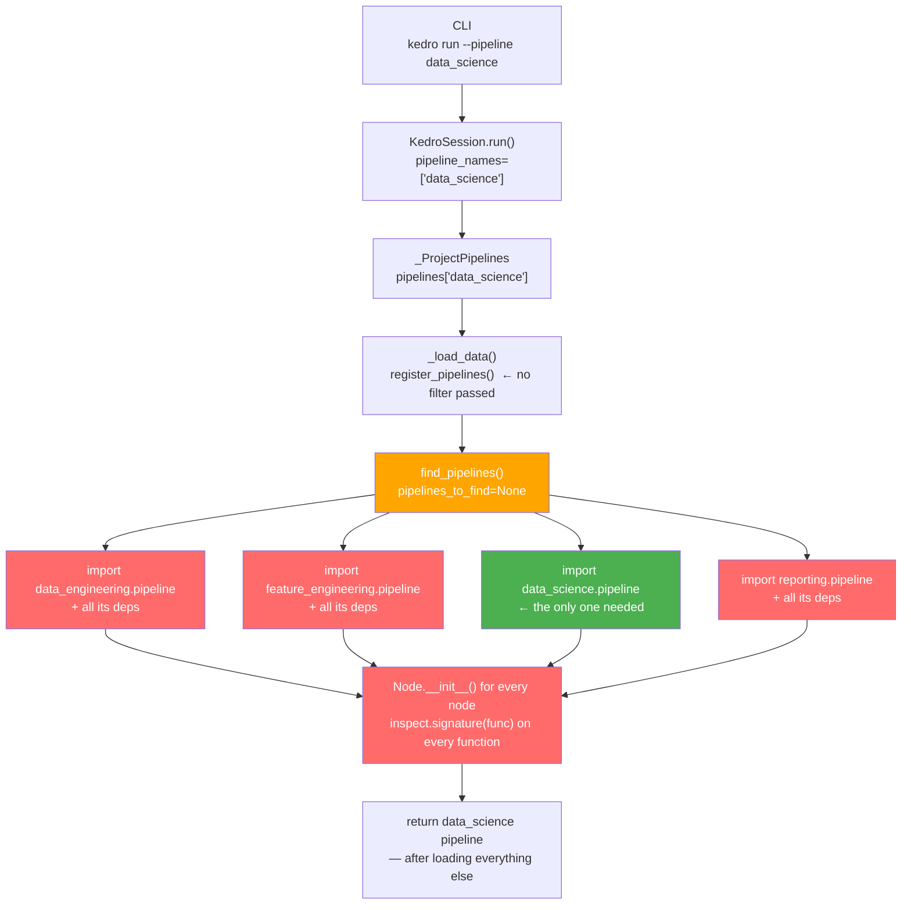

# On-Demand Project Dependency Loading — Overview

**Spike:** [#5406](https://github.com/kedro-org/kedro/issues/5406)

**Goal:** Reduce unnecessary dependency loading across CLI commands, targeted runs, and inspection workflows.

---

## 1. Problem Statement

This spike addresses two distinct scenarios with different root causes and solutions.

### Scenario 1 — Selective Pipeline Loading

When a user runs `kedro run --pipeline data_science`, Kedro imports every pipeline module in the project — including unrelated pipelines. The selective loading capability already exists via `find_pipelines(pipelines_to_find=...)` from [PR #5401](https://github.com/kedro-org/kedro/pull/5401), but it is never wired to the CLI `--pipeline` flag automatically.

### Scenario 2 — CLI Commands Without Project Dependencies

Read-only CLI commands (`kedro registry list`, `kedro registry describe`, `kedro catalog describe-datasets`, inspection API) do not execute node functions. They should be able to return pipeline metadata even when heavy project dependencies (sklearn, torch, seaborn) are not installed. Today they require a full pipeline load, which transitively imports all dependencies.

---

## 2. Current Architecture

### How a `kedro run` Triggers Full Dependency Loading Today



**Key problem:** `find_pipelines()` receives no filter, so it imports every pipeline directory even though only `data_science` was requested. The unused pipelines (red) are fully loaded before the result is returned.

---

## 3. Root Cause Analysis

### `_ProjectPipelines._load_data()` — Pipeline Level

```python
# kedro/framework/project/__init__.py
def _load_data(self) -> None:
    if self._pipelines_module is None or self._is_data_loaded:
        return

    register_pipelines = self._get_pipelines_registry_callable(
        self._pipelines_module
    )
    # ❌ No filter passed — always loads EVERYTHING
    project_pipelines = register_pipelines()

    self._content = project_pipelines
    self._is_data_loaded = True
```

The selective loading capability **already exists** in `find_pipelines(pipelines_to_find=...)` from PR #5401, but `_load_data()` never passes a filter through.

### Missing project dependencies at module load time — Import Level

Even when `_load_data()` correctly filters which pipelines to load, importing `pipeline_registry.py` triggers the full import chain for every pipeline referenced at the top level:

```python
# pipeline_registry.py — top-level import fires immediately
from my_project.pipelines.reporting import create_pipeline
#   → reporting/pipeline.py → from .nodes import train_model
#   → reporting/nodes.py   → import seaborn  ← ModuleNotFoundError
```

This happens before `register_pipelines()` is even called — before any filter can intervene.

---

**Solution details:**
- [Scenario 1 — Selective Pipeline Loading](scenario_1_selective_loading.md)
- [Scenario 2 — CLI Commands Without Project Dependencies](scenario_2_dep_free_commands.md)
