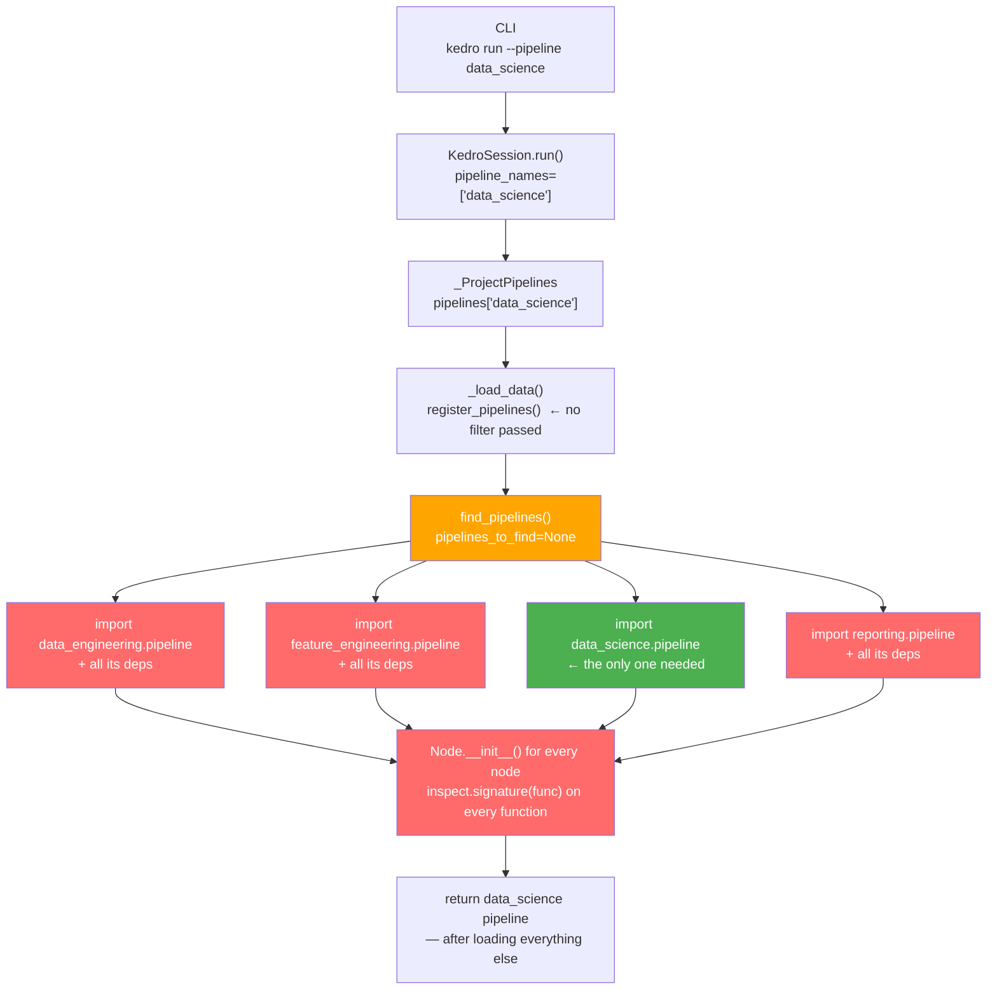
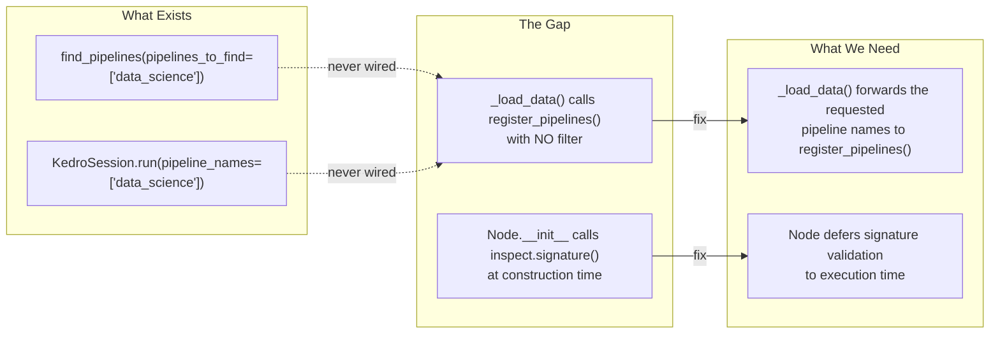

# On-Demand Project Dependency Loading

**Spike:** [#5406](https://github.com/kedro-org/kedro/issues/5406)

**Goal:** Eliminate unnecessary pipeline dependency imports across CLI commands, targeted runs, and inspection workflows.

---

## 1. Problem Statement

Kedro currently requires **all** pipeline dependencies to be installed before executing any project-specific CLI command — even when targeting a single pipeline or performing read-only inspection.

```
kedro run --pipeline data_science
```

This command today imports and instantiates **every** pipeline in the project, including `data_engineering`, `feature_engineering`, `reporting` — none of which are relevant to the run.

### Real-World Impact

| Scenario | Current Behavior | Desired Behavior |
|----------|-----------------|------------------|
| `kedro run --pipeline data_science` | All pipeline modules imported | Only `data_science` imports loaded |
| `kedro registry list` | All Pipeline objects constructed | Directory scan only — no imports |
| `kedro catalog describe-datasets -p reporting` | All pipelines loaded | Only `reporting` pipeline loaded |
| CI/CD lint/metadata check | Full dependency footprint required | Near-zero dependency footprint |
| New developer onboarding | Must install all deps to run anything | Install only the pipeline they work on |

---

## 2. Current Architecture

### How a `kedro run` Triggers Full Dependency Loading Today



**Key problem:** `find_pipelines()` receives no filter, so it imports every pipeline directory and calls `inspect.signature()` on every node function — even though only `data_science` was requested. The unused pipelines (red) are fully loaded before the result is returned.

---

## 3. Root Cause Analysis

There are **two distinct bottlenecks** at different layers of the stack:

### Bottleneck 1: `_ProjectPipelines._load_data()` — Pipeline Level

```python
# kedro/framework/project/__init__.py:211-225
def _load_data(self) -> None:
    if self._pipelines_module is None or self._is_data_loaded:
        return

    register_pipelines = self._get_pipelines_registry_callable(
        self._pipelines_module
    )
    # ❌ No filter passed — always loads EVERYTHING
    project_pipelines = register_pipelines()

    self._content = project_pipelines
    self._is_data_loaded = True
```

The selective loading capability **already exists** in `find_pipelines(pipelines_to_find=...)` from PR #5401, but `_load_data()` never passes a filter through.

### Bottleneck 2: `Node.__init__._validate_inputs()` — Function Level

```python
# kedro/pipeline/node.py:155
self._validate_inputs(func, inputs)  # called eagerly in __init__

# kedro/pipeline/node.py:683-701
def _validate_inputs(self, func, inputs):
    if not inspect.isbuiltin(func):
        # ❌ Requires func to be a live callable — the module must already be imported
        inspect.signature(func, follow_wrapped=False).bind(*args, **kwargs)
```

Every `node(my_function, ...)` call in every `create_pipeline()` body triggers `inspect.signature()`, which forces the module containing `my_function` to be fully imported.

### The Gap Visualised



---

## 4. Solutions

The gap diagram above identifies two independent problems. Each has its own fix, and both can be shipped and applied without the other.

---

### Gap 1 — Wire the filter through `_load_data()`

**Problem recap:** `_load_data()` calls `register_pipelines()` with no filter, so `find_pipelines()` imports every pipeline directory even when only one is needed. The `find_pipelines(pipelines_to_find=...)` parameter already exists but is never passed in.

**Fix:** Add `set_requested()` to `_ProjectPipelines` so callers can declare which pipelines they need before the first dict access. `_load_data()` then forwards those names to `register_pipelines()` as the `pipelines_to_find` kwarg.

#### a. Add `set_requested()` and update `_load_data()` — `kedro/framework/project/__init__.py`

```python
class _ProjectPipelines(MutableMapping):
    def __init__(self) -> None:
        self._pipelines_module: str | None = None
        self._is_data_loaded = False
        self._content: dict[str, Pipeline] = {}
        self._requested_pipelines: list[str] | None = None  # NEW

    def set_requested(self, pipeline_names: list[str] | None) -> None:
        """Hint which pipelines will be needed before first data access.

        Must be called before any dict-access on this object. If the filter
        changes after data has been loaded, the cache is invalidated.
        """
        if self._requested_pipelines != pipeline_names:
            self._is_data_loaded = False
            self._content = {}
        self._requested_pipelines = pipeline_names

    def _load_data(self) -> None:
        if self._pipelines_module is None or self._is_data_loaded:
            return

        register_pipelines = self._get_pipelines_registry_callable(
            self._pipelines_module
        )
        try:
            project_pipelines = register_pipelines(
                pipelines_to_find=self._requested_pipelines  # NEW — pass the filter
            )
        except TypeError:
            # Fallback: custom register_pipelines doesn't accept kwargs
            project_pipelines = register_pipelines()

        self._content = project_pipelines
        self._is_data_loaded = True
```

#### b. Wire `KedroSession.run()` to call `set_requested()` before any dict access — `kedro/framework/session/session.py`

```python
def run(self, pipeline_names: list[str] | None = None, ...) -> dict[str, Any]:
    ...
    names = pipeline_names or ["__default__"]

    pipelines.set_requested(names)  # NEW — must happen before pipelines[name]

    combined_pipelines = Pipeline([])
    for name in names:
        combined_pipelines += pipelines[name]  # only loads requested ones
```

With these two changes, `kedro run --pipeline data_science` imports only `data_science/pipeline.py` — `data_engineering`, `feature_engineering`, and `reporting` are never touched.

#### c. Wire CLI commands that take `--pipeline` to call `set_requested()`

Every CLI command that accepts a `--pipeline` argument should call `set_requested()` before any pipeline access, so `_load_data()` has the filter ready. `kedro registry list` is special — it only needs names, so it gets a zero-import `list_names()` method instead.

| Command | Change | Result |
|---------|--------|--------|
| `kedro run --pipeline X` | `set_requested()` called inside `KedroSession.run()` (section b above) | Only X loaded |
| `kedro catalog describe-datasets -p X` | `set_requested(["X"])` before session creation | Only X loaded |
| `kedro catalog resolve-patterns -p X` | `set_requested(["X"])` before session creation | Only X loaded |
| `kedro registry describe X` | `set_requested(["X"])` before `pipelines.get(name)` | Only X loaded |
| `kedro registry list` | Use new `list_names()` — directory scan, no imports | Zero imports |
| `inspection: get_project_snapshot(pipeline_names=["X"])` | `set_requested(["X"])` before pipeline dict access | Only X loaded |
| `kedro info`, `kedro package`, `kedro catalog list-patterns` | No change needed — never access `pipelines` | Unchanged |

The pattern is identical for every command that takes `--pipeline`. Using `kedro catalog describe-datasets` as the representative example:

```python
# kedro/framework/cli/catalog.py — BEFORE
def describe_datasets(metadata, pipeline, env):
    session = _create_session(metadata.package_name, env=env)
    datasets_dict = context.catalog.describe_datasets(pipeline or None)
    secho(yaml.dump(datasets_dict))

# kedro/framework/cli/catalog.py — AFTER
def describe_datasets(metadata, pipeline, env):
    if pipeline:
        from kedro.framework.project import pipelines as _pipelines
        _pipelines.set_requested(pipeline)  # one line before session creation
    session = _create_session(metadata.package_name, env=env)
    datasets_dict = context.catalog.describe_datasets(pipeline or None)
    secho(yaml.dump(datasets_dict))
```

`kedro registry list` uses `list_names()` instead — a pure filesystem scan with zero imports

```python
# kedro/framework/project/__init__.py

def list_names(self) -> list[str]:
    """Return pipeline names by scanning the filesystem — no imports."""
    spec = importlib.util.find_spec(PACKAGE_NAME)
    if spec is None or spec.origin is None:
        return list(self.keys())  # fallback to full load

    pipelines_path = Path(spec.origin).parent / "pipelines"
    if not pipelines_path.is_dir():
        return list(self.keys())  # non-standard layout — fallback

    names = [
        d.name for d in pipelines_path.iterdir()
        if d.is_dir() and not d.name.startswith(".") and d.name != "__pycache__"
    ]
    return sorted(["__default__", *names])
```

```python
# kedro/framework/cli/registry.py — AFTER
@registry.command("list")
def list_registered_pipelines() -> None:
    click.echo(yaml.dump(pipelines.list_names()))  # zero imports
```

> **Limitation — custom `register_pipelines` that constructs all pipelines unconditionally**
>
> This fix only delivers selective loading for projects using the default `find_pipelines()` layout. Projects with a hand-written `register_pipelines` that eagerly constructs every pipeline at the top of the function receive no benefit:
>
> ```python
> def register_pipelines() -> Dict[str, Pipeline]:
>     ingestion_pipeline = di.create_pipeline()    # ← imports di + all its deps
>     feature_pipeline   = fe.create_pipeline()    # ← imports fe + all its deps
>     modelling_pipeline = mod.create_pipeline()   # ← imports sklearn etc.
>     reporting_pipeline = rep.create_pipeline()   # ← imports matplotlib etc.
>     return {"data_ingestion": ingestion_pipeline, ...}
> ```
>
> Two reasons it fails for this pattern:
> 1. The function doesn't accept `pipelines_to_find`, so `_load_data()` hits `TypeError` and falls back to `register_pipelines()` with no filter — same behaviour as today.
> 2. Even if the kwarg were accepted, all pipeline modules are already imported unconditionally before any filter could be applied.
>
> **Options for affected projects:**
> - Switch to the default `find_pipelines()` layout (recommended for new projects).
> - Rely on the Gap 2 fix (lazy `inspect.signature` / string node references), which defers function-module imports regardless of how `register_pipelines` is structured.

---

### Gap 2 — Defer `inspect.signature()` to execution time

**Problem recap:** `Node.__init__()` calls `_validate_inputs()` immediately, which calls `inspect.signature(func)`. This forces the module containing `func` to be fully imported at pipeline construction time — even when running a completely different pipeline or just listing pipeline names.

**Fix:** Move signature validation out of `__init__()` and into `run()`, where the function's module is guaranteed to already be loaded.

#### a. Defer `_validate_inputs()` to `Node.run()` — `kedro/pipeline/node.py`

```python
# BEFORE — eager validation at construction
def __init__(self, func, inputs, outputs, ...):
    ...
    self._validate_inputs(func, inputs)  # ← runs immediately, imports func's module
    self._func = func

# AFTER — deferred validation at first run
def __init__(self, func, inputs, outputs, ...):
    ...
    self._func = func
    self._inputs = inputs
    self._inputs_validated = False  # NEW
    # Structural checks that don't need imports still run eagerly:
    self._validate_unique_outputs()
    self._validate_inputs_dif_than_outputs()

def run(self, inputs: dict[str, Any]) -> dict[str, Any]:
    if not self._inputs_validated:
        self._validate_inputs(self._func, self._inputs)  # func's module loaded by now
        self._inputs_validated = True
    ...
```

For contexts that want eager validation (e.g. `kedro run --dry-run` or test suites), expose an explicit method:

```python
def validate(self) -> None:
    """Validate node inputs against the function signature.

    Called automatically on first run(). Can be called earlier for
    eager validation, e.g. during a dry-run or test suite setup.
    """
    self._validate_inputs(self._func, self._inputs)
    self._inputs_validated = True
```

#### b. String function references in `Node` (future)

Accept a dotted string path as `func`, deferring both the import and signature inspection until execution:

```python
# kedro/pipeline/node.py — future

class Node:
    def __init__(self, func: Callable | str, inputs, outputs, ...):
        if isinstance(func, str):
            self._func_path = func
            self._func: Callable | None = None
            # No import, no inspect.signature — deferred entirely
        else:
            self._func_path = None
            self._func = func
            self._validate_inputs(func, inputs)  # still eager for live callables

    @property
    def func(self) -> Callable:
        """Resolve the function, importing its module on first access."""
        if self._func is None:
            module_path, func_name = self._func_path.rsplit(".", 1)
            module = importlib.import_module(module_path)
            self._func = getattr(module, func_name)
        return self._func

    def run(self, inputs):
        result = self.func(...)  # .func resolves + imports here
```

Usage:

```python
# BEFORE — eager import at module load
from my_project.pipelines.data_science.nodes import train_model

def create_pipeline(**kwargs):
    return pipeline([node(train_model, inputs="X_train", outputs="model")])

# AFTER — deferred via string reference
def create_pipeline(**kwargs):
    return pipeline([
        node(
            "my_project.pipelines.data_science.nodes.train_model",
            inputs="X_train",
            outputs="model",
        )
    ])
```

> This is a **potential breaking API change**. Key design questions: backwards compatibility with live callables (must be unchanged), error surfacing (import errors surface at `node.run()` not at `Pipeline()` construction — needs clear messages), `node.name` auto-derivation (today from `func.__name__`, needs a fallback), IDE/type-checking support (string paths lose navigation), and `kedro-viz`/inspection tool compatibility.

**What each fix defers:**

| Fix applied | `kedro run --pipeline X` | Non-run commands (e.g. `registry describe X`) |
|-------------|--------------------------|-----------------------------------------------|
| Gap 1 only | Only X's `pipeline.py` loaded; X's deps (e.g. `sklearn`) still import at construction | Same — only X's deps needed; other pipelines' deps not required |
| Gap 1 + Gap 2a | Only X's `pipeline.py` loaded; X's deps still import at construction; `inspect.signature()` deferred to `node.run()` | Only X's deps needed; `inspect.signature()` **never runs at all** (nodes are never executed) |
| Gap 1 + Gap 2a + Gap 2b | Nothing loads until `node.run()` — X's deps deferred to execution | X's deps never load for commands that don't execute nodes |

**Key takeaway for non-run commands:** Gap 1 alone already means you only need the specific pipeline's dependencies installed — not all pipelines'. Gap 2a gives an additional bonus: since non-run commands never call `node.run()`, the deferred `inspect.signature()` simply never runs at all. Full dependency freedom (zero installs required) is only achieved for `kedro registry list` via `list_names()`, since it never loads any pipeline module.
