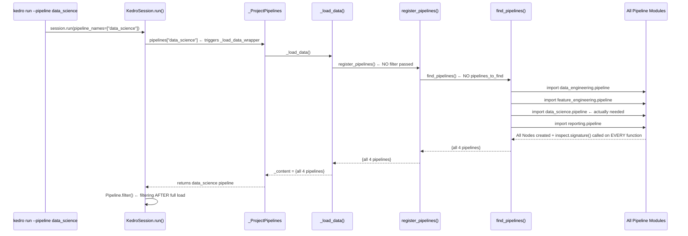
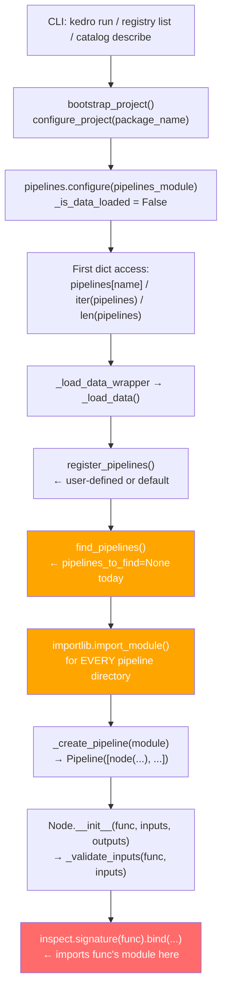
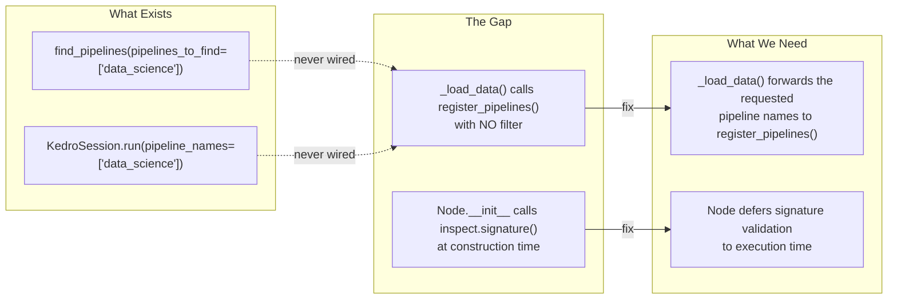
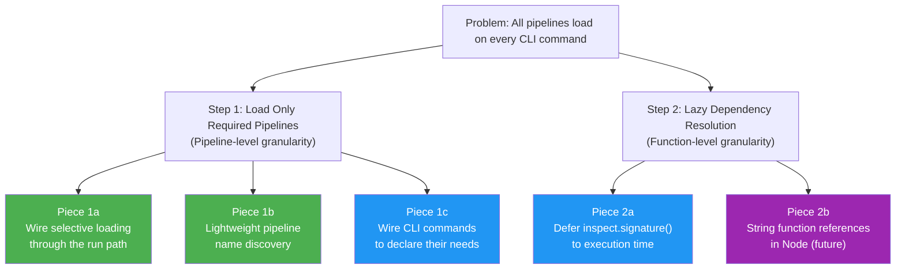
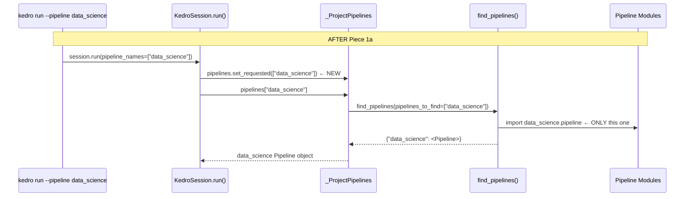
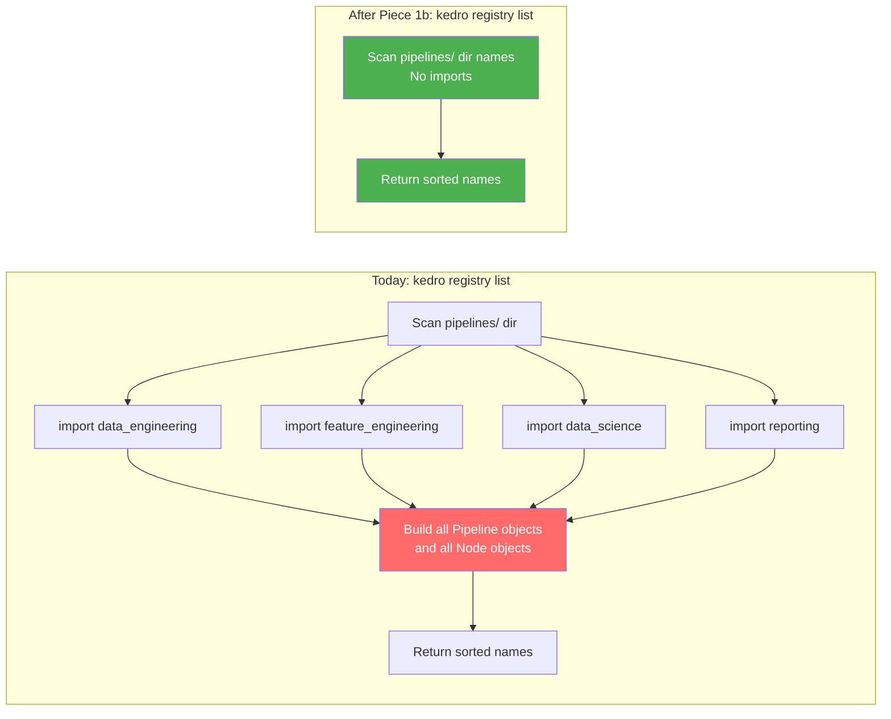
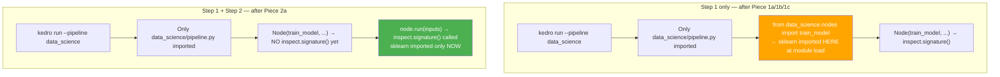
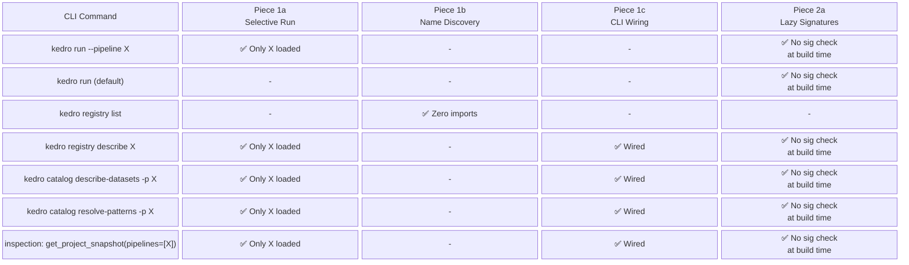
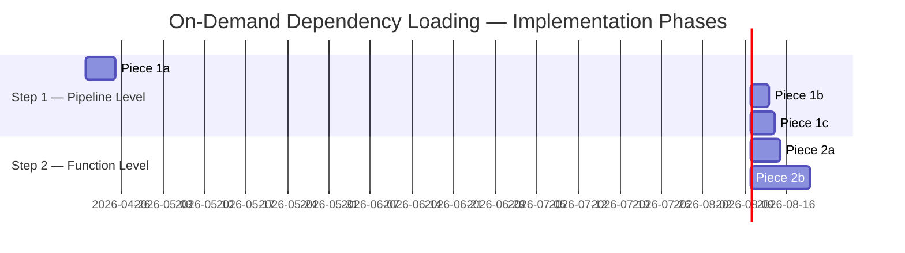
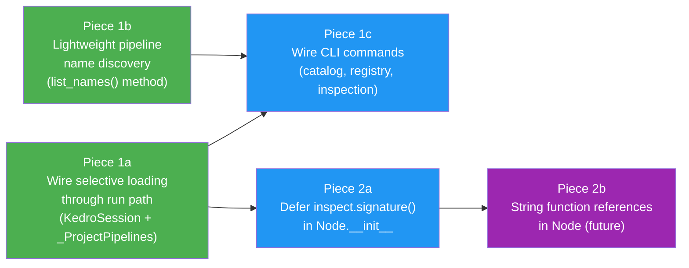

# On-Demand Project Dependency Loading

**Spike:** [#5406](https://github.com/kedro-org/kedro/issues/5406)
**Branch:** `spike/dep_free`
**Goal:** Eliminate unnecessary pipeline dependency imports across CLI commands, targeted runs, and inspection workflows.

---

## Table of Contents

1. [Problem Statement](#1-problem-statement)
2. [Current Architecture](#2-current-architecture)
3. [Root Cause Analysis](#3-root-cause-analysis)
4. [The Two-Step Strategy](#4-the-two-step-strategy)
5. [Step 1 — Load Only Required Pipelines](#5-step-1--load-only-required-pipelines)
   - [Piece 1a: Wire Selective Loading Through the Run Path](#piece-1a-wire-selective-loading-through-the-run-path)
   - [Piece 1b: Lightweight Pipeline Name Discovery](#piece-1b-lightweight-pipeline-name-discovery)
   - [Piece 1c: Wire Other CLI Commands to Declare Their Needs](#piece-1c-wire-other-cli-commands-to-declare-their-needs)
6. [Step 2 — Lazy Dependency Resolution at Node Level](#6-step-2--lazy-dependency-resolution-at-node-level)
   - [Piece 2a: Defer `inspect.signature()` to Execution Time](#piece-2a-defer-inspectsignature-to-execution-time)
   - [Piece 2b: String Function References in Node](#piece-2b-string-function-references-in-node)
7. [CLI Command Benefit Matrix](#7-cli-command-benefit-matrix)
8. [Implementation Roadmap](#8-implementation-roadmap)

---

## 1. Problem Statement

Kedro currently requires **all** pipeline dependencies to be installed before executing any project-specific CLI command — even when targeting a single pipeline or performing read-only inspection.

```
kedro run --pipeline data_science
```

This command today imports and instantiates **every** pipeline in the project, including `data_engineering`, `feature_engineering`, `reporting` — none of which are relevant to the run.

### Real-World Impact

| Scenario | Current Behavior | Desired Behavior |
|----------|-----------------|------------------|
| `kedro run --pipeline data_science` | All pipeline modules imported | Only `data_science` imports loaded |
| `kedro registry list` | All Pipeline objects constructed | Directory scan only — no imports |
| `kedro catalog describe-datasets -p reporting` | All pipelines loaded | Only `reporting` pipeline loaded |
| CI/CD lint/metadata check | Full dependency footprint required | Near-zero dependency footprint |
| New developer onboarding | Must install all deps to run anything | Install only the pipeline they work on |

---

## 2. Current Architecture

### How a `kedro run` Triggers Full Dependency Loading Today



### Pipeline Loading Call Stack



---

## 3. Root Cause Analysis

There are **two distinct bottlenecks** at different layers of the stack:

### Bottleneck 1: `_ProjectPipelines._load_data()` — Pipeline Level

```python
# kedro/framework/project/__init__.py:211-225
def _load_data(self) -> None:
    if self._pipelines_module is None or self._is_data_loaded:
        return

    register_pipelines = self._get_pipelines_registry_callable(
        self._pipelines_module
    )
    # ❌ No filter passed — always loads EVERYTHING
    project_pipelines = register_pipelines()

    self._content = project_pipelines
    self._is_data_loaded = True
```

The selective loading capability **already exists** in `find_pipelines(pipelines_to_find=...)` from PR #5401, but `_load_data()` never passes a filter through.

### Bottleneck 2: `Node.__init__._validate_inputs()` — Function Level

```python
# kedro/pipeline/node.py:155
self._validate_inputs(func, inputs)  # called eagerly in __init__

# kedro/pipeline/node.py:683-701
def _validate_inputs(self, func, inputs):
    if not inspect.isbuiltin(func):
        # ❌ Requires func to be a live callable — the module must already be imported
        inspect.signature(func, follow_wrapped=False).bind(*args, **kwargs)
```

Every `node(my_function, ...)` call in every `create_pipeline()` body triggers `inspect.signature()`, which forces the module containing `my_function` to be fully imported.

### The Gap Visualised



---

## 4. The Two-Step Strategy



**Step 1** eliminates the need to import unrelated pipeline *modules* entirely.
**Step 2** eliminates the need to import a function's *module* at pipeline definition time.

Both steps are independent and additive — Step 1 gives the biggest wins with least risk, Step 2 unlocks further gains.

---

## 5. Step 1 — Load Only Required Pipelines

### Piece 1a: Wire Selective Loading Through the Run Path

**Goal:** Activate the already-existing `find_pipelines(pipelines_to_find=...)` parameter from end to end.

**What changes:**

#### 1. Add `set_requested()` to `_ProjectPipelines`

```python
# kedro/framework/project/__init__.py

class _ProjectPipelines(MutableMapping):
    def __init__(self) -> None:
        self._pipelines_module: str | None = None
        self._is_data_loaded = False
        self._content: dict[str, Pipeline] = {}
        self._requested_pipelines: list[str] | None = None  # NEW

    def set_requested(self, pipeline_names: list[str] | None) -> None:
        """Hint which pipelines will be needed before first data access.

        Must be called before any dict-access on this object. If the filter
        changes after data has been loaded, the cache is invalidated.
        """
        if self._requested_pipelines != pipeline_names:
            self._is_data_loaded = False
            self._content = {}
        self._requested_pipelines = pipeline_names

    def _load_data(self) -> None:
        if self._pipelines_module is None or self._is_data_loaded:
            return

        register_pipelines = self._get_pipelines_registry_callable(
            self._pipelines_module
        )
        # Pass the hint as an optional kwarg — default register_pipelines
        # forwards it to find_pipelines(); custom ones can ignore it safely.
        try:
            project_pipelines = register_pipelines(
                pipelines_to_find=self._requested_pipelines
            )
        except TypeError:
            # Fallback: custom register_pipelines doesn't accept kwargs
            project_pipelines = register_pipelines()

        self._content = project_pipelines
        self._is_data_loaded = True
```

#### 2. Wire `KedroSession.run()` to set the hint before pipeline access

```python
# kedro/framework/session/session.py

def run(self, pipeline_names: list[str] | None = None, ...) -> dict[str, Any]:
    ...
    names = pipeline_names or ["__default__"]

    # NEW: inform the pipeline registry which pipelines are needed
    # before the first dict access so _load_data() can filter selectively
    pipelines.set_requested(names)

    combined_pipelines = Pipeline([])
    for name in names:
        try:
            combined_pipelines += pipelines[name]  # only loads requested ones
        except KeyError as exc:
            ...
```

#### Before / After Flow



**Impact:**
- `kedro run --pipeline data_science` imports only `data_science` module → unrelated packages (e.g. `torch`, `sklearn`) never imported
- Zero changes to the existing `find_pipelines()` implementation
- Fully backwards-compatible: custom `register_pipelines` that ignores kwargs works unchanged

---

### Piece 1b: Lightweight Pipeline Name Discovery

**Goal:** Let `kedro registry list` return pipeline names without importing any pipeline module.

Today `registry list` triggers a full pipeline load:

```python
# kedro/framework/cli/registry.py:26
click.echo(yaml.dump(sorted(pipelines)))  # iterating triggers _load_data()
```

This constructs every `Pipeline` object, instantiates every `Node`, and calls `inspect.signature()` on every node function — just to print a list of names.

**Proposed addition to `_ProjectPipelines`:**

```python
# kedro/framework/project/__init__.py

def list_names(self) -> list[str]:
    """Return pipeline names from directory structure without importing modules.

    For projects using the default modular layout, this scans the pipelines
    package directory and returns folder names — no imports, no Node objects.
    Falls back to full load if the project uses a custom layout.
    """
    if PACKAGE_NAME is None:
        return []

    try:
        pipelines_package = importlib.resources.files(
            f"{PACKAGE_NAME}.pipelines"
        )
    except ModuleNotFoundError:
        # Non-standard layout — fall back to full load
        return list(self.keys())

    names = []
    for entry in pipelines_package.iterdir():
        if (
            entry.is_dir()
            and not entry.name.startswith(".")
            and entry.name != "__pycache__"
        ):
            names.append(entry.name)

    # Always include __default__ as it's implicitly registered
    return sorted(["__default__", *names])
```

**Updated `registry list` command:**

```python
# kedro/framework/cli/registry.py

@registry.command("list")
def list_registered_pipelines() -> None:
    """List all pipelines defined in your pipeline_registry.py file."""
    # Use lightweight name discovery — no pipeline modules imported
    click.echo(yaml.dump(pipelines.list_names()))
```

**`registry describe` still needs the full pipeline** (it shows node names and functions), so it keeps using `pipelines.get(name)` — but with Piece 1a wired, it will only load the one requested pipeline:

```python
@registry.command("describe")
@click.argument("name", default="__default__")
def describe_registered_pipeline(metadata, name, **kwargs):
    pipelines.set_requested([name])   # NEW — only load what's described
    pipeline_obj = pipelines.get(name)
    ...
```

#### Comparison



---

### Piece 1c: Wire Other CLI Commands to Declare Their Needs

**Goal:** Every CLI command that takes a `--pipeline` argument should set the filter on `pipelines` before the first access, so only relevant pipeline modules are imported.

#### `kedro catalog describe-datasets --pipeline reporting`

Today this loads all pipelines to resolve dataset information for one pipeline.

```python
# kedro/framework/cli/catalog.py — CURRENT
def describe_datasets(metadata, pipeline, env):
    session = _create_session(metadata.package_name, env=env)
    context = session.load_context()
    p = pipeline or None
    datasets_dict = context.catalog.describe_datasets(p)  # pipelines accessed inside
    secho(yaml.dump(datasets_dict))
```

The fix is a single line before session creation:

```python
# kedro/framework/cli/catalog.py — AFTER Piece 1c
def describe_datasets(metadata, pipeline, env):
    if pipeline:
        from kedro.framework.project import pipelines as _pipelines
        _pipelines.set_requested(pipeline)  # pipeline is already a list via split_string

    session = _create_session(metadata.package_name, env=env)
    context = session.load_context()
    p = pipeline or None
    datasets_dict = context.catalog.describe_datasets(p)
    secho(yaml.dump(datasets_dict))
```

#### `kedro catalog resolve-patterns --pipeline X`

Same pattern:

```python
def resolve_patterns(metadata, pipeline, env):
    if pipeline:
        from kedro.framework.project import pipelines as _pipelines
        _pipelines.set_requested(pipeline)

    session = _create_session(metadata.package_name, env=env)
    ...
```

#### Commands That Need No Pipelines At All

| Command | Needs Pipelines? | Action |
|---------|-----------------|--------|
| `kedro info` | No | No change needed — never accesses `pipelines` |
| `kedro package` | No | No change needed |
| `kedro catalog list-patterns` | No | No change needed |
| `kedro pipeline list` / `kedro pipeline pull` | Discovery only | Use `list_names()` from Piece 1b |

#### Commands That Need Specific Pipelines

| Command | Filter | Implementation |
|---------|--------|----------------|
| `kedro run --pipeline X` | `["X"]` | Piece 1a (`session.run` wires it) |
| `kedro run --pipelines X,Y` | `["X", "Y"]` | Piece 1a (`session.run` wires it) |
| `kedro registry describe X` | `["X"]` | `pipelines.set_requested(["X"])` before access |
| `kedro catalog describe-datasets -p X` | `["X"]` | `pipelines.set_requested(["X"])` before access |
| `kedro catalog resolve-patterns -p X` | `["X"]` | `pipelines.set_requested(["X"])` before access |

#### Commands That Need All Pipelines

| Command | Reason | Notes |
|---------|--------|-------|
| `kedro run` (no `--pipeline`) | Runs `__default__` which merges all | Full load required |
| `kedro registry list` | Lists all names | Use `list_names()` for names only |
| Inspection API `get_project_snapshot()` | Full project snapshot | See below |

#### Inspection API Fix

The inspection API currently loads all pipelines without any filter:

```python
# kedro/inspection/snapshot.py:136 — CURRENT
pipeline_snapshots = _build_pipeline_snapshots(dict(pipelines))  # full load
```

With an optional `pipeline_names` param:

```python
# kedro/inspection/snapshot.py — AFTER Piece 1c

def _build_project_snapshot(
    project_path: str | Path,
    env: str | None = None,
    pipeline_names: list[str] | None = None,  # NEW
) -> ProjectSnapshot:
    ...
    if pipeline_names:
        pipelines.set_requested(pipeline_names)

    pipeline_snapshots = _build_pipeline_snapshots(dict(pipelines))
    ...
```

---

## 6. Step 2 — Lazy Dependency Resolution at Node Level

Step 1 avoids loading unrelated pipelines. Step 2 goes further: even for the pipeline(s) being loaded, it avoids importing the actual function modules until execution time.

This matters when pipeline definitions (`create_pipeline()`) import functions at the top of `pipeline.py`:

```python
# my_project/pipelines/data_science/pipeline.py
from my_project.pipelines.data_science.nodes import (  # ← import at module load
    split_data,
    train_model,
    evaluate_model,
)

def create_pipeline(**kwargs):
    return pipeline([
        node(split_data, ...),
        node(train_model, ...),   # sklearn imported here
        node(evaluate_model, ...) # sklearn imported here
    ])
```

Importing this pipeline module imports `sklearn`, `torch`, etc. immediately.

---

### Piece 2a: Defer `inspect.signature()` to Execution Time

**Goal:** Move `_validate_inputs()` out of `Node.__init__()` and into `Node.run()`.

#### Current: eager validation at construction

```python
# kedro/pipeline/node.py:155 — CURRENT
def __init__(self, func, inputs, outputs, ...):
    ...
    self._validate_inputs(func, inputs)  # ← runs immediately
    self._func = func
    ...

def _validate_inputs(self, func, inputs):
    if not inspect.isbuiltin(func):
        args, kwargs = self._process_inputs_for_bind(inputs)
        # ❌ Forces the module containing func to already be imported
        inspect.signature(func, follow_wrapped=False).bind(*args, **kwargs)
```

#### After: deferred validation at first run

```python
# kedro/pipeline/node.py — AFTER Piece 2a

def __init__(self, func, inputs, outputs, ...):
    ...
    # Store func and inputs without calling inspect.signature
    self._func = func
    self._inputs = inputs
    self._inputs_validated = False  # NEW
    ...
    # Structural validations that don't need imports still run eagerly:
    self._validate_unique_outputs()
    self._validate_inputs_dif_than_outputs()

def run(self, inputs: dict[str, Any]) -> dict[str, Any]:
    # Validate on first execution — this is when the function's
    # module is guaranteed to be loaded anyway
    if not self._inputs_validated:
        self._validate_inputs(self._func, self._inputs)
        self._inputs_validated = True
    ...
```

Alternatively, expose it as an explicit `validate()` method for use in contexts that want eager validation (e.g. `kedro run --dry-run`):

```python
def validate(self) -> None:
    """Explicitly validate node inputs against the function signature.

    Called automatically on first ``run()``. Can be called earlier for
    eager validation, e.g. during a dry-run or test suite setup.
    """
    self._validate_inputs(self._func, self._inputs)
    self._inputs_validated = True
```

#### What This Unlocks



**Note:** Step 2a alone doesn't remove the `from nodes import train_model` at the top of `pipeline.py`. The module is still imported at pipeline construction. The full benefit requires also lazy imports in pipeline definitions (user-side change) or Piece 2b.

---

### Piece 2b: String Function References in Node

**Goal:** Accept `"mypackage.pipelines.data_science.nodes.train_model"` as the `func` argument, deferring both the import and signature inspection until execution.

> This is the most impactful but also most disruptive change. It is a **potential breaking API change** and requires careful design.

#### Proposed Design

```python
# kedro/pipeline/node.py — Piece 2b (future)

class Node:
    def __init__(self, func: Callable | str, inputs, outputs, ...):
        if isinstance(func, str):
            # Store as string — don't import yet
            self._func_path = func
            self._func: Callable | None = None
        else:
            self._func_path = None
            self._func = func
            self._validate_inputs(func, inputs)  # still eager for live callables

    @property
    def func(self) -> Callable:
        """Resolve the function, importing its module on first access."""
        if self._func is None:
            module_path, func_name = self._func_path.rsplit(".", 1)
            module = importlib.import_module(module_path)
            self._func = getattr(module, func_name)
        return self._func

    def run(self, inputs):
        # .func resolves the callable — imports the module here
        result = self.func(...)
```

#### Usage in a Pipeline Definition

```python
# BEFORE — eager import
from my_project.pipelines.data_science.nodes import train_model

def create_pipeline(**kwargs):
    return pipeline([
        node(train_model, inputs="X_train", outputs="model"),
    ])

# AFTER — lazy via string reference
def create_pipeline(**kwargs):
    return pipeline([
        node(
            "my_project.pipelines.data_science.nodes.train_model",
            inputs="X_train",
            outputs="model",
        ),
    ])
```

#### Key Design Questions for Piece 2b

| Question | Consideration |
|----------|---------------|
| Backwards compatibility | `node(func, ...)` with live callables must continue to work unchanged |
| Error surfacing | Import errors for string paths surface at `node.run()` not at `Pipeline()` construction — need clear error messages |
| `node.name` auto-derivation | Today derived from `func.__name__` — needs fallback for string paths |
| IDE / type-checking support | String paths lose IDE navigation and refactoring support |
| `kedro-viz` / inspection | Tools that introspect `node._func_name` must handle both forms |

---

## 7. CLI Command Benefit Matrix



| CLI Command | Today | After Step 1 | After Step 1+2 |
|-------------|-------|-------------|----------------|
| `kedro run --pipeline data_science` | All 4 pipelines + all node functions imported | Only `data_science` module imported | `data_science` module imported; function modules deferred to run |
| `kedro run --pipelines X,Y` | All pipelines imported | Only X and Y imported | X and Y imported; function modules deferred |
| `kedro run` (default) | All pipelines imported | All pipelines imported (unchanged) | All pipelines imported; function modules deferred |
| `kedro registry list` | All Pipeline objects + Node objects created | Directory scan only — zero imports | Same as Step 1 |
| `kedro registry describe X` | All pipelines imported | Only X imported | Only X imported; no sig check at build |
| `kedro catalog describe-datasets -p X` | All pipelines imported | Only X imported | Only X; function modules deferred |
| `kedro catalog resolve-patterns -p X` | All pipelines imported | Only X imported | Only X; function modules deferred |
| `get_project_snapshot(pipeline_names=["X"])` | All pipelines imported | Only X imported | Only X; function modules deferred |

---

## 8. Implementation Roadmap



### Piece Dependency Graph



### Risk Assessment

| Piece | Risk | Mitigation |
|-------|------|-----------|
| **1a** — Selective loading via run path | Low — activates already-existing `find_pipelines(pipelines_to_find=...)` | `TypeError` fallback for custom `register_pipelines` that doesn't accept kwargs |
| **1b** — Lightweight name discovery | Low — purely additive new method | Falls back to full load for non-standard layouts |
| **1c** — Wire CLI commands | Low — single line additions | No logic change, just earlier hint-setting |
| **2a** — Defer signature inspection | Medium — changes when `TypeError` is raised (at run, not at pipeline construction) | Expose explicit `node.validate()` for test suites and dry-runs |
| **2b** — String function references | High — API change, affects IDE tooling, kedro-viz | Gate behind feature flag; maintain full backwards compatibility |

### What Stays Unchanged

- `register_pipelines()` signature in user projects (kwargs are optional)
- `find_pipelines()` public API
- `node(func, ...)` with live callables (Piece 2a defers but doesn't remove validation)
- All existing tests — the filtering is strictly additive
