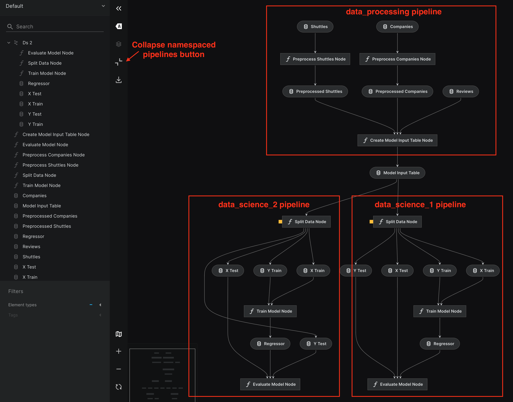
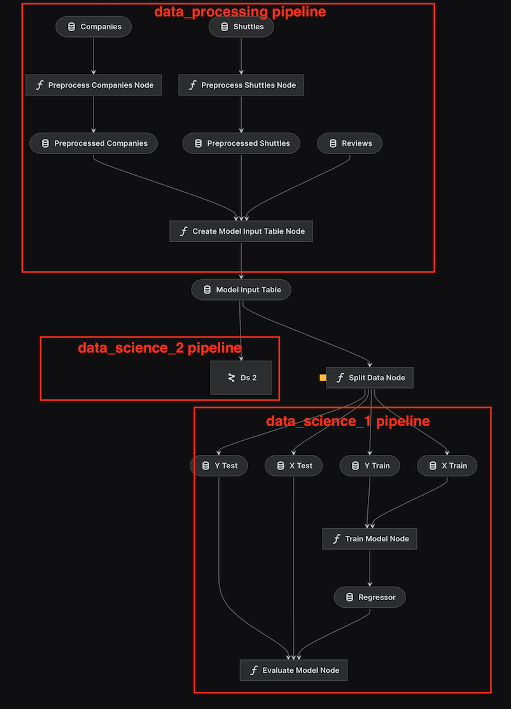
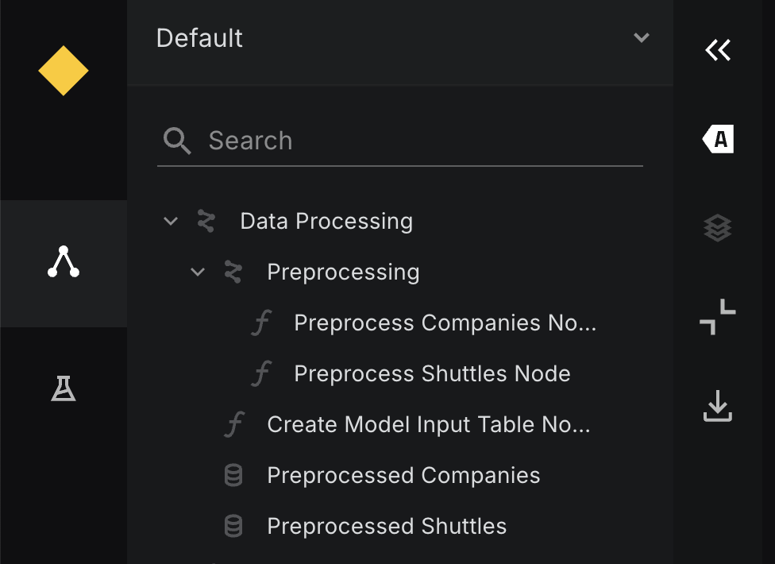

# Reuse pipelines and group nodes with namespaces

In this section, we introduce namespaces - a powerful tool for grouping and isolating nodes. Namespaces are useful in two key scenarios:

- **Reusing a Kedro pipeline:** If you need to reuse a pipeline with some modifications of inputs, outputs or parameters, Kedro does not allow direct duplication because all nodes within a project must have unique names. Using namespaces helps resolve this issue by isolating identical pipelines while also enhancing visualisation in Kedro-Viz.

- **Grouping specific nodes:**  Namespaces provide a simple way to group selected nodes, making it possible to execute them together in deployment while also improving their visual representation in Kedro-Viz.

## How to reuse your pipelines

If you want to create a new pipeline that performs similar tasks with different inputs/outputs/parameters as your `existing_pipeline`, you can use the same `Pipeline` class as described in [How to structure your pipeline creation](modular_pipelines.md#how-to-structure-your-pipeline-creation). This function allows you to overwrite inputs, outputs, and parameters. Your new pipeline creation code should look like this:

```python
def create_pipeline(**kwargs) -> Pipeline:
    return Pipeline(
       existing_pipeline, # Name of the existing Pipeline object
       inputs = {"old_input_df_name" : "new_input_df_name"},  # Mapping existing Pipeline input to new input
       outputs = {"old_output_df_name" : "new_output_df_name"},  # Mapping existing Pipeline output to new output
       parameters = {"params: model_options": "params: new_model_options"},  # Updating parameters
    )
```

This means you can create multiple pipelines based on the `existing_pipeline` pipeline to test different approaches with various input datasets and model training parameters. For example, for the `data_science` pipeline from our [Spaceflights tutorial](../tutorials/add_another_pipeline.md#data-science-pipeline), you can restructure the `src/project_name/pipelines/data_science/pipeline.py` file by separating the `data_science` pipeline creation code into a separate `base_data_science` pipeline object, then reusing it inside the `create_pipeline()` function:

```python
#src/project_name/pipelines/data_science/pipeline.py

from kedro.pipeline import Pipeline, Node
from .nodes import evaluate_model, split_data, train_model

base_data_science = Pipeline(
        [
            Node(
                func=split_data,
                inputs=["model_input_table", "params:model_options"],
                outputs=["X_train", "X_test", "y_train", "y_test"],
                name="split_data_node",
            ),
            Node(
                func=train_model,
                inputs=["X_train", "y_train"],
                outputs="regressor",
                name="train_model_node",
            ),
            Node(
                func=evaluate_model,
                inputs=["regressor", "X_test", "y_test"],
                outputs=None,
                name="evaluate_model_node",
            ),
        ]
    )  # Creating a base data science pipeline that will be reused with different model training parameters

# data_science pipeline creation function
def create_pipeline(**kwargs) -> Pipeline:
    return Pipeline(
        [base_data_science],  # Creating a new data_science pipeline based on base_data_science pipeline
        parameters={"params:model_options": "params:model_options_1"},  # Using a new set of parameters to train model
    )
```

To use a new set of parameters, you should create a second parameters file to ovewrite parameters specified in  `conf/base/parameters.yml`. To overwrite the parameter `model_options`, create a file  `conf/base/parameters_data_science.yml` and add a parameter called `model_options_1`:

```python
#conf/base/parameters.yml
model_options_1:
  test_size: 0.15
  random_state: 3
  features:
    - passenger_capacity
    - crew
    - d_check_complete
    - moon_clearance_complete
    - company_rating
```

```{note}
In Kedro, you cannot run pipelines with the same node names. In this example, both pipelines have nodes with the same names, so it's impossible to execute them together. However, `base_data_science` is not registered and will not be executed with the `kedro run` command. The `data_science` pipeline, on the other hand, will be executed during `kedro run` because it will be autodiscovered by Kedro, as it was created inside the `create_pipeline()` function.
```

If you want to execute `base_data_science` and `data_science` pipelines together or reuse `base_data_science` a few more times, you need to modify the node names. The easiest way to do this is by using namespaces.

## What is a namespace

A namespace is a way to isolate nodes, inputs, outputs, and parameters inside your pipeline. If you put `namespace="namespace_name"` attribute inside the `Pipeline` class, it will add the `namespace_name.` prefix to all nodes, inputs, outputs, and parameters inside your new pipeline.

```{note}
If you don't want to change the names of your inputs, outputs, or parameters with the `namespace_name.` prefix while using a namespace, you can disable it by setting the `prefix_datasets_with_namespace` parameter to `False`. This will keep the original names of your inputs, outputs, and parameters. However, the nodes will still be prefixed with the namespace name. For example:

```python
Pipeline(
    [Node(...), Node(...), Node(...)],
    namespace="your_namespace_name",
    prefix_datasets_with_namespace=False,
)
```
Alternatively, you can also specify the mapping of the inputs, outputs, and parameters inside the corresponding parameters of the `Pipeline` class. For example:

```python
Pipeline(
    [Node(...), Node(...), Node(...)],
    namespace="your_namespace_name",
    inputs={"first_input_to_not_be_prefixed", "second_input_to_not_be_prefixed"},
    outputs={"first_output_to_not_be_prefixed", "second_output_to_not_be_prefixed"},
    parameters={"first_parameter_to_not_be_prefixed", "second_parameter_to_not_be_prefixed"},
)
```
```

Let's extend our previous example and try to reuse the `base_data_science` pipeline one more time by creating another pipeline based on it. First, we should use the `kedro pipeline create` command to create a new blank pipeline named `data_science_2`:

```python
kedro pipeline create data_science_2
```
Then, we need to modify the `src/project_name/pipelines/data_science_2/pipeline.py` file to create a pipeline in a similar way to the example above. We will import `base_data_science` from the code above and use a namespace to isolate our nodes:

```python
#src/project_name/pipelines/data_science_2/pipeline.py
from kedro.pipeline import Pipeline
from ..data_science.pipeline import base_data_science  # Import pipeline to create a new one based on it

def create_pipeline() -> Pipeline:
    return Pipeline(
        base_data_science, # Creating a new data_science_2 pipeline based on base_data_science pipeline
        namespace = "ds_2", # With that namespace, "ds_2." prefix will be added to inputs, outputs, params, and node names
        parameters={"params:model_options": "params:model_options_2"}, # Using a new set of parameters to train model
        inputs={"model_input_table"}, # Inputs remain the same, without namespace prefix
    )
```

To use a new set of parameters, copy `model_options` from `conf/base/parameters_data_science.yml` to `conf/base/parameters_data_science_2.yml` and modify it slightly to try new model training parameters, such as test size and a different feature set. Call it `model_options_2`:

```python
#conf/base/parameters.yml
model_options_2:
  test_size: 0.3
  random_state: 3
  features:
    - d_check_complete
    - moon_clearance_complete
    - iata_approved
    - company_rating
```

In this example, all nodes inside the `data_science_2` pipeline will be prefixed with `ds_2`: `ds_2.split_data`, `ds_2.train_model`, `ds_2.evaluate_model`. Parameters will be used from `model_options_2` because we overwrite `model_options` with them. The input for that pipeline will be `model_input_table` as it was previously, because we mentioned that in the inputs parameter (without that, the input would be modified to `ds_2.model_input_table`, but we don't have that table in the pipeline).

Since the node names are unique now, we can run the project with:

```python
kedro run
```

Logs show that `data_science` and `data_science_2` pipelines were executed successfully with different R2 results. Now, we can see how Kedro-viz renders namespaced pipelines in collapsible "super nodes":

```python
kedro viz run
```

After running viz, we can see two equal pipelines: `data_science` and `data_science_2`:



We can collapse all namespaced pipelines (in our case, it's only `data_science_2`) with a special button and see that the `data_science_2` pipeline was collapsed into one super node called `Ds 2`:



```{note}
You can use `kedro run --namespaces=< namespace1,namespace2 >` to run the specific namespaces
```


### How to namespace all pipelines in a project

If we want to make all pipelines in this example fully namespaced, we should:

Modify the `data_processing` pipeline by adding to the `Pipeline` class in `src/project_name/pipelines/data_processing/pipeline.py` with the following code:
```python
        namespace="data_processing",
        inputs={"companies", "shuttles", "reviews"},  # Inputs remain the same, without namespace prefix
        outputs={"model_input_table"},  # Outputs remain the same, without namespace prefix
```
Modify the `data_science` pipeline by adding namespace and inputs in the same way as it was done in `data_science_2` pipeline:

```python
def create_pipeline(**kwargs) -> Pipeline:
    return Pipeline(
        base_data_science,
        namespace="ds_1",
        parameters={"params:model_options": "params:model_options_1"},
        inputs={"model_input_table"},
    )
```

After executing the pipeline with `kedro run`, the visualisation with `kedro viz run` after collapsing will look like this:


## Group nodes with namespaces

You can use namespaces in your Kedro projects, not only to reuse pipelines but to also group your nodes for better high level visualisation in Kedro Viz and for deployment purposes. In production environments, it might be inefficient to map each node to a container. Using namespaces as a grouping mechanism, you can map each namespaced pipeline to a container or a task in your deployment environment.

For example, in your spaceflights project, you can assign a namespace to the `data_processing` pipeline like this:

```python
#src/project_name/pipelines/data_science/pipeline.py

from kedro.pipeline import Pipeline, Node
from .nodes import create_model_input_table, preprocess_companies, preprocess_shuttles

def create_pipeline(**kwargs) -> Pipeline:
    return Pipeline(
        [
            Node(
                func=preprocess_companies,
                inputs="companies",
                outputs="preprocessed_companies",
                name="preprocess_companies_node",
            ),
            Node(
                func=preprocess_shuttles,
                inputs="shuttles",
                outputs="preprocessed_shuttles",
                name="preprocess_shuttles_node",
            ),
            Node(
                func=create_model_input_table,
                inputs=["preprocessed_shuttles", "preprocessed_companies", "reviews"],
                outputs="model_input_table",
                name="create_model_input_table_node",
            ),
        ],
        namespace="data_processing",
        prefix_datasets_with_namespace=False,  # Optional, by default True
    )
```

```{note}
From Kedro 0.19.12, you can use the `grouped_nodes_by_namespace` property of the `Pipeline` object to get a dictionary which groups nodes by their top level namespace. Plugin developers are encouraged to use this property to obtain the mapping of namespaced group of nodes to a container or a task in the deployment environment.
```
You can further nest namespaces by assigning namespaces on the node level with the `namespace` argument of the `Node` class. Namespacing at node level should only be done to enhance visualisation by creating collapsible pipeline parts on Kedro Viz. In this case, only the node name will be prefixed with `namespace_name`, while inputs, outputs, and parameters will remain unchanged. This behaviour differs from [namespacing at the pipeline level](#what-is-a-namespace).

For example, if you want to group the first two nodes of the `data_processing` pipeline from [Spaceflights tutorial](../tutorials/add_another_pipeline.md#data-science-pipeline) into the same collapsible namespace for visualisation, you can update your pipeline like this:

```python
#src/project_name/pipelines/data_science/pipeline.py

from kedro.pipeline import Pipeline, Node
from .nodes import create_model_input_table, preprocess_companies, preprocess_shuttles

def create_pipeline(**kwargs) -> Pipeline:
    return Pipeline(
        [
            Node(
                func=preprocess_companies,
                inputs="companies",
                outputs="preprocessed_companies",
                name="preprocess_companies_node",
                namespace="preprocessing", # Assigning the node to the "preprocessing" nested namespace
            ),
            Node(
                func=preprocess_shuttles,
                inputs="shuttles",
                outputs="preprocessed_shuttles",
                name="preprocess_shuttles_node",
                namespace="preprocessing", # Assigning the node to the "preprocessing" nested namespace
            ),
            Node(
                func=create_model_input_table,
                inputs=["preprocessed_shuttles", "preprocessed_companies", "reviews"],
                outputs="model_input_table",
                name="create_model_input_table_node",
            ),
        ],
        namespace="data_processing",
        prefix_datasets_with_namespace=False,  # Optional, by default True
    )
```

As you can see in the above example, the entire pipeline is namespaced as `data_processing`, while the first two nodes are also namespaced as `data_processing.preprocessing`. This will allow you to collapse the nested `preprocessing` namespace in Kedro-Viz for better visualisation.

You can execute the whole namespaced pipeline with:
```bash
kedro run --namespaces=data_processing
```
Or, you can run the first two nodes with:
```bash
kedro run --namespaces=data_processing.preprocessing
```
Open the visualisation with `kedro viz run` to see the collapsible pipeline parts, which you can toggle with "Collapse pipelines" button on the left panel.


<br>


```{warning}
The use of `namespace` at node level is not recommended for grouping your nodes for deployment as this behaviour differs from defining `namespace` at `Pipeline` level. When defining namespaces at the node level, they behave similarly to tags and do not guarantee execution consistency.
```
