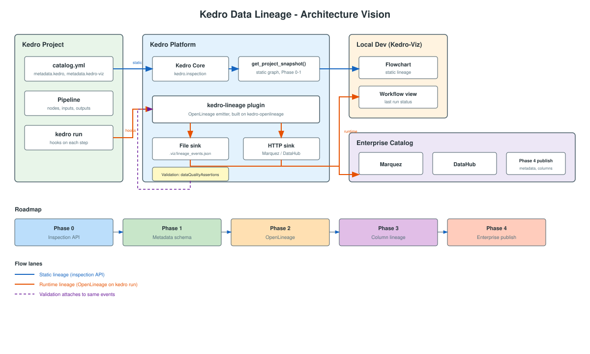

# Data Lineage for Kedro: Spike and Tech Design

**Context:** [Kedro #5311: Data quality management for Kedro pipelines](https://github.com/kedro-org/kedro/issues/5311). This issue covers validation, profiling, monitoring, and lineage. **This doc focuses on lineage.**

---

## Introduction

This doc supports a **three session tech design series** on data lineage for Kedro. Session 1 is written below. Sessions 2 and 3 will be added to this same doc once the team aligns on direction.

| Session | Goal | Status |
|---------|------|--------|
| **1. Vision and direction** | Why lineage, where we're headed, roadmap at a high level | **Below** |
| **2. Phases 0 to 2** | Metadata schema, inspection API, OpenLineage emitter, Workflow view | To be added |
| **3. Phases 3 to 4** | Column lineage, enterprise catalog integration | To be added |

**Terms that may be new:**

| Tool | What it is |
|------|------------|
| [OpenLineage](https://openlineage.io/) | Open standard for describing pipeline runs. Kedro would emit events in this format |
| [Marquez](https://marquezproject.ai/) | Focused tool for storing and viewing OpenLineage lineage graphs. Good when you mainly want run history and dataset dependencies |
| [DataHub](https://datahubproject.io/) | Full enterprise data catalog: search, ownership, documentation, governance, and lineage. Broader than Marquez, but also ingests OpenLineage events |

Both Marquez and DataHub can receive the same OpenLineage events from Kedro. Marquez is lineage-first. DataHub is for teams that want lineage as part of a wider org-wide catalog.

**Kedro hooks → OpenLineage events**

Today (`PipelineRunStatusHook` → `.viz/kedro_pipeline_events.json`):

```json
{
  "event": "after_node_run",
  "node": "ingestion.apply_types_to_companies",
  "node_id": "69c523b6",
  "duration": 0.010,
  "status": "success"
}
```

OpenLineage (Phase 2 target):

```json
{
  "eventType": "COMPLETE",
  "eventTime": "2026-08-02T14:30:00.000Z",
  "run": {
    "runId": "f0e82968-10d8-4a3a-b2c0-db7e2b8b48f7"
  },
  "job": {
    "namespace": "spaceflights",
    "name": "preprocess_companies_node"
  },
  "inputs": [
    {
      "namespace": "spaceflights",
      "name": "companies"
    }
  ],
  "outputs": [
    {
      "namespace": "spaceflights",
      "name": "preprocessed_companies"
    }
  ]
}
```

---

# Session 1: Vision and direction

## 1.1 What are we trying to solve?

When a pipeline grows, people start asking questions that are hard to answer without lineage:

- Where did this dataset come from?
- If I change this table, what breaks downstream?
- Which step introduced the bad data?
- Can we prove to compliance where this number came from?

**Data lineage** is the map that answers those questions. It tracks data from its source, through every transformation, to wherever it ends up (e.g. raw CSV → clean data → feature table → model input or dashboard).

Lineage comes in a few flavours. Most teams need more than one:

| Type | What it shows |
|------|---------------|
| **Table level** | Which dataset feeds which |
| **Column level** | Which field came from which field |
| **Static** | Dependencies from code, no run needed |
| **Runtime** | What happened in a specific run |
| **Business** | Owners, definitions, downstream consumers |

For Kedro, the goal is not to build a full enterprise data catalog. We want to give developers a clear picture inside Kedro-Viz, and connect to DataHub or Marquez when teams need more.

---

## 1.2 Why now?

The current issue covers validation, profiling, monitoring, and lineage. Kedro's catalog already lists dataset names in `catalog.yml`. That part we have.

What's missing is the **context around those datasets**:

For example, validation might fail on `model_input_table`. The catalog tells you the dataset exists. Lineage tells you it was built by `create_model_input_node` from `preprocessed_companies` and `shuttles`, and that `train_model_node` depends on it downstream.

That context is what ties these features together. They share the same dependency graph and the same runtime events, not just the same dataset names.

**Why Kedro is in a good place to do this:**

| Reason | Detail |
|--------|--------|
| We already have the graph | Nodes declare inputs and outputs. The dependency map is already there |
| Inspection API exists | `get_project_snapshot()` exports structure without running the pipeline |
| Workflow view exists | Kedro-Viz 12+ tracks run events |
| The industry uses OpenLineage | DataHub and Marquez expect a standard format. We should plug in rather than invent our own |

**What success looks like:**

1. A developer opens Kedro-Viz and immediately sees how data flows (this mostly works today).
2. After a run, they can see what succeeded, failed, and how long things took (Workflow view).
3. In production, lineage flows to an **enterprise data catalog** like Marquez or DataHub.
4. Validation and quality results attach to the same lineage events.

---

## 1.3 What others do (and where we plug in)

Kedro is closest to **dbt** (dependencies declared in code), but our transforms are Python, not SQL.

**Frameworks we can learn from**:

| Tool | How they do lineage | Takeaway for Kedro |
|------|----------------------|-------------------|
| **dbt** | Each model declares parents with `ref()`. dbt exports a dependency map (`parent_map`) in `manifest.json` | Kedro nodes already declare `inputs`/`outputs`. Kedro-Viz builds the same dependency graph. We need to export it in a standard format |
| **Dagster** | Each dataset is an `@asset` with declared deps (e.g. `deps=["raw_orders"]`). Dagster auto-builds the dependency graph in its UI. When an asset runs, `MaterializeResult(metadata={...})` attaches row counts, schemas, or column lineage to that run | Kedro nodes already declare `inputs`/`outputs` (static graph). Use hooks at execution time (`after_node_run`) to attach the same kind of runtime metadata to OpenLineage events |
| **Airflow** | OpenLineage plugin sends events on each task run | Same pattern. A community [kedro-openlineage](https://github.com/astrojuanlu/kedro-openlineage) proof of concept already exists |

---

## 1.4 What Kedro already has

| Feature | Status | Lineage type |
|---------|--------|--------------|
| Pipeline flowchart | Works | Static, table level |
| Workflow view | Works (v12+) | Runtime, single run |
| Inspection API | In Kedro core. Kedro-Viz adoption in progress (Phase 0) | Static export (`ProjectSnapshot`) |
| Dataset stats and previews | Works | Basic profiling |
| OpenLineage integration | Community PoC exists (see below) | Runtime to enterprise catalog |
| Column level lineage | Missing | |
| Run history | Missing (last run only) | |

### Why the Workflow view is not enough

The Flowchart and Workflow view are useful for local debugging. Together they cover static dependencies and the status of your last run. That is not the same as full lineage.

| Need | Flowchart + Workflow enough? |
|------|------------------------------|
| Debug my pipeline locally | Yes, mostly |
| See last run status and timings | Yes |
| Run history over time | No |
| Share lineage with platform or compliance teams | No |
| Connect Kedro to the rest of the data stack | No |
| Column level lineage | No |
| Owners, consumers, impact analysis | No |
| Attach validation results to datasets | No |

Three gaps in particular:

1. **Local and single run.** The Workflow view only shows the most recent run on your machine. There is no history, no audit trail, no "what ran in prod last Tuesday?"
2. **Custom format.** Events live in `.viz/kedro_pipeline_events.json`. DataHub and Marquez cannot read that. Other tools in the stack use [OpenLineage](https://openlineage.io/).
3. **Kedro boundary.** The graph stops at your pipeline. It cannot show upstream sources, downstream dashboards, or column level dependencies.

We are not replacing the Workflow view. We are extending what it starts: keep Kedro-Viz for local dev.

### Community plugin: [kedro-openlineage](https://github.com/astrojuanlu/kedro-openlineage)

This is a good starting point for Phase 2. Juan Luis Cano built it as part of [Discussion #4054](https://github.com/kedro-org/kedro/discussions/4054). The repo is archived now and was never published to PyPI (`0.1.dev0`, install from GitHub only), but it already proves the core idea: Kedro hooks → OpenLineage events → Marquez. It listens to `before_node_run` and `after_node_run`, emits START/COMPLETE events over HTTP, and was demo'd on spaceflights.

What's still missing: a file sink for Kedro-Viz, FAIL events, one run ID per `kedro run`, dataset load/save events, validation facets, and column lineage.
We should have an official plugin extending it filling the gaps above.

---

## 1.5 Direction: what are we proposing

### Architecture vision



### The big picture: four pieces, four roles

| Piece | Role | Who uses it |
|-------|------|-------------|
| **Kedro core** (`kedro.inspection`) | Export the pipeline graph without running it | Kedro-Viz, CI, tooling (In progress) |
| **kedro-lineage plugin** | Listen to Kedro hooks during `kedro run`, write OpenLineage events | Runs automatically on every pipeline run |
| **Kedro-Viz** | Show the graph and last run status for local development | Developers at their laptop |
| **DataHub / Marquez** | Store and search lineage across the whole org | Platform teams, compliance, downstream consumers |

---

### Decision 1: Static graph comes from Kedro core, not Kedro-Viz (Done)

**The question:** Where does the pipeline dependency graph live?

**Our proposal:** Use `kedro.inspection` and `get_project_snapshot()`. This already exists in Kedro core. It returns pipelines, nodes, datasets, and parameters as a read-only snapshot. Kedro-Viz should consume this instead of loading the full project itself.

**Why:** Avoids duplicating logic. Other tools (CI, scripts, enterprise catalogs) can call the same API. Think of it as Kedro's equivalent of dbt's `manifest.json`.

---

### Decision 2: Runtime events use OpenLineage, not custom JSON

**The question:** What format do we write when a pipeline runs?

**Our proposal:** [OpenLineage](https://openlineage.io/). Replace the custom `.viz/kedro_pipeline_events.json` format with standard OpenLineage RunEvents (see the example in the Introduction).

**Why:** DataHub and Marquez already understand OpenLineage. Airflow uses the same pattern. One standard format means we don't maintain our own event schema and hope others adopt it.

---

### Decision 3: Emission lives in a plugin, not in Kedro-Viz

**The question:** Where does the code that listens to hooks and writes events live?

**Our proposal:** Build on the existing [kedro-openlineage](https://github.com/astrojuanlu/kedro-openlineage) proof of concept. Either adopt it into kedro-org or fork it as an official plugin. The core hook → OpenLineage mapping already works.

**Why a plugin, not Kedro-Viz:** Kedro-Viz is a UI tool with heavy frontend dependencies. Lineage emission should work even when viz isn't installed, for example in production CI/CD where nobody opens a browser. Keeping them separate means production runs can emit to DataHub without pulling in the viz frontend.

---

### Decision 4: One emitter, two outputs

**The question:** Do we need separate hooks for local dev and production?

**Our proposal:** No. One OpenLineage emitter with two configurable outputs:

| Output | Where events go | Purpose |
|--------|----------------|---------|
| **File** | `.viz/lineage_events.json` | Kedro-Viz Workflow view reads this during local dev |
| **HTTP** | Marquez or DataHub endpoint | Production lineage for the wider org |

**Why:** Today Kedro-Viz has `PipelineRunStatusHook` writing custom JSON, and we'd need a separate hook for OpenLineage. That's two parallel event systems doing the same job. One emitter, two outputs is simpler to maintain.

---

### Decision 5: Two metadata namespaces in catalog.yml

**The question:** Where do owner, description, and layer live in `catalog.yml`?

**Our proposal:** Split metadata into two namespaces:

```yaml
model_input_table:
  type: pandas.ParquetDataset
  filepath: data/03_primary/model_input.parquet
  metadata:
    kedro:                    # shared: lineage, validation, enterprise catalog
      owner: data-team@company.com
      description: "Features fed into training"
    kedro-viz:                # UI only: not published externally
      layer: primary
```

| Namespace | Used by | Examples |
|-----------|---------|----------|
| `metadata.kedro` | Lineage plugin, validation, inspection, DataHub | owner, description, consumers |
| `metadata.kedro-viz` | Kedro-Viz UI only | layer, preview, styling |

**Why:** Owner and description are governance fields. They shouldn't live under a viz-specific namespace if we're publishing them to DataHub in Phase 4. Splitting early avoids rework when validation and lineage both need the same fields.

---

### Decision 6: Validation results attach to the same lineage events

**The question:** Does validation get its own event stream?

**Our proposal:** No. Validation hooks attach results to the same OpenLineage RunEvents via the `dataQualityAssertions` facet. One event stream for lineage and quality.

**Why:** When a check fails on `model_input_table`, you want to see that failure on the lineage graph next to the dataset, not in a separate system. OpenLineage already supports this facet.

---

### Decision 7: Column lineage comes later (Session 3)

Column level lineage (which field came from which field) is hard for Python. We won't ask users to annotate columns in YAML. We'll discover what we can at runtime in Phase 3. That's a Session 3 topic, not something to design today.

---

## 1.6 Roadmap: high level phases

Five phases. Sessions 2 and 3 will go into the detail for each.

| Phase | Goal | Primary owner |
|-------|------|---------------|
| **0** | Kedro-Viz uses `get_project_snapshot()` (**in progress**). Structure only: pipelines, nodes, datasets (name, type, filepath) | Kedro core and Kedro-Viz |
| **1** | Define the `metadata.kedro` schema. Extend snapshot to include metadata. Document that the flowchart is table level lineage | Kedro docs, Kedro core, and Kedro-Viz |
| **2** | Single OpenLineage emitter with file output (Workflow view) and HTTP output (Marquez). Validation attaches via `dataQualityAssertions` | kedro-lineage plugin |
| **3** | Column lineage via runtime discovery (pandas passthrough, Spark OpenLineage). Column tab in viz | kedro-lineage plugin and Kedro-Viz |
| **4** | Publish structure, columns, and metadata from Phases 0 to 3 to enterprise catalog. Impact maps and consumers | kedro-lineage plugin |

---

# Session 2: Phases 0 to 2 in depth

> **Status:** To be filled in after Session 1 alignment.

Session 2 will cover the implementation design for the first thing we can ship.

### How run history persists across multiple runs

Kedro does not store run history. Once events leave the HTTP sink, **Marquez or DataHub** owns persistence.

Each `kedro run` gets a new `runId` (UUID). All node events in that run share it. The plugin sends them over HTTP and moves on. It does not keep history locally.

| Sink | What happens on the next run |
|------|------------------------------|
| **File** (`.viz/lineage_events.json`) | Overwritten. Kedro-Viz Workflow view shows last run only |
| **HTTP** (Marquez / DataHub) | Appended. Server stores every run |

Marquez and DataHub are servers with their own databases (Marquez typically uses PostgreSQL; DataHub uses Kafka plus a metadata store). Each OpenLineage event is ingested and stored. A new run adds a new record, it does not replace the previous one.

```
Run 1 (Monday)   runId = aaa-111  →  Marquez stores run aaa-111
Run 2 (Tuesday)  runId = bbb-222  →  Marquez stores run bbb-222
Run 3 (Wednesday) runId = ccc-333  →  Marquez stores run ccc-333
```

In the Marquez or DataHub UI you can browse all runs for a job, compare success/fail over time, and trace which run wrote which dataset version.

**Design note for Session 2:** The community [kedro-openlineage](https://github.com/astrojuanlu/kedro-openlineage) PoC generates a new `runId` per node. The official plugin should use Kedro's `run_id` from hooks so all events in one `kedro run` share one ID.

**Topics we plan to cover:**

| Topic | Phase | What we will design |
|-------|-------|---------------------|
| Inspection API adoption | 0 | Kedro-Viz reads `ProjectSnapshot` for graph structure (**in progress**) |
| Shared metadata schema | 1 | Define `metadata.kedro` vs `metadata.kedro-viz`. Fields, docs, viz panel |
| Extend `DatasetSnapshot` | 1 | Add metadata to snapshot once schema is defined |
| Document existing lineage | 1 | Flowchart is table level lineage. User facing docs |
| OpenLineage emitter | 2 | Single hook. Kedro to OpenLineage mapping (Job, Run, Dataset, facets) |
| Run ID per kedro run | 2 | One `runId` for all node events in a run (fix kedro-openlineage PoC gap) |
| Multiple outputs | 2 | File output for Workflow view. HTTP output for Marquez |
| Workflow view migration | 2 | Read from OpenLineage file output. Replace custom `.viz/` event format |
| Validation integration | 2 | `dataQualityAssertions` extension hook for the validation workstream |
| Migration | 2 | Path from existing `PipelineRunStatusHook` and `DatasetStatsHook` |

---

# Session 3: Phases 3 to 4 in depth

> **Status:** To be filled in after Session 2.

Session 3 will cover column lineage and enterprise catalog publishing.

**Topics we plan to cover:**

| Topic | Phase | What we will design |
|-------|-------|---------------------|
| Pandas passthrough detection | 3 | Schema diff on `after_node_run`. Passthrough vs derived or unknown |
| Spark column lineage | 3 | Use the existing OpenLineage Spark integration |
| Column OpenLineage facets | 3 | `ColumnLineageDatasetFacet` on RunEvents. Column tab in viz |
| Publish static structure | 4 | Push `ProjectSnapshot` to DataHub or Marquez without a run |
| Publish columns and metadata | 4 | Push column lineage and `metadata.kedro` to enterprise catalog |
| Downstream consumers | 4 | `metadata.kedro.consumers` schema. Links from viz |
| Impact analysis | 4 | Dependency map helper ("what breaks if I change this?") |
| Quality on catalog graph | 4 | OpenLineage events with `dataQualityAssertions` already flow via Phase 2 |


---

## Appendix A: Spike experiments

| # | Experiment | Expected outcome |
|---|-----------|------------------|
| 1 | Run [kedro-openlineage](https://github.com/astrojuanlu/kedro-openlineage) on spaceflights, send to Marquez. See [local setup guide](kedro-openlineage-marquez-local-setup.md) | OpenLineage events work. Overlap with Workflow view |
| 2 | Export Kedro-Viz graph JSON alongside a dbt `manifest.json` | Kedro is richer for Python. dbt is richer for SQL columns |
| 3 | Wire Kedro-Viz to `get_project_snapshot()` | Viz works from inspection API (ongoing) |
| 4 | Pandas schema diff on 2 to 3 nodes | Passthrough columns detected. Derived columns flagged as unknown |

---

## Appendix B: Related reading

- [Core vs plugin: why the split is good](data-lineage-core-vs-plugin.md)
- [Local setup: kedro-openlineage → Marquez](kedro-openlineage-marquez-local-setup.md)

---

## Appendix C: References

- [Kedro #5311: Data quality management](https://github.com/kedro-org/kedro/issues/5311)
- [Kedro Discussion #4054: OpenLineage exploration](https://github.com/kedro-org/kedro/discussions/4054)
- [Kedro #4363: Pipeline inspection](https://github.com/kedro-org/kedro/issues/4363) (landed as `kedro.inspection`)
- [Kedro inspection API docs](https://docs.kedro.org/en/stable/inspect/inspect-project/)
- [kedro-openlineage proof of concept](https://github.com/astrojuanlu/kedro-openlineage)
- [OpenLineage getting started](https://openlineage.io/getting-started/)
- [Marquez project](https://marquezproject.ai/)
