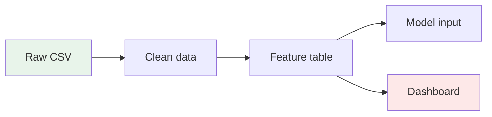
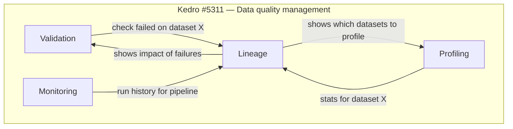
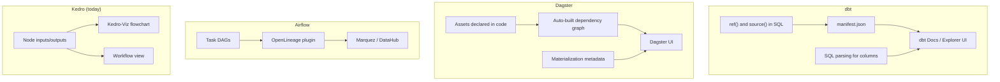
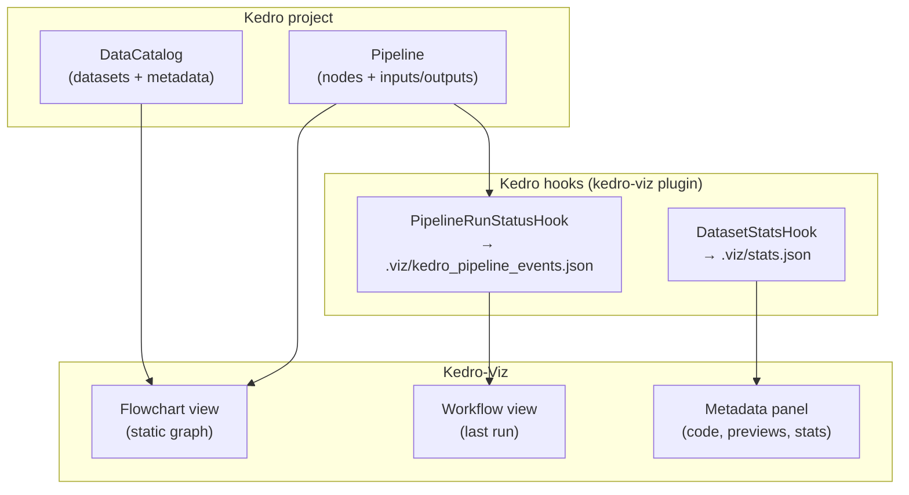
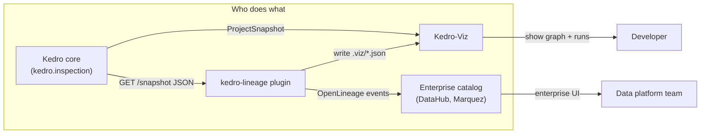
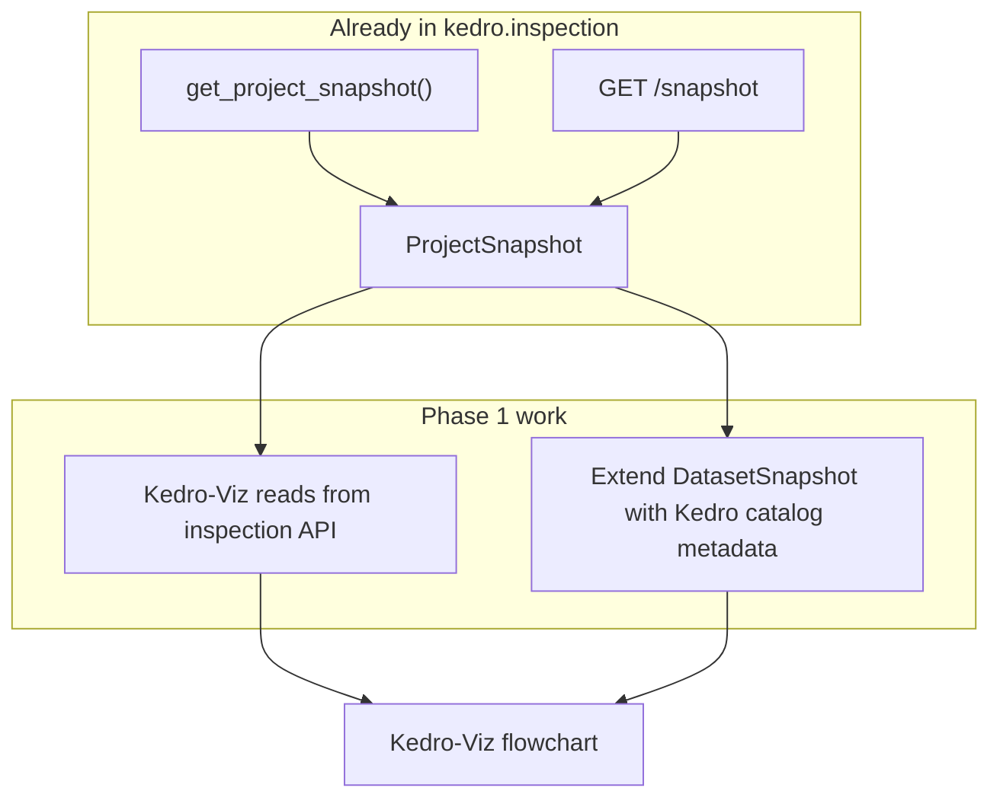
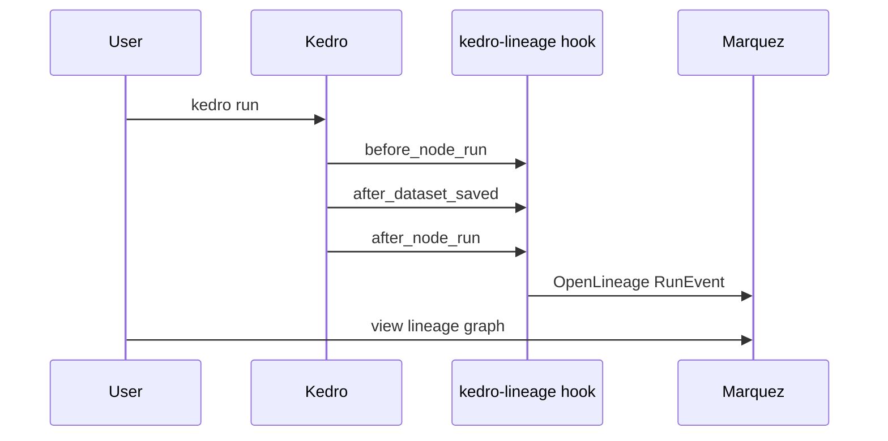
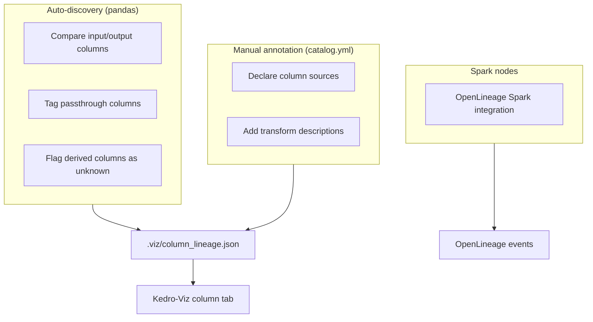
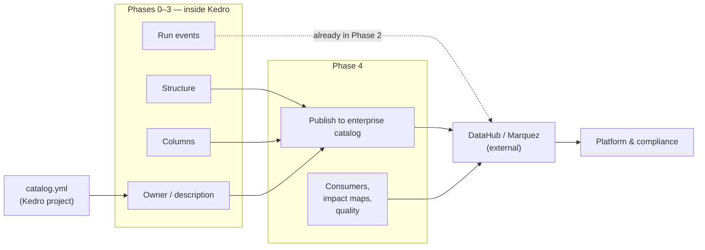
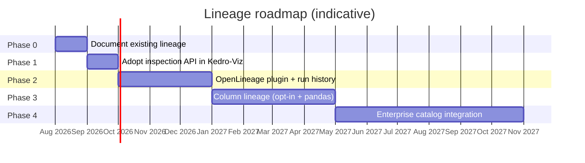

# Data Lineage for Kedro — Spike Analysis

> **Context:** [Kedro #5311 — Data quality management for Kedro pipelines](https://github.com/kedro-org/kedro/issues/5311)
> **Focus of this doc:** Data lineage (one of four workstreams in that issue)

---

## 1. What are we trying to solve?

When a data pipeline grows, people start asking simple questions that are surprisingly hard to answer:

- Where did this dataset come from?
- If I change this table, what breaks downstream?
- Which step introduced the bad data?
- Can we prove to compliance where this number came from?

**Data lineage** is the map that answers those questions. It tracks data from its source, through every transformation, to wherever it ends up.



Lineage comes in a few flavours. Most teams need more than one:

| Type | What it shows | Example question |
|------|---------------|------------------|
| **Table-level** | Which dataset feeds which | "What nodes use `companies`?" |
| **Column-level** | Which field came from which field | "Where does `revenue` come from?" |
| **Static** | Dependencies from code, no run needed | "What does the pipeline look like on paper?" |
| **Runtime** | What actually happened in a specific run | "Did node X fail? How long did it take?" |
| **Business** | Owners, definitions, policies | "Who owns this metric? What does it mean?" |

For Kedro, the goal is not to build a full enterprise data catalog. The goal is to give Kedro users a clear picture of how data flows through their pipelines, and connect to the wider data stack when they need more.

---

## 2. Why are we doing this?

Issue #5311 covers four related areas: validation, profiling, monitoring, and lineage. They are not separate problems. They all need to know **which data asset** something happened to.



**Why lineage matters for Kedro specifically:**

| Reason | Detail |
|--------|--------|
| Pipelines are getting bigger | More nodes, more datasets, harder to debug by reading code |
| Kedro is moving into data engineering | Lineage is a baseline expectation in production data teams |
| We already have most of the graph | Kedro nodes declare inputs and outputs. The dependency map exists. We just have not called it lineage or exported it properly |
| Other tools in the stack expect it | DataHub, OpenMetadata, and Marquez all consume lineage in standard formats. Kedro should plug in, not rebuild those tools |
| It connects to work we already shipped | The Workflow view (Kedro-Viz 12+) tracks run events. That is operational lineage in disguise |

**What success looks like:**

1. A Kedro developer opens Kedro-Viz and immediately sees how data flows (this mostly works today).
2. After a run, they can see what succeeded, failed, and how long things took (Workflow view).
3. In production, lineage events flow to an **enterprise data catalog** (Marquez, DataHub), not just `catalog.yml`.
4. Over time, column-level and business metadata can be added where teams need them.

---

## 3. How competitors do this

Different tools take different approaches. Kedro sits closest to **dbt** (pipeline-as-code with declared dependencies) but our transforms are Python, not SQL.

### High-level comparison



### Feature comparison table

| Capability | dbt | Dagster | Airflow | DataHub / OpenMetadata |
|------------|-----|---------|---------|------------------------|
| Table-level lineage | Automatic from `ref()` | Automatic from asset deps | Via OpenLineage plugin | Ingests from many sources |
| Column-level lineage | SQL parsing (Cloud/Enterprise) | Opt-in metadata on materialize | Via Spark/SQL extractors | Parses SQL + OL events |
| Static lineage (no run) | `manifest.json` | Asset graph from code | DAG definition only | Ingested artifacts |
| Runtime lineage | Job run history | Run + materialization events | Task instance events | OpenLineage events |
| Local dev UI | dbt Docs | Dagster UI | Airflow UI (task-focused) | Web catalog UI |
| Business metadata | Descriptions, exposures | Tags, owners on assets | Limited | Full governance suite |
| Quality on lineage graph | Via integrations (Soda, etc.) | Native checks | External tools | Built-in or integrated |

### dbt — closest analogue to Kedro

dbt gets table-level lineage for free because every model declares its parents:

```sql
-- models/stg_orders.sql
select
    order_id,
    customer_id,
    amount
from {{ ref('raw_orders') }}
```

Running `dbt run` produces a `manifest.json` with explicit dependency maps:

```json
{
  "parent_map": {
    "model.project.stg_orders": ["source.project.raw_orders"]
  },
  "child_map": {
    "source.project.raw_orders": ["model.project.stg_orders"]
  }
}
```

Column-level lineage comes from parsing the SQL `SELECT` clause. That works well for SQL. It does not help with arbitrary Python.

**Takeaway for Kedro:** We already have the equivalent of `parent_map`. It lives in the pipeline graph. We need to export it in a useful format.

### Dagster — lineage built into the framework

Dagster treats datasets as first-class "assets." Dependencies are declared in code and the UI builds the graph automatically.

Column lineage is opt-in. You attach it when a node runs:

```python
import dagster as dg

@dg.asset(deps=["raw_orders"])
def clean_orders():
    return dg.MaterializeResult(
        metadata={
            "dagster/column_lineage": dg.TableColumnLineage(
                deps_by_column={
                    "total_amount": [
                        dg.TableColumnDep(
                            asset_key="raw_orders",
                            column_name="amount",
                        )
                    ]
                }
            )
        }
    )
```

**Takeaway for Kedro:** Dagster shows that runtime metadata (row counts, schemas, column deps) should be captured at execution time via hooks, not guessed from static code.

### Airflow — lineage via OpenLineage

Airflow does not have native lineage. Since version 2.7, it ships an OpenLineage provider that emits standard events on task start, complete, and fail. Those events go to Marquez, DataHub, or OpenMetadata.

**Takeaway for Kedro:** We should emit OpenLineage events too. There is already a community proof of concept: [kedro-openlineage](https://github.com/astrojuanlu/kedro-openlineage).

### Data catalogs — where enterprise lineage lives

Tools like [DataHub](https://datahubproject.io/), [OpenMetadata](https://open-metadata.org/), and [Marquez](https://marquezproject.ai/) are where teams do impact analysis, ownership, and compliance at scale. They all accept OpenLineage events.

**Takeaway for Kedro:** Kedro-Viz is for local development. Production lineage should flow to an **enterprise data catalog** (DataHub, Marquez), not try to replace one.

---

## 4. What Kedro already has

Kedro-Viz never uses the word "lineage," but several features already cover parts of the problem.

### The big picture



### What exists today

| Feature | Where it lives | Lineage type | Status |
|---------|----------------|--------------|--------|
| Pipeline flowchart | Kedro-Viz UI | Static, table-level | Works well |
| Dataset layers | `catalog.yml` → `metadata.kedro-viz.layer` | Static grouping | Works |
| Modular pipelines | Flowchart UI | Static grouping | Works |
| Metadata panel | Click any node | Code, paths, previews | Works |
| Dataset stats | `DatasetStatsHook` → rows, columns, size | Profiling-lite | Works |
| Workflow view | `PipelineRunStatusHook` | Runtime, single run | Works (v12+) |
| Dataset previews | `dataset.preview()` | Data inspection | Works |
| Run export | `.viz/kedro_pipeline_events.json` | Runtime events | Works |

### How the static graph is built

Kedro nodes already declare data dependencies. Kedro-Viz turns that into a graph:

```python
# A typical Kedro node (simplified)
Node(
    func=preprocess_companies,
    inputs="companies",
    outputs="preprocessed_companies",
    name="preprocess_companies_node",
)
```

Kedro-Viz converts this to:

```
companies  ──→  [preprocess_companies_node]  ──→  preprocessed_companies
   ↑                        ↑                              ↑
 DataNode                 TaskNode                       DataNode
```

The core logic is in `package/kedro_viz/data_access/managers.py`. Each input becomes an edge from dataset to task. Each output becomes an edge from task to dataset.

### What the Workflow view captures

After `kedro run`, the hook writes events like this:

```json
{
  "nodes": [
    {
      "name": "preprocess_companies_node",
      "status": "success",
      "duration": 1.23
    }
  ],
  "datasets": [
    {
      "event": "dataset_loaded",
      "dataset": "companies",
      "size": 2048
    }
  ]
}
```

This is stored in `.viz/kedro_pipeline_events.json` and shown in the Workflow tab.

### What is missing

| Gap | Why it matters |
|-----|----------------|
| Kedro-Viz does not use the inspection API yet | Viz still loads via full `KedroSession`; duplicates logic that `get_project_snapshot()` already provides |
| Kedro catalog metadata not in inspection snapshot | Layer, owner, and description live in `catalog.yml` but are not in `DatasetSnapshot` today |
| No OpenLineage integration (official) | Cannot plug into Marquez, DataHub, etc. without the community PoC |
| No run history | Workflow view only shows the last run |
| No column-level lineage | Cannot trace individual fields |
| No business metadata in snapshot | No owners, glossary terms, downstream consumers in the export |
| No cross-system lineage | Kedro graph stops at the pipeline boundary |
| ParallelRunner not supported | Hooks skip worker processes |

### Prior work inside the Kedro org

| Item | Link | Notes |
|------|------|-------|
| OpenLineage exploration | [Kedro Discussion #4054](https://github.com/kedro-org/kedro/discussions/4054) | Closed. PoC delivered |
| kedro-openlineage plugin | [github.com/astrojuanlu/kedro-openlineage](https://github.com/astrojuanlu/kedro-openlineage) | Emits OL events on `kedro run` |
| Inspection API (Phase 1 foundation) | [kedro/inspection](https://github.com/kedro-org/kedro/tree/main/kedro/inspection) | `get_project_snapshot()` + `GET /snapshot`. Replaces the #4363 spin-off idea |
| Workflow view | [Kedro-Viz #2310](https://github.com/kedro-org/kedro-viz/issues/2310) | Shipped in v12. Overlaps with operational lineage |

---

## 5. What should be done, and where

The work splits across three places. Each has a clear role.



| Package | Role | Analogy |
|---------|------|---------|
| **Kedro (`kedro.inspection`)** | Read-only project snapshot (pipelines, datasets, nodes) | dbt's `manifest.json` |
| **kedro-lineage plugin** | Capture events during `kedro run`, emit OpenLineage | Airflow's OL provider |
| **Kedro-Viz** | Show the graph and run history for local dev | dbt Docs / Dagster UI |
| **External data catalog** | Enterprise lineage, compliance, cross-system (not `catalog.yml`) | DataHub, OpenMetadata, Marquez |

Do not put everything in Kedro-Viz. It is a visualization tool with heavy frontend dependencies. Lineage emission belongs in a lightweight plugin.

---

### Phase 0 — Name it and document it

**Effort:** Low
**Where:** Kedro-Viz docs + metadata panel

The flowchart already is table-level static lineage. We should say so clearly in the docs and help users get more value from what exists.

**Deliverables:**

- [ ] Document that the flowchart = table-level lineage
- [ ] Extend `metadata.kedro-viz` in the **Kedro catalog** (`catalog.yml`) with owner and description fields:

```yaml
# conf/base/catalog.yml
model_input_table:
  type: pandas.ParquetDataset
  filepath: data/03_primary/model_input.parquet
  metadata:
    kedro-viz:
      layer: primary
      owner: data-team@company.com
      description: "Features fed into the training pipeline"
```

- [ ] Show owner and description in the metadata panel

**Kedro-Viz changes:** Docs + small metadata panel update
**Plugin needed:** No

---

### Phase 1 — Consume the inspection API

**Effort:** Low to medium (foundation already exists)
**Where:** Kedro-Viz adoption + small extensions in Kedro core

Static lineage export lives in Kedro core via the [inspection API](https://github.com/kedro-org/kedro/tree/main/kedro/inspection). It returns a read-only `ProjectSnapshot` without running the pipeline or loading data.

**What inspection provides today:**

```python
from kedro.inspection import get_project_snapshot

snapshot = get_project_snapshot("/path/to/project")

snapshot.metadata      # project name, package, kedro version
snapshot.pipelines     # nodes, inputs, outputs, tags, namespace
snapshot.datasets      # name, type, filepath (incl. factory patterns)
snapshot.parameters    # parameter keys (values not stored)
```

The same data is also available as JSON via `GET /snapshot` on the [Kedro HTTP server](https://docs.kedro.org/en/stable/inspect/inspect-project/#how-to-access-the-snapshot-through-the-http-server).

**What's still missing:**

| Gap | Notes |
|-----|-------|
| Kedro-Viz does not use the inspection API | Viz still loads via full `KedroSession` in `data_loader.py` |
| Kedro catalog metadata not in snapshot | Layer, owner, and description live in `catalog.yml` but are not in `DatasetSnapshot` today |
| Modular pipeline tree | Nodes have `namespace`, but not the tree structure Kedro-Viz uses |
| Transcoding | `dataset@format` variants are Kedro-Viz-specific today |



**Deliverables:**

- [ ] Kedro-Viz adopts `get_project_snapshot()` instead of full session load
- [ ] Map modular pipeline tree and transcoding when building the viz graph from a snapshot
- [ ] Extend `DatasetSnapshot` to include metadata from `catalog.yml` (e.g. `kedro-viz.layer`, owner, description)
- [ ] Add `kedro inspect export` CLI for CI and tooling (serialize `ProjectSnapshot` to JSON)

Example snapshot shape:

```json
{
  "metadata": {
    "project_name": "spaceflights",
    "package_name": "spaceflights",
    "kedro_version": "1.0.0"
  },
  "pipelines": [
    {
      "name": "__default__",
      "inputs": ["companies", "reviews"],
      "outputs": ["model_input_table"],
      "nodes": [
        {
          "name": "preprocess_companies_node",
          "func_name": "preprocess_companies",
          "namespace": null,
          "tags": ["preprocessing"],
          "inputs": ["companies"],
          "outputs": ["preprocessed_companies"]
        }
      ]
    }
  ],
  "datasets": {
    "companies": {
      "name": "companies",
      "type": "pandas.CSVDataset",
      "filepath": "data/01_raw/companies.csv"
    }
  },
  "parameters": ["model_options"]
}
```

| Package | Work |
|---------|------|
| Kedro core | Extend `DatasetSnapshot` with metadata. Add `kedro inspect export` CLI |
| Kedro-Viz | Consume `get_project_snapshot()`. Map modular pipelines and transcoding |
| External tools | Call `get_project_snapshot()` or `GET /snapshot` directly |

---

### Phase 2 — Runtime lineage via OpenLineage

**Effort:** Medium (partially done)
**Where:** kedro-lineage plugin + Kedro-Viz Workflow view

The Workflow view already tracks run events. Phase 2 standardizes the format and connects to external systems.

**What exists vs what is needed:**

| Capability | Today | Phase 2 target |
|------------|-------|----------------|
| Node success/fail/duration | Workflow view | Same, plus run history |
| Dataset load/save events | `.viz/kedro_pipeline_events.json` | Align with OpenLineage schema |
| Single run only | Yes | Store runs by ID |
| SequentialRunner only | Yes | Document limits, explore ThreadRunner |
| External export | No | Emit to Marquez / DataHub |

**Plugin setup (based on existing PoC):**

```yaml
# conf/base/openlineage.yml
transport:
  type: http
  url: http://localhost:5000   # Marquez default
  endpoint: api/v1/lineage
```

After `kedro run`, events appear in Marquez:



| Package | Work |
|---------|------|
| kedro-lineage plugin | Officialize [kedro-openlineage](https://github.com/astrojuanlu/kedro-openlineage). Emit standard OL events |
| Kedro-Viz | Extend Workflow view to browse past runs |
| Kedro core | No changes required (hooks are enough) |

---

### Phase 3 — Column-level lineage

**Effort:** High
**Where:** kedro-lineage plugin + Kedro-Viz metadata panel

This is the hardest part for Kedro because transforms are Python, not SQL. There is no reliable way to auto-parse every function.

**Pragmatic approach: start with opt-in, add auto-discovery later**

**Step 3a — Manual annotation in Kedro catalog (`catalog.yml`) (most reliable):**

```yaml
model_input_table:
  type: pandas.ParquetDataset
  metadata:
    kedro-viz:
      columns:
        - name: total_revenue
          description: "Sum of order amounts per customer"
          lineage:
            - dataset: preprocessed_orders
              column: amount
              transform: "sum grouped by customer_id"
```

**Step 3b — Auto-discovery for pandas (best effort):**

A hook on `after_node_run` compares input and output DataFrame columns:

```python
# Conceptual: what the hook would do
input_cols = set(inputs["orders"].columns)
output_cols = set(outputs["model_input"].columns)

passthrough = input_cols & output_cols          # same name, likely unchanged
derived = output_cols - input_cols              # new columns, lineage unknown
```

Results stored in `.viz/column_lineage.json`.

**Step 3c — Spark delegation:**

For Spark nodes, use the existing [OpenLineage Spark integration](https://openlineage.io/docs/integrations/spark/) instead of building our own parser.



| Package | Work |
|---------|------|
| kedro-lineage plugin | Hook for pandas schema diff. Kedro `catalog.yml` schema for manual annotations |
| Kedro-Viz | Column tab in metadata panel. Upstream column graph |
| Kedro core | Document column metadata schema in `catalog.yml` |

---

### Phase 4 — Enterprise data catalog integration

**Effort:** Strategic (ongoing)
**Where:** kedro-lineage plugin + Kedro core + light Kedro-Viz links

> **Terminology**
>
> | Name | What it is | Where it lives |
> |------|------------|----------------|
> | **Kedro catalog** | Dataset config for your project | `conf/base/catalog.yml` |
> | **Enterprise data catalog** | Org-wide data inventory and lineage UI | DataHub, Marquez, OpenMetadata (external services) |
>
> Phase 4 is about the **enterprise data catalog**, not editing `catalog.yml`.

Phases 0–3 build lineage **inside Kedro**. Phase 4 **publishes it to enterprise data catalogs** (DataHub, Marquez, OpenMetadata) for platform, compliance, and downstream teams who do not use Kedro-Viz.

Runtime events on `kedro run` already reach enterprise catalogs in **Phase 2**. Phase 4 handles everything else: static structure, columns, metadata from `catalog.yml`, plus a few things enterprise catalogs need that earlier phases do not cover.

**What earlier phases create vs what Phase 4 does:**

| Lineage data | Built in | Visible in Kedro-Viz? | Reaches enterprise catalog? |
|--------------|----------|----------------------|----------------------------|
| Pipeline structure | Phase 1 | Yes | Phase 4 publishes it |
| Run events | Phase 2 | Yes | Phase 2 (already) |
| Column lineage | Phase 3 | Yes | Phase 4 publishes it |
| Owner & description | Phase 0/1 (`catalog.yml`) | Yes | Phase 4 publishes it |
| Downstream consumers | — | — | **Phase 4 (new)** |
| Impact maps | — | — | **Phase 4 (new)** |
| Quality on graph | — | — | **Phase 4 (new, #5311)** |



**Deliverables:**

**Publish what Phases 0–3 already produce (to enterprise data catalogs)**
- [ ] Push `ProjectSnapshot` (Phase 1) to DataHub/Marquez without re-running the pipeline
- [ ] Push column lineage (Phase 3) to enterprise catalogs
- [ ] Push owner and description from `catalog.yml` (Phase 0/1) to enterprise catalogs
- [ ] "View in DataHub" link from Kedro-Viz

**Net-new (defined in `catalog.yml`, published to enterprise catalogs)**
- [ ] Downstream consumers in `catalog.yml` (dashboards, APIs outside Kedro):

```yaml
# conf/base/catalog.yml  ← Kedro project config (not DataHub)
final_predictions:
  type: pandas.ParquetDataset
  metadata:
    kedro-viz:
      owner: ml-team@company.com       # defined in Phase 0/1
      description: "Daily churn scores"
      consumers:                        # new in Phase 4
        - name: "Sales Dashboard"
          type: tableau
          url: "https://bi.company.com/views/sales"
```

- [ ] Dependency map helper for impact analysis ("what breaks if I change this dataset?")
- [ ] Send validation and profiling results to the enterprise catalog graph (ties to other #5311 pillars)

| Package | Work |
|---------|------|
| **kedro-lineage plugin** | Publish snapshot, columns, `catalog.yml` metadata, and quality results to DataHub/Marquez |
| **Kedro core** | Impact map helper. Document consumer metadata schema in `catalog.yml` |
| **Kedro-Viz** | Show consumers in metadata panel. Link out to enterprise catalog |
| **External** | Teams set up DataHub / Marquez / OpenMetadata on their side |

---

### Phase summary



| Phase | Goal | Kedro | kedro-lineage plugin | Kedro-Viz | Enterprise catalog |
|-------|------|-------|---------------------|-----------|-------------------|
| **0** | Document what we have | Docs | — | Docs, metadata panel | — |
| **1** | Adopt inspection API | Extend snapshot, export CLI | — | Consume `ProjectSnapshot` | Use `GET /snapshot` |
| **2** | Runtime lineage | — | OpenLineage events | Run history UI | Marquez, DataHub |
| **3** | Column lineage | `catalog.yml` schema | Pandas hook, annotations | Column tab | — |
| **4** | Publish to enterprise catalog | Impact maps, consumer schema | Publish to DataHub/Marquez | Link to DataHub | DataHub, Marquez |

---

## Appendix: Spike experiments to run

These validate the approach before committing to implementation.

| # | Experiment | Expected outcome |
|---|-----------|------------------|
| 1 | Run [kedro-openlineage](https://github.com/astrojuanlu/kedro-openlineage) on spaceflights → Marquez | Confirms OL events work. Shows overlap with Workflow view |
| 2 | Export Kedro-Viz graph JSON alongside a dbt `manifest.json` | Kedro graph is richer for Python transforms. dbt is richer for SQL columns |
| 3 | Wire Kedro-Viz to `get_project_snapshot()` instead of full session load | Viz works from inspection API; no duplicate load logic (ongoing) |
| 4 | Manual column annotation on 2–3 nodes in catalog.yml | Proves opt-in CLL works. Auto-discovery handles passthrough only |

---

## References

- [Kedro #5311 — Data quality management](https://github.com/kedro-org/kedro/issues/5311)
- [Kedro Discussion #4054 — OpenLineage exploration](https://github.com/kedro-org/kedro/discussions/4054)
- [Kedro #4363 — Pipeline inspection spin-off](https://github.com/kedro-org/kedro/issues/4363) (landed as `kedro.inspection`)
- [Kedro inspection API docs](https://docs.kedro.org/en/stable/inspect/inspect-project/)
- [kedro/inspection source](https://github.com/kedro-org/kedro/tree/main/kedro/inspection)
- [kedro-openlineage PoC](https://github.com/astrojuanlu/kedro-openlineage)
- [OpenLineage getting started](https://openlineage.io/getting-started/)
- [Marquez project](https://marquezproject.ai/)
- [dbt column-level lineage](https://docs.getdbt.com/docs/explore/column-level-lineage)
- [Dagster column-level lineage](https://docs.dagster.io/guides/build/assets/metadata-and-tags/column-level-lineage)
