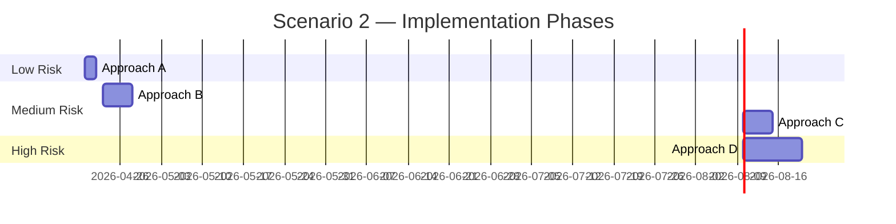
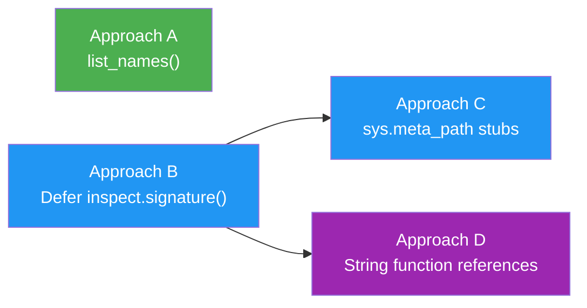

# Scenario 2 — CLI Commands Without Project Dependencies

**Part of spike [#5406](https://github.com/kedro-org/kedro/issues/5406) · [← Scenario 1](scenario_1_selective_loading.md) · [← Overview](on_demand_dependency_loading.md)**

**Goal:** Read-only CLI commands (`kedro registry list`, `kedro registry describe`, `kedro catalog describe-datasets`, inspection API) should function even when heavy project dependencies (sklearn, torch, seaborn) are not installed.

Four approaches address different layers of the stack — they are complementary, not mutually exclusive.

---

## Approach A — Filesystem-based Name Discovery

**Command:** `kedro registry list`

`kedro registry list` only needs pipeline names — no `Pipeline` or `Node` objects. Today iterating `pipelines` triggers `_load_data()`, constructing every `Node` and calling `inspect.signature()` on every function just to print names.

`list_names()` bypasses `_load_data()` entirely by scanning the filesystem directly.

> **Why not `importlib.resources.files()`?** It calls `importlib.import_module()` internally, which would import `my_project.pipelines`. `importlib.util.find_spec()` locates the package on disk without importing it.

```python
# kedro/framework/project/__init__.py — new method on _ProjectPipelines

def list_names(self) -> list[str]:
    """Return pipeline names by scanning the filesystem — no imports."""
    spec = importlib.util.find_spec(PACKAGE_NAME)
    if spec is None or spec.origin is None:
        return list(self.keys())  # fallback to full load

    pipelines_path = Path(spec.origin).parent / "pipelines"
    if not pipelines_path.is_dir():
        return list(self.keys())  # non-standard layout — fallback

    names = [
        d.name for d in pipelines_path.iterdir()
        if d.is_dir() and not d.name.startswith(".") and d.name != "__pycache__"
    ]
    return sorted(["__default__", *names])
```

`list_names()` is **not** wrapped by `_load_data_wrapper`, so calling it never triggers `_load_data()`.

```python
# kedro/framework/cli/registry.py — AFTER
@registry.command("list")
def list_registered_pipelines() -> None:
    click.echo(yaml.dump(pipelines.list_names()))  # zero imports
```

---

## Approach B — Defer `inspect.signature()` to `Node.run()`

**Commands:** `kedro registry describe X`, `kedro catalog describe-datasets -p X`, inspection API

For commands that construct `Pipeline` and `Node` objects but never execute them, the `inspect.signature()` call in `Node.__init__()` serves no purpose — it validates inputs against the function signature, which is only meaningful at execution time. Moving it to `Node.run()` means non-execution commands never trigger it.

```python
# kedro/pipeline/node.py — BEFORE
def __init__(self, func, inputs, outputs, ...):
    ...
    self._validate_inputs(func, inputs)  # ← runs immediately, forces function module import
    self._func = func

# kedro/pipeline/node.py — AFTER
def __init__(self, func, inputs, outputs, ...):
    ...
    self._func = func
    self._inputs = inputs
    self._inputs_validated = False  # NEW
    # Structural checks that don't require imports still run eagerly:
    self._validate_unique_outputs()
    self._validate_inputs_dif_than_outputs()

def run(self, inputs: dict[str, Any]) -> dict[str, Any]:
    if not self._inputs_validated:
        self._validate_inputs(self._func, self._inputs)  # func's module is loaded by now
        self._inputs_validated = True
    ...
```

Expose an explicit `validate()` for test suites and dry-runs that want eager validation:

```python
def validate(self) -> None:
    """Validate inputs against the function signature.
    Called automatically on first run(). Can be called earlier for dry-runs or tests.
    """
    self._validate_inputs(self._func, self._inputs)
    self._inputs_validated = True
```

**What each combination defers:**

| Approaches applied | What still loads at pipeline construction | What is deferred |
|-------------------|-------------------------------------------|-----------------|
| Scenario 1 only | Only X's `pipeline.py` → `nodes.py` → `sklearn` | All other pipelines' modules |
| Scenario 1 + Approach B | Only X's `pipeline.py` → `nodes.py` → `sklearn` | `inspect.signature()` — never runs for non-execution commands |
| Scenario 1 + Approach B + Approach D | Nothing at construction | Both `nodes.py` import and `inspect.signature()` |

> **Key insight:** With Approach B, `inspect.signature()` is never called for commands like `registry describe` since `node.run()` is never invoked. However, `from nodes import train_model` at the top of `pipeline.py` still fires when `pipeline.py` is loaded. Only the signature validation overhead is eliminated — not the module import itself.

---

## Approach C — `sys.meta_path` Stubs for Missing Dependencies

**When to use:** Project dependencies are genuinely not installed (e.g., `kedro run -p data_ingestion` when `seaborn` — required only by `reporting` — is absent).

**Why Scenario 1 alone doesn't cover this:** The error occurs at `importlib.import_module(pipeline_registry_module)` inside `_get_pipelines_registry_callable` — importing `pipeline_registry.py` itself — before `find_pipelines()` or any filter can intervene:

```python
# pipeline_registry.py
from my_project.pipelines.reporting import create_pipeline  # ← seaborn imported here
# ↑ fires when pipeline_registry.py is imported, before register_pipelines() is called
```

**Fix:** Install a scoped `sys.meta_path` hook inside `_load_data()` that intercepts imports of non-requested pipeline sub-packages and returns stubs, preventing their dependencies from ever being needed.

```python
# kedro/framework/project/__init__.py

@contextlib.contextmanager
def _stub_non_requested_pipelines(package_name: str, requested: set[str] | None):
    """Intercept imports of non-requested pipeline sub-packages during _load_data()
    and return stubs so their dependencies are never needed."""
    if requested is None or package_name is None:
        yield
        return

    prefix = f"{package_name}.pipelines."

    class _StubFinder(importlib.abc.MetaPathFinder):
        def find_spec(self, fullname, path, target=None):
            if not fullname.startswith(prefix):
                return None
            pipeline_name = fullname[len(prefix):].split(".")[0]
            if pipeline_name not in requested:
                return importlib.machinery.ModuleSpec(fullname, _StubLoader())
            return None

    class _StubLoader(importlib.abc.Loader):
        def create_module(self, spec):
            return types.ModuleType(spec.name)
        def exec_module(self, module):
            module.create_pipeline = lambda **kwargs: pipeline([])

    finder = _StubFinder()
    sys.meta_path.insert(0, finder)
    try:
        yield
    finally:
        sys.meta_path.remove(finder)
        # Clean up so a subsequent full load works correctly
        for key in list(sys.modules):
            if key.startswith(prefix):
                if key[len(prefix):].split(".")[0] not in (requested or set()):
                    del sys.modules[key]
```

`_load_data()` activates the stub before importing `pipeline_registry.py`:

```python
def _load_data(self) -> None:
    if self._pipelines_module is None or self._is_data_loaded:
        return

    requested = set(self._requested_pipelines) if self._requested_pipelines else None

    with _stub_non_requested_pipelines(PACKAGE_NAME, requested):
        register_pipelines = self._get_pipelines_registry_callable(
            self._pipelines_module          # ← pipeline_registry.py imported here
        )                                   #   top-level imports hit stubs, not real modules
        project_pipelines = register_pipelines()

    self._content = project_pipelines
    self._is_data_loaded = True
```

**Trace through the failing scenario (`seaborn` not installed):**

1. CLI: `kedro run -p data_ingestion` → `pipelines.set_requested(["data_ingestion"])`
2. `pipelines["data_ingestion"]` triggers `_load_data()`
3. Stub hook installed — intercepts `my_project.pipelines.reporting.*`, etc.
4. `importlib.import_module("my_project.pipeline_registry")` runs
5. `from my_project.pipelines.reporting import create_pipeline` → stub returns `lambda **kwargs: Pipeline([])` — **no seaborn import**
6. `from my_project.pipelines.data_ingestion import create_pipeline` → not stubbed, real module loads normally
7. `register_pipelines()` runs — stubs return empty pipelines for non-requested entries
8. Stub hook removed, stubbed modules cleaned from `sys.modules`

**Trade-offs:**
- Works for **any** `register_pipelines` pattern — no user code changes needed
- Scoped tightly to `_load_data()` — installed and removed in the same call
- Stub cleanup ensures a subsequent full `kedro run` (no `--pipeline`) still loads everything correctly
- Non-requested entries in the returned dict are empty `Pipeline([])` — acceptable since they are never accessed in a targeted run

---

## Approach D — String Function References in `Node` (future)

Accept a dotted string path as `func`, deferring both the module import and signature inspection until `node.run()`. This is the deepest level of lazy loading — even `nodes.py` is not imported until execution.

```python
# kedro/pipeline/node.py — future

class Node:
    def __init__(self, func: Callable | str, inputs, outputs, ...):
        if isinstance(func, str):
            self._func_path = func
            self._func: Callable | None = None
            # No import, no inspect.signature — deferred entirely
        else:
            self._func_path = None
            self._func = func
            self._validate_inputs(func, inputs)  # still eager for live callables

    @property
    def func(self) -> Callable:
        """Resolve the function, importing its module on first access."""
        if self._func is None:
            module_path, func_name = self._func_path.rsplit(".", 1)
            module = importlib.import_module(module_path)
            self._func = getattr(module, func_name)
        return self._func

    def run(self, inputs):
        result = self.func(...)  # .func resolves + imports here
```

Usage:

```python
# BEFORE — eager import at module load
from my_project.pipelines.data_science.nodes import train_model

def create_pipeline(**kwargs):
    return pipeline([node(train_model, inputs="X_train", outputs="model")])

# AFTER — deferred via string reference
def create_pipeline(**kwargs):
    return pipeline([
        node(
            "my_project.pipelines.data_science.nodes.train_model",
            inputs="X_train",
            outputs="model",
        )
    ])
```

> **Potential breaking API change.** Key design questions before shipping: backwards compatibility with live callables (must be unchanged), error surfacing (import errors surface at `node.run()` not `Pipeline()` construction — needs clear messages), `node.name` auto-derivation (today from `func.__name__`, needs a fallback for strings), IDE/type-checking support (string paths lose navigation), and `kedro-viz`/inspection tool compatibility.

---

## Implementation Roadmap



### Dependency Graph



Approach A is fully independent. B must land before C or D (C/D both rely on the lazy-validation infrastructure B introduces).

### Risk Assessment

| Approach | Risk | Mitigation |
|----------|------|-----------|
| A: `list_names()` | Low — purely additive; never triggers `_load_data()` | Falls back to full load for non-standard layouts |
| B: Defer `inspect.signature()` | Medium — `TypeError` surfaces at `node.run()` not construction | Expose explicit `node.validate()` for dry-runs and test suites |
| C: `sys.meta_path` stubs | Medium — mutations to `sys.meta_path` can have subtle side effects | Scoped tightly to `_load_data()` with cleanup in `finally`; stub modules removed post-load |
| D: String function references | High — API change, affects IDE tooling, kedro-viz | Gate behind feature flag; maintain backward compatibility with live callables |
