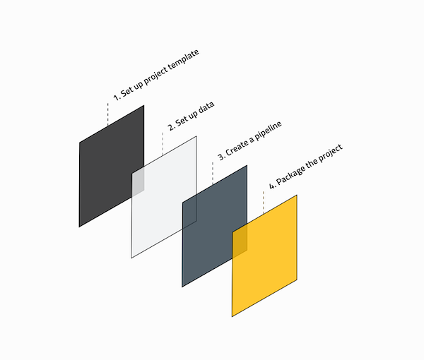

# Kedro spaceflights tutorial

**Scenario**: *It is 2160 and the space tourism industry is booming. Globally, there are thousands of space shuttle companies taking tourists to the Moon and back. You have been able to source amenities offered in each space shuttle, customer reviews and company information.*

**Project**: *You want to construct a model for predicting the price for each trip to the Moon and the corresponding return flight.*

In this tutorial, we illustrate the typical Kedro workflow and the steps necessary to convert an empty Kedro project template into a working project.

In the text, we assume that you create an empty project and follow the flow of the tutorial by copying and pasting the example code into the project as we describe. This tutorial will take approximately 2 hours and you will learn each step of the Kedro project development workflow, by working on an example to construct nodes and pipelines for the price-prediction model.

However, you may prefer to get up and running more swiftly so we provide the full spaceflights example project as a [Kedro starter](../02_get_started/06_starters.md). To create the project:

```bash
kedro new --starter=spaceflights
```

This will generate a project from the [Kedro starter for the spaceflights tutorial](https://github.com/quantumblacklabs/kedro-starters/tree/master/spaceflights) so you can follow the tutorial without any of the copy/pasting.

## Kedro project development workflow

When building a Kedro project, you will typically follow a standard development workflow:



### 1. Set up the project template

* Create a new project with `kedro new`
* Install project dependencies with `kedro install`
* Configure the following in the `conf` folder:
	* Logging
	* Credentials
	* Any other sensitive / personal content

### 2. Set up the data

* Add data to the `data/` folder
* Reference all datasets for the project in `conf/base/catalog.yml`

### 3. Create the pipeline

* Create the data transformation steps as Python functions
* Construct the pipeline by adding your functions as nodes
* Choose how to run the pipeline: sequentially or in parallel

### 4. Package the project

 * Build the project documentation
 * Package the project for distribution

## Optional: Git workflow

### Creating a project repository

We recommend that you use `git` for source control, but Kedro doesn't require it, and can work without any source control management system. This section is optional if you choose not to use a `git` repository.

> Note: If you are unfamiliar with a typical git workflow, you can follow one of the most popular, known as [Gitflow](https://www.atlassian.com/git/tutorials/comparing-workflows/gitflow-workflow).

If you don't have a local `git` repository for your project already, navigate to the project directory and create one:

```bash
git init
git remote add origin https://github.com/<your-repo>
```

### Submitting your changes to GitHub

As you work on a project, you will periodically save your changes. In a team, we suggest that you each develop your code on a branch and create pull requests to submit it to the `develop` or `main` branches:

```bash
# create a new feature branch called 'feature/project-template'
git checkout -b feature/project-template
# stage all the files you have changed
git add .
# commit changes to git with an instructive message
git commit -m 'Create project template'
# push changes to remote branch
git push origin feature/project-template
```

It isn't necessary to branch, but if everyone in a team works on the same branch (e.g. `main`), you may have to resolve merge conflicts more often. Here is an example of working directly on `main`:

```bash
# stage all files
git add .
# commit changes to git with an instructive message
git commit -m 'Create project template'
# push changes to remote main
git push origin main
```
