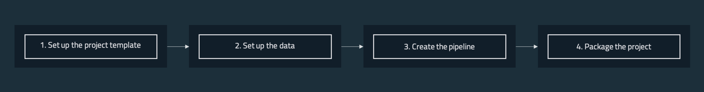

# Typical Kedro workflow

## Development workflow
When building a Kedro project, you will typically follow a standard development workflow:



### 1. Set up the project template

* Create a new project with `kedro new`
* Install dependencies with `kedro install`
* Configure the following in the `conf` folder:
	* Logging
	* Credentials
	* Any other sensitive / personal content

### 2. Set up the data

* Add data to the `data/` folder
* Reference all datasets for the project in `conf/base/catalog.yml`

### 3. Create the pipeline

* Create the data transformation steps as Python functions
* Construct the pipeline by adding your functions as nodes
  - Specify inputs and outputs for each node
* Choose how to run the pipeline: sequentially or in parallel

### 4. Package the project

 * Build the project documentation
 * Package project into [Python wheels](https://pythonwheels.com/) or eggs for distribution

## Git workflow

### Creating a project repository

Kedro doesn't require `git` and can work without any source control management system. However, we recommend keeping your work in a `git` repository. As a start you can follow one of the most popular git workflows known as [Gitflow](https://www.atlassian.com/git/tutorials/comparing-workflows/gitflow-workflow).

To use `git`, if you don't have a local repository for your project already, create it with these commands:

```bash
git init
git remote add origin https://github.com/<your-repo>
```

> Note: These commands must be issued from within the project directory.

### Submitting your changes to GitHub

As you work on a project, you will periodically want to save your changes. If you are working as part of a team, we suggest developing your code on a branch and creating pull requests to submit it to your `develop` or `master` branch:

```bash
# create a new feature branch called 'feature-project-template'
git checkout -b feature/project-template
# stage all the files you have changed
git add .
# commit changes to git with an instructive message
git commit -m 'Create project template'
# push changes to remote branch
git push origin feature/project-template
```

It isn't necessary to branch, but if everyone in a team works on the same branch (e.g. `master`), you may have to resolve merge conflicts more often. Here is an example of working directly on `master`:

```bash
# stage all files
git add .
# commit changes to git with an instructive message
git commit -m 'Create project template'
# push changes to remote master
git push origin master
```
