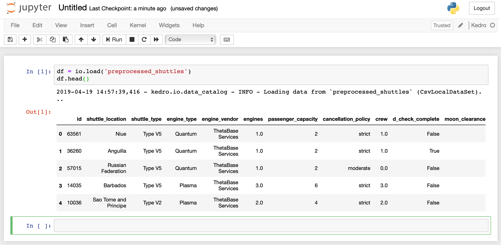

# Creating a pipeline

This section covers how to create a pipeline from a set of `node`s, which are Python functions, as described in more detail in the [nodes and pipelines user guide](../04_user_guide/05_nodes_and_pipelines.md) documentation.

1. As you draft experimental code, you can use a [Jupyter Notebook](./04_create_pipelines.md#working-with-kedro-projects-from-jupyter) or [IPython session](../06_resources/03_ipython.md#working-with-kedro-and-ipython). If you include [`docstrings`](https://google.github.io/styleguide/pyguide.html#38-comments-and-docstrings) to explain what your functions do, you can take advantage of [auto-generated Sphinx documentation](http://www.sphinx-doc.org/en/master/) later on. Once you are happy with how you have written your `node` functions, you will copy & paste the code into the `src/kedro_tutorial/nodes/` folder as a `.py` file.
2. When you are ready with a node you should add it to the pipeline in `src/kedro_tutorial/pipeline.py`, specifying its inputs and outputs.
3. Finally, you will choose how you would like to run your pipeline: sequentially or in parallel, by specifying your preference in `src/kedro_tutorial/run.py`.


## Node basics

You previously registered the raw datasets for your Kedro project, so you can now start processing the data and preparing it for model building. Let’s pre-process two of the datasets ([companies.csv](https://github.com/quantumblacklabs/kedro/tree/develop/docs/source/03_tutorial/data/companies.csv) and [shuttles.xlsx](https://github.com/quantumblacklabs/kedro/tree/develop/docs/source/03_tutorial/data/shuttles.xlsx)) by creating Python functions for each.

Create a file called `data_engineering.py` inside your `nodes` folder and add the following functions:

```python
import pandas as pd


def _is_true(x):
    return x == "t"


def _parse_percentage(x):
    if isinstance(x, str):
        return float(x.replace("%", "")) / 100
    return float("NaN")


def _parse_money(x):
    return float(x.replace("$", "").replace(",", ""))


def preprocess_companies(companies: pd.DataFrame) -> pd.DataFrame:
    """Preprocess the data for companies.

        Args:
            companies: Source data.
        Returns:
            Preprocessed data.

    """

    companies["iata_approved"] = companies["iata_approved"].apply(_is_true)

    companies["company_rating"] = companies["company_rating"].apply(_parse_percentage)

    return companies


def preprocess_shuttles(shuttles: pd.DataFrame) -> pd.DataFrame:
    """Preprocess the data for shuttles.

        Args:
            shuttles: Source data.
        Returns:
            Preprocessed data.

    """
    shuttles["d_check_complete"] = shuttles["d_check_complete"].apply(_is_true)

    shuttles["moon_clearance_complete"] = shuttles["moon_clearance_complete"].apply(
        _is_true
    )

    shuttles["price"] = shuttles["price"].apply(_parse_money)

    return shuttles
```


## Assemble nodes into a pipeline

Now you have functions which take one dataframe and output a pre-processed version of that dataframe. Next you should add these functions as nodes into the pipeline in `pipeline.py`, so the `create_pipeline()` function looks as follows:

```python
def create_pipeline(**kwargs):
    """Create the project's pipeline.

    Args:
        kwargs: Ignore any additional arguments added in the future.

    Returns:
        Pipeline: The resulting pipeline.

    """
    pipeline = Pipeline(
        [
            node(preprocess_companies, "companies", "preprocessed_companies"),
            node(preprocess_shuttles, "shuttles", "preprocessed_shuttles"),
        ]
    )

    return pipeline
```

You will also need to import `node`, and your functions by adding them to the beginning of the `pipeline.py` file:

```python
from kedro.pipeline import node, Pipeline
from kedro_tutorial.nodes.data_engineering import (
    preprocess_companies,
    preprocess_shuttles,
)
```

Now check if your pipeline is running without any errors by typing this in your terminal window:

```bash
kedro run
```

You should see output similar to the following

```bash
kedro run

2019-04-18 19:16:15,206 - root - INFO - ** Kedro project kedro-tutorial
2019-04-18 19:16:15,207 - anyconfig - INFO - Loading: /projects/kedro-tutorial/conf/base/logging.yml
2019-04-18 19:16:15,221 - anyconfig - INFO - Loading: /projects/kedro-tutorial/conf/base/catalog.yml
2019-04-18 19:16:15,225 - anyconfig - INFO - Loading: /projects/kedro-tutorial/conf/local/credentials.yml
2019-04-18 19:16:15,227 - anyconfig - INFO - Loading: /projects/kedro-tutorial/conf/base/parameters.yml
2019-04-18 19:16:15,233 - kedro.io.data_catalog - INFO - Loading data from `companies` (CSVLocalDataSet)...
2019-04-18 19:16:15,365 - kedro.io.data_catalog - INFO - Saving data to `preprocessed_companies` (MemoryDataSet)...
2019-04-18 19:16:15,366 - kedro.runner.sequential_runner - INFO - Completed 1 out of 2 tasks
2019-04-18 19:16:15,367 - kedro.io.data_catalog - INFO - Loading data from `shuttles` (ExcelLocalDataSet)...
2019-04-18 19:16:35,738 - kedro.io.data_catalog - INFO - Saving data to `preprocessed_shuttles` (MemoryDataSet)...
2019-04-18 19:16:35,745 - kedro.runner.sequential_runner - INFO - Completed 2 out of 2 tasks
2019-04-18 19:16:35,745 - kedro.runner.sequential_runner - INFO - Pipeline execution completed successfully.
2019-04-18 19:16:35,746 - kedro.io.data_catalog - INFO - Loading data from `preprocessed_shuttles` (MemoryDataSet)...
2019-04-18 19:16:35,748 - kedro.io.data_catalog - INFO - Loading data from `preprocessed_companies` (MemoryDataSet)...
```


## Persisting pre-processed data

Now each of our 2 newly added data preprocessing nodes outputs a new dataset: `preprocessed_companies` and `preprocessed_shuttles` respectively. Node inputs and outputs are used by the pipeline to determine interdependencies between the nodes, and hence, their execution order.

When Kedro ran the pipeline, it determined that those datasets were not registered in the data catalog (`conf/base/catalog.yml`). If a dataset is not registered, Kedro stores it in memory as a Python object using the `MemoryDataSet` class. Once all nodes depending on it have been executed, a `MemoryDataSet` is cleared and its memory released by the Python garbage collector.

If you prefer, you can persist any preprocessed data by adding the following to the `conf/base/catalog.yml` file:

```yaml
preprocessed_companies:
  type: CSVLocalDataSet
  filepath: data/02_intermediate/preprocessed_companies.csv

preprocessed_shuttles:
  type: CSVLocalDataSet
  filepath: data/02_intermediate/preprocessed_shuttles.csv
```

By doing so you explicitly declare that `CSVLocalDataSet` should be used instead of `MemoryDataSet`. `CSVLocalDataSet` will save the data as a CSV file to the local `filepath` specified. There is no need to change any code in your preprocessing functions to accommodate this change. `DataCatalog` will take care of saving those datasets automatically the next time you run the pipeline:

```bash
kedro run
```

`CSVLocalDataSet` is chosen for its simplicity, but you can choose any other available dataset implementation class to save the data, for example, to a database table, cloud storage (like [AWS S3](https://aws.amazon.com/s3/), [Azure Blob Storage](https://azure.microsoft.com/en-gb/services/storage/blobs/), etc.) and others. If you cannot find the dataset implementation you need, you can easily implement your own as [you already did earlier](./03_set_up_data.md#creating-custom-datasets) and share it with the world by contributing back to Kedro!


## Working with Kedro projects from Jupyter

Currently, the pipeline consists of just two nodes and performs just some data pre-processing. Let's expand it by adding more nodes.

When you are developing new nodes for your pipeline, you can write them as regular Python functions, but you may want to use Jupyter Notebooks for experimenting with your code before committing to a specific implementation. To take advantage of Kedro's Jupyter session, you can run this in your terminal:

```bash
kedro jupyter notebook
```

This will open a Jupyter Notebook in your browser. Navigate to `notebooks` folder and create a notebook there with a Kedro kernel. After opening the newly created notebook you can check what the data looks like by pasting this into the first cell of the notebook and selecting **Run**:

```python
df = io.load('preprocessed_shuttles')
df.head()
```

You should be able to see the first 5 rows of the loaded dataset as follows:



> *Note:* 
<br/>If you see an error message stating that `io` is undefined, you can see what went wrong by using `print(startup_error)`, where `startup_error` is available as a variable in Python. 
<br/>If you cannot access `startup_error` please make sure you have run **`kedro`**`jupyter notebook` from the project's root directory. Running without the `kedro` command (that is, just running a `jupyter notebook`) will not load the Kedro session for you.
<br/>When you add new datasets to your `catalog.yml` file you need to reload Kedro's session by running `%reload_kedro` in your cell.


## Creating a master table

We need to add a function to join together the three dataframes into a single master table in a cell in the notebook as follows:

```python
import pandas as pd

def create_master_table(
    shuttles: pd.DataFrame, companies: pd.DataFrame, reviews: pd.DataFrame
) -> pd.DataFrame:
    """Combines all data to create a master table.

        Args:
            shuttles: Preprocessed data for shuttles.
            companies: Preprocessed data for companies.
            reviews: Source data for reviews.
        Returns:
            Master table.

    """
    rated_shuttles = shuttles.merge(reviews, left_on="id", right_on="shuttle_id")

    with_companies = rated_shuttles.merge(
        companies, left_on="company_id", right_on="id"
    )

    master_table = with_companies.drop(["shuttle_id", "company_id"], axis=1)
    master_table = master_table.dropna()
    return master_table
```

### Working in a Jupyter notebook

To create a new node to join all tables to form a master table, you need to add the three dataframes to a cell in the Jupyter notebook:

```python
preprocessed_shuttles = io.load("preprocessed_shuttles")
preprocessed_companies = io.load("preprocessed_companies")
reviews = io.load("reviews")

master = create_master_table(preprocessed_shuttles, preprocessed_companies, reviews)
master.head()
```

### Extending the project's code

Having tested that all is working with the master table, it is now time to add the code you've worked on to the Spaceflights project code. First, add the `create_master_table()` function from the snippet above to `data_engineering.py` (you do not need to copy the import statement `import pandas as pd`).

Then you should add it to the pipeline in `pipeline.py` by adding the node as follows:

```python
node(
    create_master_table,
    ["preprocessed_shuttles", "preprocessed_companies", "reviews"],
    "master_table"
),
```
By adding this code to the project, you are telling Kedro that the function `create_master_table` should be called with the data loaded from datasets `preprocessed_shuttles`, `preprocessed_companies`, and `reviews` and the output should be saved to dataset `master_table`.

You will also need to add an import statement for `create_master_table` at the top of the file:

```python
from kedro_tutorial.nodes.data_engineering import (
    preprocess_companies,
    preprocess_shuttles,
    create_master_table,
)
```

If you want your data to be saved to file rather than used in-memory, you also need to add an entry to the `catalog.yml` file like this:

```yaml
master_table:
  type: CSVLocalDataSet
  filepath: data/03_primary/master_table.csv
```

You may want to test that all is working with your code at this point:

```bash
kedro run

2019-04-19 15:44:21,748 - root - INFO - ** Kedro project kedro-tutorial
2019-04-19 15:44:21,749 - anyconfig - INFO - Loading: /projects/kedro-tutorial/conf/base/logging.yml
2019-04-19 15:44:21,762 - anyconfig - INFO - Loading: /projects/kedro-tutorial/conf/base/catalog.yml
2019-04-19 15:44:21,769 - anyconfig - INFO - Loading: /projects/kedro-tutorial/conf/local/credentials.yml
2019-04-19 15:44:21,771 - anyconfig - INFO - Loading: /projects/kedro-tutorial/conf/base/parameters.yml
2019-04-19 15:44:21,777 - kedro.io.data_catalog - INFO - Loading data from `companies` (CSVLocalDataSet)...
2019-04-19 15:44:21,909 - kedro.io.data_catalog - INFO - Saving data to `preprocessed_companies` (CSVLocalDataSet)...
2019-04-19 15:44:22,224 - kedro.runner.sequential_runner - INFO - Completed 1 out of 3 tasks
2019-04-19 15:44:22,224 - kedro.io.data_catalog - INFO - Loading data from `shuttles` (ExcelLocalDataSet)...
2019-04-19 15:44:44,310 - kedro.io.data_catalog - INFO - Saving data to `preprocessed_shuttles` (CSVLocalDataSet)...
2019-04-19 15:44:44,993 - kedro.runner.sequential_runner - INFO - Completed 2 out of 3 tasks
2019-04-19 15:44:44,994 - kedro.io.data_catalog - INFO - Loading data from `preprocessed_shuttles` (CSVLocalDataSet)...
2019-04-19 15:44:45,132 - kedro.io.data_catalog - INFO - Loading data from `preprocessed_companies` (CSVLocalDataSet)...
2019-04-19 15:44:45,178 - kedro.io.data_catalog - INFO - Loading data from `reviews` (CSVLocalDataSet)...
2019-04-19 15:44:47,909 - kedro.io.data_catalog - INFO - Saving data to `master_table` (CSVLocalDataSet)...
2019-04-19 15:45:02,448 - kedro.runner.sequential_runner - INFO - Completed 3 out of 3 tasks
2019-04-19 15:45:02,449 - kedro.runner.sequential_runner - INFO - Pipeline execution completed successfully.
```


## Working with multiple pipelines

Having merged three input datasets to create a master table, you are now ready to make another pipeline for a price prediction model. It will be called the data science pipeline.

For this example, we will use a [`LinearRegression`](https://scikit-learn.org/stable/modules/generated/sklearn.linear_model.LinearRegression.html) implementation from the [scikit-learn](https://scikit-learn.org/stable/) library.

You can start by updating the dependencies in `src/requirements.txt` with the following:

```text
scikit-learn==0.20.2
```

You can find out more about requirements files [here](https://pip.pypa.io/en/stable/user_guide/#requirements-files). 

Then, from within the project directory, run:

```bash
kedro install
```

Next, create a file `src/kedro_tutorial/nodes/price_prediction.py` and add the following code to it:

```python
import logging
from typing import Dict, List

import numpy as np
import pandas as pd
from sklearn.linear_model import LinearRegression
from sklearn.metrics import r2_score
from sklearn.model_selection import train_test_split


def split_data(data: pd.DataFrame, parameters: Dict) -> List:
    """Splits data into training and test sets.

        Args:
            data: Source data.
            parameters: Parameters defined in parameters.yml.
            
        Returns:
            A list containing split data.

    """
    X = data[
        [
            "engines",
            "passenger_capacity",
            "crew",
            "d_check_complete",
            "moon_clearance_complete",
        ]
    ].values
    y = data["price"].values
    X_train, X_test, y_train, y_test = train_test_split(
        X, y, test_size=parameters["test_size"], random_state=parameters["random_state"]
    )

    return [X_train, X_test, y_train, y_test]


def train_model(X_train: np.ndarray, y_train: np.ndarray) -> LinearRegression:
    """Train the linear regression model.

        Args:
            X_train: Training data of independent features.
            y_train: Training data for price.
            
        Returns:
            Trained model.

    """
    regressor = LinearRegression()
    regressor.fit(X_train, y_train)
    return regressor


def evaluate_model(regressor: LinearRegression, X_test: np.ndarray, y_test: np.ndarray):
    """Calculate the coefficient of determination and log the result.

        Args:
            regressor: Trained model.
            X_test: Testing data of independent features.
            y_test: Testing data for price.

    """
    y_pred = regressor.predict(X_test)
    score = r2_score(y_test, y_pred)
    logger = logging.getLogger(__name__)
    logger.info("Model has a coefficient R^2 of %.3f.", score)
```
Add the following to `conf/base/parameters.yml`:

```yaml
test_size: 0.2
random_state: 3
```

These are the parameters fed into the `DataCatalog` when the pipeline is executed (see the details in `create_catalog()` and `main()` in `src/kedro_tutorial/run.py`).

Next, register the dataset, which will save the trained model, by adding the following definition to `conf/base/catalog.yml`:

```yaml
regressor:
  type: PickleLocalDataSet
  filepath: data/06_models/regressor.pickle
  versioned: true
```

> *Note:* Versioning is enabled for `regressor`, which means that the pickled output of the `regressor` will be versioned and saved every time the pipeline is run. This allows us to keep the history of the models built using this pipeline. See the details in the [Versioning](../04_user_guide/07_advanced_io.md#versioning) section of the User Guide.

Now to create a pipeline for the price prediction model. In `src/kedro_tutorial/nodes/pipeline.py`, update `create_pipeline()` to add an extra import statement as follows:

```python
from kedro_tutorial.nodes.price_prediction import split_data, train_model, evaluate_model
```

Then add a separate pipeline, by replacing the code in `create_pipeline()` as follows:

```python
def create_pipeline(**kwargs):
    """Create the project's pipeline.

    Args:
        kwargs: Ignore any additional arguments added in the future.

    Returns:
        Pipeline: The resulting pipeline.

    """
    de_pipeline = Pipeline(
        [
            node(preprocess_companies, "companies", "preprocessed_companies"),
            node(preprocess_shuttles, "shuttles", "preprocessed_shuttles"),
            node(
                create_master_table,
                ["preprocessed_shuttles", "preprocessed_companies", "reviews"],
                "master_table",
            ),
        ]
    )

    ds_pipeline = Pipeline(
        [
            node(
                split_data,
                ["master_table", "parameters"],
                ["X_train", "X_test", "y_train", "y_test"],
            ),
            node(train_model, ["X_train", "y_train"], "regressor"),
            node(evaluate_model, ["regressor", "X_test", "y_test"], None),
        ]
    )

    return de_pipeline + ds_pipeline
```

The first node of the `ds_pipeline` outputs 4 objects: `X_train`, `X_test`, `y_train`, `y_test`, which are not registered in `conf/base/catalog.yml`. (If you recall, if a dataset is not specified in the catalog, Kedro will automatically save it in memory using the `MemoryDataSet`). Normally you would add dataset definitions of your model features into `conf/base/catalog.yml` with the save location in `data/04_features/`.

The two pipelines are merged together in `de_pipeline + ds_pipeline`. Both pipelines will be executed when you invoke the following:

```bash
kedro run
```
You should see output similar to the following:

```bash
kedro run

2019-04-19 16:02:47,383 - root - INFO - ** Kedro project kedro-tutorial
2019-04-19 16:02:47,385 - anyconfig - INFO - Loading: /projects/kedro-tutorial/conf/base/logging.yml
2019-04-19 16:02:47,398 - anyconfig - INFO - Loading: /projects/kedro-tutorial/conf/base/catalog.yml
2019-04-19 16:02:47,405 - anyconfig - INFO - Loading: /projects/kedro-tutorial/conf/local/credentials.yml
2019-04-19 16:02:47,407 - anyconfig - INFO - Loading: /projects/kedro-tutorial/conf/base/parameters.yml
2019-04-19 16:02:47,414 - kedro.io.data_catalog - INFO - Loading data from `companies` (CSVLocalDataSet)...
2019-04-19 16:02:47,540 - kedro.io.data_catalog - INFO - Saving data to `preprocessed_companies` (CSVLocalDataSet)...
2019-04-19 16:02:47,854 - kedro.runner.sequential_runner - INFO - Completed 1 out of 6 tasks
2019-04-19 16:02:47,854 - kedro.io.data_catalog - INFO - Loading data from `shuttles` (ExcelLocalDataSet)...
2019-04-19 16:03:10,498 - kedro.io.data_catalog - INFO - Saving data to `preprocessed_shuttles` (CSVLocalDataSet)...
2019-04-19 16:03:11,163 - kedro.runner.sequential_runner - INFO - Completed 2 out of 6 tasks
2019-04-19 16:03:11,163 - kedro.io.data_catalog - INFO - Loading data from `preprocessed_shuttles` (CSVLocalDataSet)...
2019-04-19 16:03:11,307 - kedro.io.data_catalog - INFO - Loading data from `preprocessed_companies` (CSVLocalDataSet)...
2019-04-19 16:03:11,355 - kedro.io.data_catalog - INFO - Loading data from `reviews` (CSVLocalDataSet)...
2019-04-19 16:03:14,627 - kedro.io.data_catalog - INFO - Saving data to `master_table` (CSVLocalDataSet)...
2019-04-19 16:03:29,827 - kedro.runner.sequential_runner - INFO - Completed 3 out of 6 tasks
2019-04-19 16:03:29,827 - kedro.io.data_catalog - INFO - Loading data from `master_table` (CSVLocalDataSet)...
2019-04-19 16:03:32,491 - kedro.io.data_catalog - INFO - Loading data from `parameters` (MemoryDataSet)...
2019-04-19 16:03:32,950 - kedro.io.data_catalog - INFO - Saving data to `y_test` (MemoryDataSet)...
2019-04-19 16:03:32,952 - kedro.io.data_catalog - INFO - Saving data to `y_train` (MemoryDataSet)...
2019-04-19 16:03:32,953 - kedro.io.data_catalog - INFO - Saving data to `X_train` (MemoryDataSet)...
2019-04-19 16:03:32,993 - kedro.io.data_catalog - INFO - Saving data to `X_test` (MemoryDataSet)...
2019-04-19 16:03:33,062 - kedro.runner.sequential_runner - INFO - Completed 4 out of 6 tasks
2019-04-19 16:03:33,062 - kedro.io.data_catalog - INFO - Loading data from `X_train` (MemoryDataSet)...
2019-04-19 16:03:33,134 - kedro.io.data_catalog - INFO - Loading data from `y_train` (MemoryDataSet)...
2019-04-19 16:03:33,399 - kedro.io.data_catalog - INFO - Saving data to `regressor` (PickleLocalDataSet)...
2019-04-19 16:03:33,469 - kedro.runner.sequential_runner - INFO - Completed 5 out of 6 tasks
2019-04-19 16:03:33,469 - kedro.io.data_catalog - INFO - Loading data from `regressor` (PickleLocalDataSet)...
2019-04-19 16:03:33,470 - kedro.io.data_catalog - INFO - Loading data from `X_test` (MemoryDataSet)...
2019-04-19 16:03:33,487 - kedro.io.data_catalog - INFO - Loading data from `y_test` (MemoryDataSet)...
2019-04-19 16:03:33,538 - kedro_tutorial.nodes.price_prediction - INFO - Model has a coefficient R^2 of 0.456.
2019-04-19 16:03:33,573 - kedro.runner.sequential_runner - INFO - Completed 6 out of 6 tasks
2019-04-19 16:03:33,573 - kedro.runner.sequential_runner - INFO - Pipeline execution completed successfully.
```

The `de_pipeline` will preprocess the data, and `ds_pipeline` will then create features, train and evaluate the model.

> *Note:* The order in which you add the pipelines together is not significant and `ds_pipeline + de_pipeline` will result in the same pipeline, since Kedro automatically detects the correct execution order for all the nodes in the resulting pipeline.


## Partial pipeline runs

In some cases, you may want to partially run the pipeline. For example, you may need to only run the `ds_pipeline` to tune the hyperparameters of the price prediction model and skip `de_pipeline` execution. The most obvious way of doing this is by modifying your Python code for pipeline definition, however, this method sometimes introduces errors.

A better way to run partial pipelines without changing your code is to use tags. Each node within the pipeline can be tagged by passing **`name`** into the `Pipeline()`. Update the `create_pipeline()` code in `pipeline.py` one more time:

```python
def create_pipeline(**kwargs):
    """Create the project's pipeline.

    Args:
        kwargs: Ignore any additional arguments added in the future.

    Returns:
        Pipeline: The resulting pipeline.

    """
    de_pipeline = Pipeline(
        [
            node(preprocess_companies, "companies", "preprocessed_companies"),
            node(preprocess_shuttles, "shuttles", "preprocessed_shuttles"),
            node(
                create_master_table,
                ["preprocessed_shuttles", "preprocessed_companies", "reviews"],
                "master_table",
            ),
        ],
        name="de",
    )

    ds_pipeline = Pipeline(
        [
            node(
                split_data,
                ["master_table", "parameters"],
                ["X_train", "X_test", "y_train", "y_test"],
            ),
            node(train_model, ["X_train", "y_train"], "regressor"),
            node(evaluate_model, ["regressor", "X_test", "y_test"], None),
        ],
        name="ds",
    )

    return de_pipeline + ds_pipeline
```

Should you need to, you can add more than one tag to the pipeline by adding `name=['tag1', 'tag2']`.

To run a partial pipeline:

```bash
kedro run --tag=ds
```

This will skip the execution of the pipeline with tag `de` and only run the `ds` nodes (found within the `ds_pipeline`). If you want to run the whole pipeline:

```bash
kedro run
```

or:

```bash
kedro run --tag=ds --tag=de
```

> *Note:* You can also attach tags to the individual nodes by passing the `tags` keyword to the `node()` function, and these are used in addition to any tags specified at the pipeline level. To tag a node as `my-regressor-node`:

```python
node(
    train_model, 
    ["X_train", "y_train"], 
    "regressor", 
    tags=["my-regressor-node"],
)
```


## Using decorators for nodes and pipelines

In this section, you will learn about Kedro's built-in decorators as well as how to create your own node and pipeline decorators.

[Python decorators](https://wiki.python.org/moin/PythonDecorators) can be applied to Kedro nodes. Let's walk through an example of building our own decorator for logging the execution time of each node.

### Decorating the nodes

Logging the execution time for each node can be performed by creating a function and adding it to each node as a decorator.

In `data_engineering.py`, add the following decorator function near the top of the file:

```python
from functools import wraps
from typing import Callable
import time
import logging

def log_running_time(func: Callable) -> Callable:
    """Decorator for logging node execution time.

        Args:
            func: Function to be executed.
            
        Returns:
            Decorator for logging the running time.

    """
    @wraps(func)
    def with_time(*args, **kwargs):
        log = logging.getLogger(__name__)
        t_start = time.time()
        result = func(*args, **kwargs)
        t_end = time.time()
        elapsed = t_end - t_start
        log.info("Running %r took %.2f seconds", func.__name__, elapsed)
        return result
    return with_time
```

And apply it to each data engineering function by prepending `@log_running_time` to the definition:

```python
@log_running_time
def preprocess_companies(companies: pd.DataFrame) -> pd.DataFrame:
    ...

@log_running_time
def preprocess_shuttles(shuttles: pd.DataFrame) -> pd.DataFrame:
    ...
```

Then, if you run your pipeline from the command line, you should see a similar output:

```bash
kedro run

...
kedro_tutorial.nodes.data_engineering - INFO - Running 'preprocess_companies' took XXX seconds
...
kedro_tutorial.nodes.data_engineering - INFO - Running 'preprocess_shuttles' took XXX seconds
```

### Decorating the pipeline

A decorator can also be applied to the pipeline rather than each node. In `src/kedro_tutorial/nodes/pipeline.py`, update the imports from `data_engineering.py` as follows:

```python
from kedro_tutorial.nodes.data_engineering import (
    preprocess_companies,
    preprocess_shuttles,
    create_master_table,
    log_running_time,
)
```

Then add the decorators to the pipeline:

```python
def create_pipeline(**kwargs):
    """Create the project's pipeline.

    Args:
        kwargs: Ignore any additional arguments added in the future.

    Returns:
        Pipeline: The resulting pipeline.

    """
    de_pipeline = Pipeline(
        [
            node(preprocess_companies, "companies", "preprocessed_companies"),
            node(preprocess_shuttles, "shuttles", "preprocessed_shuttles"),
            node(
                create_master_table,
                ["preprocessed_shuttles", "preprocessed_companies", "reviews"],
                "master_table",
            ),
        ],
        name="de",
    ).decorate(log_running_time)

    ds_pipeline = Pipeline(
        [
            node(
                split_data,
                ["master_table", "parameters"],
                ["X_train", "X_test", "y_train", "y_test"],
            ),
            node(train_model, ["X_train", "y_train"], "regressor"),
            node(evaluate_model, ["regressor", "X_test", "y_test"], None),
        ],
        name="ds",
    ).decorate(log_running_time)

    return de_pipeline + ds_pipeline
```

This decorator is commonly used and Kedro already includes it as a built-in decorator called `kedro.pipeline.decorators.log_time`.

Another built-in decorator is `kedro.pipeline.decorators.mem_profile`, which will log the maximum memory usage of your node.


## Kedro runners

Having specified the data catalog and the pipeline, you are now ready to run the pipeline. There are two different runners you can specify:  

* `SequentialRunner` - runs your nodes sequentially; once a node has completed its task then the next one starts.
* `ParallelRunner` - runs your nodes in parallel; independent nodes are able to run at the same time, allowing you to take advantage of multiple CPU cores.

By default, `src/kedro_tutorial/run.py` uses a `SequentialRunner`, which is instantiated when you execute `kedro run` from the command line. Switching to use `ParallelRunner` is as simple as providing an additional flag when running the pipeline from the command line as follows:

```bash
kedro run --parallel
```

`ParallelRunner` executes the pipeline nodes in parallel, and is more efficient when there are independent branches in your pipeline. 

> *Note:* `ParallelRunner` performs task parallelisation, which is different from data parallelisation as seen in PySpark.
