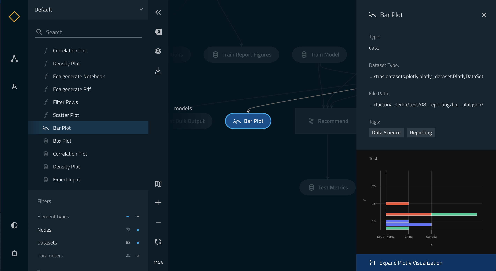
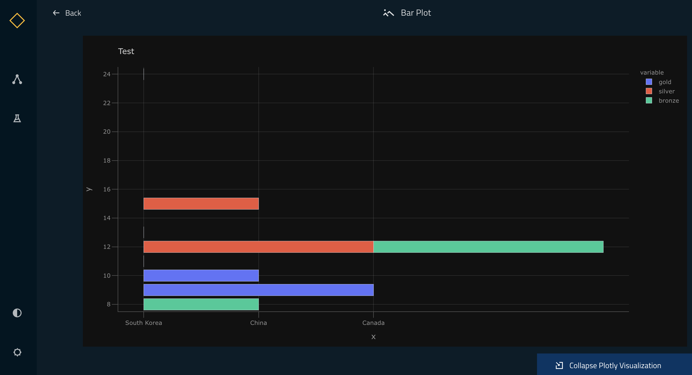

# Visualise pipelines

[Kedro-Viz](https://github.com/quantumblacklabs/kedro-viz) displays data and machine-learning pipelines in an informative way, emphasising the connections between datasets and nodes. It shows the structure of your Kedro pipeline. This exercise assumes that you have been following the [Spaceflights tutorial](01_spaceflights_tutorial.md).

## Install Kedro-Viz

You can install Kedro-Viz by running:
```bash
pip install kedro-viz
```

## Visualise a whole pipeline

You should be in your project root directory, and once Kedro-Viz is installed you can visualise your pipeline by running:
```bash
kedro viz
```

This command will run a server on http://127.0.0.1:4141 that will open up your visualisation on a browser. You should
 be able to see the following:


You may also use the `--autoreload` flag to autoreload Kedro Viz when a `Python` or `YAML` file has changed in the corresponding Kedro project.


If a visualisation panel opens up and a pipeline is not visible then please check that your [pipeline definition](04_create_pipelines.md) is complete. All other errors can be logged as GitHub Issues on the [Kedro-Viz repository](https://github.com/quantumblacklabs/kedro-viz).

## Exit an open visualisation

You exit this visualisation by closing the open browser and entering **Ctrl+C** or **Cmd+C** in your terminal.

## Visualise layers

A pipeline can be broken up into different layers according to how data is processed, and using a convention for layers makes it easier to collaborate. For example, the [data engineering convention](../12_faq/01_faq.md#what-is-data-engineering-convention) shown here labels datasets according to the stage of the pipeline (e.g. whether the data has been cleaned).

Kedro-Viz makes it easy to visualise these data processing stages by adding a `layer` attribute to the datasets in the Data Catalog. We will be modifying `catalog.yml` with the following:

```yaml
companies:
  type: pandas.CSVDataSet
  filepath: data/01_raw/companies.csv
  layer: raw

reviews:
  type: pandas.CSVDataSet
  filepath: data/01_raw/reviews.csv
  layer: raw

shuttles:
  type: pandas.ExcelDataSet
  filepath: data/01_raw/shuttles.xlsx
  layer: raw

preprocessed_companies:
  type: pandas.CSVDataSet
  filepath: data/02_intermediate/preprocessed_companies.csv
  layer: intermediate

preprocessed_shuttles:
  type: pandas.CSVDataSet
  filepath: data/02_intermediate/preprocessed_shuttles.csv
  layer: intermediate

model_input_table:
  type: pandas.CSVDataSet
  filepath: data/03_primary/model_input_table.csv
  layer: primary

regressor:
  type: pickle.PickleDataSet
  filepath: data/06_models/regressor.pickle
  versioned: true
  layer: models
```

Run kedro-viz again with `kedro viz` and observe how your visualisation has changed to indicate the layers:


## Share a pipeline

Visualisations from Kedro-Viz are made shareable by using functionality that allows you to save the visualisation as a JSON file.

To save a visualisation, run:
```
kedro viz --save-file my_shareable_pipeline.json
```

This command will save a pipeline visualisation of your primary `__default__` pipeline as a JSON file called `my_shareable_pipeline.json`.

To visualise a saved pipeline, run:
```
kedro viz --load-file my_shareable_pipeline.json
```

And this will visualise the pipeline visualisation saved as `my_shareable_pipeline.json`.


## Visualise Plotly charts in Kedro-viz

[Plotly](https://plotly.com/python/) is a free and open source python library that allows you to make interactive, publication quality graphs. With Plotly integration on Kedro-viz, you can output your interactive charts as part of your pipline visualisation. 

Kedro-viz aims to help users communicate different aspects of thier workflow and with Plotly intergration, we take one step further in this direction to allow our users share thier data insights as well. 

We have also used Plotly intergration to allow users to [visualise metrics from experiments](https://kedro.readthedocs.io/en/stable/08_logging/02_experiment_tracking.html?highlight=experiment%20tracking). 

NOTE : Kedro's Plotly integration is currently only supported for [Plotly Express](https://plotly.com/python/plotly-express/) charts. 

You can view Plotly charts in Kedro-Viz when you use Kedro's plotly datasets.

There are two plotly datasets in Kedro :
- [plotly.PlotlyDataSet](https://kedro.readthedocs.io/en/stable/kedro.extras.datasets.plotly.PlotlyDataSet.html#kedro.extras.datasets.plotly.PlotlyDataSet) - To use this dataset you need to specify the configurations of your plot in the `catalog.yml`.

```yaml
bar_plot:
  type: plotly.PlotlyDataSet
  filepath: data/08_reporting/bar_plot.json
  plotly_args:
    type: bar
    fig:
      x: features
      y: importance
      orientation: h
    layout:
      xaxis_title: x
      yaxis_title: y
      title: Test
```


- [plotly.JSONDataSet](https://kedro.readthedocs.io/en/stable/kedro.extras.datasets.plotly.JSONDataSet.html#kedro.extras.datasets.plotly.JSONDataSet) - To use this dataset you need to specify the configurations of your plot using plotly-express python library in your kedro node.

```python
import plotly.express as px
from kedro.extras.datasets.plotly import JSONDataSet


def plot():
    fig = px.bar(x=["a", "b", "c"], y=[1, 3, 2])
    data_set = JSONDataSet(filepath="test.json")
    data_set.save(fig)
    reloaded = data_set.load()
    assert fig == reloaded
    return fig
```

For plotly.JSONDataSet, you will also need to specify the output type in `catalog.yml`.

```yaml
test.json:
  type: plotly.JSONDataSet
  filepath: data/08_reporting/bar_plot.json
```

Once the above set-up is completed, you can do a `kedro run` followed by `kedro viz` and your Kedro-viz pipeline will show a new dataset type with icon  . Once you click on the node, you can see a small preview of your Plotly chart in the metadata panel.




The visualisation can be expanded using the 'Expand Plotly Visualisation' button.




