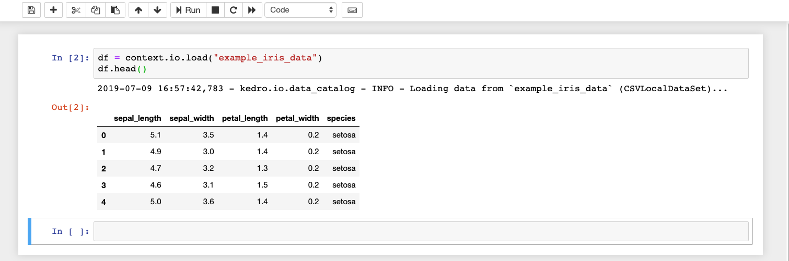
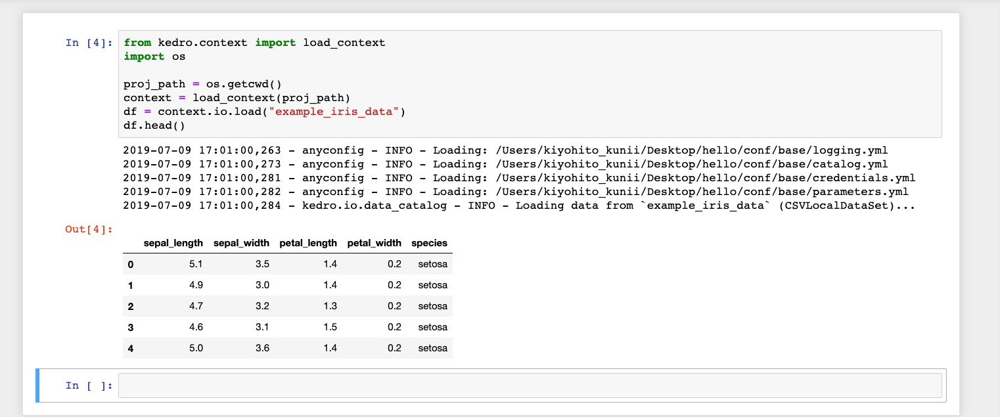
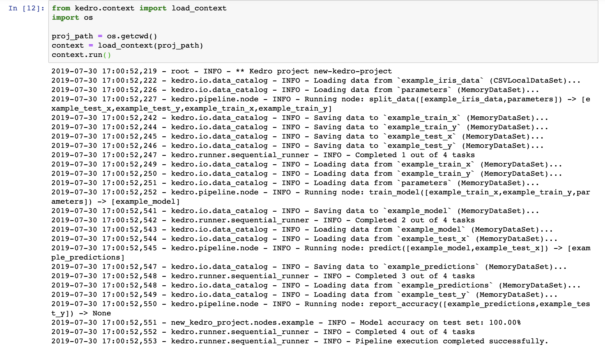

# Working with IPython and Jupyter Notebooks / Lab

> *Note:* This documentation is based on `Kedro 0.15.4`, if you spot anything that is incorrect then please create an [issue](https://github.com/quantumblacklabs/kedro/issues) or pull request.

In order to experiment with the code interactively, you may want to use a Python kernel inside a Jupyter notebook (formerly known as IPython).

To start a standalone IPython session, run the following command in the root directory of the project:

```bash
kedro ipython
```

Every time you start/restart an IPython session, a startup script (`<your_project_name>/.ipython/profile_default/startup/00-kedro-init.py`) will add the following variables in scope:

- `context` (`KedroContext`) - Kedro project context which holds the configuration
- `catalog` (`DataCatalog`) - Data catalog instance which contains all defined datasets
- `startup_error` (`Exception`) - An error that was raised during the execution of the startup script or `None` if no errors occurred

To reload these at any point (e.g., if you updated `catalog.yml`) use the [line magic](https://ipython.readthedocs.io/en/stable/interactive/magics.html) `%reload_kedro`. This magic can also be used to see the error message if any of the variables above are undefined.

With `context`, you can access the following variables and methods
- `context.project_path` (`Path`) - Root directory of the project
- `context.project_name` (`str`) - Project folder name
- `context.io` or `context.catalog` (`DataCatalog`) - Data catalog
- `context.config_loader` - An instance of `ConfigLoader`
- `context.pipeline` (`Pipeline`) - Defined pipeline
- `context.run` (`None`) - Method to run the pipeline with following arguments:
  - `tags`: An optional list of node tags which should be used to
          filter the nodes of the ``Pipeline``. If specified, only the nodes
          containing *any* of these tags will be added to the ``Pipeline``
  - `runner`: An optional parameter specifying the runner _instance_ that you want to run
          the pipeline with
  - `node_names`: An optional list of node names which should be used to
          filter the nodes of the ``Pipeline``. If specified, only the nodes
          with these names will be run.
  - `from_nodes`: An optional list of node names which should be used as a
          starting point of the new ``Pipeline``.
  - `to_nodes`: An optional list of node names which should be used as an
          end point of the new ``Pipeline``.

You can easily add customised global variables in `.ipython/profile_default/startup/00-kedro-init.py`. For example, if you want to add a global variable for `parameters` from `parameters.yml`, update `reload_kedro()` as follows:

```python
@register_line_magic
def reload_kedro(project_path, line=None):
    """"Line magic which reloads all Kedro default variables."""
    # ...
    global parameters
    try:
        # ...
        context = load_context(path)
        parameters = context.config_loader.get("parameters*", "parameters*/**")
        # ...
        logging.info("Defined global variable `context`, `catalog` and `parameters`")

```

## Loading `DataCatalog` in IPython

You can load a dataset of [Iris test example](https://archive.ics.uci.edu/ml/datasets/iris) inside the IPython console, by simply executing the following:

```python
context.catalog.load("example_iris_data").head()
```

```bash
kedro.io.data_catalog - INFO - Loading data from `example_iris_data` (CSVLocalDataSet)...

   sepal_length  sepal_width  petal_length  petal_width species
0           5.1          3.5           1.4          0.2  setosa
1           4.9          3.0           1.4          0.2  setosa
2           4.7          3.2           1.3          0.2  setosa
3           4.6          3.1           1.5          0.2  setosa
4           5.0          3.6           1.4          0.2  setosa
```

When you have finished, you can exit IPython by typing:

```python
exit()
```

## Working with Kedro Projects from Jupyter

>*Note:* Similar to IPython, you can use the above functionality in Jupyter Notebook / Lab. There are two ways to access the `context` object.

When you are developing new nodes for your pipeline, you can write them as regular Python functions, but you may want to use Jupyter Notebooks for experimenting with your code before committing to a specific implementation. To take advantage of Kedro's Jupyter session, you can run this in your terminal:

```bash
kedro jupyter notebook
```

This will open a Jupyter Notebook in your browser. Navigate to `notebooks` folder
and create a notebook. The only kernel available by default has a name of the current project.
If you need to access all available kernels, add `--all-kernels` to the command above.
After opening the newly created notebook you can check what the data looks
like by pasting this into the first cell of the notebook and selecting **Run**:

```python
df = context.catalog.load("example_iris_data")
# Or `df = catalog.load("example_iris_data")`
df.head()
```

You should be able to see the first 5 rows of the loaded dataset as follows:



Above functionality can also be achieved without running Kedro's Jupyter session. You can instead create a `context` object
by calling `load_context()`.

This method is used to express opening up Jupyter Notebook through the Anaconda interface or through your terminal and not by using `kedro jupyter notebook` within a Kedro project. If done through your terminal, then you can run:
```bash
jupyter notebook
```

And then add the following code in a notebook cell:

```python
from pathlib import Path
from kedro.context import load_context

proj_path = Path.cwd()
context = load_context(proj_path)
df = context.catalog.load("example_iris_data")
df.head()
```

You should be able to see the first 5 rows of the loaded dataset as follows:



> *Note:*
If you see an error message in a notebook cell, you can see what went wrong by using `print(startup_error)`, where `startup_error` is available as a variable in Python.
<br/>When you add new datasets to your `catalog.yml` file you need to reload Kedro's session by running `%reload_kedro` in your cell.

You can also run your Kedro pipeline by using `context.run()`, which provides the same functionality as the CLI command `kedro run`. You can try this out by typing the following in a notebook cell:

```python
from pathlib import Path
from kedro.context import load_context

proj_path = Path.cwd()
context = load_context(proj_path)
context.run()
```

You should be able to see the logging output as follows:



## Extras

There are optional extra scripts that can help improve your Kedro experience for certain use cases. Those are not essential for using Kedro CLI or library components.

### IPython loader

The script `extras/ipython_loader.py` helps to locate IPython startup directory and run all Python scripts in it when working with Jupyter Notebooks and IPython sessions. It should work identically not just within a Kedro project, but also with any project that contains IPython startup scripts.

This script will automatically locate `.ipython/profile_default/startup` directory starting from the current working directory and going up the directory tree. If the directory was found, all Python scripts in it are be executed.

> *Note:* This script will only run startup scripts from the first encountered `.ipython/profile_default/startup` directory. All consecutive `.ipython` directories higher up in the directory tree will be disregarded.

#### Installation

To install this script simply download it into your default IPython config directory:

```bash
mkdir -p ~/.ipython/profile_default/startup
wget -O ~/.ipython/profile_default/startup/ipython_loader.py https://raw.githubusercontent.com/quantumblacklabs/kedro/master/extras/ipython_loader.py
```

#### Prerequisites

In order for this script to work, the following conditions must be met:

1. You project must contain `.ipython/profile_default/startup` folder in its root directory.
2. Jupyter Notebook should be saved inside the project root directory or any nested subdirectory.
3. IPython interactive session should be started with the working directory pointing to the project root directory or any nested subdirectory.

For example, given the following project structure:
```console
new-kedro-project/
├── .ipython
│   └── profile_default
│       └── startup
│           └── 00-kedro-init.py
├── conf/
├── data/
├── docs/
├── logs/
├── notebooks
│   └── subdir1
│       └── subdir2
└── src/
```

If your `Notebook.ipynb` is placed anywhere in `new-kedro-project/notebooks/`, `new-kedro-project/notebooks/subdir1/`, `new-kedro-project/notebooks/subdir1/subdir2/` or even `new-kedro-project/` (although strongly discouraged), then `.ipython/profile_default/startup/00-kedro-init.py` will automatically be executed on every notebook startup.

> *Note:* Given the example structure above, this script *will not* load your IPython startup scripts if the notebook is saved anywhere *outside* `new-kedro-project` directory.
