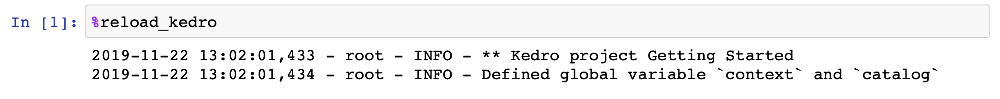

# Working with IPython and Jupyter Notebooks / Lab

> *Note:* This documentation is based on `Kedro 0.15.9`, if you spot anything that is incorrect then please create an [issue](https://github.com/quantumblacklabs/kedro/issues) or pull request.

This section follows the ["Hello World" example](../02_getting_started/04_hello_world.md) and demonstrates how to effectively use IPython and Jupyter Notebooks / Lab.

## Startup script

Every time you start or restart a Jupyter or IPython session using Kedro command, a startup script in `.ipython/profile_default/startup/00-kedro-init.py` is being executed. It adds the following variables in scope:

* `context` (`KedroContext`) - Kedro project context which holds the configuration
* `catalog` (`DataCatalog`) - Data catalog instance which contains all defined datasets; this is a shortcut for `context.catalog`
* `startup_error` (`Exception`) - An error that was raised during the execution of the startup script or `None` if no errors occurred

To reload these at any point (e.g., if you update `catalog.yml`), use the [line magic](https://ipython.readthedocs.io/en/stable/interactive/magics.html) `%reload_kedro`. This magic can also be used to see the error message if any of the variables above are undefined.



It also loads the environment specified in the `KEDRO_ENV` environment variable if specified, otherwise it defaults to `local`. Instructions for setting the environment variable can be found in the [configuration](./03_configuration.md#additional-configuration-environments) section.

## Working with `context`
With `context`, you can access the following variables and methods
- `context.project_path` (`Path`) - Root directory of the project
- `context.project_name` (`str`) - Project folder name
- `context.catalog` (`DataCatalog`) - An instance of [DataCatalog](/kedro.io.DataCatalog)
- `context.config_loader` (`ConfigLoader`) - An instance of [ConfigLoader](/kedro.config.ConfigLoader)
- `context.pipeline` (`Pipeline`) - Defined pipeline
- `context.run` (`None`) - Method to run a pipeline

### Additional parameters for `context.run()`
If you want to parameterize the run, you can also specify the following optional arguments for `context.run()`:

```eval_rst
+---------------+----------------+-------------------------------------------------------------------------------+
| Argument name | Accepted types | Description                                                                   |
+===============+================+===============================================================================+
| tags          | Iterable[str]  | Construct the pipeline using only nodes which have this tag attached.         |
|               |                | A node is included in the resulting pipeline if it contains any of those tags |
+---------------+----------------+-------------------------------------------------------------------------------+
| runner        | AbstractRunner | An instance of Kedro [AbstractRunner](/kedro.runner.AbstractRunner);          |
|               |                | can be an instance of a [ParallelRunner](/kedro.runner.ParallelRunner)        |
+---------------+----------------+-------------------------------------------------------------------------------+
| node_names    | Iterable[str]  | Run only nodes with specified names                                           |
+---------------+----------------+-------------------------------------------------------------------------------+
| from_nodes    | Iterable[str]  | A list of node names which should be used as a starting point                 |
+---------------+----------------+-------------------------------------------------------------------------------+
| to_nodes      | Iterable[str]  | A list of node names which should be used as an end point                     |
+---------------+----------------+-------------------------------------------------------------------------------+
| from_inputs   | Iterable[str]  | A list of dataset names which should be used as a starting point              |
+---------------+----------------+-------------------------------------------------------------------------------+
| load_versions | Dict[str, str] | A mapping of a dataset name to a specific dataset version (timestamp)         |
|               |                | for loading - this applies to the versioned datasets only                     |
+---------------+----------------+-------------------------------------------------------------------------------+
| pipeline_name | str            | Name of the modular pipeline to run - must be one of those returned           |
|               |                | by create_pipelines function from src/<package_name>/pipeline.py              |
+---------------+----------------+-------------------------------------------------------------------------------+
```

This list of options is fully compatible with the list of CLI options for `kedro run` command. In fact, `kedro run` is calling `context.run()` behind the scenes.

## Adding global variables

You can easily add customised global variables in `.ipython/profile_default/startup/00-kedro-init.py`. For example, if you want to add a global variable for `parameters` from `parameters.yml`, update `reload_kedro()` as follows:

```python
@register_line_magic
def reload_kedro(project_path, line=None):
    """"Line magic which reloads all Kedro default variables."""
    # ...
    global parameters
    try:
        # ...
        context = load_context(path)
        parameters = context.params
        # ...
        logging.info("Defined global variable `context`, `catalog` and `parameters`")
    except:
        pass
```

## Working with IPython

In order to experiment with the code interactively, you may want to use a Python kernel inside a Jupyter notebook (formerly known as IPython).

To start a standalone IPython session, run the following command in the root directory of the project:

```bash
kedro ipython
```

### Loading `DataCatalog` in IPython

In accordance with the ["Hello World" example](../02_getting_started/04_hello_world.md), you can load a dataset of [Iris test example](https://archive.ics.uci.edu/ml/datasets/iris) inside the IPython console, by simply executing the following:

```python
catalog.load("example_iris_data").head()
```

```bash
kedro.io.data_catalog - INFO - Loading data from `example_iris_data` (CSVDataSet)...

   sepal_length  sepal_width  petal_length  petal_width species
0           5.1          3.5           1.4          0.2  setosa
1           4.9          3.0           1.4          0.2  setosa
2           4.7          3.2           1.3          0.2  setosa
3           4.6          3.1           1.5          0.2  setosa
4           5.0          3.6           1.4          0.2  setosa
```

If you enable versioning, you can load a particular version of a dataset. Given a catalog entry

```yaml
example_train_x:
  type: pandas.CSVDataSet
  filepath: data/02_intermediate/example_train_x.csv
  versioned: true
```

and having run the pipeline at least once, you may specify which version to load like so:

```python
catalog.load("example_train_x", version="2019-12-13T15.08.09.255Z")
```

When you have finished, you can exit IPython by typing:

```python
exit()
```

## Working from Jupyter

When you are developing new nodes for your pipeline, you can write them as regular Python functions, but you may want to use Jupyter notebooks for experimenting with your code before committing to a specific implementation. To take advantage of Kedro's Jupyter session, you can run this in your terminal:

```bash
kedro jupyter notebook
```

This will start a Jupyter server and navigate you to your default browser.

> Note: If you want Jupyter to listen to a different port number, then run `kedro jupyter notebook --port <port>`

Then you should navigate to the `notebooks` folder and create a notebook.

> *Note:* The only kernel available by default has a name of the current project. If you need to access all available kernels, add `--all-kernels` to the command above.

### Idle notebooks

If you close the notebook and its kernel is idle, it will be automatically terminated by the Jupyter server after 30 seconds of inactivity. However, if the notebook kernel is busy, it won't be automatically terminated by the server.

You can change the timeout by passing `--idle-timeout=<integer>` option to `kedro jupyter notebook` or `kedro jupyter lab` call. If you set `--idle-timeout=0`, this will disable automatic termination of idle notebook kernels.

### What if I cannot run `kedro jupyter notebook`?

In certain cases, you may not be able to run `kedro jupyter notebook` and have to work in a standard Jupyter session. An example of this may be because you don't have a CLI access to the machine where the Jupyter server is running. In that case, you can create a `context` variable yourself by running the following block of code at the top of your notebook:

```python
from pathlib import Path
from kedro.context import load_context

current_dir = Path.cwd()  # this points to 'notebooks/' folder
proj_path = current_dir.parent  # point back to the root of the project
context = load_context(proj_path)
```

### Loading `DataCatalog` in Jupyter


As mentioned earlier in the project overview section, `KedroContext` represents the main application entry point, so having `context` variable available in Jupyter notebook gives a lot of flexibility in interaction with your project components.

You can load a dataset defined in your `conf/base/catalog.yml`, by simply executing the following:

```python
df = catalog.load("example_iris_data")
df.head()
```


If you enable versioning, you also have the option of loading a particular version of a dataset. Given a catalog entry

```yaml
example_train_x:
  type: pandas.CSVDataSet
  filepath: data/02_intermediate/example_train_x.csv
  versioned: true
```

and having run the pipeline at least once, you can specify which version to load like so:

```python
catalog.load("example_train_x", version="2019-12-13T15.08.09.255Z")
```

### Saving `DataCatalog` in Jupyter

Saving operation in the example below is analogous to the load.

Let's put the following dataset entry in `conf/base/catalog.yml`:

```yaml
my_dataset:
  type: pandas.JSONDataSet
  filepath: data/01_raw/my_dataset.json
```

Next, you need to reload Kedro variables by calling `%reload_kedro` line magic in your Jupyter notebook.

Finally, you can save the data by executing the following command:

```python
my_dict = {"key1": "some_value", "key2": None}
catalog.save("my_dataset", my_dict)
```

### Using parameters

`context` object also exposes `params` property, which allows you to easily access all project parameters:

```python
parameters = context.params  # type: Dict
parameters["example_test_data_ratio"]
# returns the value of 'example_test_data_ratio' key from 'conf/base/parameters.yml'
```

> Note: You need to reload Kedro variables by calling `%reload_kedro` and re-run the code snippet from above if you change the contents of `parameters.yml`.

### Running the pipeline

If you wish to run the whole 'master' pipeline within a notebook cell, you can do it by just calling

```python
context.run()
```

Which will run all the nodes from your default project pipeline in a sequential manner.

If you wish to parameterise your pipeline run, please refer to [run parameters section](#additional-parameters-for-contextrun) which lists all available options.

### Converting functions from Jupyter Notebooks into Kedro nodes

Another useful built-in feature in Kedro Jupyter workflow is the ability to convert multiple functions defined in the Jupyter notebook(s) into Kedro nodes using a single CLI command.

Here is how it works:

* Start a Jupyter server, if you haven't done so already, by running `kedro jupyter notebook`
* Create a new notebook and paste the following code into the first cell:

```python
def some_action():
    print("This function came from `notebooks/my_notebook.ipynb`")
```

* Enable tags toolbar: `View` menu -> `Cell Toolbar` -> `Tags`

* Add the `node` tag to the cell containing your function

> Tip: The notebook can contain multiple functions tagged as `node`, each of them will be exported into the resulting Python file

* Save your Jupyter notebook to `notebooks/my_notebook.ipynb`
* Run from your terminal: `kedro jupyter convert notebooks/my_notebook.ipynb` - this will create a Python file `src/<package_name>/nodes/my_notebook.py` containing `convert_me` function definition
> Tip: You can also convert all your notebooks at once by calling `kedro jupyter convert --all`
* Now `some_action` function can be used in your Kedro pipelines

## Extras

There are optional extra scripts that can help improve your Kedro experience for certain use cases. Those are not essential for using Kedro CLI or library components.

### IPython loader

The script `tools/ipython/ipython_loader.py` helps to locate IPython startup directory and run all Python scripts in it when working with Jupyter notebooks and IPython sessions. It should work identically not just within a Kedro project, but also with any project that contains IPython startup scripts.

This script will automatically locate `.ipython/profile_default/startup` directory starting from the current working directory and going up the directory tree. If the directory was found, all Python scripts in it are executed.

> *Note:* This script will only run startup scripts from the first encountered `.ipython/profile_default/startup` directory. All consecutive `.ipython` directories higher up in the directory tree will be disregarded.

#### Installation

To install this script simply download it into your default IPython config directory:

```bash
mkdir -p ~/.ipython/profile_default/startup
wget -O ~/.ipython/profile_default/startup/ipython_loader.py https://raw.githubusercontent.com/quantumblacklabs/kedro/master/tools/ipython/ipython_loader.py
```

#### Prerequisites

In order for this script to work, the following conditions must be met:

1. You project must contain `.ipython/profile_default/startup` folder in its root directory.
2. Jupyter notebook should be saved inside the project root directory or any nested subdirectory.
3. IPython interactive session should be started with the working directory pointing to the project root directory or any nested subdirectory.

For example, given the following project structure:
```console
new-kedro-project/
├── .ipython
│   └── profile_default
│       └── startup
│           └── 00-kedro-init.py
├── conf/
├── data/
├── docs/
├── logs/
├── notebooks
│   └── subdir1
│       └── subdir2
└── src/
```

If your `Notebook.ipynb` is placed anywhere in `new-kedro-project/notebooks/`, `new-kedro-project/notebooks/subdir1/`, `new-kedro-project/notebooks/subdir1/subdir2/` or even `new-kedro-project/` (although strongly discouraged), then `.ipython/profile_default/startup/00-kedro-init.py` will automatically be executed on every notebook startup.

> *Note:* Given the example structure above, this script *will not* load your IPython startup scripts if the notebook is saved anywhere *outside* `new-kedro-project` directory.
