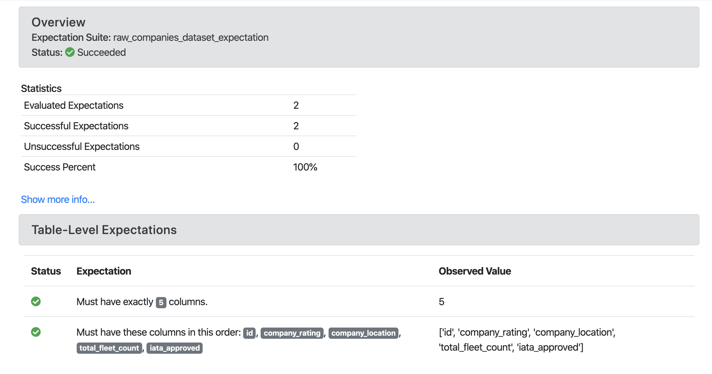
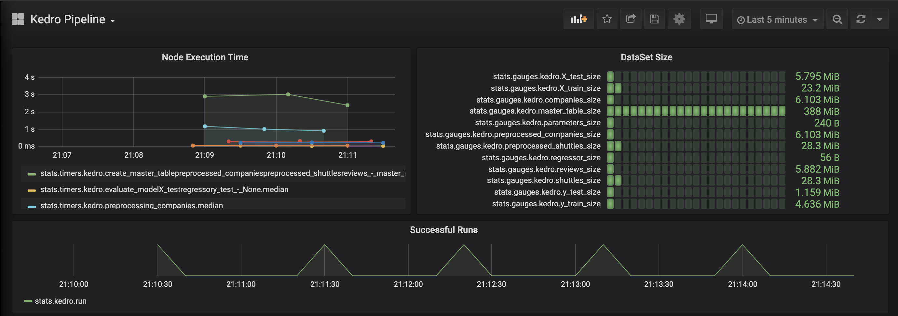

# Hooks

## Introduction

Hooks are a mechanism to add extra behaviour to Kedro's main execution in an easy and consistent manner. Some examples may include:

* Adding a transformer after the data catalog is loaded
* Adding data validation to the inputs before a node runs, and to the outputs after a node has run. This makes it possible to integrate with other tools like [Great-Expectations](https://docs.greatexpectations.io/en/latest/)
* Adding machine learning metrics tracking, e.g. using [MLflow](https://mlflow.org/), throughout a pipeline run

## Concepts

A Hook is comprised of a Hook specification and Hook implementation. To add Hooks to your project you will need to:

* Provide a Hook implementation for an existing Kedro-defined Hook specification
* Register your Hook implementation in the `ProjectContext` or in your `settings.py` file under the key `HOOKS`.


### Hook specification

Kedro distinguishes between 2 main types of Hooks: execution timeline and component registration.

#### Execution timeline Hooks

Kedro defines Hook specifications for particular execution points where users can inject additional behaviour. Currently, the following Hook specifications are provided in [kedro.framework.hooks](/kedro.framework.hooks):

* `after_catalog_created`
* `before_node_run`
* `after_node_run`
* `on_node_error`
* `before_pipeline_run`
* `after_pipeline_run`
* `on_pipeline_error`
* `before_dataset_loaded`
* `after_dataset_loaded`
* `before_dataset_saved`
* `after_dataset_saved`

The naming convention for non-error Hooks is `<before/after>_<noun>_<past_participle>`, in which:

* `<before/after>` and `<past_participle>` refers to when the Hook executed, e.g. `before <something> was run` or `after <something> was created`.
* `<noun>` refers to the relevant component in the Kedro execution timeline for which this Hook adds extra behaviour, e.g. `catalog`, `node` and `pipeline`.

The naming convention for error hooks is `on_<noun>_error`, in which:

* `<noun>` refers to the relevant component in the Kedro execution timeline that throws the error.

[kedro.framework.hooks](/kedro.framework.hooks) lists the full specifications for which you can inject additional behaviours by providing an implementation.


#### Registration Hooks

In addition, Kedro defines Hook specifications to register certain library components to be used with the project. This is where users can define their custom class implementations. Currently, the following Hook specifications are provided:

* `register_pipelines`
* `register_config_loader`
* `register_catalog`

The naming convention for registration hooks is `register_<library_component>`.

### Hook implementation

You should provide an implementation for the specification that describes the point at which you want to inject additional behaviour. The Hook implementation should have the same name as the specification. The Hook must provide a concrete implementation with a subset of the corresponding specification's parameters (you do not need to use them all).

To declare a Hook implementation, use the `@hook_impl` decorator.

For example, the full signature of the [`after_data_catalog_created`](/kedro.framework.hooks.specs.DataCatalogSpecs) Hook specification is:

```python
@hook_spec
def after_catalog_created(
    self,
    catalog: DataCatalog,
    conf_catalog: Dict[str, Any],
    conf_creds: Dict[str, Any],
    save_version: str,
    load_versions: Dict[str, str],
    run_id: str,
) -> None:
    pass
```

However, if you just want to use this Hook to add transformer for a data catalog after it is created, your Hook implementation can be as simple as:

```python
# <your_project>/src/<your_project>/hooks.py
from kedro.extras.transformers.time_profiler import ProfileTimeTransformer
from kedro.framework.hooks import hook_impl
from kedro.io import DataCatalog


class TransformerHooks:

    @hook_impl
    def after_catalog_created(self, catalog: DataCatalog) -> None:
        catalog.add_transformer(ProfileTimeTransformer())
```

> Note: The name of a module that contains Hooks implementation is arbitrary and is not restricted to `hooks.py`.

We recommend that you group related Hook implementations under a namespace, preferably a class, within a `hooks.py` file in your project.

#### Registering your Hook implementations with Kedro

Hook implementations should be registered with Kedro either through `ProjectContext.hooks`, or in your `settings.py` file under `HOOKS` key.

You can register more than one implementation for the same specification. They will be called in LIFO (last-in, first-out) order.

The following example sets up a Hook so that the `after_data_catalog_created` implementation is called every time after a data catalog is created.

```python
# <your_project>/src/<your_project>/run.py
from your_project.hooks import TransformerHooks


class ProjectContext(KedroContext):

    hooks = (
        # register the collection of your Hook implementations here.
        # Note that we are using an instance here, not a class. It could also be a module.
        TransformerHooks(),
    )
    # You can add more than one hook by simply listing them
    # in a tuple.`hooks = (Hook1(), Hook2())`
```

Alternatively, you can use `settings.py` as follows:

```python
# <your_project>/src/<your_project>/settings.py
from your_project.hooks import TransformerHooks


HOOKS = (TransformerHooks(),)
```


Kedro also has auto-discovery enabled by default. This means that any installed plugins that declare a Hooks entry-point will be registered. To learn more about how to enable this for your custom plugin, see our [plugin development guide](04_plugins.md#hooks).

>Note: Auto-discovered Hooks will run *first*, followed by the ones specified in `settings.py`, and finally `ProjectContext.hooks`.

#### Disable auto-registered plugins' Hooks

Auto-registered plugins' Hooks can be disabled via `settings.py` as follows:

```python
# <your_project>/src/<your_project>/settings.py
DISABLE_HOOKS_FOR_PLUGINS = (<plugin_name>, ...)
```

where `<plugin_name>` is the name of an installed plugin for which the auto-registered Hooks must be disabled.

## Common use cases

### Use Hooks to extend a node's behaviour

Prior to Kedro 0.16, to add extra behaviour before and after a node's execution, we recommended using [decorators](07_decorators.md) on individual nodes. We also exposed a convenience method to apply decorators to [all nodes in a `Pipeline`](07_decorators.md#how-to-apply-a-decorator-to-nodes).

However, after the introduction of Hooks in 0.16, this capability is readily available through the [`before_node_run` and `after_node_run` Hooks](/kedro.framework.hooks#node-hooks). Furthermore, you can apply extra behaviour to not only an individual node or an entire Kedro pipeline, but also to a _subset_ of nodes based on their tags or namespaces. For example, let's say we want to add the following extra behaviours to a node:

```python
from kedro.pipeline.node import Node

def say_hello(node: Node):
    """An extra behaviour for a node to say hello before running.
    """
    print(f"Hello from {node.name}")
```

Then you can either add it to a single node based on the node's name:

```python
# <your_project>/src/<your_project>/hooks.py

from kedro.framework.hooks import hook_impl
from kedro.pipeline.node import Node


class ProjectHooks:

    @hook_impl
    def before_node_run(self, node: Node):
        # adding extra behaviour to a single node
        if node.name == "hello":
            say_hello(node)
```

Or add it to a group of nodes based on their tags:


```python
# <your_project>/src/<your_project>/hooks.py

from kedro.framework.hooks import hook_impl
from kedro.pipeline.node import Node


class ProjectHooks:

    @hook_impl
    def before_node_run(self, node: Node):
        if "hello" in node.tags:
            say_hello(node)
```

Or add it to all nodes in the entire pipeline:

```python
# <your_project>/src/<your_project>/hooks.py

from kedro.framework.hooks import hook_impl
from kedro.pipeline.node import Node


class ProjectHooks:

    @hook_impl
    def before_node_run(self, node: Node):
        # adding extra behaviour to all nodes in the pipeline
        say_hello(node)
```

If your use case takes advantage of a decorator, for example to retry a node's execution using a library such as [tenacity](https://tenacity.readthedocs.io/en/latest/), you can still decorate the node's function directly:

```python
from tenacity import retry

@retry
def my_flaky_node_function():
    ...
```

Or applying it in the `before_node_run` Hook as follows:

```python
# <your_project>/src/<your_project>/hooks.py
from tenacity import retry

from kedro.framework.hooks import hook_impl
from kedro.pipeline.node import Node


class ProjectHooks:

    @hook_impl
    def before_node_run(self, node: Node):
        # adding retrying behaviour to nodes tagged as flaky
        if "flaky" in node.tags:
            node.func = retry(node.func)
```
### Use Hooks to customise the dataset load and save methods
From Kedro 0.18.0 [Transformers](06_transformers.md) will be deprecated and we recommend using the `before_dataset_loaded`/`after_dataset_loaded` and `before_dataset_saved`/`after_dataset_saved` Hooks to customise the dataset `load` and `save` methods where appropriate.

For example, you can add logging about the dataset load runtime as follows:

```python
@property
def _logger(self):
    return logging.getLogger(self.__class__.__name__)

@hook_impl
def before_dataset_loaded(self, dataset_name: str) -> None:
    start = time.time()
    logging.info("Loading dataset %s started at %0.3f", dataset_name, start)

@hook_impl
def after_dataset_loaded(self, dataset_name: str, data: Any) -> None:
    end = time.time()
    logging.info("Loading dataset %s ended at %0.3f", dataset_name, end)
```

## Under the hood

Under the hood, we use [pytest's pluggy](https://pluggy.readthedocs.io/en/latest/) to implement Kedro's Hook mechanism. We recommend reading their documentation if you have more questions about the underlying implementation.

## Hooks examples

**Example 1:** Add data validation to the node's inputs and outputs using [Great Expectations](https://docs.greatexpectations.io/en/latest/).

* Install dependencies:

```console
pip install great-expectations
```

* Implement `before_node_run` and `after_node_run` Hooks to validate inputs and outputs data respectively leveraging `Great Expectations`:

```python
# <your_project>/src/<your_project>/hooks.py
from typing import Any, Dict

from kedro.framework.hooks import hook_impl
from kedro.io import DataCatalog

import great_expectations as ge


class DataValidationHooks:

    # Map expectation to dataset
    DATASET_EXPECTATION_MAPPING = {
        "companies": "raw_companies_dataset_expectation",
        "preprocessed_companies": "preprocessed_companies_dataset_expectation",
    }

    @hook_impl
    def before_node_run(
        self, catalog: DataCatalog, inputs: Dict[str, Any], run_id: str
    ) -> None:
        """ Validate inputs data to a node based on using great expectation
        if an expectation suite is defined in ``DATASET_EXPECTATION_MAPPING``.
        """
        self._run_validation(catalog, inputs, run_id)

    @hook_impl
    def after_node_run(
        self, catalog: DataCatalog, outputs: Dict[str, Any], run_id: str
    ) -> None:
        """ Validate outputs data from a node based on using great expectation
        if an expectation suite is defined in ``DATASET_EXPECTATION_MAPPING``.
        """
        self._run_validation(catalog, outputs, run_id)

    def _run_validation(self, catalog: DataCatalog, data: Dict[str, Any], run_id: str):
        for dataset_name, dataset_value in data.items():
            if dataset_name not in self.DATASET_EXPECTATION_MAPPING:
                continue

            dataset = catalog._get_dataset(dataset_name)
            dataset_path = str(dataset._filepath)
            expectation_suite = self.DATASET_EXPECTATION_MAPPING[dataset_name]

            expectation_context = ge.data_context.DataContext()
            batch = expectation_context.get_batch(
                {"path": dataset_path, "datasource": "files_datasource"},
                expectation_suite,
            )
            expectation_context.run_validation_operator(
                "action_list_operator", assets_to_validate=[batch], run_id=run_id
            )
```

* Register Hooks implementation, as described [above](#registering-your-hook-implementations-with-kedro) and run Kedro.

`Great Expectations` example report:



**Example 2:** Add observability to your pipeline with [statsd](https://statsd.readthedocs.io/en/v3.3/configure.html) and visualise it using [Grafana](https://grafana.com/).

* Install dependencies:

```console
pip install statsd
```

* Implement `before_node_run` and `after_node_run` Hooks to collect metrics (DataSet size and node execution time):

```python
# <your_project>/src/<your_project>/hooks.py
import sys
from typing import Any, Dict

import statsd
from kedro.framework.hooks import hook_impl
from kedro.pipeline.node import Node


class PipelineMonitoringHooks:
    def __init__(self):
        self._timers = {}
        self._client = statsd.StatsClient(prefix="kedro")

    @hook_impl
    def before_node_run(self, node: Node) -> None:
        node_timer = self._client.timer(node.name)
        node_timer.start()
        self._timers[node.short_name] = node_timer

    @hook_impl
    def after_node_run(self, node: Node, inputs: Dict[str, Any]) -> None:
        self._timers[node.short_name].stop()
        for dataset_name, dataset_value in inputs.items():
            self._client.gauge(dataset_name + "_size", sys.getsizeof(dataset_value))

    @hook_impl
    def after_pipeline_run(self):
        self._client.incr("run")
```

* Register Hooks implementation, as described [above](#registering-your-hook-implementations-with-kedro) and run Kedro.

`Grafana` example page:



**Example 3:** Add metrics tracking to your model with [MLflow](https://mlflow.org/).

* Install dependencies:

```console
pip install mlflow
```

* Implement `before_pipeline_run`, `after_pipeline_run` and `after_node_run` Hooks to collect metrics using `MLflow`:

```python
# <your_project>/src/<your_project>/hooks.py
from typing import Any, Dict

import mlflow
import mlflow.sklearn
from kedro.framework.hooks import hook_impl
from kedro.pipeline.node import Node


class ModelTrackingHooks:
    """Namespace for grouping all model-tracking hooks with MLflow together.
    """

    @hook_impl
    def before_pipeline_run(self, run_params: Dict[str, Any]) -> None:
        """Hook implementation to start an MLflow run
        with the same run_id as the Kedro pipeline run.
        """
        mlflow.start_run(run_name=run_params["run_id"])
        mlflow.log_params(run_params)

    @hook_impl
    def after_node_run(
        self, node: Node, outputs: Dict[str, Any], inputs: Dict[str, Any]
    ) -> None:
        """Hook implementation to add model tracking after some node runs.
        In this example, we will:
        * Log the parameters after the data splitting node runs.
        * Log the model after the model training node runs.
        * Log the model's metrics after the model evaluating node runs.
        """
        if node._func_name == "split_data":
            mlflow.log_params(
                {"split_data_ratio": inputs["params:example_test_data_ratio"]}
            )

        elif node._func_name == "train_model":
            model = outputs["example_model"]
            mlflow.sklearn.log_model(model, "model")
            mlflow.log_params(inputs["parameters"])

    @hook_impl
    def after_pipeline_run(self) -> None:
        """Hook implementation to end the MLflow run
        after the Kedro pipeline finishes.
        """
        mlflow.end_run()
```

* Register Hooks implementation, as described [above](#registering-your-hook-implementations-with-kedro) and run Kedro.

`MLflow` example page:


**Example 4:** Modify node inputs using `before_node_run` hook.

If the `before_node_run` hook is implemented _and_ returns a dictionary, that dictionary is used to update the corresponding node inputs.

For example, if a pipeline contains a node named `my_node`, which takes 2 inputs: `first_input` and `second_input`, to overwrite the value of `first_input` that is passed to `my_node`, we can implement the following hook:

```python
from typing import Any, Dict, Optional

from kedro.framework.hooks import hook_impl
from kedro.pipeline.node import Node
from kedro.io import DataCatalog

class NodeInputReplacementHook:
    @hook_impl
    def before_node_run(
        self, node: Node, catalog: DataCatalog
    ) -> Optional[Dict[str, Any]]:
        """Replace `first_input` for `my_node`
        """
        if node.name == "my_node":
            # return the string filepath to the `first_input` dataset
            # instead of the underlying data
            dataset_name = "first_input"
            filepath = catalog._get_dataset(dataset_name)._filepath
            return {"first_input": filepath}  # `second_input` is not affected
        return None
```

Node input overwrites implemented in `before_node_run` affect only a specific node and do not modify the corresponding datasets in the `DataCatalog`.

> *Note:* In the example above, the `before_node_run` hook implementation must return datasets present in the `inputs` dictionary. If they are not in `inputs`, the node fails with the following error: `Node <name> expected X input(s) <expected_inputs>, but got the following Y input(s) instead: <actual_inputs>`.

To apply the changes once you have implemented a new hook, you need to register it, as described [above](#registering-your-hook-implementations-with-kedro), and then run Kedro.
