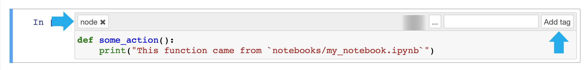

# Use Kedro with IPython and Jupyter Notebooks/Lab

> *Note:* This documentation is based on `Kedro 0.17.0`, if you spot anything that is incorrect then please create an [issue](https://github.com/quantumblacklabs/kedro/issues) or pull request.

This section follows the [Iris dataset example](../02_get_started/05_example_project.md) and demonstrates how to use Kedro with IPython and Jupyter Notebooks / Lab. We also recommend a video that explains the transition from the use of vanilla Jupyter Notebooks to using Kedro, from [Data Engineer One](https://www.youtube.com/watch?v=dRnCovp1GRQ&t=50s&ab_channel=DataEngineerOne).


<iframe width="560" height="315" style="max-width: 100%" src="https://www.youtube.com/embed/dRnCovp1GRQ" frameborder="0" allow="accelerometer; autoplay; clipboard-write; encrypted-media; gyroscope; picture-in-picture" allowfullscreen></iframe>

## Why use a Notebook?
There are reasons why you may want to use a Notebook, although in general, the principles behind Kedro would discourage their use because they have some [drawbacks when they are used to create production or reproducible code](https://towardsdatascience.com/5-reasons-why-you-should-switch-from-jupyter-notebook-to-scripts-cb3535ba9c95). However, there are occasions when you'd want to put some code into a Notebook, for example:

* To conduct exploratory data analysis
* For experimentation as you create new Python functions (nodes)
* As a tool for reporting and presentations


## Kedro and IPython

You may want to use a Python kernel inside a Jupyter notebook (formerly known as IPython) to experiment with your Kedro code.

To start a standalone IPython session, run the following command in the root directory of your Kedro project:

```bash
kedro ipython
```
This opens an iPython session in your shell, which you can terminate, when you have finished, by typing:

```python
exit()
```
### Load `DataCatalog` in IPython

To test the IPython session, load the [Iris test example](https://archive.ics.uci.edu/ml/datasets/iris) data inside the IPython console as follows:

```python
catalog.load("example_iris_data").head()
```
You should see the following in your shell:

```bash
kedro.io.data_catalog - INFO - Loading data from `example_iris_data` (CSVDataSet)...

   sepal_length  sepal_width  petal_length  petal_width species
0           5.1          3.5           1.4          0.2  setosa
1           4.9          3.0           1.4          0.2  setosa
2           4.7          3.2           1.3          0.2  setosa
3           4.6          3.1           1.5          0.2  setosa
4           5.0          3.6           1.4          0.2  setosa
```


#### Dataset versioning

If you enable [versioning](../05_data/01_data_catalog.md#versioning-datasets-and-ml-models), you can load a particular version of a dataset. Given a catalog entry:

```yaml
example_train_x:
  type: pandas.CSVDataSet
  filepath: data/02_intermediate/example_train_x.csv
  versioned: true
```

and having run your pipeline at least once, you may specify which version to load:

```python
catalog.load("example_train_x", version="2019-12-13T15.08.09.255Z")
```

## Kedro and Jupyter

You may want to use Jupyter notebooks to experiment with your code as you develop new nodes for a pipeline, although you can write them as regular Python functions without a notebook. To use Kedro's Jupyter session:

```bash
kedro jupyter notebook
```

This starts a Jupyter server and opens a window in your default browser.

> Note: If you want Jupyter to listen to a different port number, then run `kedro jupyter notebook --port <port>`

Navigate to the `notebooks` folder of your Kedro project and create a new notebook.


> *Note:* The only kernel available by default has a name of the current project. If you need to access all available kernels, add `--all-kernels` to the command above.

Every time you start or restart a Jupyter or IPython session in the CLI using a `kedro` command, a startup script in `.ipython/profile_default/startup/00-kedro-init.py` is executed. It adds the following variables in scope:

* `context` (`KedroContext`) - Kedro project context that provides access to Kedro's library components.
* `catalog` (`DataCatalog`) - Data catalog instance that contains all defined datasets; this is a shortcut for `context.catalog`
* `startup_error` (`Exception`) - An error that was raised during the execution of the startup script or `None` if no errors occurred

## How to use `context`

The `context` variable allows you to interact with Kedro library components from within the Kedro Jupyter notebook.


With `context`, you can access the following variables and methods:

- `context.project_path` (`Path`) - Root directory of the project
- `context.project_name` (`str`) - Project folder name
- `context.catalog` (`DataCatalog`) - An instance of [DataCatalog](/kedro.io.DataCatalog)
- `context.config_loader` (`ConfigLoader`) - An instance of [ConfigLoader](/kedro.config.ConfigLoader)
- `context.pipeline` (`Pipeline`) - Defined pipeline

### Run the pipeline

If you wish to run the whole main pipeline within a notebook cell, you can do so by instantiating a `Session`:

```python
from kedro.framework.session import KedroSession

with KedroSession.create("<your-kedro-project-package-name>") as session:
    session.run()
```

The command runs the nodes from your default project pipeline in a sequential manner.

To parameterise your pipeline run, refer to [a later section on this page on run parameters](#additional-parameters-for-session-run) which lists all available options.


### Parameters

The `context` object exposes the `params` property, which allows you to access all project parameters:

```python
parameters = context.params  # type: Dict
parameters["example_test_data_ratio"]
# returns the value of 'example_test_data_ratio' key from 'conf/base/parameters.yml'
```

> Note: You need to reload Kedro variables by calling `%reload_kedro` and re-run the code snippet above if you change the contents of `parameters.yml`.

### Load/Save `DataCatalog` in Jupyter

You can load a dataset defined in your `conf/base/catalog.yml`:

```python
df = catalog.load("example_iris_data")
df.head()
```


The save operation in the example below is analogous to the load.

Put the following dataset entry in `conf/base/catalog.yml`:

```yaml
my_dataset:
  type: pandas.JSONDataSet
  filepath: data/01_raw/my_dataset.json
```

Next, you need to reload Kedro variables by calling `%reload_kedro` line magic in your Jupyter notebook.

Finally, you can save the data by executing the following command:

```python
my_dict = {"key1": "some_value", "key2": None}
catalog.save("my_dataset", my_dict)
```

### Additional parameters for `session.run()`
You can also specify the following optional arguments for `session.run()`:

```eval_rst
+---------------+----------------+-------------------------------------------------------------------------------+
| Argument name | Accepted types | Description                                                                   |
+===============+================+===============================================================================+
| tags          | Iterable[str]  | Construct the pipeline using only nodes which have this tag attached.         |
|               |                | A node is included in the resulting pipeline if it contains any of those tags |
+---------------+----------------+-------------------------------------------------------------------------------+
| runner        | AbstractRunner | An instance of Kedro [AbstractRunner](/kedro.runner.AbstractRunner);          |
|               |                | can be an instance of a [ParallelRunner](/kedro.runner.ParallelRunner)        |
+---------------+----------------+-------------------------------------------------------------------------------+
| node_names    | Iterable[str]  | Run only nodes with specified names                                           |
+---------------+----------------+-------------------------------------------------------------------------------+
| from_nodes    | Iterable[str]  | A list of node names which should be used as a starting point                 |
+---------------+----------------+-------------------------------------------------------------------------------+
| to_nodes      | Iterable[str]  | A list of node names which should be used as an end point                     |
+---------------+----------------+-------------------------------------------------------------------------------+
| from_inputs   | Iterable[str]  | A list of dataset names which should be used as a starting point              |
+---------------+----------------+-------------------------------------------------------------------------------+
| load_versions | Dict[str, str] | A mapping of a dataset name to a specific dataset version (timestamp)         |
|               |                | for loading - this applies to the versioned datasets only                     |
+---------------+----------------+-------------------------------------------------------------------------------+
| pipeline_name | str            | Name of the modular pipeline to run - must be one of those returned           |
|               |                | by register_pipelines function from src/<package_name>/hooks.py               |
+---------------+----------------+-------------------------------------------------------------------------------+
```

This list of options is fully compatible with the list of CLI options for the `kedro run` command. In fact, `kedro run` is calling `context.run()` behind the scenes.


## Global variables

Add customised global variables to `.ipython/profile_default/startup/00-kedro-init.py`. For example, if you want to add a global variable for `parameters` from `parameters.yml`, update `reload_kedro()` as follows:

```python
@register_line_magic
def reload_kedro(project_path, line=None):
    """"Line magic which reloads all Kedro default variables."""
    # ...
    global parameters
    try:
        # ...
        session = KedroSession.create("<your-kedro-project-package-name>", project_path)
        _activate_session(session)
        context = session.load_context()
        parameters = context.params
        # ...
        logging.info(
            "Defined global variable `context`, `session`, `catalog` and `parameters`"
        )
    except:
        pass
```


## Convert functions from Jupyter Notebooks into Kedro nodes

Built into the Kedro Jupyter workflow is the ability to convert multiple functions defined in the Jupyter notebook(s) into Kedro nodes. You need a single CLI command.

Here is how it works:

* Start a Jupyter notebook session: `kedro jupyter notebook`
* Create a new notebook and paste the following code into the first cell:

```python
def some_action():
    print("This function came from `notebooks/my_notebook.ipynb`")
```

* Enable tags toolbar: `View` menu -> `Cell Toolbar` -> `Tags`


* Add the `node` tag to the cell containing your function


> Tip: The notebook can contain multiple functions tagged as `node`, each of them will be exported into the resulting Python file

* Save your Jupyter notebook to `notebooks/my_notebook.ipynb`
* Run `kedro jupyter convert notebooks/my_notebook.ipynb` from the terminal to create a Python file `src/<package_name>/nodes/my_notebook.py` containing `some_action` function definition

> Tip: You can also convert all your notebooks at once by calling `kedro jupyter convert --all`

* The `some_action` function can now be used in your Kedro pipelines

## IPython loader

The script `tools/ipython/ipython_loader.py` helps to locate IPython startup directory and run all Python scripts in it when working with Jupyter notebooks and IPython sessions. It should work identically not just within a Kedro project, but also with any project that contains IPython startup scripts.

The script automatically locates the `.ipython/profile_default/startup` directory by starting from the current working directory and going up the directory tree. If the directory is found, all Python scripts in it are executed.

> *Note:* This script will only run startup scripts from the first encountered `.ipython/profile_default/startup` directory. All consecutive `.ipython` directories higher up in the directory tree will be disregarded.

### Installation

To install this script simply download it into your default IPython config directory:

```bash
mkdir -p ~/.ipython/profile_default/startup
wget -O ~/.ipython/profile_default/startup/ipython_loader.py https://raw.githubusercontent.com/quantumblacklabs/kedro/master/tools/ipython/ipython_loader.py
```

### Prerequisites

For this script to work, the following conditions must be met:

* Your project must contain the `.ipython/profile_default/startup` folder in its root directory.
* The Jupyter notebook should be saved inside the project root directory or within any nested subfolder of the project directory.
* An IPython interactive session should be started with the working directory pointing to the project root directory or any nested subdirectory.

For example, given the following project structure:

```console
new-kedro-project/
├── .ipython
│   └── profile_default
│       └── startup
│           └── 00-kedro-init.py
├── conf/
├── data/
├── docs/
├── logs/
├── notebooks
│   └── subdir1
│       └── subdir2
└── src/
```

If your `Notebook.ipynb` is placed anywhere in the following, `.ipython/profile_default/startup/00-kedro-init.py` will automatically be executed on every notebook startup:

* `new-kedro-project/notebooks/`
* `new-kedro-project/notebooks/subdir1/`
* `new-kedro-project/notebooks/subdir1/subdir2/`
* or even `new-kedro-project/` (although this is strongly discouraged).

> *Note:* Given the example structure above, this script *will not* load your IPython startup scripts if the notebook is saved anywhere *outside* `new-kedro-project` directory.

### Troubleshooting and FAQs

#### How can I stop my notebook terminating?

If you close the notebook and its kernel is idle, it will be automatically terminated by the Jupyter server after 30 seconds of inactivity. However, if the notebook kernel is busy, it won't be automatically terminated by the server.

You can change the timeout by passing `--idle-timeout=<integer>` option to `kedro jupyter notebook` or `kedro jupyter lab` call. If you set `--idle-timeout=0`, this will disable automatic termination of idle notebook kernels.

#### Why can't I run `kedro jupyter notebook`?

In certain cases, you may not be able to run `kedro jupyter notebook`, which means that you have to work in a standard Jupyter session. This may be because you don't have a CLI access to the machine where the Jupyter server is running or you've opened a Jupyter notebook by running `jupyter notebook` from the terminal. In that case, you can create a `context` variable yourself by running the following block of code at the top of your notebook:

```python
from pathlib import Path
from kedro.framework.session import KedroSession
from kedro.framework.session.session import _activate_session

current_dir = Path.cwd()  # this points to 'notebooks/' folder
project_path = current_dir.parent  # point back to the root of the project
session = KedroSession.create("<your-kedro-project-package-name>", project_path)
_activate_session(session)
context = session.load_context()
```

#### How can I reload the `session`, `context`, `catalog` and `startup_error` variables?

To reload these variables at any point (e.g., if you update `catalog.yml`), use the [line magic](https://ipython.readthedocs.io/en/stable/interactive/magics.html) `%reload_kedro`. This magic can also be used to see the error message if any of the variables above are undefined.


If the `KEDRO_ENV` environment variable is specified, the startup script loads that environment, otherwise it defaults to `local`. Instructions for setting the environment variable can be found in the [Kedro configuration documentation](../04_kedro_project_setup/02_configuration.md#additional-configuration-environments).
