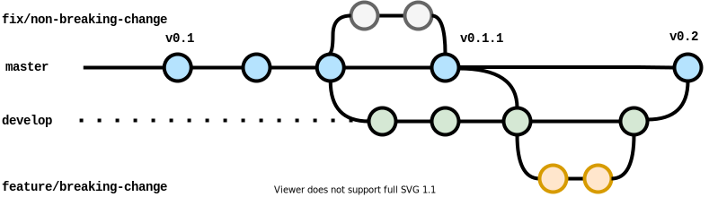

# Backwards compatibility & breaking changes

This page explains the principles of backwards compatibility and breaking changes.

A backwards-compatible change is any change that is not a breaking change. So what is a breaking change?

A breaking change is any change that modifies Kedro's public APIs. Examples include making a change to the signature of public functions or removing a module.

Your change is **not** considered a breaking change, and so is backwards compatible, **if a user can upgrade their Kedro version and include your change without anything breaking in their project**.

### When should I make a breaking change?

We aim to minimise the number of breaking changes to keep Kedro software stable and reduce the overhead for users as they migrate their projects. However, there are cases where a breaking change brings considerable value or increases the maintainability of the codebase. In these cases, breaking backwards compatibility can make sense.

Before you contribute a breaking change, you should create a [Github Issue](https://github.com/quantumblacklabs/kedro/issues) that describes the change and justifies the value gained by breaking backwards compatibility.

## The Kedro release model

All non-breaking changes go into `master`, from which a minor release can be deployed at any time.

All breaking changes go into `develop`, from which a major release can be deployed at any time. The `develop` branch contains all commits from the `master` branch, but the `master` branch does not contain all the commits from `develop` until the next major release.

Please check the Q&A on [GitHub discussions](https://github.com/quantumblacklabs/kedro/discussions) and ask any new questions about the development process there too!
