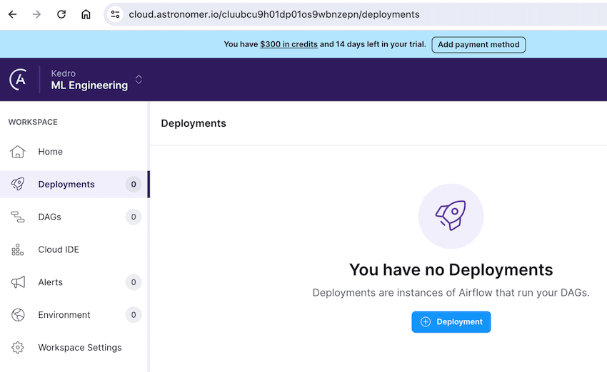
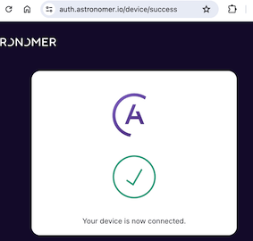
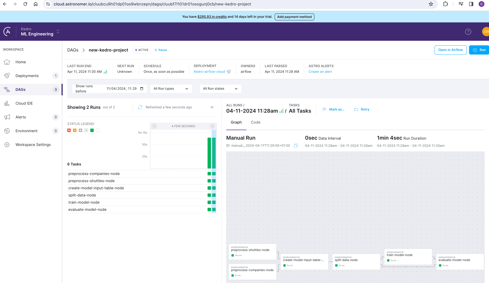

# Apache Airflow

Apache Airflow is a popular open-source workflow management platform. It is a suitable engine to orchestrate and execute a pipeline authored with Kedro, because workflows in Airflow are modelled and organised as [DAGs](https://en.wikipedia.org/wiki/Directed_acyclic_graph).

## How to run a Kedro pipeline on Apache Airflow with Astronomer

The following tutorial shows how to deploy an example [Spaceflights Kedro project](https://docs.kedro.org/en/stable/tutorial/spaceflights_tutorial.html) on [Apache Airflow](https://airflow.apache.org/) with [Astro CLI](https://docs.astronomer.io/astro/cli/overview), a command-line tool created by [Astronomer](https://www.astronomer.io/) that streamlines the creation of local Airflow projects. You will deploy it locally first, and then transition to Astro Cloud.

[Astronomer](https://docs.astronomer.io/astro/install-cli) is a managed Airflow platform which allows users to spin up and run an Airflow cluster in production. Additionally, it also provides a set of tools to help users get started with Airflow locally in the easiest way possible.

### Strategy

The general strategy to deploy a Kedro pipeline on Apache Airflow is to run every Kedro node as an [Airflow task](https://airflow.apache.org/docs/apache-airflow/stable/concepts/tasks.html) while the whole pipeline is converted to an [Airflow DAG](https://airflow.apache.org/docs/apache-airflow/stable/concepts/dags.html). This approach mirrors the principles of [running Kedro in a distributed environment](distributed.md).

Each node will be executed within a new Kedro session, which implies that `MemoryDataset`s cannot serve as storage for the intermediate results of nodes. Instead, all datasets must be registered in the [`DataCatalog`](https://docs.kedro.org/en/stable/data/index.html) and stored in persistent storage. This approach enables nodes to access the results from preceding nodes.

### Prerequisites

To follow this tutorial, ensure you have the following:

* The [Astro CLI installed](https://docs.astronomer.io/astro/install-cli)
* A container service like [Docker Desktop](https://docs.docker.com/get-docker/) (v18.09 or higher)
* `kedro>=0.19` installed
* [`kedro-airflow>=0.8`](https://github.com/kedro-org/kedro-plugins/tree/main/kedro-airflow) installed. We will use this plugin to convert the Kedro pipeline into an Airflow DAG.

### Create, prepare and package example Kedro project

In this section, you will create a new Kedro project equipped with an example pipeline designed to solve a typical data science task: predicting spaceflights prices. You will need to customise this project to ensure compatibility with Airflow, which includes enriching the Kedro `DataCatalog` with datasets previously stored only in memory and simplifying logging through custom settings. Following these modifications, you will package the project for installation in an Airflow Docker container and generate an Airflow DAG that mirrors our Kedro pipeline.

1. To create a new Kedro project, select the `example=yes` option to include example code. Additionally, to implement custom logging, select `tools=log`. Proceed with the default project name, but feel free to add any other tools as desired:

    ```shell
    kedro new --example=yes --name=new-kedro-project --tools=log
    ```

2. Navigate to your project's directory, create a new `conf/airflow` directory for Airflow-specific configurations, and copy the `catalog.yml` file from `conf/base` to `conf/airflow`. This setup allows you to customise the `DataCatalog` for use with Airflow:

    ```shell
    cd new-kedro-project
    mkdir conf/airflow
    cp conf/base/catalog.yml conf/airflow/catalog.yml
    ```

3. Open `conf/airflow/catalog.yml` to see the list of datasets used in the project. Note that additional intermediate datasets (`X_train`, `X_test`, `y_train`, `y_test`) are stored only in memory. You can locate these in the pipeline description under `/src/new_kedro_project/pipelines/data_science/pipeline.py`. To ensure these datasets are preserved and accessible across different tasks in Airflow, we need to include them in our `DataCatalog`. Instead of repeating similar code for each dataset, you can use [Dataset Factories](https://docs.kedro.org/en/stable/data/kedro_dataset_factories.html), a special syntax that allows defining a catch-all pattern to overwrite the default `MemoryDataset` creation. Add this code to the end of the file:

```yaml
{IntermediateDataset}:
  type: pandas.CSVDataset
  filepath: data/02_intermediate/{IntermediateDataset}.csv
```

In the example here we assume that all Airflow tasks share one disk, but for distributed environments you would need to use non-local file paths.

Starting with kedro-airflow release version 0.9.0, you can adopt a different strategy instead of following steps 2-3: group nodes that use intermediate `MemoryDataset`s into larger tasks. This approach allows intermediate data manipulation to occur within a single task, eliminating the need to transfer data between nodes. You can implement this by running `kedro airflow create` with the `--group-in-memory` flag on Step 6.

4. Open `conf/logging.yml` and modify the `root: handlers` section to `[console]` at the end of the file. By default, Kedro uses the [Rich library](https://rich.readthedocs.io/en/stable/index.html) to enhance log output with sophisticated formatting. However, some deployment systems, including Airflow, don't work well with Rich. Therefore, we're adjusting the logging to a simpler console version. For more information on logging in Kedro, you can refer to the [Kedro docs](https://docs.kedro.org/en/stable/logging/index.html).

```shell
root:
  handlers: [console]
```

5. Package the Kedro pipeline as a Python package so you can install it into the Airflow container later on:

```shell
kedro package
```

This step should produce a wheel file called `new_kedro_project-0.1-py3-none-any.whl` located at `dist/`.

6. Convert the Kedro pipeline into an Airflow DAG with `kedro airflow`

```shell
kedro airflow create --target-dir=dags/ --env=airflow
```

This step should produce a `.py` file called `new_kedro_project_dag.py` located at `dags/`.

### Deployment process with Astro CLI

In this section, you will start by setting up a new blank Airflow project using Astro and then copy the files prepared in the previous section from the Kedro project. Next, you will need to customise the Dockerfile to enhance logging capabilities and manage the installation of our Kedro package. Finally, you will be able to run and explore the Airflow cluster.

0. To complete this section, you have to install both the [Astro CLI](https://docs.astronomer.io/astro/install-cli) and [Docker Desktop](https://docs.docker.com/get-docker/).

1. [Initialise an Airflow project with Astro](https://docs.astronomer.io/astro/cli/develop-project) in a new folder outside of your Kedro project. Let's call it `kedro-airflow-spaceflights`

    ```shell
    cd ..
    mkdir kedro-airflow-spaceflights
    cd kedro-airflow-spaceflights
    astro dev init
    ```

2. The folder `kedro-airflow-spaceflights` will be executed within the Airflow container. To run the Kedro project there, you need to copy several items from the previous section into it:
- the `/data` folder from Step 1, containing sample input datasets for our pipeline. This folder will also store the output results.
- the `/conf` folder from Steps 2-4, which includes our `DataCatalog`, parameters, and customised logging files. These files will be used by Kedro during its execution in the Airflow container.
- the `.whl` file from Step 5, which you will need to install in the Airflow Docker container to execute our project node by node.
- the Airflow DAG from Step 6 for deployment in the Airflow cluster.
    ```shell
    cd ..
    cp -r new-kedro-project/data kedro-airflow-spaceflights/data
    cp -r new-kedro-project/conf kedro-airflow-spaceflights/conf
    mkdir -p kedro-airflow-spaceflights/dist/
    cp new-kedro-project/dist/new_kedro_project-0.1-py3-none-any.whl kedro-airflow-spaceflights/dist/
    cp new-kedro-project/dags/new_kedro_project_dag.py kedro-airflow-spaceflights/dags/
    ```

Feel free to completely copy `new-kedro-project` into `kedro-airflow-spaceflights` if your project requires frequent updates, DAG recreation, and repackaging. This approach allows you to work with kedro and astro projects in a single folder, eliminating the need to copy kedro files for each development iteration. However, be aware that both projects will share common files such as `requirements.txt`, `README.md`, and `.gitignore`.

3. Add a few lines to the `Dockerfile` located in the `kedro-airflow-spaceflights` folder to set the environment variable `KEDRO_LOGGING_CONFIG` to point to `conf/logging.yml` to enable custom logging in Kedro and to install the .whl file of our prepared Kedro project into the Airflow container:

```Dockerfile
ENV KEDRO_LOGGING_CONFIG="conf/logging.yml"

RUN pip install --user dist/new_kedro_project-0.1-py3-none-any.whl
```

4. Navigate to `kedro-airflow-spaceflights` folder and launch the local Airflow cluster with Astronomer

```shell
cd kedro-airflow-spaceflights
astro dev start
```

5. Visit the Airflow Webserver UI at its default address, http://localhost:8080, using the default login credentials: username and password both set to `admin`. There, you'll find a list of all DAGs. Navigate to the `new-kedro-project` DAG, and then press the `Trigger DAG` play button to initiate it. You can then observe the steps of your project as they run successfully:


6. The Kedro project was run inside an Airflow Docker container, and the results are stored there as well. To copy these results to your host, first identify the relevant Docker containers by listing them:
```shell
docker ps
```
Select the container acting as the scheduler and note its ID. Then, use the following command to copy the results, substituting `d36ef786892a` with the actual container ID:

```shell
docker cp  d36ef786892a:/usr/local/airflow/data/ ./data/
```


7. To stop the Astro Airflow environment, you can use the command:
```shell
astro dev stop
```

### Deployment to Astro Cloud

You can easily deploy and run your project on Astro Cloud, the cloud infrastructure provided by Astronomer, by following these steps:

1. Log in to your account on the [Astronomer portal](https://www.astronomer.io/) and create a new deployment if you don't already have one:


2. Use the Astro CLI to log in to your Astro Cloud account:
```shell
astro auth
```
You will be redirected to enter your login credentials in your browser. Successful login indicates that your terminal is now linked with your Astro Cloud account:



3. To deploy your local project to the cloud, navigate to the `kedro-airflow-spaceflights` folder and run:
```shell
astro deploy
```

4. At the end of the deployment process, a link will be provided. Use this link to manage and monitor your project in the cloud:



## How to run a Kedro pipeline on Apache Airflow using a Kubernetes cluster

The `kedro-airflow-k8s` plugin from GetInData | Part of Xebia enables you to run a Kedro pipeline on Airflow with a Kubernetes cluster. The plugin can be used together with `kedro-docker` to prepare a docker image for pipeline execution. At present, the plugin is available for versions of Kedro < 0.18 only.

Consult the [GitHub repository for `kedro-airflow-k8s`](https://github.com/getindata/kedro-airflow-k8s) for further details, or take a look at the [documentation](https://kedro-airflow-k8s.readthedocs.io/).
