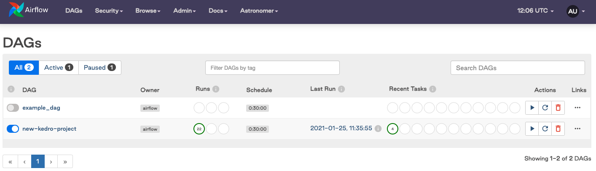
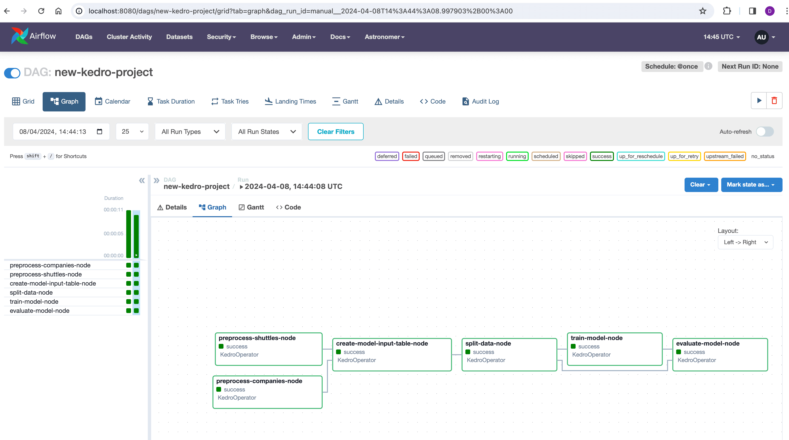

# How to deploy your Kedro pipeline on Apache Airflow with Astronomer

This tutorial explains how to deploy a Kedro project on [Apache Airflow](https://airflow.apache.org/) with [Astronomer](https://www.astronomer.io/). Apache Airflow is an extremely popular open-source workflow management platform. Workflows in Airflow are modelled and organised as [DAGs](https://en.wikipedia.org/wiki/Directed_acyclic_graph), making it a suitable engine to orchestrate and execute a pipeline authored with Kedro. [Astronomer](https://docs.astronomer.io/astro/install-cli) is a managed Airflow platform which allows users to spin up and run an Airflow cluster easily in production. Additionally, it also provides a set of tools to help users get started with Airflow locally in the easiest way possible.

The following discusses how to run the [example Iris classification pipeline](../get_started/example_project.md) on a local Airflow cluster with Astronomer.

## Strategy

The general strategy to deploy a Kedro pipeline on Apache Airflow is to run every Kedro node as an [Airflow task](https://airflow.apache.org/docs/apache-airflow/stable/concepts/tasks.html) while the whole pipeline is converted into a [DAG](https://airflow.apache.org/docs/apache-airflow/stable/concepts/dags.html) for orchestration purpose. This approach mirrors the principles of running Kedro in a [distributed](distributed.md) environment.

## Prerequisites

To follow this tutorial, ensure you have the following:

* An Airflow cluster: you can follow [Astronomer's quickstart guide](https://docs.astronomer.io/astro/#get-started) to set one up.
* The [Astro CLI installed](https://docs.astronomer.io/astro/install-cli)
* `kedro>=0.17` installed

## Project Setup

1. [Initialise an Airflow project with Astro](https://docs.astronomer.io/astro/create-project). Let's call it `kedro-airflow-iris`

    ```shell
    mkdir kedro-airflow-iris
    cd kedro-airflow-iris
    astro dev init
    ```

2. Create a new Kedro project using the `pandas-iris` starter. You can use the default value in the project creation process:

    ```shell
    kedro new --starter=pandas-iris
    ```

3. Copy all files and directories under `new-kedro-project`, which was the default project name created in step 2, to the root directory so Kedro and Astro CLI share the same project root:

    ```shell
    cp new-kedro-project/* .
    rm -r new-kedro-project
    ```

    After this step, your project should have the following structure:

    ```console
    .
    ├── Dockerfile
    ├── README.md
    ├── airflow_settings.yaml
    ├── conf
    ├── dags
    ├── data
    ├── docs
    ├── include
    ├── logs
    ├── notebooks
    ├── packages.txt
    ├── plugins
    ├── pyproject.toml
    ├── requirements.txt
    ├── setup.cfg
    └── src
    ```

4. Install [`kedro-airflow~=0.4`](https://github.com/kedro-org/kedro-plugins/tree/main/kedro-airflow). We will use this plugin to convert the Kedro pipeline into an Airflow DAG.

    ```shell
    pip install kedro-airflow~=0.4
    ```

5. Run `pip install -r src/requirements.txt` to install all dependencies.

## Deployment process

### Step 1. Create new configuration environment to prepare a compatible `DataCatalog`

* Create a `conf/airflow` directory in your Kedro project
* Create a `catalog.yml` file in this directory with the following content

```yaml
example_iris_data:
  type: pandas.CSVDataSet
  filepath: data/01_raw/iris.csv
example_train_x:
  type: pickle.PickleDataSet
  filepath: data/05_model_input/example_train_x.pkl
example_train_y:
  type: pickle.PickleDataSet
  filepath: data/05_model_input/example_train_y.pkl
example_test_x:
  type: pickle.PickleDataSet
  filepath: data/05_model_input/example_test_x.pkl
example_test_y:
  type: pickle.PickleDataSet
  filepath: data/05_model_input/example_test_y.pkl
example_model:
  type: pickle.PickleDataSet
  filepath: data/06_models/example_model.pkl
example_predictions:
  type: pickle.PickleDataSet
  filepath: data/07_model_output/example_predictions.pkl
```

This ensures that all datasets are persisted so all Airflow tasks can read them without the need to share memory. In the example here we assume that all Airflow tasks share one disk, but for distributed environment you would need to use non-local filepaths.

### Step 2. Package the Kedro pipeline as an Astronomer-compliant Docker image

* **Step 2.1**: Package the Kedro pipeline as a Python package so you can install it into the container later on:

```shell
kedro package
```

This step should produce a wheel file called `new_kedro_project-0.1-py3-none-any.whl` located at `dist/`.

* **Step 2.2**: Add the `src/` directory to `.dockerignore`, as it's not necessary to bundle the entire code base with the container once we have the packaged wheel file.

```shell
echo "src/" >> .dockerignore
```

* **Step 2.3**: Modify the `Dockerfile` to have the following content:

```Dockerfile
FROM quay.io/astronomer/ap-airflow:2.0.0-buster-onbuild

RUN pip install --user dist/new_kedro_project-0.1-py3-none-any.whl
```

### Step 3. Convert the Kedro pipeline into an Airflow DAG with `kedro airflow`

```shell
kedro airflow create --target-dir=dags/ --env=airflow
```

### Step 4. Launch the local Airflow cluster with Astronomer

```shell
astro dev start
```

If you visit the Airflow UI, you should now see the Kedro pipeline as an Airflow DAG:





## Final thought

This tutorial walks you through the manual process of deploying an existing Kedro project on Apache Airflow with Astronomer. However, if you are starting out, consider using our `astro-airflow-iris` starter which provides all the aforementioned boilerplate out of the box:

```shell
kedro new --starter=astro-airflow-iris
```
