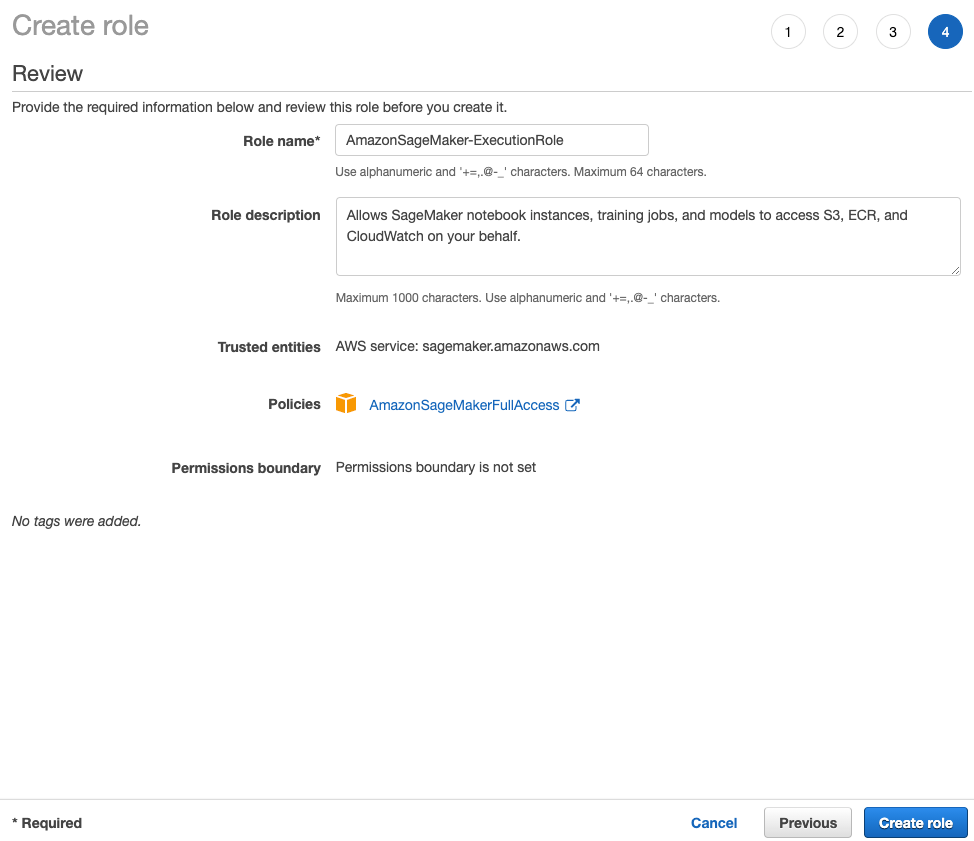

# How to integrate Amazon SageMaker into your Kedro pipeline

This tutorial explains how to integrate a Kedro project with [Amazon SageMaker](https://aws.amazon.com/sagemaker/) in order to train a machine learning model. It shows how to build machine learning pipelines in Kedro and while taking advantage of the power of SageMaker for potentially compute-intensive machine learning tasks.

The Kedro project will still run locally (or on one of many supported workflow engines like [Argo](./argo.md), [Prefect](./prefect.md), [Kubeflow](./kubeflow.md), [AWS Batch](./aws_batch.md) and others), but the model training step will be offloaded onto SageMaker.

## Why would you use Amazon SageMaker?

Machine learning development is a complex, expensive, and labour-intensive process with very specific requirements for the execution environment (ML tools and libraries, hardware requirements for CPU or GPU-optimised algorithms). Amazon SageMaker provides the components used for machine learning in a single toolset so models get to production faster with much less effort and at lower cost. Sagemaker supports both classical machine learning libraries like [`Scikit-Learn`](https://scikit-learn.org/) or [`XGBoost`](https://xgboost.readthedocs.io/), and Deep Learning frameworks such as [`TensorFlow`](https://www.tensorflow.org/) or [`PyTorch`](https://pytorch.org/).

Amazon SageMaker is a fully-managed service and its features are covered by the [official service documentation](https://docs.aws.amazon.com/sagemaker/index.html). In this tutorial we will focus on training a simple machine learning model on SageMaker as part of Kedro pipeline execution.

## Prerequisites

To use Amazon SageMaker, make sure you have the following prerequisites in place:
- An [AWS account set up](https://aws.amazon.com/premiumsupport/knowledge-center/create-and-activate-aws-account/)
- [Configured AWS credentials](https://docs.aws.amazon.com/cli/latest/userguide/cli-configure-files.html) on your local machine
- Generated Kedro project called **Kedro Tutorial** using [Kedro Spaceflights starter](https://github.com/kedro-org/kedro-starters/tree/main/spaceflights/)
- Completed the [spaceflights tutorial](../tutorial/spaceflights_tutorial.md)

## Prepare the environment

### Install SageMaker package dependencies

First, you should add extra package dependencies that are required [to communicate with SageMaker via its Python SDK](https://sagemaker.readthedocs.io/en/stable/).

Add the dependencies by modifying `src/requirements.txt`. Open the corresponding file with a text editor and add the following lines at the end of the file:

```text
sagemaker>=2.13.0
s3fs>=0.3.0, <0.4.1  # will be needed to work with AWS S3
```

Since you have added two extra dependencies, you should install the updated project dependencies by running the following from your terminal:

```bash
cd <project_root>
pip install -r src/requirements.txt
```

```{note}
All CLI commands in the following sections should be executed from the project root directory.
```

### Create SageMaker execution role

1. Sign into the AWS Management Console and open the [IAM console](https://console.aws.amazon.com/iam/)
2. In the left navigation pane, choose `Roles`
3. Choose `Create role`
4. For role type, select `AWS Service`, find and choose `SageMaker`, and then pick the `SageMaker - Execution` use case, then click `Next: Permissions`
5. On the `Attach permissions policy` page, select `AmazonSageMakerFullAccess` managed policy, then click `Next: Review`
6. Give it a name (for example, `AmazonSageMaker-ExecutionRole`) and choose `Create role`



### Create S3 bucket

You should [create a new S3 bucket](https://docs.aws.amazon.com/AmazonS3/latest/user-guide/create-bucket.html) rather than use an existing one because SageMaker jobs will save source script data to the bucket root. Having a dedicated bucket for this tutorial makes the cleanup easier.

Your bucket name should contain the word `sagemaker`, this way the role that we created earlier will automatically have all necessary access permissions to it. Your new bucket does not require public access, so you can leave `Block all public access` setting enabled and preserve other defaults.

It's generally a good practice to create AWS resources (like S3 bucket above) for the tutorial within the same [region](https://aws.amazon.com/about-aws/global-infrastructure/regions_az/#Regions) that you have in your [local configuration](#prerequisites) where possible. It helps reduce the network transmission latency and ensure that different services can talk to each other.

## Update the Kedro project

### Create the configuration environment

Configuration in Kedro is logically separated into [configuration environments](../kedro_project_setup/configuration.md#additional-configuration-environments) which are loaded in specific order where the project is run. To separate SageMaker-specific configuration from the default one, let's create a new configuration environment. Go ahead and create a `conf/sagemaker` folder and then create the following files in it.

```{note}
`${key}` in the YAML snippets below is a special syntax which allows you to template the project configuration. You don't need to replace those values, just paste them as-is.
```

* `catalog.yml` - defines the datasets that need to be saved into S3 (rather than kept in memory):

```yaml
X_train@pickle:
  type: pickle.PickleDataSet
  filepath: ${s3.train_path}/X_train.pickle

X_train@path:
  type: MemoryDataSet
  data: ${s3.train_path}/X_train.pickle

y_train:
  type: pickle.PickleDataSet
  filepath: ${s3.train_path}/y_train.pickle
```

> *Node:* `@pickle` and `@path` in the dataset names above correspond to the [dataset transcoding feature of Kedro](../data/data_catalog.md#transcode-datasets). This allows to pass S3 path to the `X_train` dataset instead of the actual data itself to the `train_model_sagemaker` node that you will create shortly.

* `parameters.yml` - contains the configuration for [SageMaker Scikit Learn Estimator](https://sagemaker.readthedocs.io/en/stable/frameworks/sklearn/sagemaker.sklearn.html#scikit-learn-estimator):

```yaml
sklearn_estimator_kwargs:
  entry_point: src/kedro_tutorial/sagemaker_entry_point.py  # you will create this file later
  role: <your_sagemaker_role_name>  # put the name of the role you've created earlier
  instance_type: ml.m4.xlarge
  instance_count: 1
  framework_version: 0.23-1
  output_path: ${s3.output_path}
```

* `globals.yml` - contains the values that will be used to extrapolate the values in the config files above (you will need to replace the bucket name in the snippet below):

```yaml
s3:
  train_path: s3://<your_s3_bucket_name>/train
  output_path: s3://<your_s3_bucket_name>/output
```

### Update the project hooks

Now you need to tell Kedro to use the [`TemplatedConfigLoader`](/kedro.config.TemplatedConfigLoader) instead of the default `ConfigLoader` class to read the project configuration. It is very easy to do via `settings.py` file - open `src/kedro_tutorial/settings.py` file and set the `CONFIG_LOADER_CLASS` constant:

```python
from kedro.config import TemplatedConfigLoader


CONFIG_LOADER_CLASS = TemplatedConfigLoader
```

### Update the data science pipeline

Now modify the data science pipeline in the project to send the training job to Amazon SageMaker and to process the resulting model artifact afterwards.

#### Create node functions

Open `src/kedro_tutorial/pipelines/data_science/nodes.py` and add these new node functions:

<details>
<summary><b>Click to expand</b></summary>

```python
import pickle
import tarfile
from typing import Any, Dict

import fsspec
from sagemaker.sklearn.estimator import SKLearn
from sklearn.linear_model import LinearRegression

# <other node functions>


def train_model_sagemaker(
    X_train_path: str, sklearn_estimator_kwargs: Dict[str, Any]
) -> str:
    """Train the linear regression model on SageMaker.

    Args:
        X_train_path: Full S3 path to `X_train` dataset.
        sklearn_estimator_kwargs: Keyword arguments that will be used
            to instantiate SKLearn estimator.

    Returns:
        Full S3 path to `model.tar.gz` file containing the model artifact.

    """
    sklearn_estimator = SKLearn(**sklearn_estimator_kwargs)

    # we need a path to the directory containing both
    # X_train (feature table) and y_train (target variable)
    inputs_dir = X_train_path.rsplit("/", 1)[0]
    inputs = {"train": inputs_dir}

    # wait=True ensures that the execution is blocked
    # until the job finishes on SageMaker
    sklearn_estimator.fit(inputs=inputs, wait=True)

    training_job = sklearn_estimator.latest_training_job
    job_description = training_job.describe()
    model_path = job_description["ModelArtifacts"]["S3ModelArtifacts"]
    return model_path


def untar_model(model_path: str) -> LinearRegression:
    """Unarchive the linear regression model artifact produced
    by the training job on SageMaker.

        Args:
            model_path: Full S3 path to `model.tar.gz` file containing
                the model artifact.

        Returns:
            Trained model.

    """
    with fsspec.open(model_path) as s3_file, tarfile.open(
        fileobj=s3_file, mode="r:gz"
    ) as tar:
        # we expect to have only one file inside the `model.tar.gz` archive
        filename = tar.getnames()[0]
        model_obj = tar.extractfile(filename)
        return pickle.load(model_obj)
```
</details>

#### Update the pipeline definition

Open `src/kedro_tutorial/pipelines/data_science/pipeline.py` and replace its contents with the following:

<details>
<summary><b>Click to expand</b></summary>

```python
from kedro.pipeline import Pipeline, node

from .nodes import (
    evaluate_model,
    split_data,
    train_model_sagemaker,
    untar_model,
)


def create_pipeline(**kwargs) -> Pipeline:
    return pipeline(
        [
            node(
                func=split_data,
                inputs=["model_input_table", "parameters"],
                outputs=["X_train@pickle", "X_test", "y_train", "y_test"],
            ),
            node(
                func=train_model_sagemaker,
                inputs=["X_train@path", "params:sklearn_estimator_kwargs"],
                outputs="model_path",
            ),
            node(untar_model, inputs="model_path", outputs="regressor"),
            node(
                func=evaluate_model,
                inputs=["regressor", "X_test", "y_test"],
                outputs=None,
            ),
        ]
    )
```
</details>

Great, you are almost ready to run your pipeline with the SageMaker integration. The last step before we can do that will be to create the entry point script.

### Create the SageMaker entry point

SageMaker job requires an entry point script that it will execute to perform the actual model training. This script will be automatically uploaded into S3 and run as part of the training job. SageMaker will also automatically [download the training data from S3](https://sagemaker.readthedocs.io/en/stable/overview.html#prepare-a-training-script) to the container before running the job and then upload the trained model artifact back into S3 after the job is complete. Therefore the entry point script does not need to worry about data transfer from and to S3, but it will need to serialise/deserialise such data using `pickle`.

Create the file `src/kedro_tutorial/sagemaker_entry_point.py` and paste the following into it:

<details>
<summary><b>Click to expand</b></summary>

```python
import argparse
import pickle
from os import getenv
from pathlib import Path
from typing import Any

from sklearn.linear_model import LinearRegression


def _pickle(path: Path, data: Any) -> None:
    """Pickle the object and save it to disk"""
    with path.open("wb") as f:
        pickle.dump(data, f)


def _unpickle(path: Path) -> Any:
    """Unpickle the object from a given file"""
    with path.open("rb") as f:
        return pickle.load(f)


def _get_arg_parser() -> argparse.ArgumentParser:
    """Instantiate the command line argument parser"""
    parser = argparse.ArgumentParser()

    parser.add_argument(
        "--output-data-dir", type=str, default=getenv("SM_OUTPUT_DATA_DIR")
    )
    parser.add_argument("--model-dir", type=str, default=getenv("SM_MODEL_DIR"))
    parser.add_argument("--train", type=str, default=getenv("SM_CHANNEL_TRAIN"))
    parser.add_argument("--test", type=str, default=getenv("SM_CHANNEL_TEST"))

    return parser


def main():
    """The main script entry point which will be called by SageMaker
    when running the training job
    """
    parser = _get_arg_parser()
    args = parser.parse_args()

    data_path = Path(args.train)
    X_train = _unpickle(data_path / "X_train.pickle")
    y_train = _unpickle(data_path / "y_train.pickle")

    regressor = LinearRegression()
    regressor.fit(X_train, y_train)

    model_dir = Path(args.model_dir)
    _pickle(model_dir / "regressor.pickle", regressor)


if __name__ == "__main__":
    # SageMaker will run this script as the main program
    main()
```
</details>

## Run the project

You are now ready to run your project! To do that, execute the following CLI command:
```bash
kedro run --env sagemaker
```

The first 4 nodes of the pipeline will still run locally, but then you should see a similar output in the terminal:

```console
2020-10-06 21:20:25,696 - kedro.runner.sequential_runner - INFO - Completed 4 out of 7 tasks
2020-10-06 21:20:25,696 - kedro.io.data_catalog - INFO - Loading data from `X_train@path` (MemoryDataSet)...
2020-10-06 21:20:25,696 - kedro.io.data_catalog - INFO - Loading data from `params:sklearn_estimator_kwargs` (MemoryDataSet)...
2020-10-06 21:20:25,697 - kedro.pipeline.node - INFO - Running node: train_model_sagemaker([X_train@path,params:sklearn_estimator_kwargs]) -> [model_path]
2020-10-06 21:20:25,713 - botocore.credentials - INFO - Found credentials in shared credentials file: ~/.aws/credentials
2020-10-06 21:20:25,793 - sagemaker.image_uris - INFO - Same images used for training and inference. Defaulting to image scope: inference.
2020-10-06 21:20:27,197 - sagemaker - INFO - Creating training-job with name: sagemaker-scikit-learn-2020-10-06-20-20-25-801
2020-10-06 20:20:27 Starting - Starting the training job...
2020-10-06 20:20:33 Starting - Launching requested ML instances...
2020-10-06 20:21:31 Starting - Preparing the instances for training...
2020-10-06 20:22:27 Downloading - Downloading input data...
2020-10-06 20:23:02 Training - Downloading the training image...

... [SageMaker Job Logs] ...

2020-10-06 20:23:56 Uploading - Uploading generated training model
2020-10-06 20:23:56 Completed - Training job completed
2020-10-06 21:24:20,485 - kedro.io.data_catalog - INFO - Saving data to `model_path` (MemoryDataSet)...
2020-10-06 21:24:20,486 - kedro.runner.sequential_runner - INFO - Completed 5 out of 7 tasks
```

You should also find your training job if you open [SageMaker console](https://console.aws.amazon.com/sagemaker/home) and choose `Training jobs` tab from the left.

Now you know how to run serverless machine learning jobs using SageMaker right from your Kedro pipeline!

## Cleanup

To cleanup the resources, [delete the S3 bucket](https://docs.aws.amazon.com/AmazonS3/latest/userguide/delete-bucket.html) and, optionally, the [IAM role you've created earlier](#create-sagemaker-execution-role) (IAM resources are free). The job details of an already completed SageMaker training job cannot be deleted, but such jobs incur no costs.
