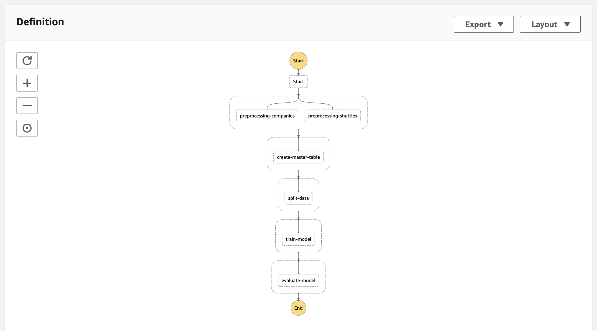
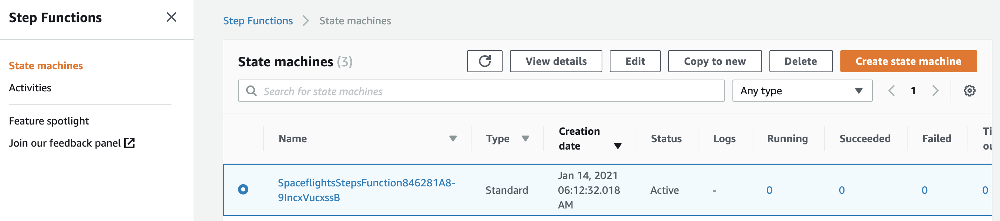
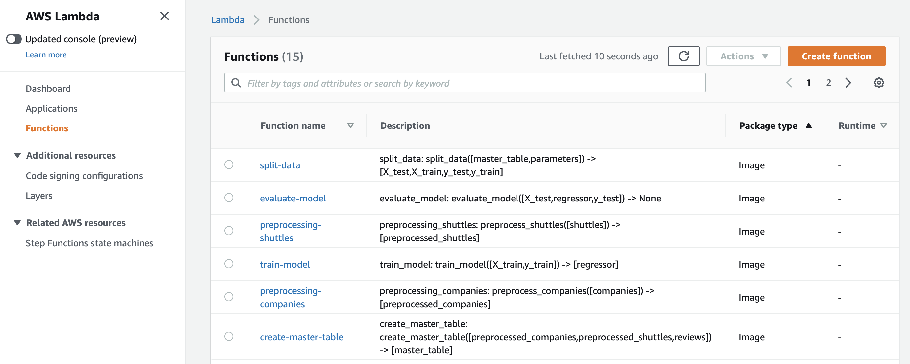

# AWS Step Functions

This tutorial explains how to deploy a Kedro project with [AWS Step Functions](https://aws.amazon.com/step-functions/?step-functions.sort-by=item.additionalFields.postDateTime&step-functions.sort-order=desc) in order to run a Kedro pipeline in production on AWS [Serverless Computing](https://aws.amazon.com/serverless/) platform.

## Why would you run a Kedro pipeline with AWS Step Functions?

A major problem when data pipelines move to production is to build and maintain the underlying compute infrastructure, or [servers](https://en.wikipedia.org/wiki/Server_(computing)). [Serverless computing](https://en.wikipedia.org/wiki/Serverless_computing) hands the provisioning and management of distributed computing resources to cloud providers, enabling data engineers and data scientists to focus on their business problems.

[Azure Functions](https://docs.microsoft.com/en-us/azure/azure-functions/) and [AWS Lambda](https://aws.amazon.com/lambda/) are good examples of this solution, but others are available. Services like [AWS Step Functions](https://aws.amazon.com/step-functions/) offer a managed orchestration capability that makes it easy to sequence serverless functions and multiple cloud-native services into business-critical applications.

From a Kedro perspective, this means the ability to run each node and retain the pipeline's correctness and reliability through a managed orchestrator without the concerns of managing underlying infrastructure. Another benefit of running a Kedro pipeline in a serverless computing platform is the ability to take advantage of other services from the same provider, such as the use of the [feature store for Amazon SageMaker](https://aws.amazon.com/sagemaker/feature-store/) to store features data.

The following discusses how to run the Kedro pipeline from the [spaceflights tutorial](../tutorial/spaceflights_tutorial.md) on [AWS Step Functions](https://aws.amazon.com/step-functions/).


## Strategy

The general strategy to deploy a Kedro pipeline on AWS Step Functions is to run every Kedro node as an [AWS Lambda](https://aws.amazon.com/lambda/) function. The whole pipeline is converted into an [AWS Step Functions State Machine](https://docs.aws.amazon.com/step-functions/latest/dg/tutorial-creating-lambda-state-machine.html) for orchestration. This approach mirrors the principles of [running Kedro in a distributed environment](distributed).

## Prerequisites

To use AWS Step Functions, ensure you have the following:

- An [AWS account set up](https://aws.amazon.com/premiumsupport/knowledge-center/create-and-activate-aws-account/)
- [Configured AWS credentials](https://docs.aws.amazon.com/cli/latest/userguide/cli-configure-files.html) on your local machine
- Generated Kedro project called **Spaceflights Step Functions** using [Kedro Spaceflights starter](https://github.com/kedro-org/kedro-starters/tree/main/spaceflights-pandas/).
  - The final project directory's name should be `spaceflights-step-functions`.
  - You should complete the [spaceflights tutorial](../tutorial/spaceflights_tutorial.md) to understand the project's structure.

* In this tutorial, we will also be using [AWS Cloud Development Kit (CDK)](https://aws.amazon.com/cdk/) to write our deployment script. To install the `cdk` command, please consult [AWS guide](https://docs.aws.amazon.com/cdk/latest/guide/cli.html). The official method of installation is using [npm](https://www.npmjs.com/):

```console
$ npm install -g aws-cdk
# to verify that the cdk command has been installed
$ cdk -h
```

## Deployment process

The deployment process for a Kedro pipeline on AWS Step Functions consists of the following steps:

* Develop the Kedro pipeline locally as normal
* Create a new configuration environment in which we ensure all nodes' inputs and outputs have a persistent location on S3, since `MemoryDataset` can't be shared between AWS Lambda functions
* Package the Kedro pipeline as an [AWS Lambda-compliant Docker image](https://docs.aws.amazon.com/lambda/latest/dg/lambda-images.html)
* Write a script to convert and deploy each Kedro node as an AWS Lambda function. Each function will use the same pipeline Docker image created in the previous step and run a single Kedro node associated with it. This follows the principles laid out in our [distributed deployment guide](distributed).
* The script above will also convert and deploy the entire Kedro pipeline as an AWS Step Functions State Machine.

The final deployed AWS Step Functions State Machine will have the following visualisation in AWS Management Console:



The rest of the tutorial will explain each step in the deployment process above in details.

### Step 1. Create new configuration environment to prepare a compatible `DataCatalog`

* Create a `conf/aws` directory in your Kedro project
* Put a `catalog.yml` file in this directory with the following content
* Ensure that you have `s3fs>=0.3.0,<0.5` defined in your `requirements.txt` so the data can be read from S3.

<details>
<summary><b>Click to expand</b></summary>

```yaml
companies:
  type: pandas.CSVDataset
  filepath: s3://<your-bucket>/companies.csv

reviews:
  type: pandas.CSVDataset
  filepath: s3://<your-bucket>/reviews.csv

shuttles:
  type: pandas.ExcelDataset
  filepath: s3://<your-bucket>/shuttles.xlsx

preprocessed_companies:
  type: pandas.CSVDataset
  filepath: s3://<your-bucket>/preprocessed_companies.csv

preprocessed_shuttles:
  type: pandas.CSVDataset
  filepath: s3://<your-bucket>/preprocessed_shuttles.csv

model_input_table:
  type: pandas.CSVDataset
  filepath: s3://<your-bucket>/model_input_table.csv

regressor:
  type: pickle.PickleDataset
  filepath: s3://<your-bucket>/regressor.pickle
  versioned: true

X_train:
  type: pickle.PickleDataset
  filepath: s3://<your-bucket>/X_train.pickle

X_test:
  type: pickle.PickleDataset
  filepath: s3://<your-bucket>/X_test.pickle

y_train:
  type: pickle.PickleDataset
  filepath: s3://<your-bucket>/y_train.pickle

y_test:
  type: pickle.PickleDataset
  filepath: s3://<your-bucket>/y_test.pickle
```

</details>

### Step 2. Package the Kedro pipeline as an AWS Lambda-compliant Docker image

In December 2020, [AWS announced that an AWS Lambda function can now use a container image up to **10 GB in size**](https://aws.amazon.com/blogs/aws/new-for-aws-lambda-container-image-support/) as its deployment package, besides the original zip method. As it has a few [requirements for the container image to work properly](https://docs.aws.amazon.com/lambda/latest/dg/images-create.html#images-reqs), you must build your own custom Docker container image, both to contain the Kedro pipeline and to comply with Lambda's requirements.

```{note}
All the following steps should be done in the Kedro project's root directory.
```

* **Step 2.1**: Package the Kedro pipeline as a Python package so you can install it into the container later on:

```console
$ kedro package
```

For more information, please visit the guide on [packaging Kedro as a Python package](../tutorial/package_a_project).

* **Step 2.2**: Create a `lambda_handler.py` file:

```python
from unittest.mock import patch


def handler(event, context):
    from kedro.framework.project import configure_project

    configure_project("spaceflights_step_functions")
    node_to_run = event["node_name"]

    # Since _multiprocessing.SemLock is not implemented on lambda yet,
    # we mock it out so we could import the session. This has no impact on the correctness
    # of the pipeline, as each Lambda function runs a single Kedro node, hence no need for Lock
    # during import. For more information, please see this StackOverflow discussion:
    # https://stackoverflow.com/questions/34005930/multiprocessing-semlock-is-not-implemented-when-running-on-aws-lambda
    with patch("multiprocessing.Lock"):
        from kedro.framework.session import KedroSession

        with KedroSession.create(env="aws") as session:
            session.run(node_names=[node_to_run])
```

This file acts as the handler for each Lambda function in our pipeline, receives the name of a Kedro node from a triggering event and executes it accordingly.

* **Step 2.3**: Create a `Dockerfile` to define the custom Docker image to act as the base for our Lambda functions:

```Dockerfile
# Define global args
ARG FUNCTION_DIR="/home/app/"
ARG RUNTIME_VERSION="3.8"

# Stage 1 - bundle base image + runtime
# Grab a fresh copy of the image and install GCC
FROM python:${RUNTIME_VERSION}-buster as build-image

# Install aws-lambda-cpp build dependencies
RUN apt-get update && \
  apt-get install -y \
  g++ \
  make \
  cmake \
  unzip \
  libcurl4-openssl-dev

# Include global args in this stage of the build
ARG FUNCTION_DIR
ARG RUNTIME_VERSION
# Create the function directory
RUN mkdir -p ${FUNCTION_DIR}
RUN mkdir -p ${FUNCTION_DIR}/{conf}
# Add handler function
COPY lambda_handler.py ${FUNCTION_DIR}
# Add conf/ directory
COPY conf ${FUNCTION_DIR}/conf
# Install Kedro pipeline
COPY dist/spaceflights_step_functions-0.1-py3-none-any.whl .
RUN python${RUNTIME_VERSION} -m pip install --no-cache-dir spaceflights_step_functions-0.1-py3-none-any.whl --target ${FUNCTION_DIR}
# Install Lambda Runtime Interface Client for Python
RUN python${RUNTIME_VERSION} -m pip install --no-cache-dir awslambdaric --target ${FUNCTION_DIR}

# Stage 3 - final runtime image
# Grab a fresh copy of the Python image
FROM python:${RUNTIME_VERSION}-buster
# Include global arg in this stage of the build
ARG FUNCTION_DIR
# Set working directory to function root directory
WORKDIR ${FUNCTION_DIR}
# Copy in the built dependencies
COPY --from=build-image ${FUNCTION_DIR} ${FUNCTION_DIR}
ENTRYPOINT [ "/usr/local/bin/python", "-m", "awslambdaric" ]
CMD [ "lambda_handler.handler" ]
```

This `Dockerfile` is adapted from the official guide on [how to create a custom image](https://docs.aws.amazon.com/lambda/latest/dg/images-create.html#images-types) for Lambda to include Kedro-specific steps.

* **Step 2.4**: Build the Docker image and push it to AWS Elastic Container Registry (ECR):

```console
# build and tag the image
$ docker build -t spaceflights-step-functions .
$ docker tag spaceflights-step-functions:latest <your-aws-account-id>.dkr.ecr.<your-aws-region>.amazonaws.com/spaceflights-step-functions:latest
# login to ECR
$ aws ecr get-login-password | docker login --username AWS --password-stdin <your-aws-account-id>.dkr.ecr.<your-aws-region>.amazonaws.com
# push the image to ECR
$ docker push <your-aws-account-id>.dkr.ecr.<your-aws-region>.amazonaws.com/spaceflights-step-functions:latest
```

### Step 3. Write the deployment script

As you will write our deployment script using [AWS CDK in Python](https://docs.aws.amazon.com/cdk/latest/guide/work-with-cdk-python.html), you will have to install some required dependencies from CDK.

* **Step 3.1**: Create a `deploy_requirements.txt` with the following content:

```
aws_cdk.aws_s3
aws_cdk.core
aws-cdk.aws_ecr
aws-cdk.aws_lambda
aws-cdk.aws-stepfunctions
aws-cdk.aws-stepfunctions-tasks
```

Then install these dependencies with `pip`:

```console
$ pip install -r deploy_requirements.txt
```

* **Step 3.2**: Create a `deploy.py` file:

```python
import re
from pathlib import Path

from aws_cdk import aws_stepfunctions as sfn
from aws_cdk import aws_s3 as s3
from aws_cdk import core, aws_lambda, aws_ecr
from aws_cdk.aws_lambda import IFunction
from aws_cdk.aws_stepfunctions_tasks import LambdaInvoke
from kedro.framework.project import pipelines
from kedro.framework.session import KedroSession
from kedro.framework.startup import bootstrap_project
from kedro.pipeline.node import Node


def _clean_name(name: str) -> str:
    """Reformat a name to be compliant with AWS requirements for their resources.

    Returns:
        name: formatted name.
    """
    return re.sub(r"[\W_]+", "-", name).strip("-")[:63]


class KedroStepFunctionsStack(core.Stack):
    """A CDK Stack to deploy a Kedro pipeline to AWS Step Functions."""

    env = "aws"
    project_path = Path.cwd()
    erc_repository_name = project_path.name
    s3_data_bucket_name = (
        "spaceflights-step-functions"  # this is where the raw data is located
    )

    def __init__(self, scope: core.Construct, id: str, **kwargs) -> None:
        super().__init__(scope, id, **kwargs)

        self._parse_kedro_pipeline()
        self._set_ecr_repository()
        self._set_ecr_image()
        self._set_s3_data_bucket()
        self._convert_kedro_pipeline_to_step_functions_state_machine()

    def _parse_kedro_pipeline(self) -> None:
        """Extract the Kedro pipeline from the project"""
        metadata = bootstrap_project(self.project_path)

        self.project_name = metadata.project_name
        self.pipeline = pipelines.get("__default__")

    def _set_ecr_repository(self) -> None:
        """Set the ECR repository for the Lambda base image"""
        self.ecr_repository = aws_ecr.Repository.from_repository_name(
            self, id="ECR", repository_name=self.erc_repository_name
        )

    def _set_ecr_image(self) -> None:
        """Set the Lambda base image"""
        self.ecr_image = aws_lambda.EcrImageCode(repository=self.ecr_repository)

    def _set_s3_data_bucket(self) -> None:
        """Set the S3 bucket containing the raw data"""
        self.s3_bucket = s3.Bucket(
            self, "RawDataBucket", bucket_name=self.s3_data_bucket_name
        )

    def _convert_kedro_node_to_lambda_function(self, node: Node) -> IFunction:
        """Convert a Kedro node into an AWS Lambda function"""
        func = aws_lambda.Function(
            self,
            id=_clean_name(f"{node.name}_fn"),
            description=str(node),
            code=self.ecr_image,
            handler=aws_lambda.Handler.FROM_IMAGE,
            runtime=aws_lambda.Runtime.FROM_IMAGE,
            environment={},
            function_name=_clean_name(node.name),
            memory_size=256,
            reserved_concurrent_executions=10,
            timeout=core.Duration.seconds(15 * 60),
        )
        self.s3_bucket.grant_read_write(func)
        return func

    def _convert_kedro_node_to_sfn_task(self, node: Node) -> LambdaInvoke:
        """Convert a Kedro node into an AWS Step Functions Task"""
        return LambdaInvoke(
            self,
            _clean_name(node.name),
            lambda_function=self._convert_kedro_node_to_lambda_function(node),
            payload=sfn.TaskInput.from_object({"node_name": node.name}),
        )

    def _convert_kedro_pipeline_to_step_functions_state_machine(self) -> None:
        """Convert Kedro pipeline into an AWS Step Functions State Machine"""
        definition = sfn.Pass(self, "Start")

        for i, group in enumerate(self.pipeline.grouped_nodes, 1):
            group_name = f"Group {i}"
            sfn_state = sfn.Parallel(self, group_name)
            for node in group:
                sfn_task = self._convert_kedro_node_to_sfn_task(node)
                sfn_state.branch(sfn_task)

            definition = definition.next(sfn_state)

        sfn.StateMachine(
            self,
            self.project_name,
            definition=definition,
            timeout=core.Duration.seconds(5 * 60),
        )


app = core.App()
KedroStepFunctionsStack(app, "KedroStepFunctionsStack")
app.synth()
```

This script contains the logic to convert a Kedro pipeline into an AWS Step Functions State Machine with each Kedro node defined as a Lambda function using the Docker image in Step 2. You will then need to register it with CDK by creating a `cdk.json` with the following content:

```json
{
  "app": "python3 deploy.py"
}
```

And that's it! You are now ready to deploy and run the Kedro pipeline on AWS Step Functions.

### Step 4. Deploy the pipeline

Deploying with CDK is very straightforward. You just need to run:

```console
$ cdk deploy
```

After the deployment finishes, when you log into AWS Management Console, you should be able to see an AWS Step Functions State Machine created for your pipeline:



As well as the corresponding Lambda functions for each Kedro node:



If you go into the state machine and click on `Start Execution`, you will be able to see a full end-to-end (E2E) run of the Kedro pipeline on AWS Step Functions.

## Limitations

Generally speaking, the [limitations on AWS Lambda](https://docs.aws.amazon.com/lambda/latest/dg/gettingstarted-limits.html) have improved dramatically in recent years. However, it's still worth noting that each Lambda function has a 15-minute timeout, 10GB maximum memory limit and 10GB container image code package size limit. This means, for example, if you have a node that takes longer than 15 minutes to run, you should switch to some other AWS services, such as [AWS Batch](aws_batch) or [AWS ECS](https://aws.amazon.com/ecs/), to execute that node.
