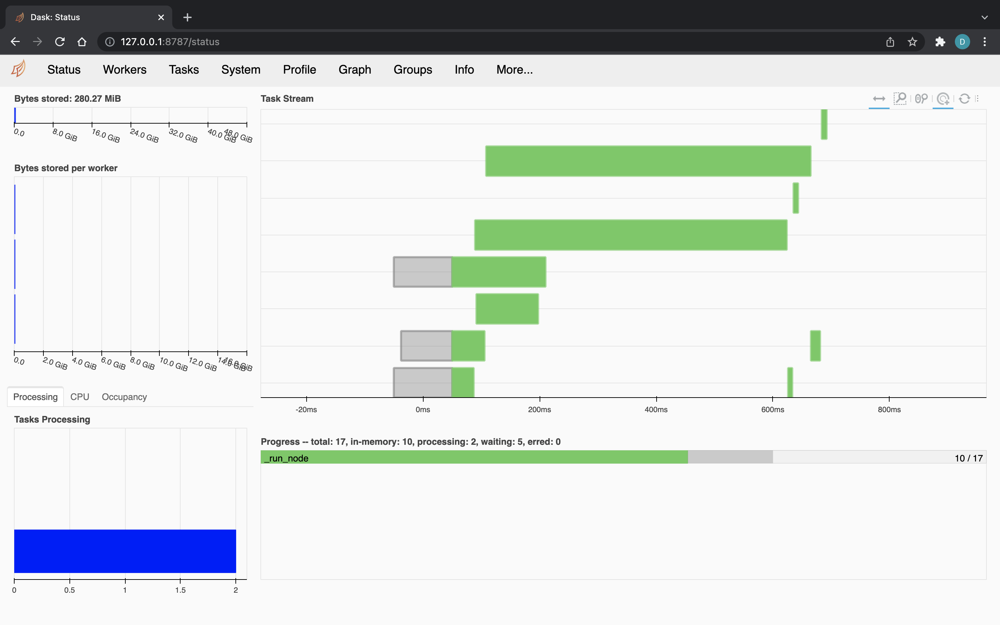

# Dask

This page explains how to distribute execution of the nodes composing your Kedro pipeline using [Dask](https://docs.dask.org/en/stable/), a flexible, open-source library for parallel computing in Python.

Dask offers both a default, single-machine scheduler and a more sophisticated, distributed scheduler. The newer [`dask.distributed`](http://distributed.dask.org/en/stable/) scheduler is often preferable, even on single workstations, and is the focus of our deployment guide. For more information on the various ways to set up Dask on varied hardware, see [the official Dask how-to guide](https://docs.dask.org/en/stable/how-to/deploy-dask-clusters.html).

## Why would you use Dask?

`Dask.distributed` is a lightweight library for distributed computing in Python. It complements the existing PyData analysis stack, which forms the basis of many Kedro pipelines. It's also pure Python, which eases installation and simplifies debugging. For further motivation on why people choose to adopt Dask, and, more specifically, `dask.distributed`, see [Why Dask?](https://docs.dask.org/en/stable/why.html) and [the `dask.distributed` documentation](http://distributed.dask.org/en/stable/#motivation), respectively.

## Prerequisites

The only additional requirement, beyond what was already required by your Kedro pipeline, is to [install `dask.distributed`](http://distributed.dask.org/en/stable/install.html). To review the full installation instructions, including how to set up Python virtual environments, see our [Get Started guide](../get_started/install.md#installation-prerequisites).

## How to distribute your Kedro pipeline using Dask

### Create a custom runner

Create a new Python package `runner` in your `src` folder, i.e. `kedro_tutorial/src/kedro_tutorial/runner/`. Make sure there is an `__init__.py` file at this location, and add another file named `dask_runner.py`, which will contain the implementation of your custom runner, `DaskRunner`. The `DaskRunner` will submit and monitor tasks asynchronously, surfacing any errors that occur during execution.

Make sure the `__init__.py` file in the `runner` folder includes the following import and declaration:

```python
from .dask_runner import DaskRunner

__all__ = ["DaskRunner"]
```

Copy the contents of the script below into `dask_runner.py`:

```python
"""``DaskRunner`` is an ``AbstractRunner`` implementation. It can be
used to distribute execution of ``Node``s in the ``Pipeline`` across
a Dask cluster, taking into account the inter-``Node`` dependencies.
"""
from collections import Counter
from itertools import chain
from typing import Any, Dict

from distributed import Client, as_completed, worker_client
from kedro.framework.hooks.manager import (
    _create_hook_manager,
    _register_hooks,
    _register_hooks_setuptools,
)
from kedro.framework.project import settings
from kedro.io import AbstractDataset, DataCatalog
from kedro.pipeline import Pipeline
from kedro.pipeline.node import Node
from kedro.runner import AbstractRunner, run_node
from pluggy import PluginManager


class _DaskDataset(AbstractDataset):
    """``_DaskDataset`` publishes/gets named datasets to/from the Dask
    scheduler."""

    def __init__(self, name: str):
        self._name = name

    def _load(self) -> Any:
        try:
            with worker_client() as client:
                return client.get_dataset(self._name)
        except ValueError:
            # Upon successfully executing the pipeline, the runner loads
            # free outputs on the scheduler (as opposed to on a worker).
            Client.current().get_dataset(self._name)

    def _save(self, data: Any) -> None:
        with worker_client() as client:
            client.publish_dataset(data, name=self._name, override=True)

    def _exists(self) -> bool:
        return self._name in Client.current().list_datasets()

    def _release(self) -> None:
        Client.current().unpublish_dataset(self._name)

    def _describe(self) -> Dict[str, Any]:
        return dict(name=self._name)


class DaskRunner(AbstractRunner):
    """``DaskRunner`` is an ``AbstractRunner`` implementation. It can be
    used to distribute execution of ``Node``s in the ``Pipeline`` across
    a Dask cluster, taking into account the inter-``Node`` dependencies.
    """

    def __init__(self, client_args: Dict[str, Any] = {}, is_async: bool = False):
        """Instantiates the runner by creating a ``distributed.Client``.

        Args:
            client_args: Arguments to pass to the ``distributed.Client``
                constructor.
            is_async: If True, the node inputs and outputs are loaded and saved
                asynchronously with threads. Defaults to False.
        """
        super().__init__(is_async=is_async)
        Client(**client_args)

    def __del__(self):
        Client.current().close()

    def create_default_dataset(self, ds_name: str) -> _DaskDataset:
        """Factory method for creating the default dataset for the runner.

        Args:
            ds_name: Name of the missing dataset.

        Returns:
            An instance of ``_DaskDataset`` to be used for all
            unregistered datasets.
        """
        return _DaskDataset(ds_name)

    @staticmethod
    def _run_node(
        node: Node,
        catalog: DataCatalog,
        is_async: bool = False,
        session_id: str = None,
        *dependencies: Node,
    ) -> Node:
        """Run a single `Node` with inputs from and outputs to the `catalog`.

        Wraps ``run_node`` to accept the set of ``Node``s that this node
        depends on. When ``dependencies`` are futures, Dask ensures that
        the upstream node futures are completed before running ``node``.

        A ``PluginManager`` instance is created on each worker because the
        ``PluginManager`` can't be serialised.

        Args:
            node: The ``Node`` to run.
            catalog: A ``DataCatalog`` containing the node's inputs and outputs.
            is_async: If True, the node inputs and outputs are loaded and saved
                asynchronously with threads. Defaults to False.
            session_id: The session id of the pipeline run.
            dependencies: The upstream ``Node``s to allow Dask to handle
                dependency tracking. Their values are not actually used.

        Returns:
            The node argument.
        """
        hook_manager = _create_hook_manager()
        _register_hooks(hook_manager, settings.HOOKS)
        _register_hooks_setuptools(hook_manager, settings.DISABLE_HOOKS_FOR_PLUGINS)

        return run_node(node, catalog, hook_manager, is_async, session_id)

    def _run(
        self,
        pipeline: Pipeline,
        catalog: DataCatalog,
        hook_manager: PluginManager,
        session_id: str = None,
    ) -> None:
        nodes = pipeline.nodes
        load_counts = Counter(chain.from_iterable(n.inputs for n in nodes))
        node_dependencies = pipeline.node_dependencies
        node_futures = {}

        client = Client.current()
        for node in nodes:
            dependencies = (
                node_futures[dependency] for dependency in node_dependencies[node]
            )
            node_futures[node] = client.submit(
                DaskRunner._run_node,
                node,
                catalog,
                self._is_async,
                session_id,
                *dependencies,
            )

        for i, (_, node) in enumerate(
            as_completed(node_futures.values(), with_results=True)
        ):
            self._logger.info("Completed node: %s", node.name)
            self._logger.info("Completed %d out of %d tasks", i + 1, len(nodes))

            # Decrement load counts, and release any datasets we
            # have finished with. This is particularly important
            # for the shared, default datasets we created above.
            for dataset in node.inputs:
                load_counts[dataset] -= 1
                if load_counts[dataset] < 1 and dataset not in pipeline.inputs():
                    catalog.release(dataset)
            for dataset in node.outputs:
                if load_counts[dataset] < 1 and dataset not in pipeline.outputs():
                    catalog.release(dataset)

    def run_only_missing(
        self, pipeline: Pipeline, catalog: DataCatalog
    ) -> Dict[str, Any]:
        """Run only the missing outputs from the ``Pipeline`` using the
        datasets provided by ``catalog``, and save results back to the
        same objects.

        Args:
            pipeline: The ``Pipeline`` to run.
            catalog: The ``DataCatalog`` from which to fetch data.
        Raises:
            ValueError: Raised when ``Pipeline`` inputs cannot be
                satisfied.

        Returns:
            Any node outputs that cannot be processed by the
            ``DataCatalog``. These are returned in a dictionary, where
            the keys are defined by the node outputs.
        """
        free_outputs = pipeline.outputs() - set(catalog.list())
        missing = {ds for ds in catalog.list() if not catalog.exists(ds)}
        to_build = free_outputs | missing
        to_rerun = pipeline.only_nodes_with_outputs(*to_build) + pipeline.from_inputs(
            *to_build
        )

        # We also need any missing datasets that are required to run the
        # `to_rerun` pipeline, including any chains of missing datasets.
        unregistered_ds = pipeline.datasets() - set(catalog.list())
        # Some of the unregistered datasets could have been published to
        # the scheduler in a previous run, so we need not recreate them.
        missing_unregistered_ds = {
            ds_name
            for ds_name in unregistered_ds
            if not self.create_default_dataset(ds_name).exists()
        }
        output_to_unregistered = pipeline.only_nodes_with_outputs(
            *missing_unregistered_ds
        )
        input_from_unregistered = to_rerun.inputs() & missing_unregistered_ds
        to_rerun += output_to_unregistered.to_outputs(*input_from_unregistered)

        # We need to add any previously-published, unregistered datasets
        # to the catalog passed to the `run` method, so that it does not
        # think that the `to_rerun` pipeline's inputs are not satisfied.
        catalog = catalog.shallow_copy()
        for ds_name in unregistered_ds - missing_unregistered_ds:
            catalog.add(ds_name, self.create_default_dataset(ds_name))

        return self.run(to_rerun, catalog)
```

### Update CLI implementation

You're nearly there! Before you can use the new runner, you need to add a `cli.py` file at the same level as `settings.py`, using [the template we provide](../development/commands_reference.md#customise-or-override-project-specific-kedro-commands). Update the `run()` function in the newly-created `cli.py` file to make sure the runner class is instantiated correctly:

```python
def run(tag, env, ...):
    """Run the pipeline."""
    runner = runner or "SequentialRunner"

    tag = _get_values_as_tuple(tag) if tag else tag
    node_names = _get_values_as_tuple(node_names) if node_names else node_names

    with KedroSession.create(env=env, extra_params=params) as session:
        context = session.load_context()
        runner_instance = _instantiate_runner(runner, is_async, context)
        session.run(
            tags=tag,
            runner=runner_instance,
            node_names=node_names,
            from_nodes=from_nodes,
            to_nodes=to_nodes,
            from_inputs=from_inputs,
            to_outputs=to_outputs,
            load_versions=load_version,
            pipeline_name=pipeline,
        )
```

where the helper function `_instantiate_runner()` looks like this:

```python
def _instantiate_runner(runner, is_async, project_context):
    runner_class = load_obj(runner, "kedro.runner")
    runner_kwargs = dict(is_async=is_async)

    if runner.endswith("DaskRunner"):
        client_args = project_context.params.get("dask_client") or {}
        runner_kwargs.update(client_args=client_args)

    return runner_class(**runner_kwargs)
```

### Deploy

You're now ready to trigger the run. Without any further configuration, the underlying Dask [`Client`](http://distributed.dask.org/en/stable/api.html#distributed.Client) creates a [`LocalCluster`](http://distributed.dask.org/en/stable/api.html#distributed.LocalCluster) in the background and connects to that:

```bash
kedro run --runner=kedro_tutorial.runner.DaskRunner
```

#### Set up Dask and related configuration

To connect to an existing Dask cluster, you'll need to set the Dask-related configuration that the runner will use. Create the `conf/dask/` directory and add a `parameters.yml` file inside of it with the following keys:

```yaml
dask_client:
  address: 127.0.0.1:8786
```

Next, [set up scheduler and worker processes on your local computer](http://distributed.dask.org/en/stable/quickstart.html#setup-dask-distributed-the-hard-way):

```bash
$ dask-scheduler
Scheduler started at 127.0.0.1:8786

$ PYTHONPATH=$PWD/src dask-worker 127.0.0.1:8786
$ PYTHONPATH=$PWD/src dask-worker 127.0.0.1:8786
$ PYTHONPATH=$PWD/src dask-worker 127.0.0.1:8786
```

```{note}
The above code snippet assumes each worker is started from the root directory of the Kedro project in a Python environment where all required dependencies are installed.
```

You're once again ready to trigger the run. Execute the following command:

```bash
kedro run --env=dask --runner=kedro_tutorial.runner.DaskRunner
```

You should start seeing tasks appearing on [Dask's diagnostics dashboard](http://127.0.0.1:8787/status):


