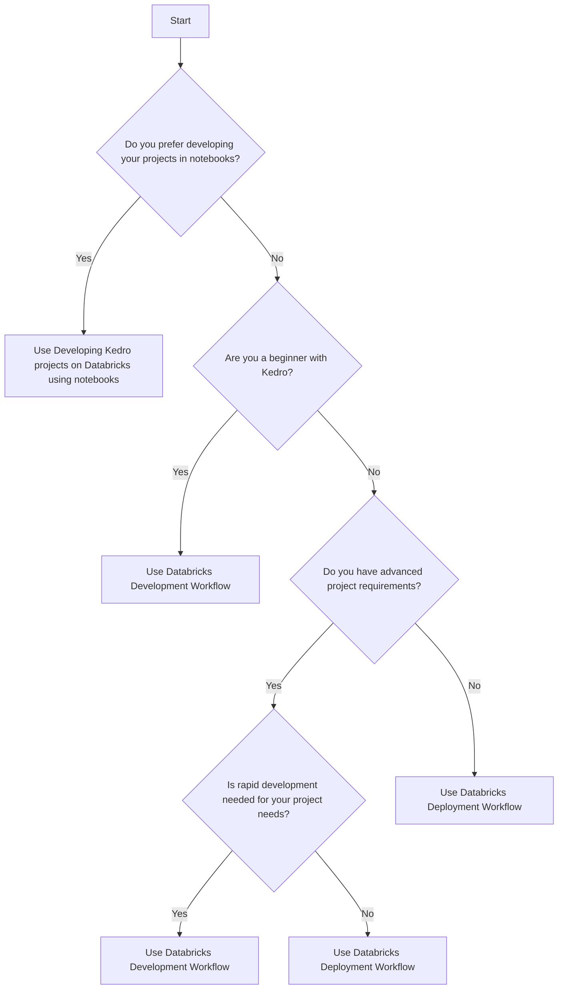

# Choosing the Right Kedro Workflow for Databricks

Kedro supports three main workflows for Databricks: the Databricks Deployment Workflow, the Databricks Development Workflow, and the workflow for Developing Kedro projects on Databricks using notebooks. Each of these workflows serves different needs, and this guide will help you choose the right one for your situation.

## Databricks Deployment Workflow

This workflow is suited for more advanced requirements, where your code needs to be executed in a structured and reproducible way. It is ideal for production deployment as it supports CI/CD and automated/scheduled runs. However, if your project requires rapid iteration, this workflow may not be the best choice as it lacks the flexibility needed for rapid development.

## Databricks Development Workflow

This workflow is perfect if you are looking for an environment that supports rapid development and testing. It leverages powerful IDE features and provides the flexibility for iterative development and modifications. This workflow is also suitable for beginners who are still getting familiar with Kedro. While it can be used for production deployment, a transition to the Databricks Deployment Workflow may be needed for a production-ready setup.

## Developing Kedro projects on Databricks using notebooks

If you prefer developing and testing your projects in notebooks, this workflow is for you. It allows you to work entirely within the Databricks workspace, which can be particularly useful if you want to avoid the overhead of setting up and syncing a local environment with Databricks. This workflow also supports rapid iteration. However, like the Databricks Development Workflow, a transition to the Databricks Deployment Workflow may be needed for production.

## Decision-Making Flowchart

Here's a flowchart to guide you in choosing the right workflow:

Remember, the workflow you choose should meet the needs of your project, whether that's rapid development, notebook-based development, or production-ready deployment. Always consider these factors and your own familiarity with Kedro when choosing your workflow.
