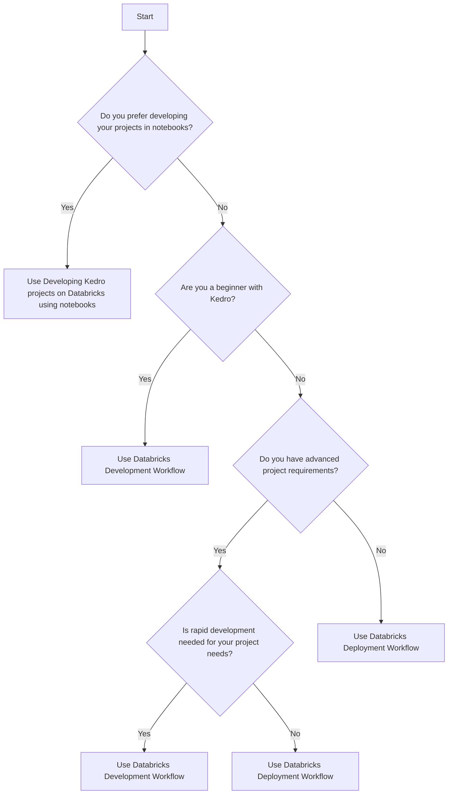

# Choosing the Right Kedro Workflow for Databricks

Databricks offers integration with Kedro through three principal workflows: The Databricks Deployment Workflow, the Databricks Development Workflow, and the Workflow for Developing Kedro projects on Databricks using notebooks. To enhance your development experience, it is crucial to choose the workflow that best fits your project's needs. Let's break down the advantages and use-cases of each workflow to help you make an informed decision.

## Databricks Deployment Workflow

The Deployment Workflow is the go-to choice when dealing with complex project requirements that call for a high degree of structure and reproducibility. It's your best bet for a production setup given its support for CI/CD, automated/scheduled runs and other advanced use-cases. That being said, it might not be the ideal choice for projects requiring quick iterations due to its relatively rigid nature.

## Databricks Development Workflow

If you're in the early stages of learning Kedro, or your project requires constant testing and adjustments, the Development Workflow is the way to go. This workflow allows you to make the most of your local IDE's capabilities for faster, error-free development. It is perfect for development stages and can handle production deployment, but you might need to transition to the Deployment Workflow to fully optimize your project for production.

## Developing Kedro projects on Databricks using notebooks

This workflow is crafted for those who enjoy developing and testing their projects directly within notebooks. If you wish to avoid the overhead of setting up and syncing a local environment with Databricks, then this is your workflow. The flexibility for quick iterations is there, however, transitioning to the Deployment Workflow might be necessary when preparing your project for production.

## Decision-Making Flowchart

Here's a flowchart to guide you in choosing the right workflow:

Remember, the right workflow is the one that aligns best with your project's requirements, whether that's quick development, notebook-based coding, or a production-ready setup. Make sure to consider these factors alongside your comfort level with Kedro when making your decision.
